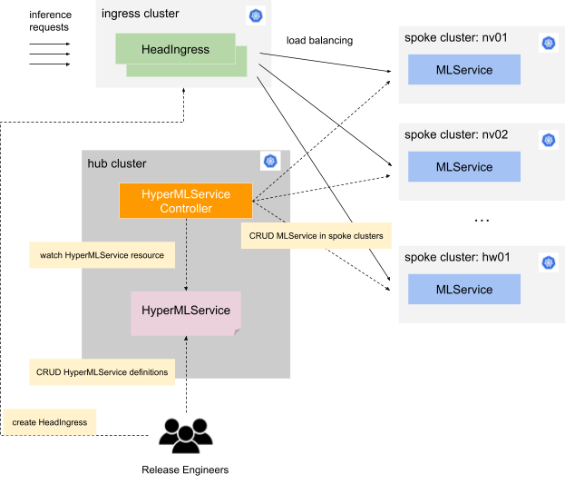

# HyperMLService

HyperMLService 用于实现多集群的推理服务自动化部署。

## 架构

整体架构如下图所示：

<figure class="architecture">
  
</figure>

其中集群分为以下几类：

1. 主集群（hub cluster）：用于运行 HyperMLService 控制器、创建 HyperMLService 实例
2. 子集群（spoke cluster）：用于运行具体的 MLService 工作负载
3. 流量入口集群（ingress cluster）：用于运行 HeadIngress，分发流量到各个子集群，实现负载均衡

工作流程如下：

1. 发布工程师（release engineers）在主集群中通过定义/修改 HyperMLService 实现自动化的多集群高可靠部署模型推理服务。
2. HyperMLService 控制器在各个子集群中自动化部署 MLService
3. 发布工程师在流量入口集群中创建 HeadIngress，用于分发流量到各个子集群中的 MLService，实现负载均衡策略。

注：

* 主集群、子集群、流量入口集群只是功能上的区分，一个物理集群可以同时是主集群、子集群或流量入口集群
* 目前 HeadIngress 由发布工程师手动创建，后续可实现自动化部署。

## 使用

### 准备工作

首先，您需要准备好以下几个 kubeconfig（均为 cluster-admin 权限）：

1. `hub.kubeconfig`：主集群的 kubeconfig
2. `spoke.kubeconfig`：每个子集群的 kubeconfig
3. `ingress.kubeconfig`：流量入口集群的 kubeconfig
4. `karmada.kubeconfig`：主集群中运行的 Karmada API Server 的 kubeconfig，获取方式如下：

```bash
$ kubectl --kubeconfig hub.kubeconfig get secret -n karmada-system karmada-kubeconfig -o jsonpath={.data.kubeconfig} | base64 -d > karmada.kubeconfig
```

然后，您需要在本地安装 kubectl karmada plugin：

```bash
$ curl -s https://raw.githubusercontent.com/karmada-io/karmada/master/hack/install-cli.sh | sudo bash -s kubectl-karmada
```

最后，您需要在 Karmada 中注册各个子集群，其中需要为每个子集群选取一个名称 `<spoke-cluster-name>`：

```bash
$ kubectl karmada join <spoke-cluster-name> \
    --kubeconfig=./karmada.kubeconfig \
    --cluster-kubeconfig=./spoke.kubeconfig
```

### 创建 HyperMLService

在主集群的 namespace `demo` 中创建一个 HyperMLService `hmls-sample`：

```bash
$ kubectl --kubeconfig hub.kubeconfig create -f ./hmls-sample.yaml
```

其中 `hmls-sample.yaml` 文件的内容如下：

```yaml
# hmls-sample.yaml
apiVersion: tensorstack.dev/v1beta1
kind: HyperMLService
metadata:
  name: hmls-sample
  namespace: demo
spec:
  workloads:
  - clusters:
    - spoke1
    - spoke2
    manifests:
    - apiVersion: tensorstack.dev/v1beta1
      kind: MLServiceRuntime
      metadata:
        name: t9k-torchserve
        namespace: demo
      spec:
        ...
    - apiVersion: v1
      kind: Secret
      metadata:
        name: s3-secret
        namespace: demo
      spec:
        ...
    - apiVersion: tensorstack.dev/v1beta1
      kind: MLService
      metadata:
        name: torch-mnist-s3
        namespace: demo
      spec:
        ...
  - clusters:
    - spoke3
    - spoke4
    manifests:
    - apiVersion: tensorstack.dev/v1beta1
      kind: MLService
      metadata:
        name: t9k-torchserve
        namespace: demo
      spec:
        ...
```

其中：

* `spec.workloads` 是一个数组，其中每个元素包括一组子集群的名称和一组资源的定义，表示要在这些子集群中创建这些资源。
* 具体的资源定义根据子集群的情况不同有差别，实际创建时再填充完整

查看 HyperMLService 的状态：

```bash
$ kubectl --kubeconfig hub.kubeconfig get hmls -n demo hmls-sample -o yaml
apiVersion: tensorstack.dev/v1beta1
kind: HyperMLService
metadata:
  creationTimestamp: "2024-04-15T10:11:48Z"
  finalizers:
  - tensorstack.dev/hypermlservice-controller
  generation: 2
  name: hmls-sample
  namespace: demo
  resourceVersion: "60156093"
  uid: 4f4bd6c7-911e-4cb4-9f6a-ce541fe16654
spec:
  ...
status:
  aggregatedStatus:
  - applied: true
    appliedMessage: Manifest has been successfully applied
    cluster: spoke1
    resource:
      apiVersion: tensorstack.dev/v1beta1
      kind: MLService
      name: torch-mnist-s3
      namespace: default
    status:
      address:
        url: http://torch-mnist-s3.default.ksvc.spoke1.t9kcloud.cn
      conditions:
      - lastTransitionTime: "2024-04-16T02:45:26Z"
        status: "False"
        type: Paused
      - lastTransitionTime: "2024-04-16T02:45:52Z"
        status: "True"
        type: Ready
      defaultRelease: origin
      releases:
      - name: origin
        ready: true
        readyReplicas: 1
        totalReplicas: 1
        trafficPercent: 100
        url: http://torch-mnist-s3-predict-origin.default.ksvc.spoke1.t9kcloud.cn
  - applied: true
    appliedMessage: Manifest has been successfully applied
    cluster: spoke1
    resource:
      apiVersion: tensorstack.dev/v1beta1
      kind: MLServiceRuntime
      name: t9k-torchserve
      namespace: default
  - applied: true
    appliedMessage: Manifest has been successfully applied
    cluster: spoke1
    resource:
      apiVersion: v1
      kind: Secret
      name: nfs-pek
      namespace: default
  - applied: true
    appliedMessage: Manifest has been successfully applied
    cluster: spoke2
    resource:
      apiVersion: tensorstack.dev/v1beta1
      kind: MLService
      name: torch-mnist-s3
      namespace: default
    status:
      address:
        url: http://torch-mnist-s3.default.ksvc.spoke2.t9kcloud.cn
      conditions:
      - lastTransitionTime: "2024-04-19T02:23:52Z"
        status: "False"
        type: Paused
      - lastTransitionTime: "2024-04-19T02:24:09Z"
        status: "True"
        type: Ready
      defaultRelease: origin
      releases:
      - name: origin
        ready: true
        readyReplicas: 1
        totalReplicas: 1
        trafficPercent: 100
        url: http://torch-mnist-s3-predict-origin.default.ksvc.spoke2.t9kcloud.cn
  - applied: true
    appliedMessage: Manifest has been successfully applied
    cluster: spoke2
    resource:
      apiVersion: tensorstack.dev/v1beta1
      kind: MLServiceRuntime
      name: t9k-torchserve
      namespace: default
  - applied: true
    appliedMessage: Manifest has been successfully applied
    cluster: spoke2
    resource:
      apiVersion: v1
      kind: Secret
      name: nfs-pek
      namespace: default
  conditions:
  - lastTransitionTime: "2024-04-19T02:23:51Z"
    message: All manifests have been successfully applied
    status: "True"
    type: FullyApplied
```

其中：

* `status.aggregatedStatus` 是一个数组，其中每个元素对应一个子集群中的一个资源的运行状态。例如，从中可以获取每个子集群中 MLService 的推理 API 地址。
* `status.conditions` 表示 HyperMLService 的总体状态，如果有资源未能在子集群中创建成功，这里会显示相关报错信息。

### 创建 HeadIngress

从 HyperMLService 的 status 中获取每个子集群的 MLService 的推理 API 地址，例如：

* `http://torch-mnist-s3-predict-origin.default.ksvc.spoke1.t9kcloud.cn`
* `http://torch-mnist-s3-predict-origin.default.ksvc.spoke2.t9kcloud.cn`

对于上述每个推理 API 地址，在流量入口集群中创建一个 ServiceEntry：

```bash
$ kubectl --kubeconfig ingress.kubeconfig create -f ./serviceentry.yaml
```

其中 `serviceentry.yaml` 文件的内容如下：

```yaml
# serviceentry.yaml
apiVersion: networking.istio.io/v1beta1
kind: ServiceEntry
metadata:
 name: mlservice-spoke1
spec:
 hosts:
 - torch-mnist-s3-predict-origin.default.ksvc.spoke1.t9kcloud.cn
 location: MESH_EXTERNAL
 ports:
 - number: 80
   name: example-http
   protocol: HTTP
 resolution: DNS
---
apiVersion: networking.istio.io/v1beta1
kind: ServiceEntry
metadata:
 name: mlservice-spoke2
spec:
 hosts:
 - torch-mnist-s3-predict-origin.default.ksvc.spoke2.t9kcloud.cn
 location: MESH_EXTERNAL
 ports:
 - number: 80
   name: example-http
   protocol: HTTP
 resolution: DNS
```

然后创建一个 VirtualService，用于负载均衡：

```bash
$ kubectl --kubeconfig ingress.kubeconfig create -f ./virtualservice.yaml
```

其中 `virtualservice.yaml` 文件的内容如下：

```yaml
# virtualservice.yaml
apiVersion: networking.istio.io/v1beta1
kind: VirtualService
metadata:
  name: lb
spec:
  gateways:
  - t9k.t9k-system
  hosts:
  - '*'
  http:
  - match:
    - uri:
        prefix: /t9k/hypermlservices/namespaces/demo/hmls-sample/
    route:
    - destination:
        host: torch-mnist-s3-predict-origin.default.ksvc.spoke1.t9kcloud.cn
      headers:
        request:
          set:
            Host: torch-mnist-s3-predict-origin.default.ksvc.spoke1.t9kcloud.cn
      weight: 30
    - destination:
        host: torch-mnist-s3-predict-origin.default.ksvc.spoke2.t9kcloud.cn
      headers:
        request:
          set:
            Host: torch-mnist-s3-predict-origin.default.ksvc.spoke2.t9kcloud.cn
      weight: 70
```

其中：

* 设置了 url path 为 `/t9k/hypermlservices/namespaces/demo/hmls-sample/`
* 设置了两个推理 API 地址的权重为 30 和 70

因此，您可以通过以下地址访问 HyperMLService：

`<ingress-nginx-domain-name>/t9k/hypermlservices/namespaces/demo/hmls-sample/`

其中 30% 的请求将转发到第一个子集群，70% 的请求将转发到第二个子集群。
