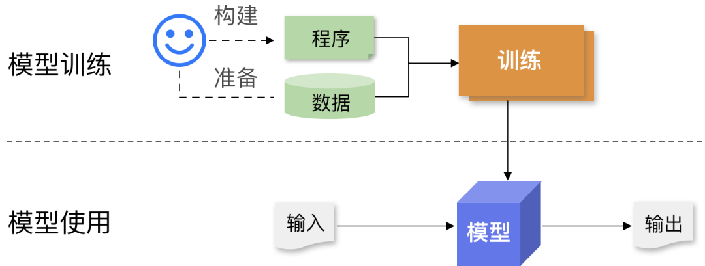
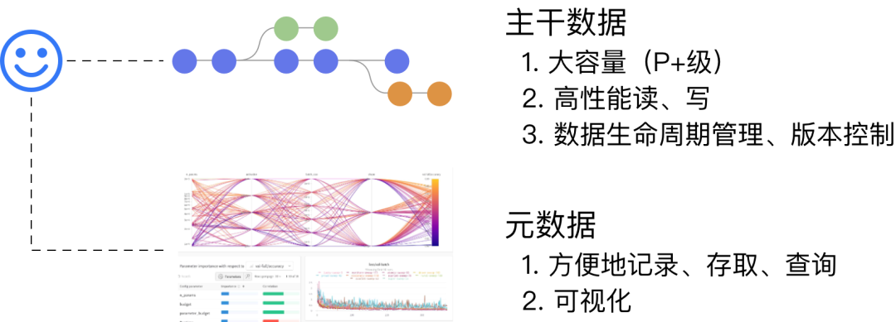
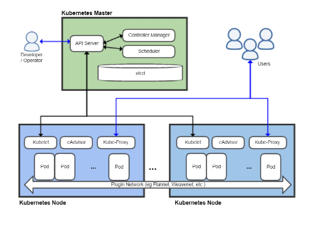

# 背景

人工智能（AI）技术的发展已经取得了显著的成果，并对各行业的发展产生了深远的影响。其中最为突出的成就是以深度学习为基础在计算机视觉、LLM 等领域的突破性成果。

<aside class="note info">

通用人工智能（AGI）

预计在不远的将来我们将能够实现通用人工智能（AGI）。AGI 代表着机器不仅能在特定任务上表现出人类水平的智能，而且能够具备广泛的理解力和学习能力，适应各种不同的环境和挑战。这样的技术进步将彻底改变科学研究、工业生产、教育、医疗保健等领域的面貌。

</aside>

AI 计算平台对于 AI 技术的开发和应用具有重要意义。它提供了一个集成化、高效的环境，让开发者和企业能够轻松地构建、训练和部署机器学习模型。这种便捷性极大地降低了 AI 技术的门槛，使得更多的组织和个人能够利用先进的 AI 能力。

1. AI 计算平台通过提供高级的 AI 开发工具和预构建的模型，简化了 AI 开发流程。开发者不需要从头开始构建复杂的模型，而是可以基于现有的模型进行定制和优化，这加速了从概念到实现的过程。
2. AI 计算平台提供了大规模的计算资源和数据管理能力，这对于处理大量数据和运行复杂的 AI 模型至关重要。用户可以根据需要轻松扩展资源，以适应不断变化的需求。
3. 平台还包含丰富的协作和集成工具，使得团队可以更有效地合作开发。此外，它们还提供了严格的安全和隐私保护措施，保证了数据的安全性和合规性。

## 新的范式

AI 是一种崭新的计算范式，它具有数据驱动、基于实验的特点，并且经常需要进行大规模的计算。

- 在传统软件开发中，程序员编写明确的指令或规则，来告诉计算机如何处理数据和执行任务。这种方法依赖于开发者对问题的深入理解以及能够准确预测所有可能的情况并据此编写代码。
- 相比之下，AI 的开发更多地依赖于数据而不是预设的规则。在这种模式下，AI 系统通过大量数据来学习和识别模式，然后基于这些学习成果做出判断或预测。开发者不是直接编写处理每种情况的代码，
而是设计算法来让计算机自我学习和适应。这意味着 AI 系统在面对新数据时可以持续改进其性能和准确性。
- 此外，AI 开发通常需要更多关注于数据的收集、处理和分析。数据的质量和量直接影响到模型的性能，因此数据预处理成为 AI 开发中的一个重要步骤。而在传统软件开发中，主要关注的是逻辑的构建和代码的优化。

总的来说，AI 的数据驱动计算范式更加强调数据本身和从数据中学习的能力，而不是像传统软件那样依赖于硬编码的指令和规则。
这种方法使得 AI 在处理复杂、动态和模糊的问题时更加有效，但也带来了对数据质量和巨大计算处理能力的依赖。

<figure>
  
  <figcaption>图 1: AI 计算的要素。模型架构程序 + 数据集经过训练（模型参数优化）后产生 AI 模型。</figcaption>
</figure>

## 系统需求

由于 AI 技术的特性，用户在开发和使用 AI 过程中，在系统方面提出了多方面的需求，希望能够：

- 方便地构建、使用和迭代数据集、模型架构和参数，以及
- 简单、可靠地使用大规模分布式并行、异构和加速计算等技术来快速、高效地运行大规模的数据处理、训练和推理计算等。

### 数据

AI 计算过程中读取或者产生的数据可以分为两类：主干数据、元数据。

- 主干数据：训练数据集、模型等大体量数据。
- 元数据：计算过程中的各种配置、超参数、指标等。

<figure>
  
  <figcaption>图 2：AI 计算在数据方面的核心需求。1）针对大规模的数据（训练数据集、模型等）提供高性能、大容量和完善的生命周期管理支持；2）对 AI 实验过程中的各种配置、超参数、指标等进行方便地记录、存取、查询等，并提供丰富的可视化支持。</figcaption>
</figure>

用户希望通过一致、多维度高度可扩展的机制来支持对数据的各种操作。例如，训练数据无论是100KiB 还是 100TiB，都能够使用同一套工具、SDK，API：

1.  方便地使用数据：能够在探索、实验、训练过程中，简单、快速地使用不同的数据；
2.  高性能地使用数据：支持训练过程中对数据的高速读取（训练数据集）、写入（checkpoint，模型本身）；
3.  可靠地维护数据：
    - 像代码一样维护数据版本 (versioning)；
    - 记录数据的变化历史 (commits and logs)；
    - 隔离 (branches)。
4.  对 AI 计算过程中的配置、超参数、脚本、各种指标等，提供方便、完善的支持：
    - 元数据管理系统为基础底座；
    - SDK 支持在各种场景进行集成；
    - 可视化工具方便地跟踪、展示、比较、分析多个实验过程。

### 计算

用户希望能够通过便捷的方式使用大规模分布式并行、异构、加速计算等技术以快速、高效地运行大规模的数据处理、训练和推理计算等。

<figure>
  
  <figcaption>图 3: 方便的进行计算。系统支持以同样的方式定义、运行、调试 AI 领域的各种计算任务。例如，使用 1 张 GPU 的训练任务和使用 1000 张 GPU  的训练任务可以使用一致的方式来完成。</figcaption>
</figure>

AI 计算场景的典型需求：

| 类别 | 需求说明 |
|-------|--------|
| 软件包依赖  | 清晰、一致、方便地管理对 Pyhton 脚本、GPU 驱动程序、网络驱动程序等各种软件包的依赖   |
| 计算环境  | 支持在 dev、 train、test、deploy 等环境方便地切换、迭代   |
| 数据、代码  | 高效、便捷地使用数据、脚本、配置及跟踪它们的变化   | 
| 计算资源  | 快速、简单、方便地请求和使用各种计算资源：CPU、RAM、GPU、高速网络、存储... |
| 运行计算  |可靠、简单、方便地运行个各种类型的计算：开发环境、并行训练、微调、数据处理、推理服务... |

## Kubernetes

Kubernetes 这个单词源自希腊语，意思是指舵手（helmsman）或导航员（pilot）。       

Kubernetes 的历史可以追溯到 Google 的 Borg 系统 （据说名字取自 Star Trek）。Borg 是 Google 内部使用的第一个容器编排系统，于 2003 年开始开发。Borg 是一个集中式的系统，使用一个单一的控制器来管理集群中的所有资源。

Kubernetes 是一个灵活、可扩展的容器集群管理平台，它通过 Master 节点的集中控制和调度，工作节点（Worker Nodes) 负责运行应用工作负载。工作节点可方便地动态伸缩规模。

<figure>
  
  <figcaption>图 4：Kubernetes 架构图。Source: https://en.wikipedia.org/wiki/Kubernetes </figcaption>
</figure>

如上图所示，Kubernetes 的整体架构主要包含以下组件:

Master 节点: Master 节点负责整个集群的控制和管理。主要包含以下组件:
- kube-apiserver：提供了资源操作的统一入口，以 RESTful API 方式提供服务。
- etcd：负责存储集群的配置信息和资源状态。
- kube-scheduler：负责资源的调度，按照预定的调度策略将 Pod 调度到相应的节点上。
- kube-controller-manager: 负责管理控制器，确保集群处于预期的状态。    

Node节点：Node 节点是 Kubernetes 集群中的工作节点，由 Master 节点管理,主要包含以下组件:

- kubelet：负责管理 Node 节点上的 Pod 和容器的生命周期。
- kube-proxy：负责为 Service 提供 cluster 内部的服务发现和负载均衡。
- 容器运行时（containerd，CRI-O，Docker 等）: 负责真正运行容器的软件。         

Kubernetes 还包括其它辅助模块（Add-ons），例如:

- DNS 模块：负责为集群中的主机提供 DNS 解析服务。
- 网络插件：负责提供底层的网络实现,例如 flannel 和 calico。
- 参数模块：提供配置管理功能。
- 仪表板插件：提供 GUI。
- 存储插件：提供持久化存储实现，例如 Ceph 和 Luster 。
- 日志模块：提供日志收集、存储功能。
- 安全模块：提供认证、授权、准入控制等安全功能。        

**平台的平台**

Kubernetes 是一个为云原生应用提供核心抽象和服务层的平台，提供了合理、良好的机制支持和下层硬件及其它基础设施服务（如容器运行时、存储、网络等）进行交互。         

Kubernetes 有时候被称为 “平台的平台，母平台” ，被用来构建特定领域的平台或者应用系统，是由于其如下特征：

1. Kubernetes 提供了一个跨平台的容器编排和管理的统一平台。这个平台不依赖于任何特定的基础设施，可以跨多种云和本地环境运行。
1. Kubernetes 对不同基础架构和资源类型进行了抽象和封装，屏蔽了底层平台的差异，提供统一的管理方式。使应用可以无缝迁移。
1. Kubernetes 作为一个通用平台，可以用来运行和管理各种类型的应用和工作负载，包括 Web 服务、移动应用后端、AI 工作负载、大数据计算等。
1. 基于 Kubernetes 构建的平台都可以获得 Kubernetes 的强大容器编排能力，如服务发现、负载均衡、滚动更新等，这大大降低了运维成本。
1. Kubernetes 生态系统丰富，有大量的工具和服务，可以扩展其功能，构建自定义平台。         

总之，Kubernetes 提供了一个云原生应用的标准化基础架构和管理平台，使得构建上层平台更加简单高效。

## TensorStack AI 计算平台

TensorStack AI 计算平台构建于以 Kubernetes 为核心的云原生技术支行，采用开放的、标准的、被普遍采用的、无厂商锁定风险的技术和协议，并能够：

1. 长期稳定迭代、不断进步；
2. 提供高度可靠性；
3. 提供高度安全性；
4. 支持在多个维度（计算规模、数据规模、硬件架构等）方便进行扩展。

<figure>
  
  <figcaption>图 5：TensorStack AI 计算平台。 平台采用开放的、标准的、被普遍采用的、无厂商锁定风险的技术和协议；并在稳定性、可靠性、扩展性、安全性多方面具备优异的能力。<figcaption>
</figure>

TensorStack 对 AI 计算中的主要系统问题及解决方法：

1. 软件包依赖 

    采用容器镜像清晰、一致、方便地管理对 Pyhton 脚本、GPU 驱动程序、网络驱动程序等各种软件包的依赖：

        - 稳定的基础镜像：跟随框架（PyTorch）等主要依赖发布；
        - 镜像全流程支持：制作、发布到 Registry、运行。

2. 计算环境

    采用 <a target="_blank" rel="noopener noreferrer" href="https://en.wikipedia.org/wiki/Infrastructure_as_code" >Infrastructure As Code </a> 原则 + 容器镜像 + 网络存储的机制支持在 dev、 train、test、deploy 等环境方便地切换、迭代数据、代码。

3. 数据、代码

    通过网络存储 + 服务（Version Control，AI DB，Experiment Management 等）支持高效、便捷地使用数据、脚本、配置及跟踪它们的变化。

4. 计算资源

    通过 CRD controller + resource scheduler，实现快速、简单、方便地请求和使用各种计算资源：CPU、RAM、GPU、高速网络、存储...

5. 运行计算

    T9k Jobs + Services 等实现可靠、简单、方便地运行个各种类型的计算：开发环境、并行训练、微调、数据处理、推理服务...

TensorStack AI 计算平台将在推动 AI 技术的普及和应用方面发挥着关键作用，为各行各业提供实现 AI 驱动创新的关键工具和资源。

## 参考

Infrastructure for deep learning, 2016  
<https://openai.com/research/infrastructure-for-deep-learning>
         
Scaling Kubernetes to 2,500 nodes, 2018  
<https://openai.com/research/scaling-kubernetes-to-2500-nodes>
         
Scaling Kubernetes to 7,500 nodes, 2021  
<https://openai.com/research/scaling-kubernetes-to-7500-nodes>
         
Borg, Omega, and Kubernetes - Lessons learned from three container-management systems over a decade, 2016  
<https://queue.acm.org/detail.cfm?id=2898444>
         
Large-scale cluster management at Google with Borg, 2015  
<https://research.google/pubs/pub43438/>
         
Omega: flexible, scalable schedulers for large compute clusters, 2013  
<https://research.google/pubs/pub41684/>
         
Kubernetes as a Platform for building Platforms with Mario-Leander Reimer, 2022  
<https://www.youtube.com/watch?v=wDMbBSVNzWY>
