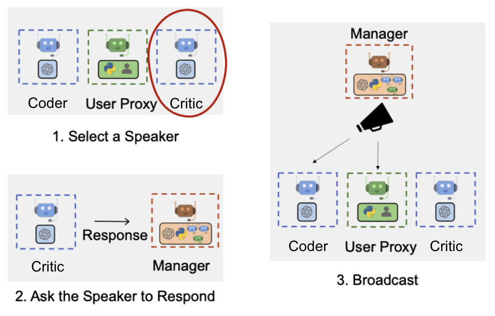
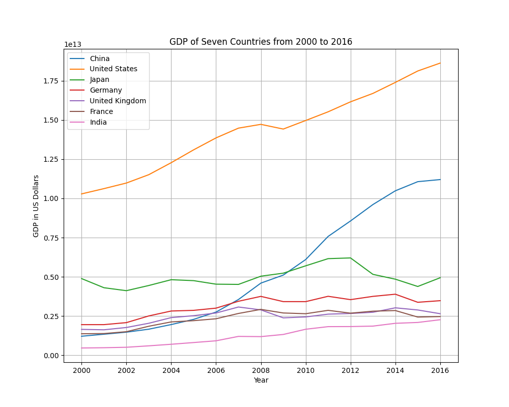

# 使用 AutoGen 构建下一代 LLM 应用

LLM 所展现出的推理、规划、指令遵循、上下文学习和工具使用等多项能力，使得它们成为目前开发强大 AI 智能体 （AI Agent）的首选。一些基于这样的智能体构建的 AI 应用已经出现，例如 ChatGPT + Wolfram Alpha 插件可以解答数学问题，AutoGPT 可以自主达成用户给定的目标，等等。最近公开的 AutoGen 框架引入了多智能体对话（multi-agent conversation）机制，为构建 AI 应用提供了高效实现和高度可扩展性。

本教程演示几个基于 AutoGen 框架构建的简单应用。这些应用分别采用了 OpenAI 的 GPT 系列模型以及开源的 LLM 作为智能体的后端，前者通过调用 OpenAI 的官方 API 实现，后者则是接入使用 SimpleMLService 部署的 LLM 推理服务。

应用的代码被放置在 [https://github.com/t9k/examples/tree/master/applications/autogen](https://github.com/t9k/examples/tree/master/applications/autogen)，用户可参照 README 自行尝试。这里推荐用户在 [Notebook](../tasks/use-notebook.md) 中运行应用示例的 `.ipynb` 文件；如要使用开源模型作为智能体后端，请参阅[部署 LLM 聊天机器人](./deploy-llm-chatbot.md)进行本地部署。

## AutoGen 框架

我们希望基于 LLM 的智能体能够帮助人类完成现实世界中的复杂任务，但即便是当下最强大的 GPT-4 模型，也在许多场景下表现不佳。为了提升智能体解决问题的能力，除了提升单个智能体的表现，另一种直观的思路是使用多个智能体进行分工合作，分解复杂任务并各自承担一个专业的子任务。现有研究表明，多个智能体有助于鼓励不同的思考方式，提高推理能力，提供验证以提高正确性。就像人类一样，团队合作能够实现许多个人难以独立达成的成就。

论文 <a target="_blank" rel="noopener noreferrer" href="https://arxiv.org/abs/2308.08155">《AutoGen: Enabling Next-Gen LLM Applications via Multi-Agent Conversation》</a>提出了多智能体对话框架 <a target="_blank" rel="noopener noreferrer" href="https://github.com/microsoft/autogen">AutoGen</a>，其基本原理如下：

* 提供通用的可对话智能体抽象，智能体有统一的对话接口，由 LLM、人类、（由 Python 代码实现的）外部工具或它们的组合驱动，可自定义和扩展行为，可重用。
* LLM 应用的工作流被统一为多智能体的对话流，开发应用的过程即为：(1) 定义一组各自有特定能力和角色的可对话智能体；(2) 通过程序语言（Python 代码）和自然语言（LLM 的系统信息（system message）、指令等）控制智能体自身的计算以及智能体之间的对话流。

<figure style="display: block; margin-left: auto; margin-right: auto;">
  
</figure>

AutoGen 框架提供的灵活性超越了目前其他框架或系统（如 AutoGPT、LangChain Agent、CAMEL 等），适用于构建各种形式、领域和复杂度的应用。

## 应用一：解数学题

在第一个应用中，我们使用 <a target="_blank" rel="noopener noreferrer" href="https://arxiv.org/abs/2306.01337">MathChat</a> 框架解答数学问题。

<figure style="display: block; margin-left: auto; margin-right: auto;">
  
</figure>

为该应用编写的部分 AutoGen 代码如下，其中定义了智能体 user_proxy 和 assistant。前者负责初始化对话（MathUserProxyAgent 封装了解答数学问题的 prompt，见下面的日志），以及执行 Python 代码并返回结果（所有 UserProxyAgent 均有执行 Python 代码的功能）；后者负责解答问题（使用了默认的系统信息）：

```python
user_proxy = MathUserProxyAgent(
    name="user_proxy", 
    human_input_mode="NEVER",
)
assistant = autogen.AssistantAgent(
    name="assistant", 
    system_message="你是一个提供帮助的助手。",
    llm_config={
        "request_timeout": 600,
        "seed": 42,
        "config_list": config_list,
    }
)

math_problem = "[数学问题]"
user_proxy.initiate_chat(assistant, problem=math_problem)
```

通过修改 config，智能体可以使用由 OpenAI 提供的 gpt-4、gpt-3.5-turbo 等 API，或者由 FastChat 本地部署的开源模型作为 LLM 后端。数学问题如下：

* 任务 1：找到满足不等式 $(2x+10)(x+3)<(3x+9)(x+8)$ 的所有 $x$，并以区间表示答案。
* 任务 2：当 $k$ 取何负值时，以下方程组存在恰好一个解？

$$
\left\{
\begin{aligned}
y &= 2x^2 + kx + 6 \\
y &= -x + 4
\end{aligned}
\right.
$$

使用 gpt-4 后端执行任务 1，整个过程的日志如下，最终回答正确：

<details><summary>日志</summary>

{{#include ../assets/examples/build-next-generation-llm-app-using-autogen/app-math-task1-gpt4.log}}

</details>

换用其他 LLM 作为 Assistant 的后端能否解决这些数学问题？这里实验了 gpt-3.5-turbo、meta-llama/Llama-2-70b-chat-hf、meta-llama/Llama-2-13b-chat-hf、Qwen/Qwen-14B-Chat，结果汇总如下：

| 模型                           | 任务 1 | 任务 2 | 失败原因                                        |
| ------------------------------ | ------ | ------ | ----------------------------------------------- |
| gpt-4                          | ✅     | ✅     |                                                 |
| gpt-3.5-turbo                  | ❌     | ✅     | 代数计算出错                                    |
| meta-llama/Llama-2-70b-chat-hf | ❌     | ❌     | 代数计算出错，代码编写出错（不会使用 sympy 包） |
| meta-llama/Llama-2-13b-chat-hf | ❌     | ❌     | 代数计算出错，指令遵循存在问题                  |
| Qwen/Qwen-14B-Chat             | ❌     | ✅     | 代数计算出错                                    |

由此可见，gpt-4 的数学能力相较于这些有代表性的开源模型遥遥领先。

## 应用二：文档问答

在第二个应用中，LLM 需要根据从向量数据库检索得到的上下文回答用户提出的问题。

<figure style="display: block; margin-left: auto; margin-right: auto;">
  
</figure>

为该应用编写的 AutoGen 代码如下，其中定义了智能体 user_proxy 和 assistant，前者在对话之外负责构建和检索向量数据库（定义中包含一些相关配置），在对话当中负责提供 prompt、问题和上下文，后者回答问题：

```python
user_proxy = RetrieveUserProxyAgent(
    name="user_proxy",
    human_input_mode="NEVER",
    max_consecutive_auto_reply=10,
    retrieve_config={
        "task": "qa",
        "docs_path": "local_path_or_url_of_docs",
        "chunk_token_size": 2000,
        "model": config_list[0]["model"],
        "client": chromadb.PersistentClient(path="./tmp/chromadb"),
        "collection_name": "natural-questions",
        "chunk_mode": "one_line",
        "embedding_model": "all-MiniLM-L6-v2",
    },
)
assistant = RetrieveAssistantAgent(
    name="assistant", 
    system_message="你是一个提供帮助的助手。",
    llm_config={
        "request_timeout": 600,
        "seed": 42,
        "config_list": config_list,
    },
)

question = "[提出的问题]"
user_proxy.initiate_chat(assistant, problem=question, n_results=30)
```

这里准备了两个任务：

任务 1：根据 <a target="_blank" rel="noopener noreferrer" href="https://huggingface.co/datasets/thinkall/NaturalQuestionsQA/resolve/main/corpus.txt">NaturalQuestionsQA 语料库</a>，回答下列问题：

| No. | 问题                                                                                | 正确答案                                                                                    |
| --- | ----------------------------------------------------------------------------------- | ------------------------------------------------------------------------------------------- |
| 1   | what is non controlling interest on balance sheet                                   | the portion of a subsidiary corporation's stock that is not owned by the parent corporation |
| 2   | how many episodes are in chicago fire season 4                                      | 23                                                                                          |
| 3   | what are bulls used for on a farm                                                   | breeding, as work oxen, slaughtered for meat                                                |
| 4   | who has been honoured with the wisden leading cricketer in the world award for 2016 | Virat Kohli                                                                                 |
| 5   | who carried the usa flag in opening ceremony                                        | Erin Hamlin                                                                                 |

任务 2：根据<a target="_blank" rel="noopener noreferrer" href="https://www.szse.cn/api/disc/info/download?id=f44320dc-1129-44aa-9924-a2d212f16e70">比亚迪 2023 年上半年财报</a>，回答下列问题：

| No. | 问题                                         | 正确答案                                                         |
|-----|--------------------------------------------|----------------------------------------------------------------|
| 1   | 公司是否计划派发现金红利？                     | 公司计划不派发现金红利。                                           |
| 2   | 集团在八月达成的里程碑是什么？                   | 本集团第500万辆新能源汽车下线，成为全球首家达成这一里程碑的车企。   |
| 3   | 公司的主管会计工作负责人是谁？                   | 周亚琳                                                          |
| 4   | 公司的 2023 年上半年的归母净利润为多少元？         | 10,954,145,000元                                                |
| 5   | 王传福的持股比例是多少？                        | 17.64%                                                         |

使用 gpt-4 后端执行任务 2 的问题 1，整个过程的日志如下，最终回答正确：

<details><summary>日志</summary>

{{#include ../assets/examples/build-next-generation-llm-app-using-autogen/app-rag-task2-gpt4.log}}

</details>

同样地，我们使用 gpt-4、gpt-3.5-turbo、meta-llama/Llama-2-13b-chat-hf、Qwen/Qwen-14B-Chat 分别作为 Assistant 的后端，结果汇总如下（人工打分，回答正确一个问题得 1 分，回答不完整得小于 1 分，总分均为 5 分）：

| 模型                           | 任务 1 | 任务 2 | 失败原因                                                           |
| ------------------------------ | ------ | ------ | ------------------------------------------------------------------ |
| gpt-4                          | 4.8    | 4      | 向量数据库未返回相关上下文，归纳不完整                             |
| gpt-3.5-turbo                  | 3.5    | 4      | 向量数据库未返回相关上下文，归纳不完整，从上下文寻找信息的能力不足 |
| meta-llama/Llama-2-13b-chat-hf | 2      | 0      | 从上下文寻找信息的能力弱，允许的上下文长度较短，不能理解问题       |
| Qwen/Qwen-14B-Chat             | 1.8    | 0      | 从上下文寻找信息的能力弱，归纳不完整                               |

可以看到这些开源模型的自然语言能力也不及 gpt 系列模型。

## 应用三：可视化数据（群聊）

在第三个应用中，我们让 LLM 编写代码以可视化表格数据。

<figure style="display: block; margin-left: auto; margin-right: auto;">
  
</figure>

和前两个应用不同的是，这里我们采用动态群聊（dynamic group chat）的方法来完成任务，通过：

* 引入 3 个智能体：User Proxy 负责初始化对话，执行 Python 代码并返回结果，以及传入用户的发言；Coder 负责计划和编写代码；Critic 提出一般性的评价和改进建议，系统信息指定了 Critic 的角色并给出了详细的评估维度和标准。
* 引入 1 个 GroupChat 的 Manager，Manager 的作用是在每一轮当中根据对话历史挑选 1 个智能体发言，并将其发言内容广播给其他智能体，即“主持群聊”。
* 对于 UserProxyAgent 设置 human_input_mode="ALWAYS"，这样每当 Manager 选取 User Proxy 发言，用户都可以提出自己的想法、需求或意见。

在代码中，我们定义了智能体 user_proxy、coder 和 critic，包含这些 agent 的 groupchat，以及 groupchat 的 manager，最后传入任务描述（prompt）以初始化对话。

```python
user_proxy = autogen.UserProxyAgent(  
   name="User_Proxy",
   system_message="人类管理员",
   code_execution_config={"last_n_messages": 3, "work_dir": "groupchat"},
   human_input_mode="ALWAYS",
   is_termination_msg=lambda x: x.get("content", "").rstrip().endswith("TERMINATE")
)
coder = autogen.AssistantAgent(
    name="Coder",  # 默认的 assistant agent 就可以编写代码
    llm_config=llm_config,
)
critic = autogen.AssistantAgent(
    name="Critic",
    system_message="""评论员。您是一个非常擅长评估给定可视化代码质量的有益助手，通过提供从 1（差）到 10（好）的评分，并提供清晰的理由。在每个评估中，您必须考虑可视化最佳实践。具体来说，您可以仔细评估代码的以下维度：（后略）""",
    llm_config=llm_config,
)

groupchat = autogen.GroupChat(agents=[user_proxy, coder, critic], messages=[], max_round=20)
manager = autogen.GroupChatManager(groupchat=groupchat, llm_config=llm_config)
user_proxy.initiate_chat(manager, message="从 https://raw.githubusercontent.com/datasets/gdp/master/data/gdp.csv 下载数据，绘制中、美、日、德、英、法、印七个国家从 2000 年到 2016 年的名义 GDP 折线图（以美元计价），要求折线图有网格线，图例放置在左上角。将图片保存为文件。接受来自 critic 的反馈并改进代码。")
```

鉴于 gpt-4 无可匹敌的强大能力，这里仅使用 gpt-4 作为智能体的后端。一次具体的对话的日志如下：

<details><summary>日志</summary>

{{#include ../assets/examples/build-next-generation-llm-app-using-autogen/app-groupchat-gpt4.log}}

</details>

这是第一版生成的图片：

<figure style="display: block; margin-left: auto; margin-right: auto;">
  
</figure>

用户提出的改进建议是“折线图的左上角有一个"1e13"的标记，这是因为纵轴的单位为一美元，请将其修改为十亿美元”，于是 Coder 修改得到第二版：

<figure style="display: block; margin-left: auto; margin-right: auto;">
  
</figure>

在 Manager 的 GroupChat 管理以及 User Proxy、Coder 和 Critic 的协作之下（尽管在这次运行中 Critic 并未提出改进意见），应用迭代出了更加准确、美观并且符合用户需求的可视化结果。

## 总结

经过上面几个简单应用的实验，我们可以获得如下总结和思考：

1. 根据应用一和应用二的实验结果，能力更强的模型（gpt-4）可以使应用在任务中取得显著更好的表现。换言之，LLM 的（应用相关）能力是应用能否解决具体问题的决定性因素之一。
1. 根据应用三的结果，模型被另一个相同的模型（但设定的角色不同）所纠正，可以认为是精心设计的系统信息和 prompt 激发了模型在子任务的专业领域上的表现。即便如此，模型的输出仍有欠缺，这里人类的干预可以进一步补足模型能力，提高应用的最终表现。
1. 试想如果模型能力进一步提升会如何，基于下一代 GPT 模型的单智能体会不会比应用三的多智能体对话流表现更好？换一个视角，如果把除了 User Proxy 之外的 Coder、Critic 和 GroupChat Manager 打包为一个整体，把这个整体视作基于某个比 gpt-4 更强的 LLM 的单一智能体，AutoGen 框架在多智能体对话流中所起的作用就是这个 LLM 内部的一种机制。而传闻中，gpt-4 实际上就是类似的 MoE 结构（尽管细节尚不可知），由 8 个 220B 专家模型组成，这些模型分别在不同的数据集和任务分布上训练。或许“集成”和“对话”只需要一个，内部有着强大集成机制的 LLM 不会再需要外部的对话框架。

回到 AutoGen 框架，它仍是一个处于早期实验阶段的工作，其进一步的研究方向包括：

1. 研究提升对话有效性和总体效率的策略（如智能体拓扑、对话模式等）；探索对于特定 LLM 应用的最优多智能体对话流。
1. 为构建针对不同应用的强大智能体提供系统性的参考，建立大规模开源知识库，建立具备自主学习和升级技能的智能体。
1. 评估极度复杂的任务能否通过多智能体对话的方法有效解决。
