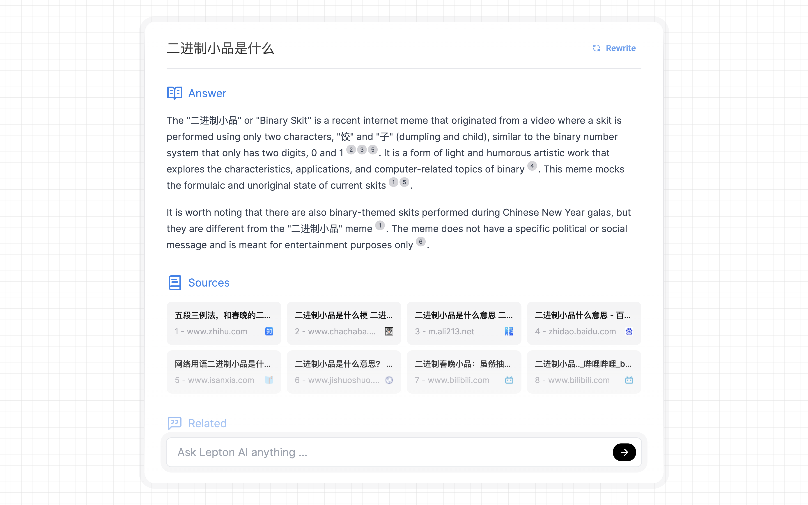
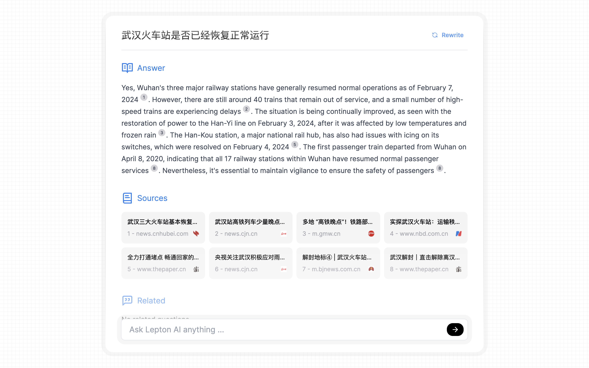
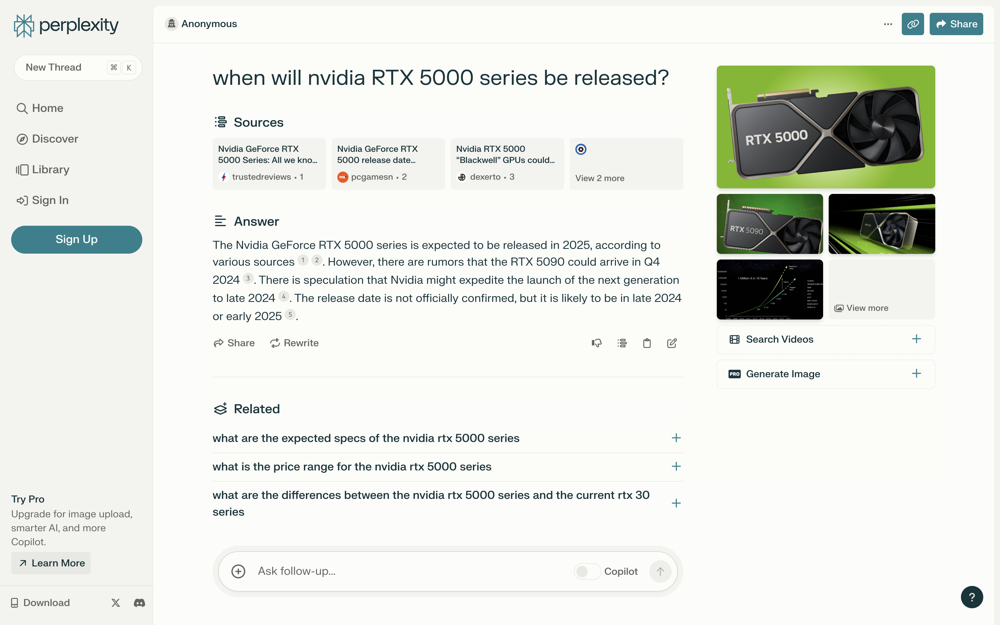
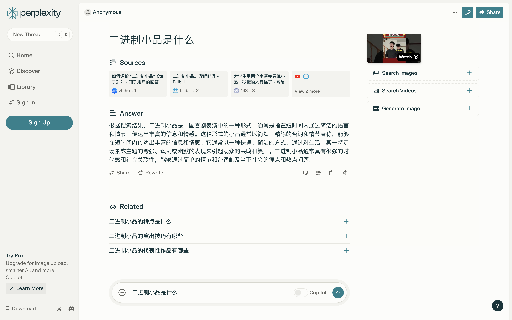
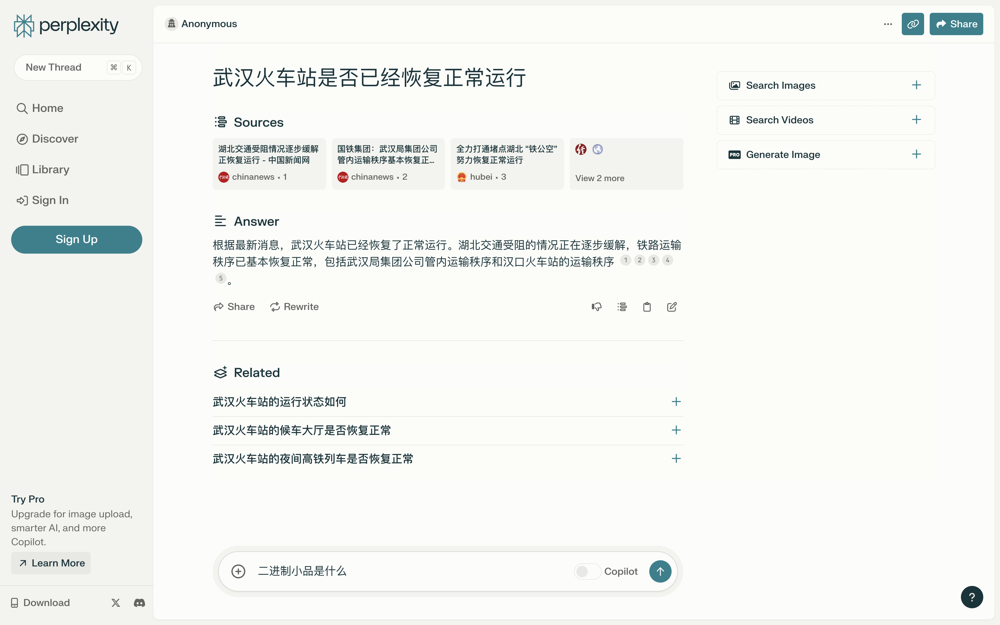

# 部署对话式搜索引擎

对话式搜索引擎（conversational search engine）是利用自然语言处理技术来理解和响应用户查询的下一代搜索引擎。与传统的基于关键字的搜索引擎不同，对话式搜索引擎能够与用户以自然语言对话的形式进行互动，从而提供更为精准和个性化的搜索结果。这种搜索引擎通过分析用户的查询意图和上下文信息，能够提出问题、澄清疑惑，并给出更加直观和详细的回答。

当下（2024 Q1）最火热的对话式搜索引擎产品无疑是 <a target="_blank" rel="noopener noreferrer" href="https://www.perplexity.ai/">Perplexity</a>，但最近广受好评的开源项目 <a target="_blank" rel="noopener noreferrer" href="https://github.com/leptonai/search_with_lepton">Search with Lepton</a> 仅用 ~500 行 Python 代码就实现了类似的功能，其核心逻辑为：

1. 获取用户的查询文本，调用传统搜索引擎的 API 以获取上下文，即结果页面的片段（snippets）。
2. 将上下文添加到 system prompt（用于编写回答）中，将查询文本作为 user prompt，调用 LLM 生成回答。
3. 将同样的上下文添加到另一个 system prompt（用于产生关联问题）中，将查询文本作为 user prompt，调用 LLM 生成关联问题。
4. 将上下文、回答和关联问题返回给 UI 以供展示。
5. （可选）将当次查询结果存储到数据库中，若用户再次进行相同的查询则直接返回该结果。

用户也可以在平台上方便地部署和使用这项功能！项目 <a target="_blank" rel="noopener noreferrer" href="https://github.com/t9k/search_with_lepton">`t9k/search_with_lepton`</a> fork 了 Search with Lepton 项目并进行了以下修改：

* 移除使用 Lepton AI 云服务的代码。
* 增加 Dockerfile 并构建镜像 `t9kpublic/search-with-lepton`。

本示例使用 Kubernetes 原生资源和 TensorStack 资源部署该修改后的对话式搜索引擎应用，系统架构如下图所示：

<figure class="architecture">
  
  <figcaption>图 1：在平台上实现的对话式搜索引擎的系统架构。</figcaption>
</figure>

创建的资源如下表所示：

| 类型             | 名称             | 作用                    | 备注                                                                                      |
| ---------------- | ---------------- | ----------------------- | ------------ |
| PVC              | `search`           | 存储代码和模型文件      | 卷大小为 `180Gi`                                                                          |
| MLServiceRuntime | `vllm-openai-2xtp `| 定义 LLM 推理服务的模板 |      |
| MLService        | `mixtral-8x7b `    | 部署 LLM 推理服务      | 计算资源为 `{"limits":{"cpu": 4, "memory": "64Gi", "nvidia.com/gpu": 2}, "requests": {}}` |
| Secret           | `search`           | 存储搜索引擎的 API key |     |
| Deployment       | `search`           | 部署对话式搜索服务      | 计算资源为 `{"limits":{"cpu": 2, "memory": "8Gi"}, "requests": {}}`                       |
| Service          | `search`           | 暴露服务                |    |

## 准备

在项目中创建一个名为 `search`、大小 180 GiB 以上的 PVC，然后创建一个同样名为 `search` 的 Notebook 挂载该 PVC（镜像类型和模板不限）。

进入 Notebook，启动一个终端，执行以下命令以克隆 <a target="_blank" rel="noopener noreferrer" href="https://github.com/t9k/examples">`t9k/examples`</a> 仓库：

```bash
cd ~
git clone https://github.com/t9k/examples.git
```

## 部署

### LLM 推理服务

<aside class="note tip">
<div class="title">提示</div>

以下部署 LLM 推理服务的步骤来自[使用 vLLM 部署 LLM 推理服务](./deploy-llm-using-vllm.md)。本示例以 Mixtral 8x7B 模型为例，计算资源需求接近于 70B 的 Code Llama 模型。

</aside>

继续使用 Notebook 的终端，执行以下命令以下载 
Mixtral-8x7B-Instruct-v0.1 的模型文件：

```bash
# 方法 1：如果可以直接访问 Hugging Face
huggingface-cli download mistralai/Mixtral-8x7B-Instruct-v0.1 \
  --local-dir Mixtral-8x7B-Instruct-v0.1 --local-dir-use-symlinks False

# 方法 2：对于国内用户，访问 ModelScope 的网络连通性更好
pip install modelscope
python -c \
  "from modelscope import snapshot_download; snapshot_download('AI-ModelScope/Mixtral-8x7B-Instruct-v0.1')"
mv .cache/modelscope/hub/AI-ModelScope/Mixtral-8x7B-Instruct-v0.1 .
```

<aside class="note info">
<div class="title">Mixtral 8x7B 模型</div>

<a target="_blank" rel="noopener noreferrer" href="https://mistral.ai/news/mixtral-of-experts/">Mixtral 8x7B</a> 是一个高质量的稀疏专家混合模型（SMoE），在大部分基准测试中与 Llama 2 70B 和 GPT-3.5 相当或更胜一筹。与 Mixtral 8x7B 一同发布的还有 Mixtral 8x7B Instruct，这是一个经过有监督微调和 DPO 优化的模型，旨在精确遵循指令，性能与 GPT-3.5 相当。更多信息请参阅<a target="_blank" rel="noopener noreferrer" href="https://mistral.ai/news/mixtral-of-experts/">官方博客</a>。

</aside>

然后使用 vLLM 部署兼容 OpenAI API 的 LLM 推理服务。使用以下 YAML 配置文件创建 MLServiceRuntime：

```bash
cd examples/applications/search
kubectl apply -f mlservice-runtime.yaml
```

再使用以下 YAML 配置文件创建 MLService 以部署服务（必要时修改 [`spec.scheduler`](../references/api-reference/mlservice.md#schedulepolicy) 字段以使用 `t9k-scheduler` 及特定的队列）：

```bash
kubectl create -f mlservice.yaml
```

### 搜索服务

在以下 YAML 配置文件中提供所调用搜索引擎的 API key，使用它创建 Secret：

```bash
# 修改 secret.yaml
kubectl apply -f secret.yaml
```

<aside class="note tip">
<div class="title">提示</div>

请参阅 <a target="_blank" rel="noopener noreferrer" href="https://github.com/leptonai/search_with_lepton/tree/main?tab=readme-ov-file#setup-search-engine-api">Setup Search Engine API</a> 以获取相应搜索引擎后端的 API key 或 subscription key。

</aside>

在以下 YAML 配置文件中提供环境变量，使用它创建 Deployment：

```bash
# 修改 deployment.yaml
kubectl create -f deployment.yaml
```

然后为 Deployment 创建 Service：

```bash
kubectl create -f service.yaml
```

## 使用

在本地的终端中，使用 [t9k-pf 命令行工具](../tools/cli-t9k-pf/index.md)，将服务的 8080 端口转发到本地的 8080 端口：

```bash
t9k-pf service search 8080:8080 -n <PROJECT NAME>
```

然后使用浏览器访问 <a target="_blank" rel="noopener noreferrer" href="http://127.0.0.1:8080">http://127.0.0.1:8080</a>，搜索以下问题：

1. when will nvidia RTX 5000 series be released?
1. 二进制小品是什么
1. 武汉火车站是否已经恢复正常运行

需要说明的是，这里对话式搜索引擎所使用的搜索引擎后端是 Bing，调用的 LLM 是 <a target="_blank" rel="noopener noreferrer" href="https://huggingface.co/mistralai/Mixtral-8x7B-Instruct-v0.1">Mixtral-8x7B-Instruct-v0.1</a>。以下搜索于 2024 年 2 月 8 日进行。

<figure class="screenshot">
  
</figure>

<figure class="screenshot">
  
</figure>

<figure class="screenshot">
  
</figure>

作为比较，我们在 <a target="_blank" rel="noopener noreferrer" href="https://www.perplexity.ai/">Perplexity</a> 搜索相同的问题：

<figure class="screenshot">
  
</figure>

<figure class="screenshot">
  
</figure>

<figure class="screenshot">
  
</figure>

可以看到，该应用的回答基本准确且详细，但存在以下问题：

1. 尽管该应用可以理解中文查询和上下文，但它仅以英文回复，这是因为其调用的 Mixtral 8x7B 模型<a target="_blank" rel="noopener noreferrer" href="https://mistral.ai/news/mixtral-of-experts">仅支持英语和一些欧洲语言</a>。用户可以自行尝试调用其他支持中文的 LLM。

1. 在回答问题 2 时，应用给出的解释“It is a form of light and humorous artistic work that explores the characteristics, applications, nad computer-related topics of binary.（它是一种轻松幽默的艺术作品形式，探索了二进制的特征、应用和与计算机相关的话题。）”存在明显误解，追溯其引用的<a target="_blank" rel="noopener noreferrer" href="https://zhidao.baidu.com/question/274974338041104445.html">参考源</a>，我们发现该来源的解释就存在错误，且很有可能是由另一个 LLM 产生的虚构的信息。这提示我们在对话式搜索引擎中，搜索的准确性比内容生成更为关键，凸显了优化获取和处理上下文信息步骤的重要性。

相比之下，Perplexity 支持中文，并且生成回答的速度更快。尽管如此，其回答的质量并没有更好，尤其是对于问题 2 的回答出现了问题，完全没有引用参考源，而是由 LLM 直接生成的。其对于问题 3 的回答所包含的有用信息也较少。

## 参考

* GitHub 上的 <a target="_blank" rel="noopener noreferrer" href="https://github.com/leptonai/search_with_lepton">Search with Lepton</a> 原项目，以及 fork 项目 <a target="_blank" rel="noopener noreferrer" href="https://github.com/t9k/search_with_lepton">t9k/search_with_lepton</a>
* <a target="_blank" rel="noopener noreferrer" href="https://www.perplexity.ai/">Perplexity</a>
* <a target="_blank" rel="noopener noreferrer" href="https://mistral.ai/news/mixtral-of-experts/">Mistral AI News: Mixtral of experts</a>
