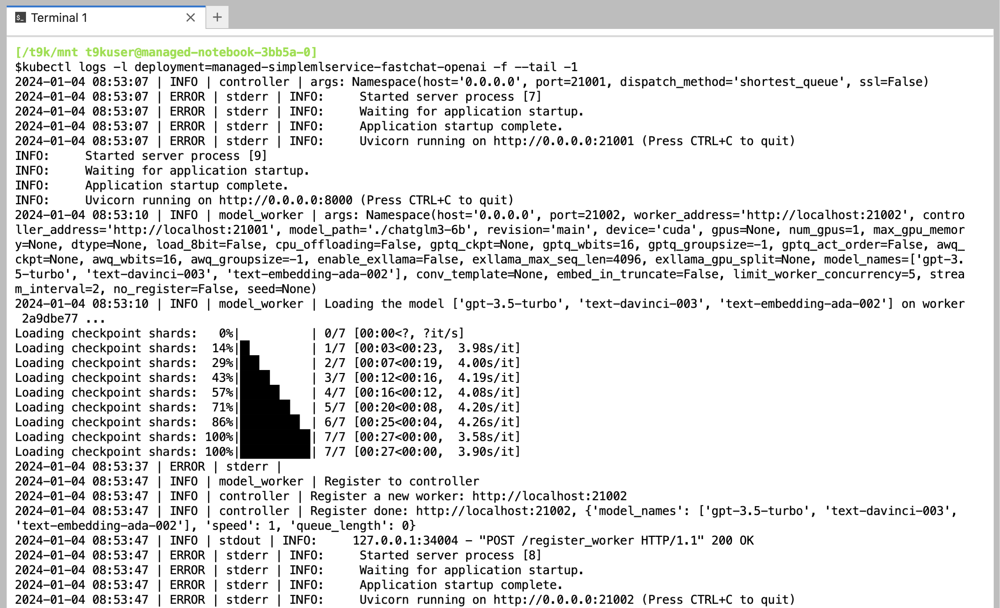
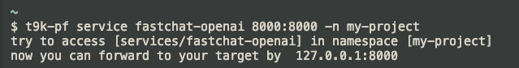
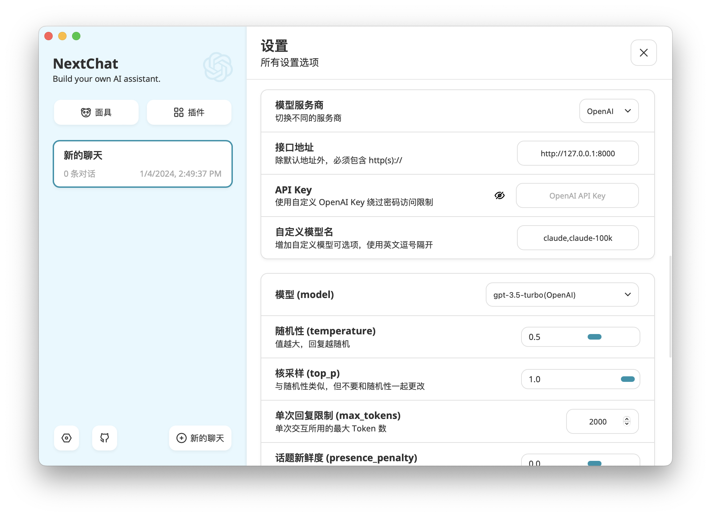
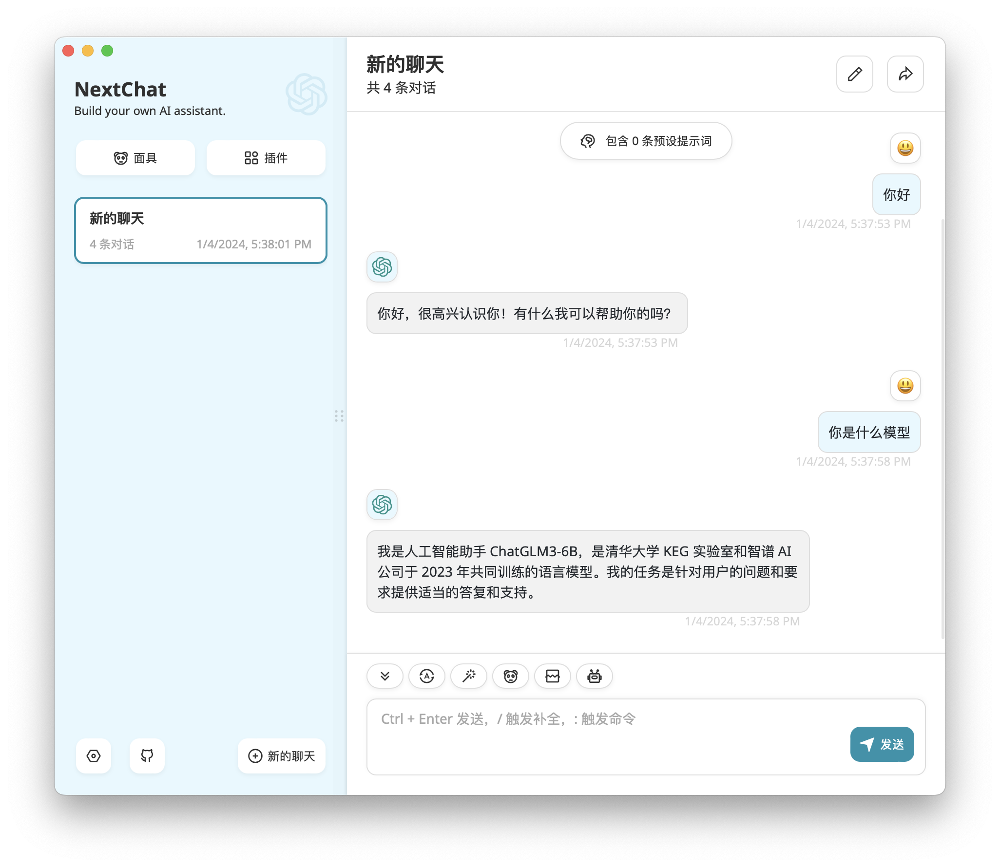

# 部署 LLM 聊天机器人

TensorStack 提供的 [SimpleMLService](../modules/deployment/simplemlservice.md) 和 [MLService](../modules/deployment/mlservice.md) 可以让用户方便地部署各种基于 LLM 的服务或应用。

本教程演示如何使用 SimpleMLService 快速部署一个类似于 ChatGPT 的基于 LLM 的聊天机器人应用。

## 模型

在用户的项目中创建一个名为 `chat`、大小 50 GiB 以上的 PVC，然后创建一个同样名为 `chat` 的 Notebook 挂载该 PVC（镜像类型和模板不限）。

进入 Notebook 或远程连接到 Notebook，启动一个终端，执行以下命令以下载 ChatGLM3-6B 的模型文件：

```bash
git clone --depth 1 https://huggingface.co/THUDM/chatglm3-6b
```

<aside class="note info">
<div class="title">ChatGLM3-6B 模型</div>

<a target="_blank" rel="noopener noreferrer" href="https://github.com/THUDM/ChatGLM3">ChatGLM3-6B</a> 是一个开源的、支持中英双语的对话语言模型，基于 General Language Model (GLM) 架构。

</aside>

## 部署

<a target="_blank" rel="noopener noreferrer" href="https://github.com/lm-sys/FastChat">FastChat</a> 是一个训练、伺服和评估基于 LLM 的聊天机器人的开放平台，其提供多种伺服方式，包括命令行、Web UI、兼容 OpenAI 的 RESTful API 等，这里使用它的 OpenAI API。

使用以下 YAML 配置文件创建 SimpleMLService（必要时修改 `spec.scheduler.t9kScheduler.queue` 字段指定的队列）：

<details><summary><code class="hljs">smls.yaml</code></summary>

```yaml
{{#include ../assets/examples/deploy-llm-chatbot/smls.yaml}}
```

</details>

```bash
kubectl create -f smls.yaml
```

## 启动

查看 SimpleMLService 创建的 Pod 打印的日志：

```bash
kubectl logs -l deployment=managed-simplemlservice-fastchat-openai -f --tail -1
```

<figure class="screenshot">
  
</figure>

当打印 Uvicorn running on http://0.0.0.0:21002 表示服务已经准备就绪，接下来就可以开始聊天了！

## 开始聊天

在本地的终端中，使用 [t9k-pf 命令行工具](../tools/cli-t9k-pf/index.md)，将 SimpleMLService 创建的服务的 8000 端口转发到本地的 8000 端口：

```bash
t9k-pf service fastchat-openai 8000:8000 -n <PROJECT NAME>
```

<figure class="screenshot">
  
</figure>

我们可以直接使用 `curl` 发送包含聊天内容的请求：

```bash
$ curl http://127.0.0.1:8000/v1/chat/completions \
  -H "Content-Type: application/json" \
  -d '{
     "model": "gpt-3.5-turbo",
     "messages": [{"role": "user", "content": "你好"}],
     "temperature": 0.5
   }'
```

返回的响应类似于：

```json
{
  "id": "chatcmpl-3NzSZge2YL3AwZpKzvDUtB",
  "object": "chat.completion",
  "created": 1704362426,
  "model": "gpt-3.5-turbo",
  "choices": [
    {
      "index": 0,
      "message": {
        "role": "assistant",
        "content": "你好，很高兴认识你！请问有什么我可以帮助你的吗？"
      },
      "finish_reason": "stop"
    }
  ],
  "usage": {
    "prompt_tokens": 15,
    "total_tokens": 29,
    "completion_tokens": 14
  }
}
```

为了让聊天有一个简洁而美观的 UI 界面，我们也可以使用 <a target="_blank" rel="noopener noreferrer" href="https://github.com/ChatGPTNextWeb/ChatGPT-Next-Web">ChatGPT-Next-Web</a> 的客户端，在<a target="_blank" rel="noopener noreferrer" href="https://github.com/ChatGPTNextWeb/ChatGPT-Next-Web/releases">这里</a>下载相应平台的安装包并进行安装。

在客户端的设置中填写接口地址 `http://127.0.0.1:8000`，其他设置保持不变，就可以开始聊天了：

<figure style="display: block; margin-left: auto; margin-right: auto;">
  
</figure>

<figure style="display: block; margin-left: auto; margin-right: auto;">
  
</figure>

## 扩展

### 部署其他 LLM

我们也可以使用同样的方法部署 LLaMA2、Vicuna、Alpaca、ChatGLM、Falcon 等一系列 LLM，例如要将本示例部署的模型从 ChatGLM3-6B 换成 LLaMA2-7B-chat，只需：

下载 LLaMA2-7B-chat 的模型文件：

```bash
# 需要登录 Hugging Face 以下载此模型
git clone --depth 1 https://huggingface.co/meta-llama/Llama-2-7b-chat-hf
```

并对 SimpleMLService 的定义作修改，再次创建即可：

```diff
$ diff --color -u smls.yaml smls-llama2.yaml
--- smls.yaml
+++ smls-llama2.yaml
@@ -10,8 +10,8 @@
   storage:
     pvc:
       name: chat
-      subPath: chatglm3-6b
-      containerPath: /workspace/chatglm3-6b
+      subPath: Llama-2-7b-chat-hf
+      containerPath: /workspace/llama2-7b-chat
   service:
     type: ClusterIP
     ports:
@@ -23,7 +23,7 @@
       - name: server
         image: t9kpublic/fastchat-openai:main
         args:
-          - "./chatglm3-6b"
+          - "./llama2-7b-chat"
         ports:
         - containerPort: 8000
         resources:
```
