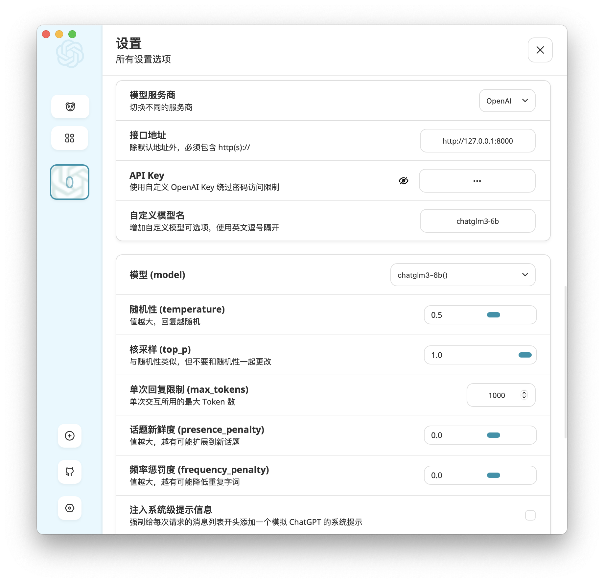
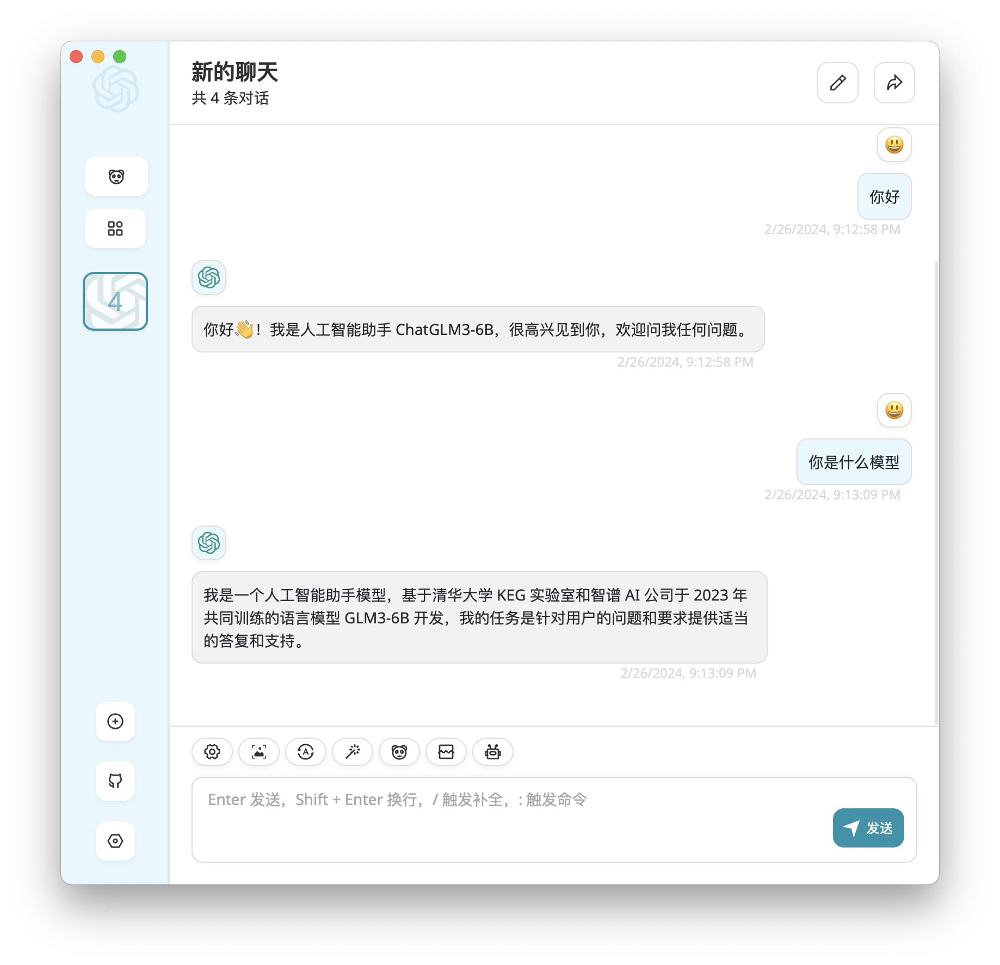

# 使用 FastChat 部署 LLM 推理服务

平台提供的 [SimpleMLService](../modules/deployment/simplemlservice.md) 和 [MLService](../modules/deployment/mlservice.md) 资源可以让用户方便地部署各种基于 LLM 的服务和应用。

<a target="_blank" rel="noopener noreferrer" href="https://github.com/lm-sys/FastChat">FastChat</a> 是一个训练、伺服和评估基于 LLM 的聊天机器人的开放平台，其提供多种伺服方式，包括命令行、Web UI、兼容 OpenAI 的 RESTful API 等。

本示例使用 SimpleMLService 和 FastChat 框架部署一个 LLM 推理服务。模型存储使用 PVC。

## 准备

在项目中创建一个名为 `fastchat`、大小 50 GiB 以上的 PVC，然后创建一个同样名为 `fastchat` 的 Notebook 挂载该 PVC（镜像类型和模板不限）。

进入 Notebook 或远程连接到 Notebook，启动一个终端，执行以下命令以克隆 <a target="_blank" rel="noopener noreferrer" href="https://github.com/t9k/examples">`t9k/examples`</a> 仓库：

```bash
cd ~
git clone https://github.com/t9k/examples.git
```

然后从 Hugging Face Hub 或魔搭社区下载要部署的模型，这里以 <a target="_blank" rel="noopener noreferrer" href="https://huggingface.co/THUDM/chatglm3-6b">chatglm3-6b</a> 模型为例：

```bash
# 方法 1：如果可以直接访问 huggingface
huggingface-cli download THUDM/chatglm3-6b \
  --local-dir chatglm3-6b --local-dir-use-symlinks False

# 方法 2：对于国内用户，访问 modelscope 网络连通性更好
pip install modelscope
python -c \
  "from modelscope import snapshot_download; snapshot_download('ZhipuAI/chatglm3-6b')"
mv .cache/modelscope/hub/ZhipuAI/chatglm3-6b .
```

<aside class="note info">
<div class="title">ChatGLM3-6B 模型</div>

<a target="_blank" rel="noopener noreferrer" href="https://github.com/THUDM/ChatGLM3">ChatGLM3-6B</a> 是一个开源的、支持中英双语的对话语言模型，基于 General Language Model (GLM) 架构。

</aside>

## 部署

这里使用 FastChat 部署兼容 OpenAI API 的服务器。

使用以下 YAML 配置文件创建 SimpleMLService：

```bash
cd examples/deployments/fastchat
kubectl create -f simplemlservice.yaml
```

监控服务是否准备就绪：

```bash
kubectl get -f simplemlservice.yaml -w
```

待其 `READY` 值变为 `true` 后，便可开始使用该服务。第一次拉取镜像可能会花费较长的时间，具体取决于集群的网络状况。

## 使用推理服务

继续使用 Notebook 的终端，使用 `curl` 命令发送聊天或生成文本的请求：

``` bash
address=$(kubectl get -f simplemlservice.yaml -ojsonpath='{.status.address.url}')

# 聊天
curl ${address}/v1/chat/completions \
  -H "Content-Type: application/json" \
  -d '{
    "model": "chatglm3-6b",
    "messages": [{"role": "user", "content": "你好"}],
    "temperature": 0.5
  }'

# 当前生成文本存在错误
```

返回的响应类似于：

<details><summary>响应</summary>

```json
{{#include ../assets/examples/deploy-llm-using-fastchat/response.log}}
```

</details>

## 为聊天增加 UI 界面

为了让聊天有一个简洁而美观的 UI 界面，我们可以使用 <a target="_blank" rel="noopener noreferrer" href="https://github.com/ChatGPTNextWeb/ChatGPT-Next-Web">ChatGPT-Next-Web</a> 提供的桌面客户端，在<a target="_blank" rel="noopener noreferrer" href="https://github.com/ChatGPTNextWeb/ChatGPT-Next-Web/releases">这里</a>下载相应平台的安装包并进行安装。

继续使用 Notebook 的终端，获取 SimpleMLService 创建的服务的名称：

```bash
echo ${address} | cut -d'.' -f1
```

然后打开本地的终端，使用 [t9k-pf 命令行工具](../tools/cli-t9k-pf/index.md)，将该服务的 80 端口转发到本地的 8000 端口：

```bash
t9k-pf service <SERVICE_NAME> 8000:80 -n <PROJECT_NAME>
```

在桌面客户端的设置中，**接口地址**填写 `http://127.0.0.1:8000`，**自定义模型名**填写 `chatglm3-6b` 并选择该模型，其他设置保持不变，就可以开始聊天了：

<figure style="display: block; margin-left: auto; margin-right: auto;">
  
</figure>

<figure style="display: block; margin-left: auto; margin-right: auto;">
  
</figure>

## 扩展：部署其他 LLM

我们可以使用同样的方法部署其他<a target="_blank" rel="noopener noreferrer" href="https://github.com/lm-sys/FastChat?tab=readme-ov-file#supported-models">支持的模型</a>，例如要将本示例部署的模型从 ChatGLM3-6B 换成 LLaMA2-7B-chat，只需：

1. 下载 LLaMA2-7B-chat 的模型文件：

```bash
# 方法 1：如果可以直接访问 huggingface
# 需要登录
huggingface-cli download meta-llama/Llama-2-7b-chat-hf \
  --local-dir Llama-2-7b-chat-hf --local-dir-use-symlinks False

# 方法 2：对于国内用户，访问 modelscope 网络连通性更好
pip install modelscope
python -c \
  "from modelscope import snapshot_download; snapshot_download('shakechen/Llama-2-7b-chat-hf')"
mv .cache/modelscope/hub/shakechen/Llama-2-7b-chat-hf .
```

2. 对 SimpleMLService 的 YAML 配置文件作以下修改，再次创建即可：

```diff
$ diff --color -u simplemlservice.yaml simplemlservice-llama2.yaml
--- simplemlservice.yaml
+++ simplemlservice-llama2.yaml
@@ -10,8 +10,8 @@
   storage:
     pvc:
       name: fastchat
-      subPath: chatglm3-6b
-      containerPath: /workspace/chatglm3-6b
+      subPath: Llama-2-7b-chat-hf
+      containerPath: /workspace/llama2-7b-chat
   service:
     type: ClusterIP
     ports:
@@ -23,7 +23,7 @@
       - name: server
         image: t9kpublic/fastchat-openai:20240227
         args:
-          - "chatglm3-6b"
+          - "llama2-7b-chat"
         ports:
         - containerPort: 80
         resources:
```

## 参考

* <a target="_blank" rel="noopener noreferrer" href="https://github.com/lm-sys/FastChat">GitHub 上的 FastChat</a>
* <a target="_blank" rel="noopener noreferrer" href="https://github.com/ChatGPTNextWeb/ChatGPT-Next-Web">GitHub 上的 ChatGPT Next Web</a>
