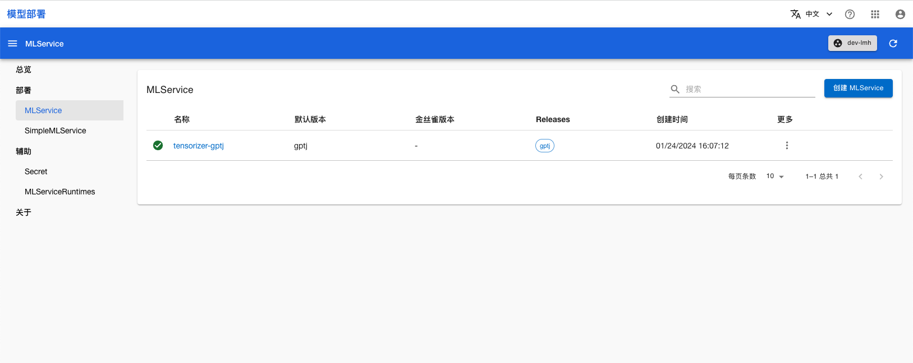

# 使用 CoreWeave Tensorizer 加速模型部署

在部署模型的过程中，加载模型尤其是大模型往往耗时很长。对此，CoreWeave 发布了 [Tensorizer](https://docs.coreweave.com/coreweave-machine-learning-and-ai/inference/tensorizer) 用于模型和张量的序列化和反序列化。它能以更少的资源和更快的速度加载模型。

TensorStack 提供的 [SimpleMLService](../modules/deployment/simplemlservice.md) 和 [MLService](../modules/deployment/mlservice.md) 可以让用户方便地部署各种模型。

本示例通过 MLService 部署一个 [GPT-J-6B](https://huggingface.co/EleutherAI/gpt-j-6b) 大模型，并使用 [CoreWeave Tensorizer](https://docs.coreweave.com/coreweave-machine-learning-and-ai/inference/tensorizer) 加速模型加载。


## 准备

在项目中创建一个名为 `tensorizer`、大小为 50GiB 以上的 PVC，然后创建一个同样名为 `tensorizer` 的 Notebook 挂载该 PVC，镜像选择带有 sudo 权限的类型，资源不限（如要使用远程操作，请开启 SSH）。

进入 Notebook 或远程连接到 Notebook，启动一个终端，执行以下命令以克隆必要的仓库：

```bash
# change to mount point of PVC `tensorizer`, defaults to /t9k/mnt, and also $HOME
cd ~
git clone https://github.com/t9k/examples.git
```

## 下载模型

Tensorizer 以 "tensor streaming" 的形式加载模型，从而以更少的资源和更快的速度加载模型。这需要用户首先以 Tensorizer 支持的形式来保存模型。通过运行以下命令创建一个 `GenericJob` 来下载并保存模型：

```sh
# 切换到正确目录
cd ~/examples/inference/tensorizer
kubectl apply -f ./download-job.yaml
```

在该 GenericJob 中，我们先使用国内模型平台 ModelScope 来下载 GPT-J-6B 模型，然后将模型转换为 CoreWeave Tensorizer 所需的格式，并保存到 PVC 中，代码细节见 [model_download.py](https://github.com/t9k/examples/blob/master/inference/tensorizer/download/model_download.py)。


## 部署推理服务

待模型下载的任务结束后，便可以开始部署服务。首先创建 `MLServiceRuntime`，MLServiceRuntime 定义了部署服务的 Pod 模版，此处所定义的 Pod 模版会使用 Tensorizer 加载环境变量 `MODEL_PATH` 所指定的路径中的模型文件：

```sh
kubectl apply -f ./runtime.yaml
```

然后部署 `MLService`，MLService 会指定要使用的 `MLServiceRuntime` 以及要挂载的模型。此处我们使用[下载模型](#下载模型)中 PVC 里所保存的模型文件：

```sh
kubectl apply -f ./mlservice.yaml
```

部署后进入模型部署控制台的 MLService 页面，可以看到名为 **tensorizer-gptj** 的 MLService，稍等片刻，等其进入 Ready 状态：

<figure class="screenshot">
    
</figure>

## 使用推理服务

您可以直接使用命令行工具访问 MLService 的预测服务。运行命令获取 MLService 的 URL：

``` shell
url=$(kubectl get mlservice tensorizer-gptj -o jsonpath='{.status.address.url}') && echo $url
```

发送推理请求：

``` shell
curl ${url}/v1/models/gptj:predict -X POST -H 'Content-Type: application/json' -d '{"instances": ["Once upon a time, there was"]}'
```

返回的响应类似于：

```json
{
  "predictions":["Once upon a time, there was a happy prince…\n\nFaced with a constant barrage of attacks from enemies, this happy prince decided to launch a counterattack and create his own military kingdom. He created a country called Fairy Tail, where no dragon is found, but all dragon"]
}
```

## 扩展

上述例子演示了如何下载以及部署 GPT-J-6B 大模型。用户可以参考[制作 Tensorizer 相关的镜像](https://github.com/t9k/examples/blob/master/inference/tensorizer/README.md#%E5%88%B6%E4%BD%9C-tensorizer-%E7%9B%B8%E5%85%B3%E7%9A%84%E9%95%9C%E5%83%8F)将 Tensorizer 用于自定义模型的部署。