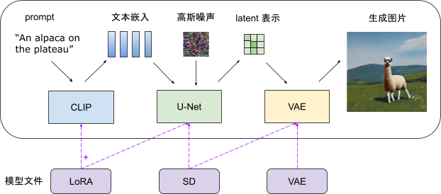
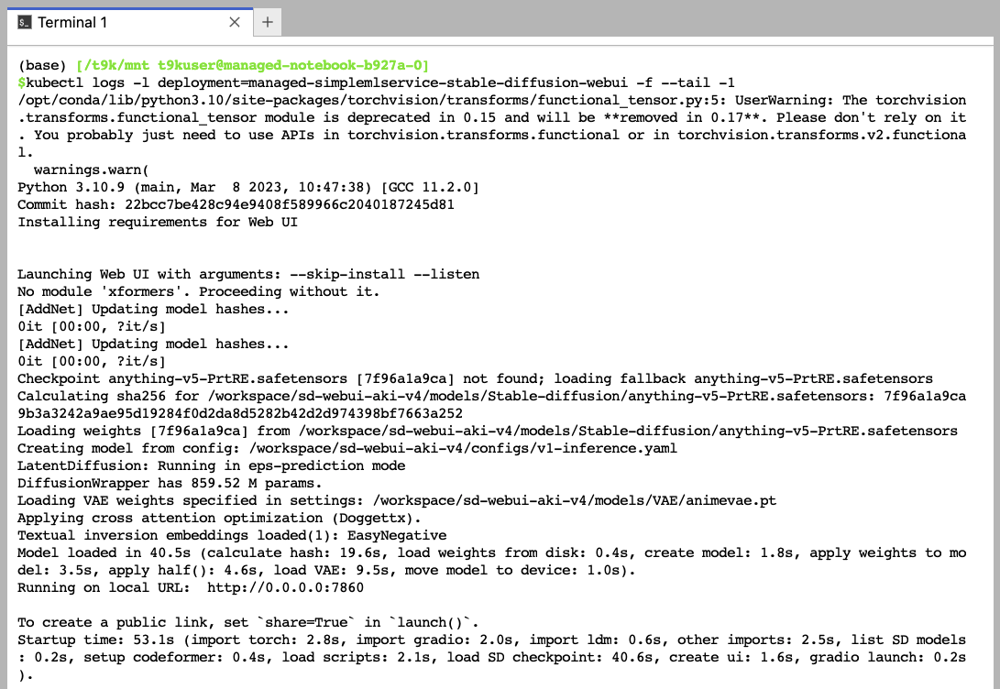
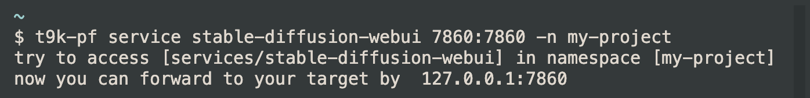
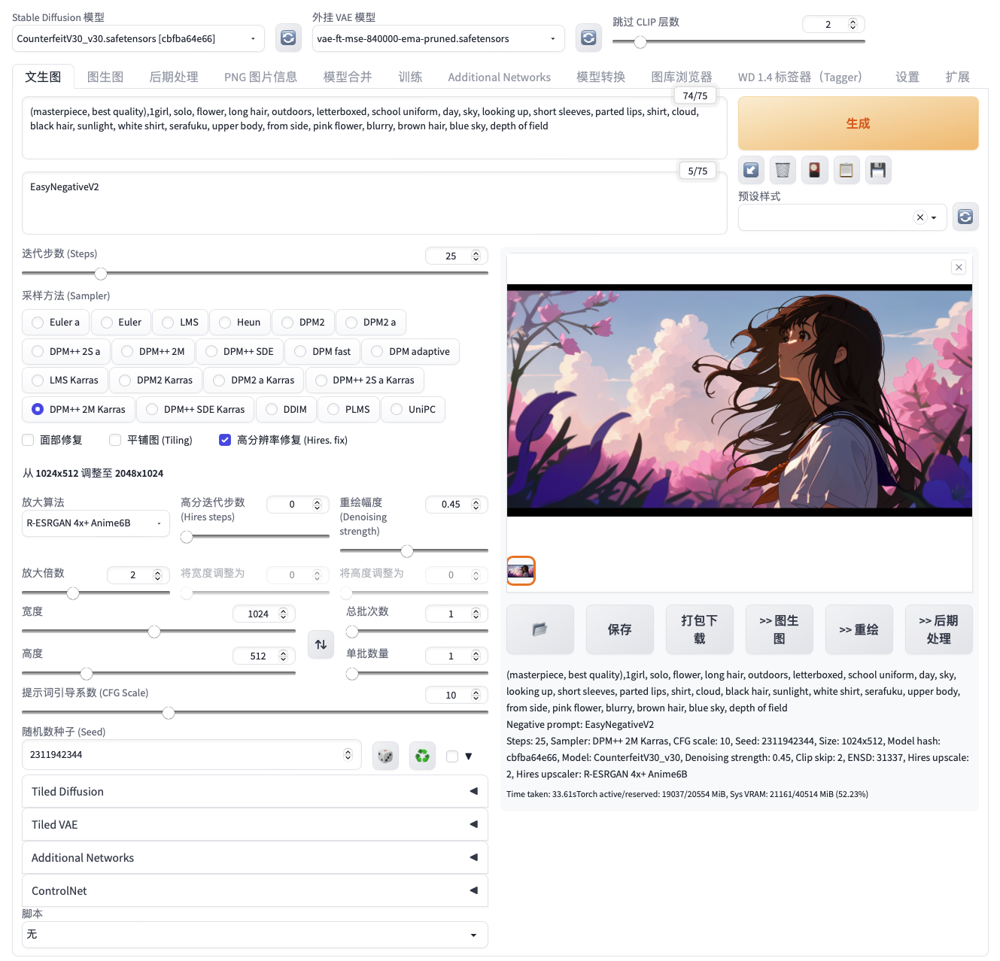
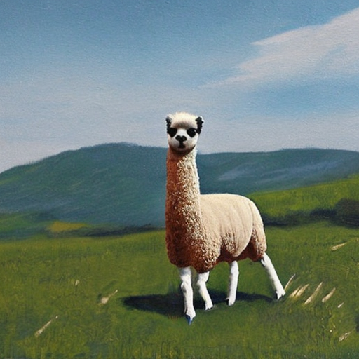
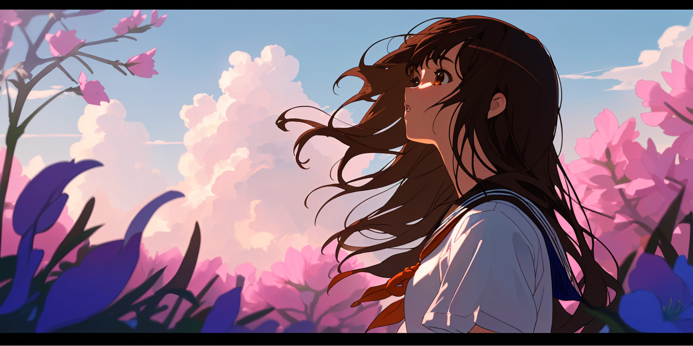
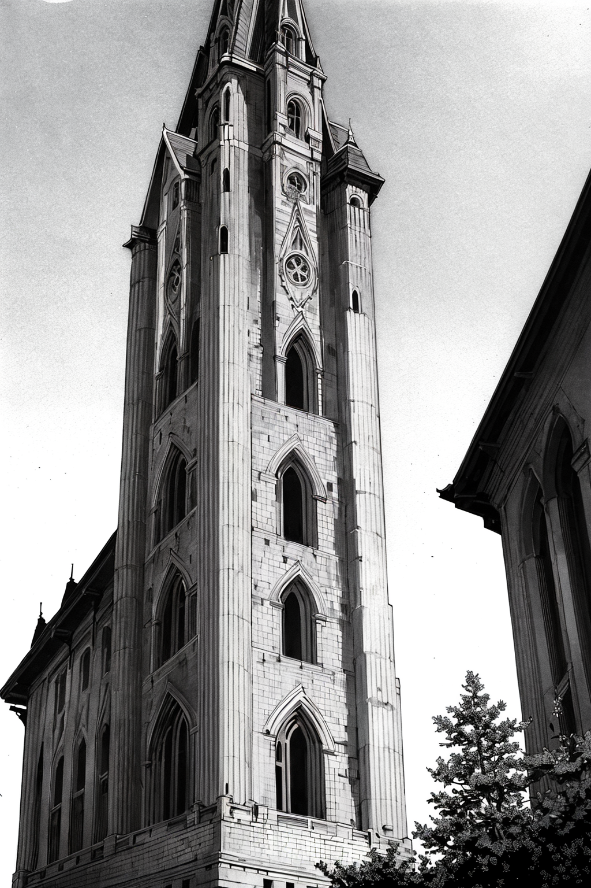
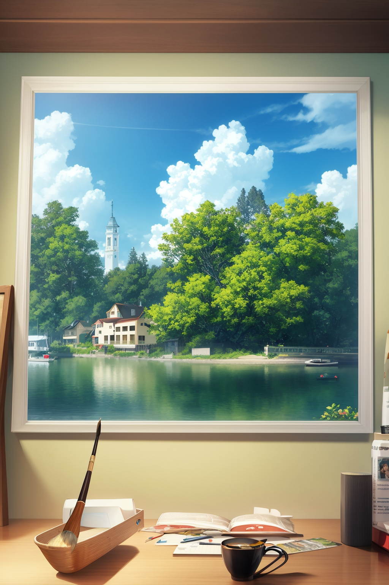
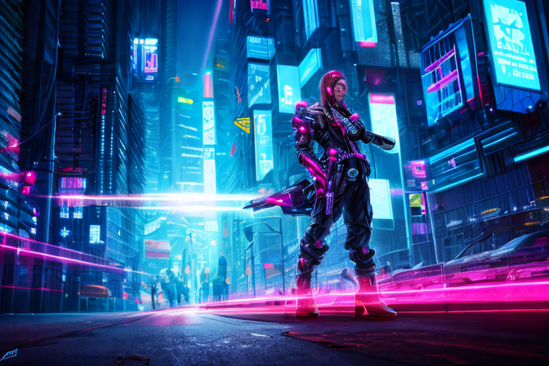

# 部署 Stable Diffusion 图像生成模型

自扩散模型问世以来，AI 绘图应用在艺术、设计和创意领域取得了显著的突破和广泛的应用。在 TensorStack 平台上，用户可以使用 [SimpleMLService](../modules/deployment/simplemlservice.md) 和 [MLService](../modules/deployment/mlservice.md) 方便地部署各种基于图像生成模型的服务或应用。

本教程演示如何使用 SimpleMLService 快速部署一个基于 Stable Diffusion 图像生成模型的绘图应用。

## 模型

在项目中创建一个名为 `draw`、大小 50 GiB 以上的 PVC，然后创建一个同样名为 `draw` 的 Notebook 挂载该 PVC（镜像类型和模板不限）。

进入 Notebook 或远程连接到 Notebook，启动一个终端，执行下列命令以下载 Stable Diffusion、VAE、LoRA 等模型的文件：

```bash
mkdir sd
wget https://civitai.com/api/download/models/30163 \
  -O sd/anything-v5-PrtRE.safetensors
wget https://civitai.com/api/download/models/57618 \
  -O sd/CounterfeitV30_v30.safetensors
wget https://huggingface.co/runwayml/stable-diffusion-v1-5/resolve/main/v1-5-pruned.safetensors \
  -O sd/v1-5-pruned.safetensors

mkdir lora
wget https://civitai.com/api/download/models/87153 \
  -O lora/more_details.safetensors

mkdir vae
wget https://huggingface.co/stabilityai/sd-vae-ft-mse-original/resolve/main/vae-ft-mse-840000-ema-pruned.safetensors \
  -O vae/vae-ft-mse-840000-ema-pruned.safetensors

mkdir outputs
```

最终目录结构如下：

```
.
├── lora
│   └── more_details.safetensors
├── outputs (用于放置模型输出)
├── sd
│   ├── anything-v5-PrtRE.safetensors
│   ├── CounterfeitV30_v30.safetensors
│   └── v1-5-pruned.safetensors
└── vae
    └── vae-ft-mse-840000-ema-pruned.safetensors
```

Stable Diffusion 生成图片的简化流水线如下图所示，具体包含三个主要步骤：

1. CLIP 模型为输入的 prompt 生成文件嵌入；
1. U-Net 反复地去除 latent 表示中的噪音；
1. VAE 将 latent 表示解码为最终的图片。

<figure style="display: block; margin-left: auto; margin-right: auto;">
  
</figure>

我们前面所下载的模型文件中：

* Stable Diffusion 模型提供图中的 U-Net 和 VAE 模型。
* VAE 用于替换现有 Stable Diffusion 模型的 VAE。VAE 会影响图片的风格以及细节处理。
* LoRA 用于更新 CLIP 和 U-Net 的权重。使用 LoRA 会应用微调过程中对模型的修改，以生成特定内容或风格的图片。

</aside>

<aside class="note info">
<div class="title">信息</div>

用户可以前往 <a target="_blank" rel="noopener noreferrer" href="https://huggingface.co/models">Hugging Face</a> 或 <a target="_blank" rel="noopener noreferrer" href="https://civitai.com/">Civitai</a> 获取更多图像生成模型。

想要更深入地了解 Stable Diffusion 模型的机制，可以参阅 <a target="_blank" rel="noopener noreferrer" href="https://stable-diffusion-art.com/how-stable-diffusion-work/">How does Stable Diffusion work?</a>。

</aside>

## 部署

<a target="_blank" rel="noopener noreferrer" href="https://github.com/AUTOMATIC1111/stable-diffusion-webui">stable-diffusion-webui</a> 是一个用于运行 Stable Diffusion 模型的 gradio web UI。bilibili 用户“秋葉aaaki”基于这一项目制作了<a target="_blank" rel="noopener noreferrer" href="https://www.bilibili.com/video/BV1iM4y1y7oA">整合包</a>。这里使用它来部署上述模型。

使用以下 YAML 配置文件创建 SimpleMLService（必要时修改 `spec.scheduler.t9kScheduler.queue` 字段指定的队列）：

<details><summary><code class="hljs">smls.yaml</code></summary>

```yaml
{{#include ../assets/examples/deploy-sd-drawing-model/smls.yaml}}
```

</details>

```bash
kubectl create -f smls.yaml
```

## 启动

查看 SimpleMLService 创建的 Pod 打印的日志：

```bash
kubectl logs -l deployment=managed-simplemlservice-stable-diffusion-webui -f --tail -1
```

<figure class="screenshot">
  
</figure>

接下来就可以开始生成图片了！

## 生成图片

在本地的终端中，使用 [t9k-pf 命令行工具](../tools/cli-t9k-pf/index.md)，将 SimpleMLService 创建的服务的 7860 端口转发到本地的 7860 端口：

```bash
t9k-pf service stable-diffusion-webui 7860:7860 -n <PROJECT NAME>
```

<figure class="screenshot">
  
</figure>

然后使用浏览器访问 `127.0.0.1:7860`，绘制喜欢的图片：

<figure class="screenshot">
  
</figure>

生成的图片可以通过 Web UI 下载，同时也会保存到 PVC 的 `outputs/` 路径下。

## 画廊

这里展示一些最终生成的图片：

<br><br>

<figure style="display: block; margin-left: auto; margin-right: auto;">
  
</figure>

<table>
  <tr>
    <td>模型</td>
    <td>v1-5-pruned.safetensors, vae-ft-mse-840000-ema-pruned.safetensors</td>
  </tr>
  <tr>
    <td>生成数据</td>
    <td>alpaca, plateau, mountain, realistic, 
Steps: 20, Sampler: DPM++ 2M Karras, CFG scale: 7, Seed: 2642782115, Size: 512x512, Model hash: 1a189f0be6, Model: v1-5-pruned, Clip skip: 2, ENSD: 31337</td>
  </tr>
</table>

<br><br>

<figure style="display: block; margin-left: auto; margin-right: auto;">
  
</figure>

<table>
  <tr>
    <td>模型</td>
    <td>CounterfeitV30_v30.safetensors, vae-ft-mse-840000-ema-pruned.safetensors</td>
  </tr>
  <tr>
    <td>生成数据</td>
    <td>(masterpiece, best quality),1girl, solo, flower, long hair, outdoors, letterboxed, school uniform, day, sky, looking up, short sleeves, parted lips, shirt, cloud, black hair, sunlight, white shirt, serafuku, upper body, from side, pink flower, blurry, brown hair, blue sky, depth of field
Negative prompt: EasyNegativeV2
Steps: 25, ENSD: 31337, Size: 1024x512, Seed: 2311942344, Model: CF5_Counterfeit-V3.0_fix_fix_fix, Sampler: DPM++ 2M Karras, CFG scale: 10, Clip skip: 2, Model hash: db6cd0a62d, Hires upscale: 2, Hires upscaler: R-ESRGAN 4x+ Anime6B, Denoising strength: 0.45</td>
  </tr>
</table>

<br><br>

<figure style="display: block; margin-left: auto; margin-right: auto;">
  
</figure>

<table>
  <tr>
    <td>模型</td>
    <td>anything-v5-PrtRE.safetensors, vae-ft-mse-840000-ema-pruned.safetensors</td>
  </tr>
  <tr>
    <td>生成数据</td>
    <td>masterpiece, best quality, scenery, whale, fish, starry sky, galaxy, cosmos, fantasy, floating object|fish, backlight, shadow
Negative prompt: (low quality, worst quality:1.4), (bad anatomy)，easynegative
Steps: 20, Size: 1024x512, Seed: 3421647346, Sampler: DPM++ 2M Karras, CFG scale: 8</td>
  </tr>
</table>

<br><br>

<figure style="display: block; margin-left: auto; margin-right: auto;">
  
</figure>

<table>
  <tr>
    <td>模型</td>
    <td>anything-v5-PrtRE.safetensors, vae-ft-mse-840000-ema-pruned.safetensors</td>
  </tr>
  <tr>
    <td>生成数据</td>
    <td>masterpiece, best quality, best 8k wallpaper, chibi, 1girl, official, solo, silver hair, ponytail, blush, smile, head, sunglasses, white background, pixel, (pixel art)
Negative prompt: badhandv4,EasyNegative
Steps: 80, Sampler: DPM++ 2M Karras, CFG scale: 9, Seed: 1362619635, Size: 512x512, Model hash: 7f96a1a9ca, Model: anything-v5-PrtRE, ENSD: 31337</td>
  </tr>
</table>

<br><br>

<figure style="display: block; margin-left: auto; margin-right: auto;">
  
</figure>

<table>
  <tr>
    <td>模型</td>
    <td>anything-v5-PrtRE.safetensors, vae-ft-mse-840000-ema-pruned.safetensors</td>
  </tr>
  <tr>
    <td>生成数据</td>
    <td>greyscale, monochrome, no humans, tree, scenery, traditional media, tower, building, outdoors
Negative prompt: EasyNegative
Steps: 20, Sampler: DPM++ SDE Karras, CFG scale: 7, Seed: 2579617703, Size: 512x768, Model hash: 7f96a1a9ca, Model: anything-v5-PrtRE, Denoising strength: 0.7, Clip skip: 2, ENSD: 31337, Hires upscale: 2, Hires upscaler: Latent</td>
  </tr>
</table>

<br><br>

<figure style="display: block; margin-left: auto; margin-right: auto;">
  
</figure>

<table>
  <tr>
    <td>模型</td>
    <td>anything-v5-PrtRE.safetensors, vae-ft-mse-840000-ema-pruned.safetensors</td>
  </tr>
  <tr>
    <td>生成数据</td>
    <td>Monet style, beach, boat, cloud, sky, traditional media, water, watercraft, (masterpiece:1,2), best quality, masterpiece, highres, original, extremely detailed wallpaper, perfect lighting,(extremely detailed CG:1.2), drawing, paintbrush,
Negative prompt: NSFW, (worst quality:2), (low quality:2), (normal quality:2), lowres, normal quality, ((monochrome)), ((grayscale)), skin spots, acnes, skin blemishes, age spot, (ugly:1.331), (duplicate:1.331), (morbid:1.21), (mutilated:1.21), (tranny:1.331), mutated hands, (poorly drawn hands:1.5), blurry, (bad anatomy:1.21), (bad proportions:1.331), extra limbs, (disfigured:1.331), (missing arms:1.331), (extra legs:1.331), (fused fingers:1.61051), (too many fingers:1.61051), (unclear eyes:1.331), lowers, bad hands, missing fingers, extra digit,bad hands, missing fingers, (((extra arms and legs))),
Steps: 36, Sampler: Euler a, CFG scale: 4.5, Seed: 2739912422, Size: 512x768, Model hash: 7f96a1a9ca, Model: anything-v5-PrtRE, Denoising strength: 0.7, Clip skip: 3, ENSD: 31337, Hires upscale: 2, Hires upscaler: Latent</td>
  </tr>
</table>

<br><br>

<figure style="display: block; margin-left: auto; margin-right: auto;">
  
</figure>

<table>
  <tr>
    <td>模型</td>
    <td>anything-v5-PrtRE.safetensors, vae-ft-mse-840000-ema-pruned.safetensors</td>
  </tr>
  <tr>
    <td>生成数据</td>
    <td>digital painting, best quality, magic, cyberpunk, city, street, neon, mystic, <lora:more_details:1>
Negative prompt: (worst quality:1.2), (low quality:1.2), (lowres:1.1), (monochrome:1.1), (greyscale), multiple views, comic, sketch, watermark, multiple_views
Steps: 150, Sampler: PLMS, CFG scale: 7, Seed: 2300531334, Size: 768x512, Model hash: 7f96a1a9ca, Model: anything-v5-PrtRE, Clip skip: 2, ENSD: 31337
</td>
  </tr>
</table>
