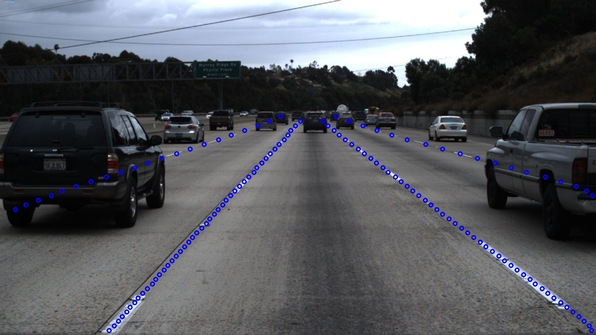
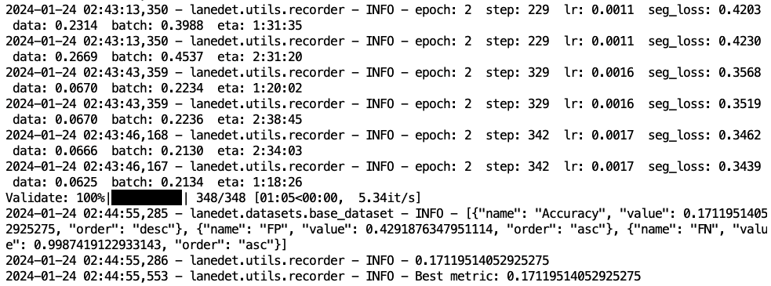

# 车道检测

车道检测是计算机视觉和自动驾驶领域的一项关键技术，旨在识别和跟踪道路上的车道线。这个任务对于实现车辆的自动驾驶和辅助驾驶系统至关重要，因为它能够帮助车辆理解其在道路上的位置，保持车道，并执行如车道保持、车道变换等操作。



本示例使用 PyTorchTrainingJob 训练一个车道检测模型。

## 准备

在项目中创建一个名为 `lanedet`、大小 50 GiB 以上的 PVC，然后创建一个同样名为 `lanedet` 的 Notebook 挂载该 PVC（镜像类型和模板不限）。

进入 Notebook，启动一个终端，执行以下命令以克隆 <a target="_blank" rel="noopener noreferrer" href="https://github.com/t9k/examples">`t9k/examples` 仓库</a>：

```bash
cd ~
git clone https://github.com/t9k/examples.git
```

<aside class="note info">
<div class="title">训练代码</div>

<a target="_blank" rel="noopener noreferrer" href="https://github.com/Turoad/lanedet">LaneDet</a> 是一个基于 PyTorch 的开源车道检测工具箱，旨在汇集多种最先进的车道检测模型。开发者可以复现这些最先进的方法，并构建他们自己的方法。

本示例的代码位于 `t9k/examples` 仓库的 `lanedet/` 路径下，其在 LaneDet 原项目的基础上进行了一些修改，包括用 PyTorch 原生的数据并行训练替换 MMCV 提供的数据并行训练，以及提供 PyTorchTrainingJob 的 YAML 配置文件以启动训练。

</aside>

继续执行以下命令以从 kaggle 下载 TuSimple 数据集并解压，其中 `kaggle.json` 文件需要登录 kaggle 获取。完整的操作步骤可以参阅博客 <a target="_blank" rel="noopener noreferrer" href="https://www.endtoend.ai/tutorial/how-to-download-kaggle-datasets-on-ubuntu/">How to Download Kaggle Datasets on Ubuntu</a>。

```bash
pip install kaggle

# 在浏览器中登录 kaggle，在账户设置页面创建新的 token 以生成 kaggle.json 文件，将其上传到 Notebook
mkdir ~/.kaggle
mv kaggle.json ~/.kaggle

kaggle datasets download manideep1108/tusimple
unzip tusimple.zip
```

<aside class="note info">
<div class="title">TuSimple 数据集</div>

<a target="_blank" rel="noopener noreferrer" href="https://www.kaggle.com/datasets/manideep1108/tusimple?resource=download">TuSimple</a> 数据集包含了 6,408 张美国高速公路上的道路图像，图像的分辨率为 1280×720。该数据集包括了 3,626 张用于训练的图像和 2,782 张用于测试的图像。

</aside>

## 训练

使用如下 YAML 配置文件创建 PyTorchTrainingJob 以启动训练。该 PyTorchTrainingJob 创建 2 个副本，每个副本启动 2 个进程，每个进程使用 1 个 GPU。

```bash
kubectl create -f examples/lanedet/t9k/job.yaml
```

通过以下命令查看训练过程中打印的日志：

```bash
export POD=$(kubectl get pj lanedet -o jsonpath="{.status.tasks[0].replicas[0].name}")
kubectl logs $POD -f
```

<figure class="screenshot">
  
</figure>

训练共进行 100 个 epoch，每个 epoch 结束时进行验证（使用测试图像作为验证集），计算准确率、假阳性率和假阴性率。训练完成之后，模型文件将保存到 `output/TuSimple/0/*/` 路径下。训练花费约 3 小时，最终准确率可以达到约 0.94。
