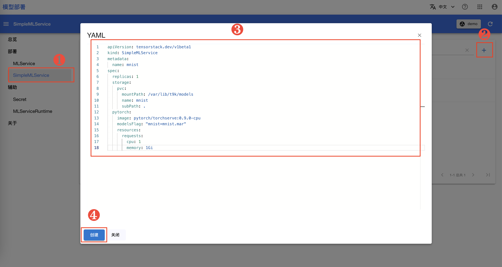
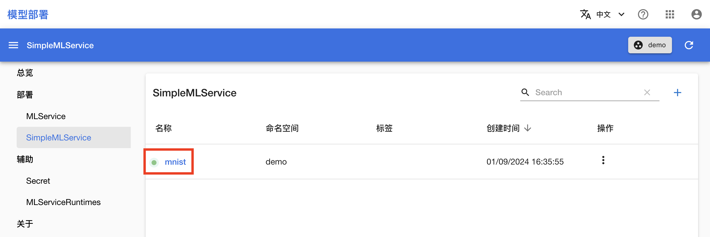
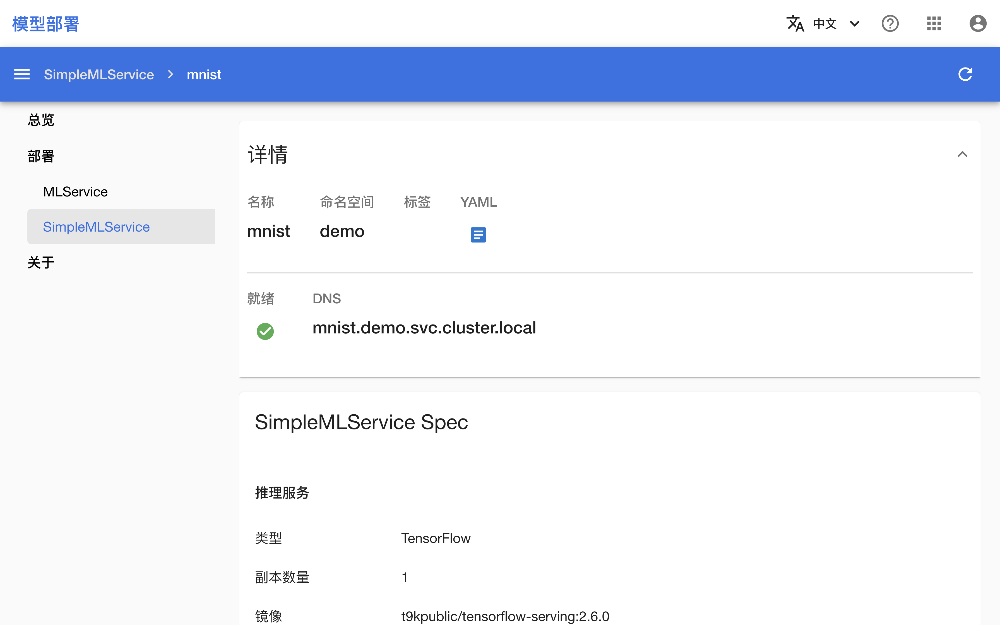

# 部署模型

本教程带领用户使用 CRD [SimpleMLService](../modules/deployment/simplemlservice.md)，部署模型为推理服务。

在教程[训练你的第一个模型](./training-first-model.md)和[进行并行训练](./parallel-training.md)中，训练完成的模型都被保存为文件 `model_state_dict.pt`，这两个模型文件所对应的模型是相同的。本教程将部署这个模型为推理服务。

## 准备模型文件

这里我们使用 <a target="_blank" rel="noopener noreferrer" href="https://github.com/pytorch/serve">TorchServe</a> 部署 PyTorch 模型。回到 Notebook mnist，在 HOME 目录（即左侧边栏文件浏览器显示的根目录 `/`）下新建以下文件：

<details><summary><code class="hljs">model.py</code></summary>

```python
{{#include ../assets/get-started/deployment/model.py}}
```

</details>

<details><summary><code class="hljs">handler.py</code></summary>

```python
{{#include ../assets/get-started/deployment/handler.py}}
```

</details>

点击左上角的 **+**，然后点击 Other 下的 **Terminal** 以新建一个终端。

<figure class="screenshot">
  
</figure>

执行以下命令以打包一个 torch model archive：

```bash
# 使用 Notebook 中训练的模型
torch-model-archiver --model-name mnist \
  --version 1.0 \
  --model-file model.py \
  --handler handler.py \
  --serialized-file first-model/model_state_dict.pt

# 如果使用 Job 中训练的模型，切换参数
# --serialized-file parallel-training/model_state_dict.pt
```

## 部署推理服务

在 TensorStack AI 平台首页，点击**Deploy**进入模型部署控制台。

<figure class="screenshot">
  
</figure>

模型部署控制台的总览页面展示了当前部署服务的数量以及资源使用情况。在左侧的导航菜单中点击**部署&nbsp;> SimpleMLService**，点击右上角的 **+** 弹出创建对话框，然后复制下面的 YAML 配置文件并粘贴到编辑框中，最后点击**创建**。

```yaml
apiVersion: tensorstack.dev/v1beta1
kind: SimpleMLService
metadata:
  name: mnist
spec:
  replicas: 1
  storage:
    pvc:
      containerPath: /var/lib/t9k/models
      name: mnist
      subPath: .
  pytorch:
    image: pytorch/torchserve:0.9.0-cpu
    modelsFlag: "mnist=mnist.mar"
    resources: 
      requests:
        cpu: 1
        memory: 1Gi
```

<figure class="screenshot">
  
</figure>

<aside class="note info">
<div class="title">SimpleMLService</div>

[SimpleMLService](../modules/deployment/simplemlservice.md) 是平台提供的用于部署模型推理服务的资源。与同样用于部署推理服务的 [MLService](../modules/deployment/mlservice.md) 相比，SimpleMLService 更加精简，适用于快速测试。

</aside>

在跳转回到 SimpleMLService 管理页面之后，等待刚才创建的 SimpleMLService 准备就绪。

- 第一次拉取镜像可能会花费较长的时间，具体取决于用户集群的网络状况。
- 点击右上角的**刷新按钮**以手动刷新 SimpleMLService 状态。

## 使用推理服务

### 查看推理服务地址

待 SimpleMLService 就绪之后，点击其**名称**进入详情页面。

<figure class="screenshot">
  
</figure>

页面中展示的 DNS 即为推理服务地址，注意该地址只能从集群内部访问。

<figure class="screenshot">
  
</figure>


### 访问推理服务

回到 Notebook mnist，在终端中执行以下命令以下载测试数据，并向推理服务发送请求，其中 `URL` 变量的值需要修改为用户实际部署的推理服务的地址。

```bash
# 下载测试图像文件
wget https://t9k.github.io/user-manuals/assets/get-started/deployment/{0,1,2}.png

# 注意：此 URL 只适合在集群内当前项目（Project）内部（例如当前项目的 Notebook 中）访问使用
URL="http://mnist.demo.svc.cluster.local/v1/models/mnist:predict"
curl -T 0.png $URL    # 或使用 `1.png`, `2.png`
```

响应体应是一个类似于下面的 JSON，其预测了图片最有可能是的 5 个数字以及相应的概率：

```json
{
  "0": 1.0,
  "2": 1.7797361302828807e-16,
  "9": 6.094195260341553e-19,
  "6": 1.5410183526346253e-19,
  "5": 7.889719768364669e-20
}
```

## 清理

体验结束后，可将当前教程产生的所有文件移动到名为 `deployment` 的新文件夹下。

也可以将部署的推理服务删除：

```bash
# optional, delete service if desired.
kubectl delete SimpleMLService mnist
```

## 下一步

* 了解[模型部署](../modules/deployment/index.md)
* 进一步学习如何[部署用于测试环境的模型推理服务](../tasks/deploy-simplemlservice.md)
* 进一步学习如何[部署用于生产环境的模型推理服务](../tasks/deploy-mlservice.md)
