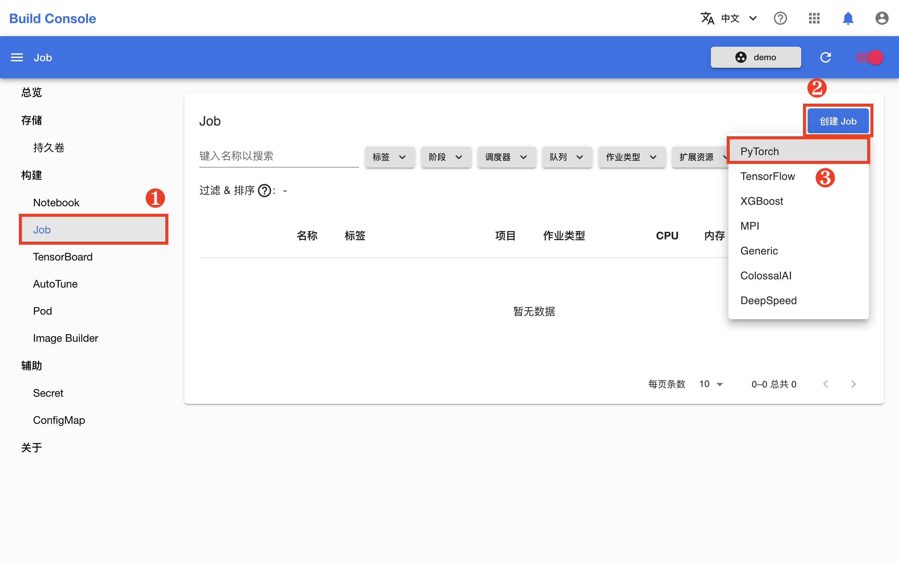
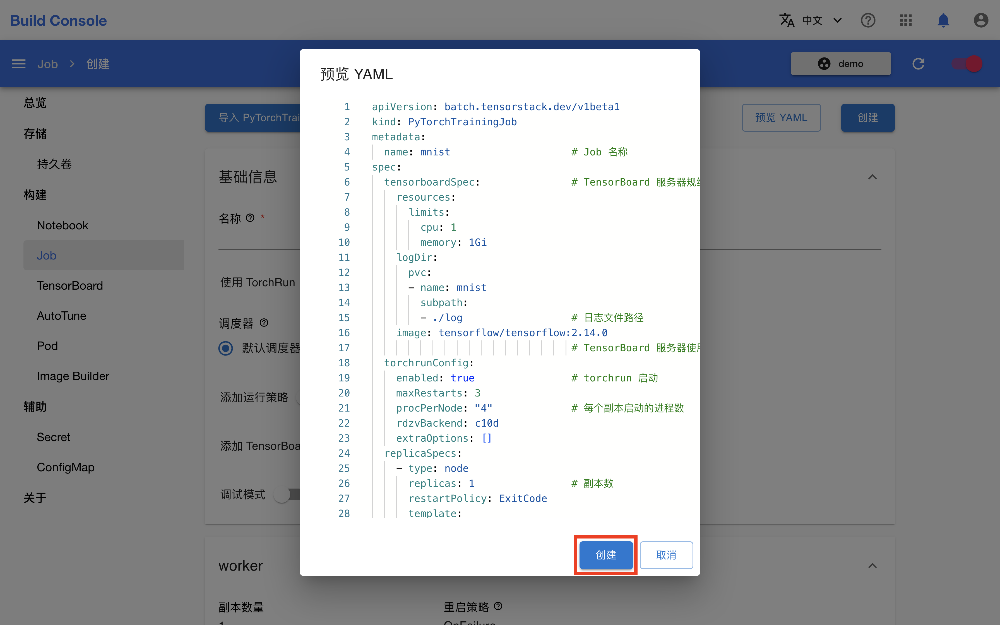
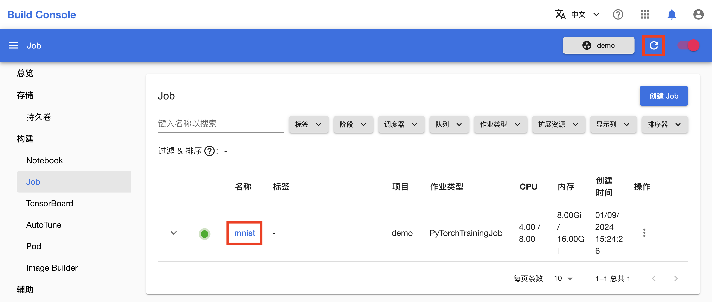
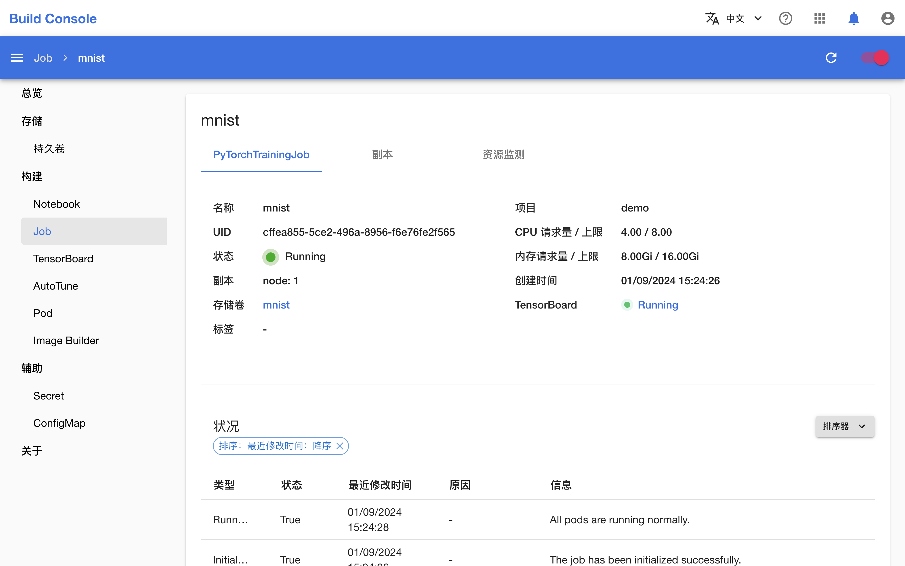
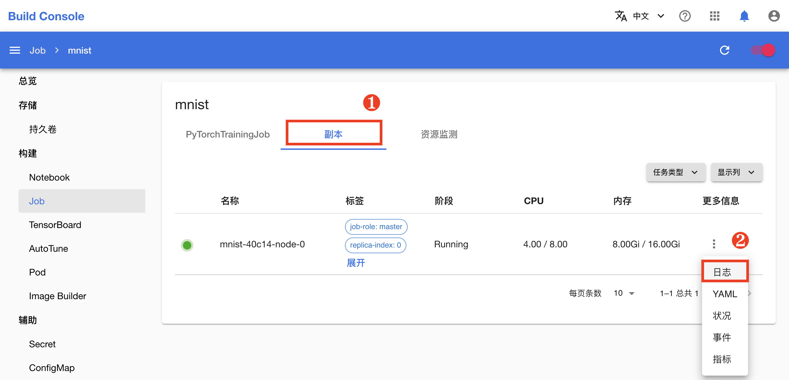
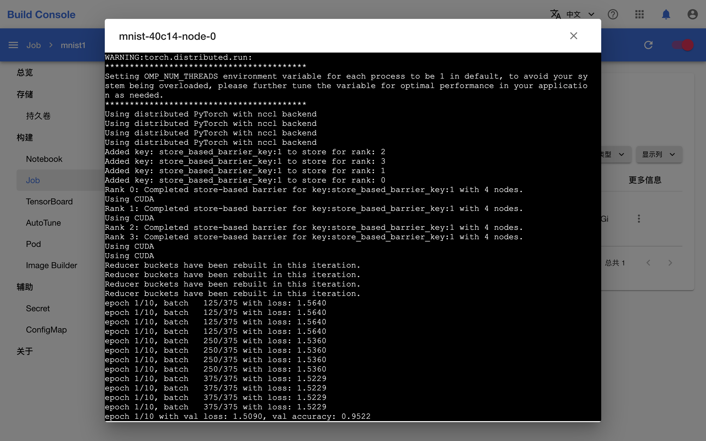
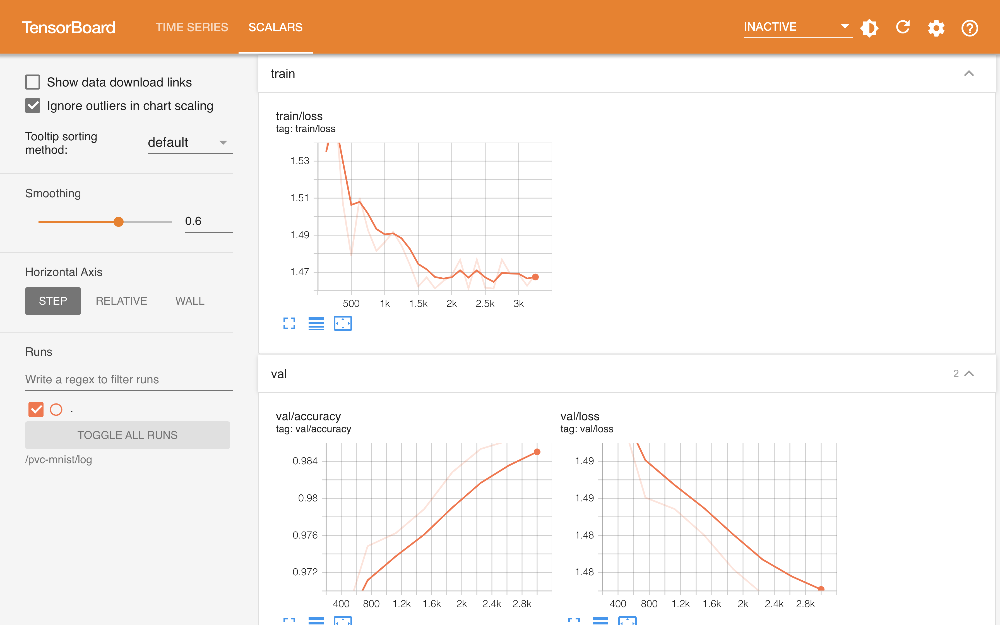

# 进行并行训练

本教程将带领用户使用 [PyTorchTrainingJob](../modules/jobs/pytorchtrainingjob.md) 资源，将教程[训练你的第一个模型](./training-first-model.md)中的模型训练改进为使用 GPU 加速的数据并行训练。

## 在 Notebook 中准备并行训练

回到 Notebook mnist，在 HOME 目录（即左侧边栏文件浏览器显示的根目录 `/`）下，点击左上角的 **+**，然后点击 **Other** 下的 **Python File** 以新建一个 Python 脚本文件。

<figure class="screenshot">
  
</figure>

向该文件复制以下代码，并将其命名为 `torch_mnist_trainingjob.py`。该脚本在上一篇教程的脚本的基础上进行了修改以支持数据并行训练。

<details><summary><code class="hljs">torch_mnist_trainingjob.py</code></summary>

```python
{{#include ../assets/get-started/parallel-training/torch_mnist_trainingjob.py}}
```

</details>

## 创建 Job 进行并行训练

回到模型构建控制台，在左侧的导航菜单中点击**构建 > Job** 进入 Job 管理页面，然后点击右上角的**创建 Job > PyTorch**。

<aside class="note info">
<div class="title">Job</div>

[Job]((../modules/jobs/index.md)) 是 TensorStack 提供的一组 CRD，用于支持各种规模的批处理任务。

PyTorchTrainingJob 是服务于 PyTorch 并行训练框架的执行机器学习任务的 Job。

</aside>

<figure class="screenshot">
  
</figure>

为了简化操作，在 Job 创建页面，点击**预览 YAML**，然后直接复制下面的 YAML 配置文件并粘贴到编辑框中，然后点击**创建**。

<details><summary><code class="hljs">job.yaml</code></summary>

```yaml
{{#include ../assets/get-started/parallel-training/job.yaml}}
```

</details>

<figure class="screenshot">
  
</figure>

在跳转回到 Job 管理页面之后，等待刚才创建的 Job 就绪。第一次拉取镜像可能会花费较长的时间，具体取决于用户集群的网络状况。点击右上角的**刷新图标**来手动刷新 Job 状态，待 Job 开始运行之后，点击其**名称**进入详情页面。

<figure class="screenshot">
  
</figure>

可以看到，Job 及其创建的 4 个 Worker（工作器）正在运行。

<figure class="screenshot">
  
</figure>

切换到**副本**标签页，点击副本的**日志**会显示其命令行输出，可以看到并行训练的当前进度。

<figure class="screenshot">
  
</figure>

<figure class="screenshot">
  
</figure>

`torch_mnist_trainingjob.py` 训练脚本在训练过程中添加了 TensorBoard 回调并将日志保存在了 `log` 目录下，Job 相应地启动了一个 TensorBoard 服务器用于可视化展示这些数据。点击 TensorBoard 右侧的 **Running** 进入其前端页面。

<figure class="screenshot">
  
</figure>

一段时间之后，Job 的状态变为 **Done**，表示训练已经成功完成。回到 Notebook mnist，将当前教程产生的所有文件移动到名为 `parallel-training` 的新文件夹下。

## 下一步

* 将训练完成的模型[部署为推理服务](./deploy-model.md)
* 了解[作业](../modules/jobs/index.md)
* 进一步学习如何[进行并行训练](../tasks/model-training.md)
* 学习如何[进行超参数优化](../tasks/hyperparameter-tuning.md)
