# 训练你的第一个模型

本教程带领用户使用 [Notebook](../modules/building/notebook.md) CRD，来构建和训练一个 AI 模型。

<aside class="note info">
<div class="title"> CRD </div>

**CRD （Custom Resource Defintion，定制资源定义）** 是 Kubernetes 提供的一种 API 扩展机制，可用于提供特定领域（例如 AI）的额外能力。

TensorStack 平台通过 CRD 提供了丰富的系统功能，包括存储系统、开发环境、数据处理、模型训练、推理服务等。
`Notebook` 是 TensorStack 提供的一个 CRD，用于支持在 TensorStack 平台上使用 JupyterLab，RStudio。

有关 CRD 机制的详细信息请参阅 <a target="_blank" rel="noopener noreferrer" href="https://kubernetes.io/docs/reference/using-api/api-concepts/"> Kubernetes API Concepts </a> 及 <a target="_blank" rel="noopener noreferrer" href="https://kubernetes.io/docs/concepts/extend-kubernetes/api-extension/custom-resources/"> Custom Resources </a>。

</aside>

## 创建 Notebook

在 TensorStack AI 平台首页，点击**模型构建**进入模型构建控制台。

<figure class="screenshot">
  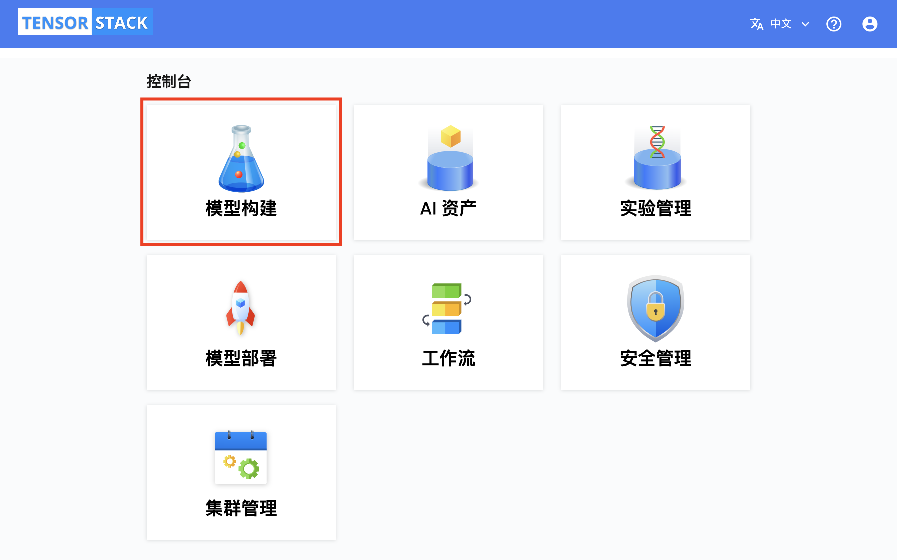
</figure>

模型构建控制台的总览页面展示了多种**资源**，用户可以点击右上角的按钮切换 Project，也可以点击**事件**和**配额**标签页以查看当前 Project 最近发生的事件以及计算资源（CPU、Memory、GPU 等）配额。

<aside class="note info">
<div class="title"> API 资源 </div>

**API 资源（Resources）**， **Kubernetes 资源（Resources）**，或者简称**资源（Resources）**：此术语用于统称 Kubernetes 管理的内置或**定制资源定义（CRD）** 的实体。这些资源包括标准类型，如 `Pods`、`Deployments`、`Services`、`ConfigMaps`，以及通过 CRDs 定义的任何自定义资源，例如 TensorStack 提供的 `Notebook`。它们是 Kubernetes 集群功能的基本构建模块。

注意：**计算资源**，例如 CPU，Memory， GPU 也经常简称为**资源**，但一般可根据上下文判断其具体所指。

</aside>

<figure class="screenshot">
  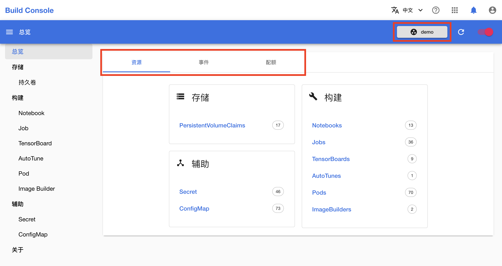
</figure>

### 创建 PVC

在创建 Notebook 之前，首先需要创建一个用于存储文件的 PVC（持久卷）。在左侧的导航菜单中点击**存储&nbsp;> 持久卷**进入 PVC 管理页面，然后点击右上角的**创建 PVC**。

<aside class="note info">
<div class="title">PVC</div>

<a target="_blank" rel="noopener noreferrer" href="https://kubernetes.io/zh/docs/concepts/storage/persistent-volumes/">PVC（PersistentVolumeClaim，持久卷申领）</a>是一种 Kubernetes 原生 **API 资源**，表示用户对存储的请求。参阅[管理 PVC](../tasks/manage-pvc.md) 以进一步了解如何在平台上使用 PVC。

</aside>

<figure class="screenshot">
  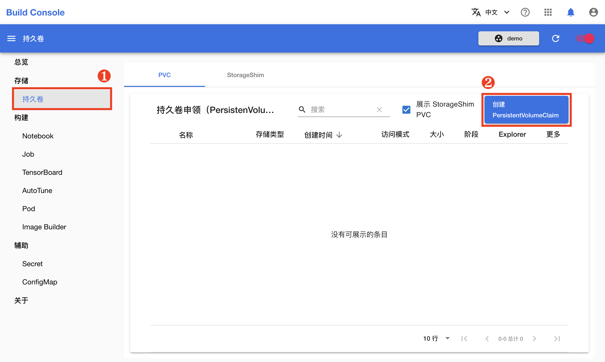
</figure>

在 PVC 创建页面，如下填写各个参数：

* **Name** 填写 `mnist`。
* **Size** 填写 `1Gi`。

其他参数保持默认即可。完成之后，点击**创建**。

<figure class="screenshot">
  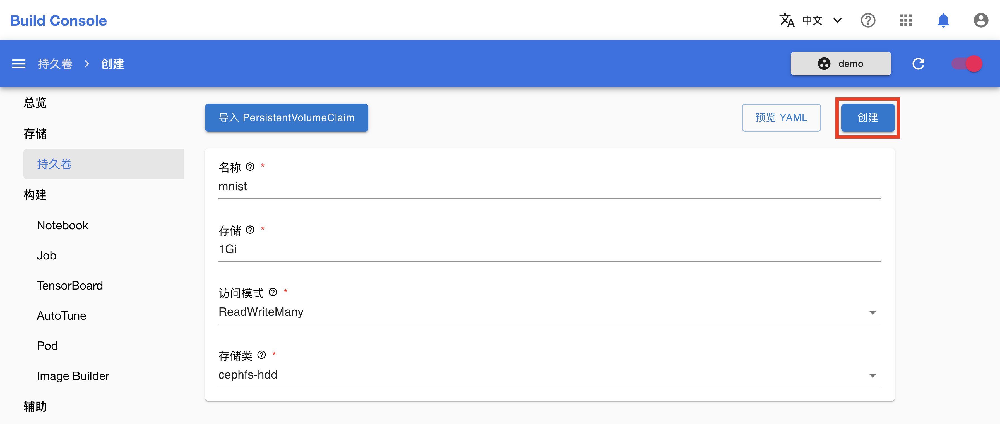
</figure>

在跳转回到 PVC 管理页面之后，可点击右上角的**刷新图标**来手动刷新 PVC 状态。下图展示 PVC `mnist` 已经创建完成。

<figure class="screenshot">
  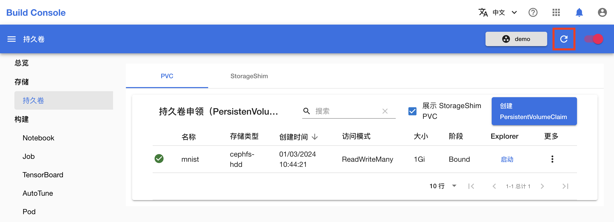
</figure>

### 创建 Notebook

在左侧的导航菜单中点击**构建 > Notebook** 进入 Notebook 管理页面，然后点击右上角的**创建 Notebook**。

<aside class="note info">
<div class="title">Notebook</div>

[Notebook](../modules/building/notebook.md) 是一种 CRD 形式的 **API 资源**，用于在集群中运行在线交互式开发环境的服务（例如 JupyterLab、RStudio），同时提供 GPU 使用、SSH 访问等补充功能。

</aside>

<figure class="screenshot">
  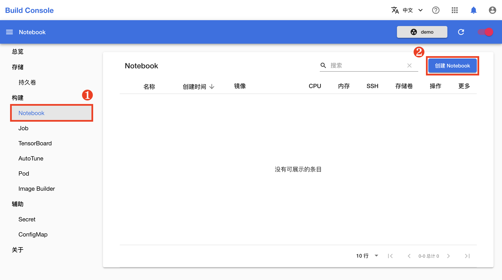
</figure>

在 Notebook 创建页面，如下填写各个参数：

* **名称**填写 `mnist`。
* **镜像类型**选择 `Jupyter`，**镜像**选择 `t9kpublic/torch-2.1.0-notebook:1.77.1`。
* **存储卷**选择 `mnist`。
* **调度器**选择**默认调度器**，**模板**选择 **large**。

完成之后，点击**创建**。

<figure class="screenshot">
  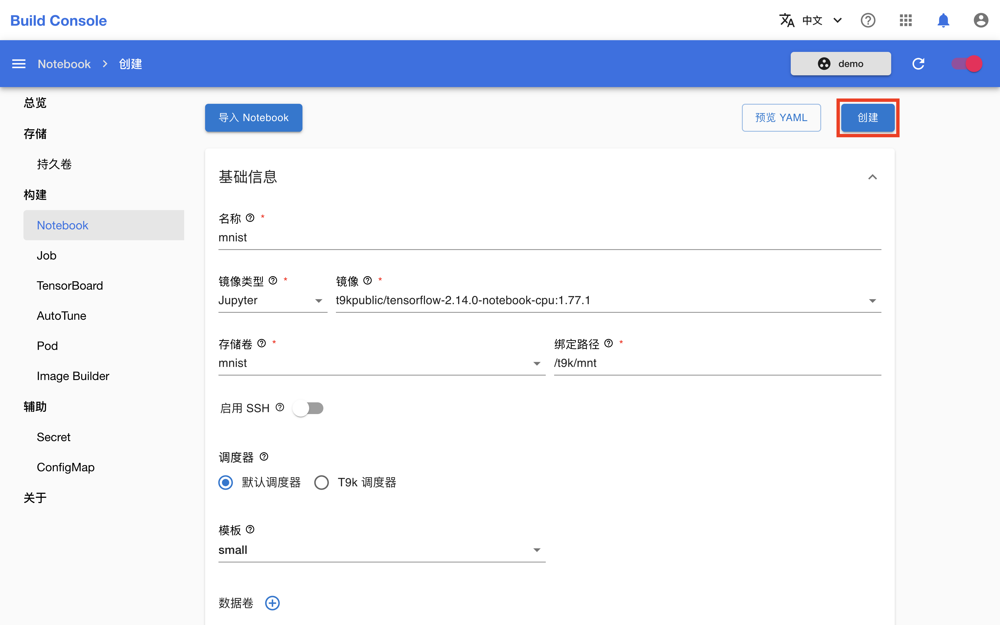
</figure>

<aside class="note info">
<div class="title">调度器</div>

调度器负责将工作负载调度到合适的节点上以运行。平台支持 Kubernetes 的默认调度器 <a target="_blank" rel="noopener noreferrer" href="https://kubernetes.io/docs/concepts/scheduling-eviction/kube-scheduler/#kube-scheduler">kube-scheduler</a>，同时提供了更加强大的 T9k 调度器。详情请参阅：[计算资源](../modules/scheduling/index.md)。

</aside>

在跳转回到 Notebook 管理页面之后，等待刚才创建的 Notebook 准备就绪。第一次拉取镜像可能会花费较长的时间，具体取决于用户集群的网络状况。点击右上角的**刷新图标**来手动刷新 Notebook 状态，待 Notebook 开始运行之后，点击右侧的**打开**进入其前端页面。

<figure class="screenshot">
  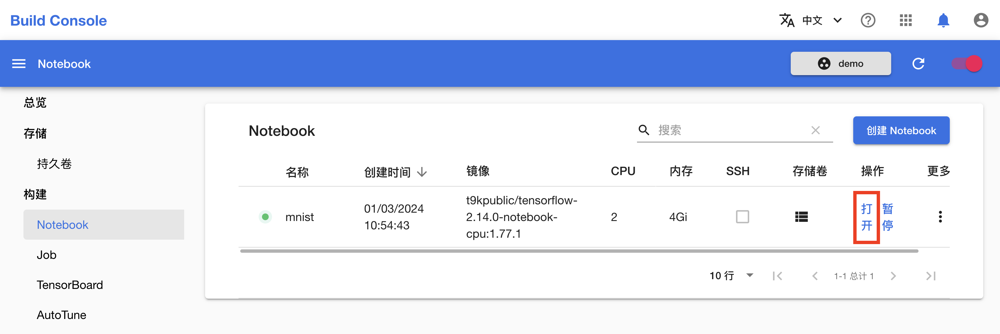
</figure>

现在 Notebook 已经可以使用了，用户可以在这里进行模型的开发与测试。

<figure class="screenshot">
  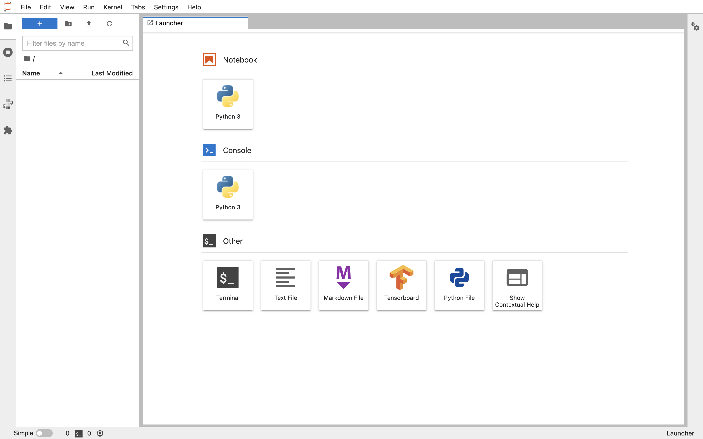
</figure>

## 使用 Notebook 训练模型

<aside class="note tip">
<div class="title">提示</div>

如果用户之前从未使用过 JupyterLab，建议在使用之前先阅读<a target="_blank" rel="noopener noreferrer" href="https://jupyterlab.readthedocs.io/en/stable/">官方文档</a>以熟悉 JupyterLab 的功能特性以及基本操作。

</aside>

在 Notebook 的前端页面，点击左上角的 **+**，然后点击 Notebook 下的 **Python3** 以新建一个 `.ipynb` 文件。

<figure class="screenshot">
  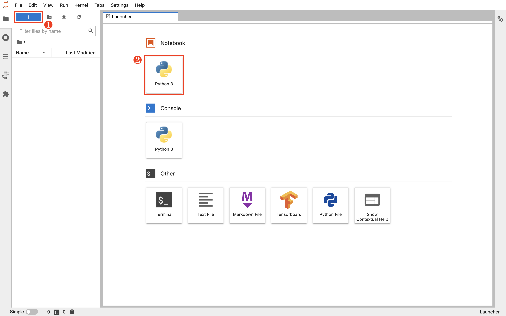
</figure>

复制下面的训练脚本到该 `.ipynb` 文件的代码框中。该脚本基于 PyTorch 框架，建立一个简单的卷积神经网络模型，并使用 MNIST 数据集的手写数字图像进行训练和测试。

<details><summary><code class="hljs">torch_mnist.py</code></summary>

```python
{{#include ../assets/get-started/training-first-model/torch_mnist.py}}
```

</details>

点击上方的运行按钮，可以看到训练开始进行：

<figure class="screenshot">
  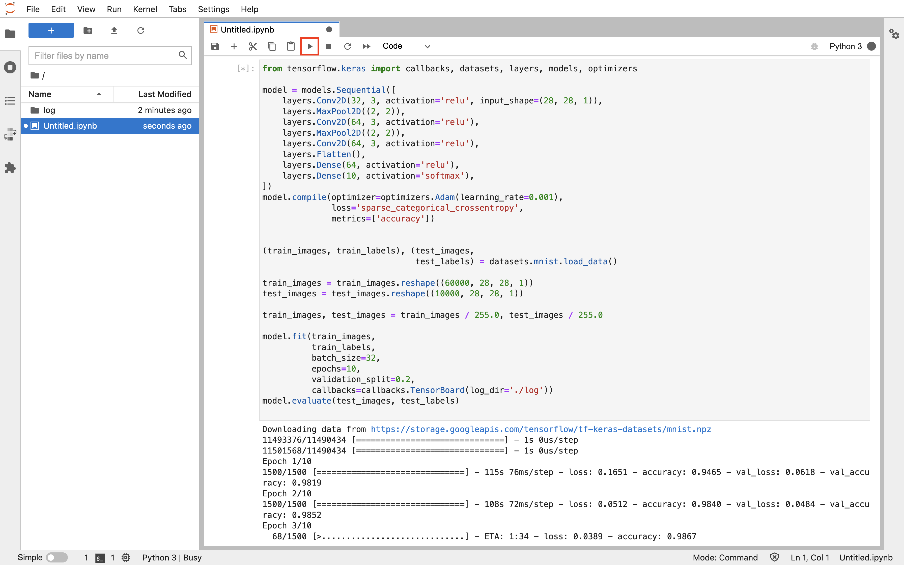
</figure>

训练结束后，点击左上角的**新建文件夹按钮**，为新文件夹命名 **first-model**，并将当前教程产生的所有文件拖拽移动到其中。

<figure class="screenshot">
  
</figure>

## 下一步

* 针对同样的模型，[使用 Job 进行并行训练](./parallel-training.md)
* 全面了解[模型构建](../modules/building/index.md)
