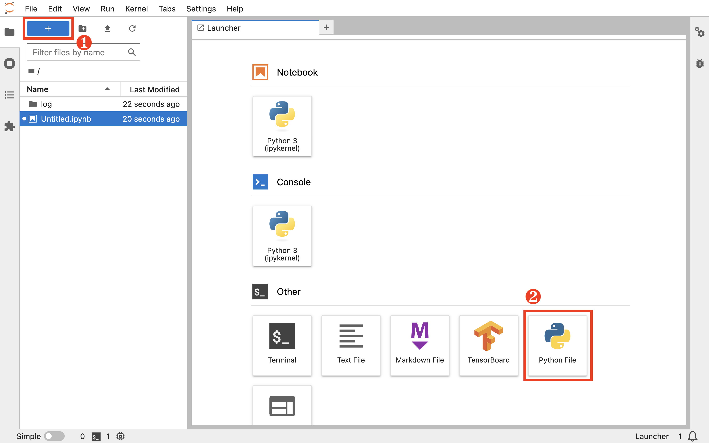
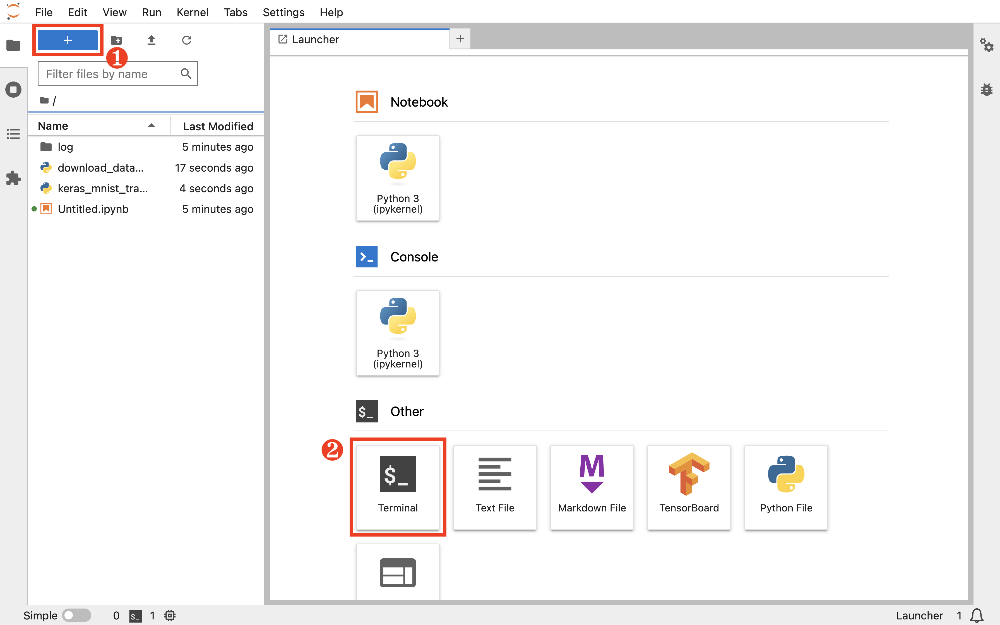
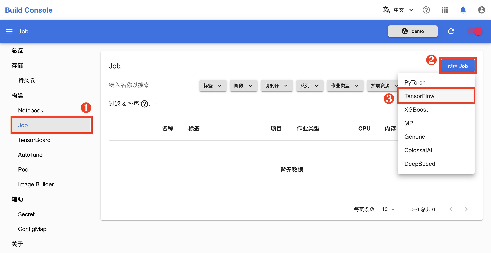
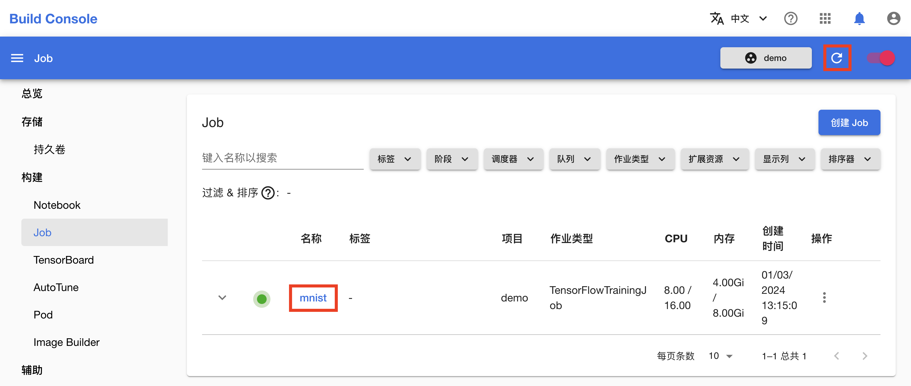
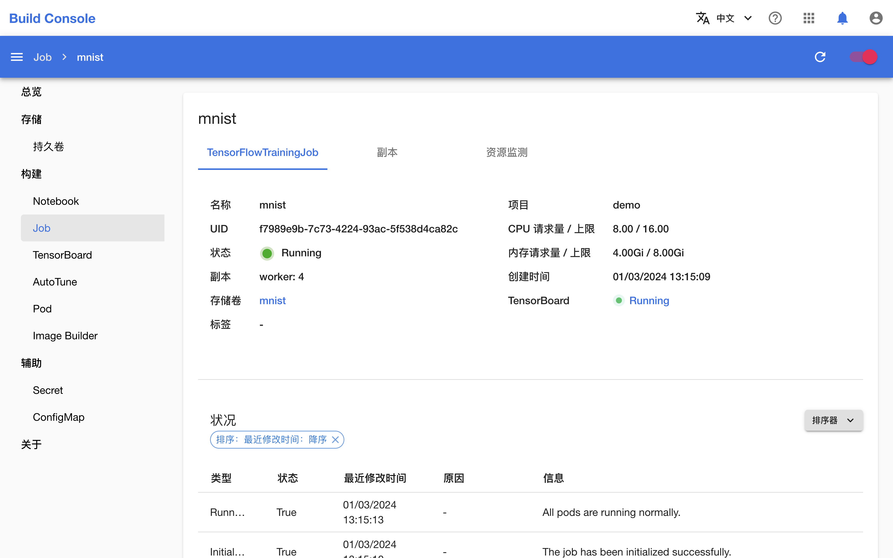
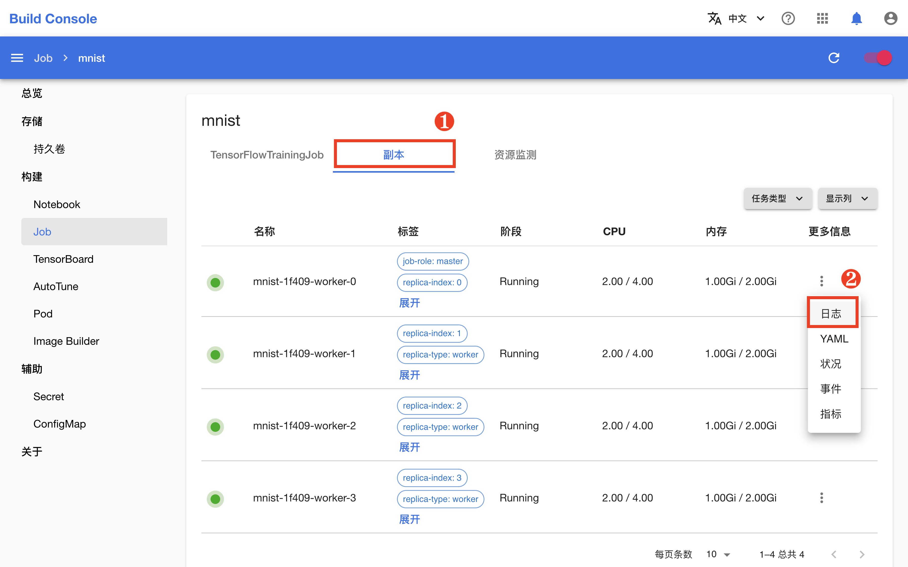
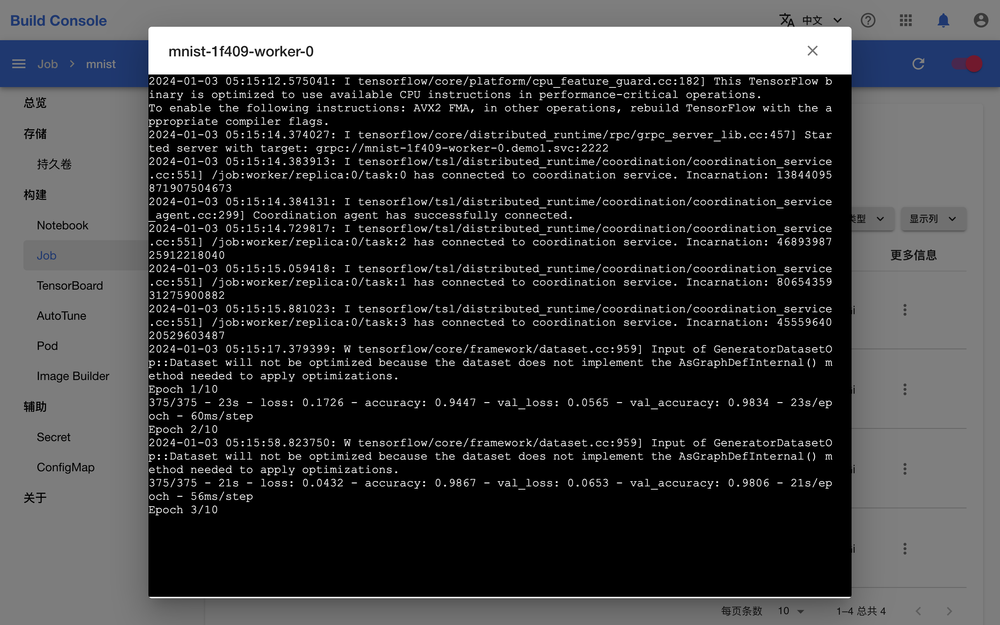
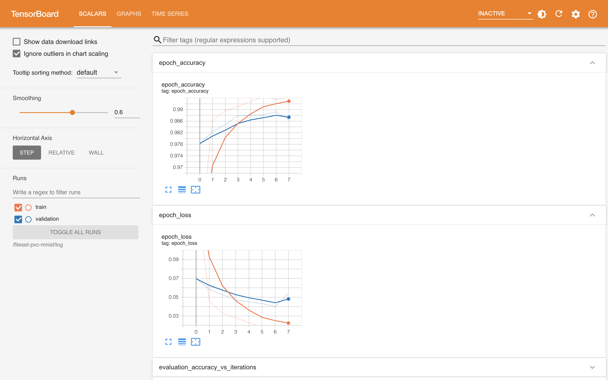

# 使用 Job 进行分布式训练

Job 是 TensorStack 提供的一组 CRDs，用于支持各种规模的批处理任务。

详情请参考[作业](../modules/jobs/index.md)。

## 在 Notebook 中准备分布式训练

在 Notebook 的前端页面，点击左上角的 **+**，然后点击 **Other** 下的 **Python File** 以新建一个 Python 脚本文件。

<figure class="screenshot">
  
</figure>

将该文件重命名为 `download_dataset.py`，并向其复制以下代码：

```python title="download_dataset.py"
import os
import tensorflow as tf

tf.keras.datasets.mnist.load_data(os.path.join(os.getcwd(), 'mnist.npz'))
```

以同样的方式再新建一个名为 `keras_mnist_trainingjob.py` 的文件，并向其复制下面的训练脚本。该脚本在上面的脚本的基础上进行了修改以支持数据并行训练。

```python title="keras_mnist_trainingjob.py"
import argparse
import json
import os
import shutil

import tensorflow as tf
from tensorflow.keras import callbacks, datasets, layers, models, optimizers

parser = argparse.ArgumentParser(
    description='Distributed training of Keras model with MultiWorkerMirroredStrategy.')
parser.add_argument('--log_dir',
                    type=str,
                    help='Path of the tensorboard log directory.')
parser.add_argument('--no_cuda',
                    action='store_true',
                    default=False,
                    help='Disable CUDA training.')
parser.add_argument('--save_path',
                    type=str,
                    help='Save path of the trained model.')
args = parser.parse_args()

if args.no_cuda:
    tf.config.set_visible_devices([], 'GPU')

strategy = tf.distribute.MultiWorkerMirroredStrategy()

# Get world size and index of current worker.
tf_config = json.loads(os.environ['TF_CONFIG'])
world_size = len(tf_config['cluster']['worker'])
task_index = tf_config['task']['index']

with strategy.scope():
    model = models.Sequential([
        layers.Conv2D(32, 3, activation='relu', input_shape=(28, 28, 1)),
        layers.MaxPool2D((2, 2)),
        layers.Conv2D(64, 3, activation='relu'),
        layers.MaxPool2D((2, 2)),
        layers.Conv2D(64, 3, activation='relu'),
        layers.Flatten(),
        layers.Dense(64, activation='relu'),
        layers.Dense(10, activation='softmax'),
    ])
    model.compile(optimizer=optimizers.Adam(learning_rate=0.001 * world_size),
                  loss='sparse_categorical_crossentropy',
                  metrics=['accuracy'])


(train_images, train_labels), (test_images,
                               test_labels) = datasets.mnist.load_data(
                                   path=os.path.join(os.getcwd(), 'mnist.npz'))

train_images = train_images.reshape((60000, 28, 28, 1))
test_images = test_images.reshape((10000, 28, 28, 1))

train_images, test_images = train_images / 255.0, test_images / 255.0

# Set save path for TensorBoard log.
train_callbacks = []
if task_index == 0:
    log_dir = args.log_dir
    if os.path.exists(log_dir):
        shutil.rmtree(log_dir, ignore_errors=True)
    train_callbacks.append(callbacks.TensorBoard(log_dir=log_dir))

model.fit(train_images,
          train_labels,
          batch_size=32 * world_size,
          epochs=10,
          validation_split=0.2,
          callbacks=train_callbacks,
          verbose=2)

# Set save path and save model.
if task_index == 0:
    save_path = args.save_path
else:
    dirname = os.path.dirname(args.save_path)
    basename = os.path.basename(
        args.save_path) + '_temp_' + str(task_index)
    save_path = os.path.join(dirname, basename)
if os.path.exists(save_path):
    shutil.rmtree(save_path, ignore_errors=True)
model.save(save_path)
if task_index != 0:
    shutil.rmtree(save_path, ignore_errors=True)

model.evaluate(test_images, test_labels, verbose=2)

```

点击左上角的 **+**，然后点击 Other 下的 **Terminal** 以新建一个终端。

<figure class="screenshot">
  
</figure>

执行 `download_dataset.py` 脚本以下载数据集文件 `mnist.npz` 到当前 `$HOME` 目录下。

```shell
python download_dataset.py
```

## 创建 Job 进行分布式训练

回到模型构建控制台，在左侧的导航菜单中点击 **构建 > Job** 进入 Job 管理页面，然后点击右上角的**创建 Job > TensorFlow**。

<figure class="screenshot">
  
</figure>

为了简化操作，在 Job 创建页面，点击**预览 YAML**，然后直接复制下面的 YAML 配置文件并粘贴到编辑框中，然后点击**创建**。

```yaml
apiVersion: batch.tensorstack.dev/v1beta1
kind: TensorFlowJob
metadata:
  name: mnist
spec:
  tensorboardSpec:               # TensorBoard服务器规约
    trainingLogFilesets:
      - t9k://pvc/mnist/log      # 日志文件路径
    image: tensorflow/tensorflow:2.14.0
                                # TensorBoard服务器使用的镜像
  replicaSpecs:
    - type: worker               # 工作器
      replicas: 4                # 工作器数量
      restartPolicy: ExitCode
      template:
        spec:
          securityContext:
            runAsUser: 1000
          containers:
            - image: tensorflow/tensorflow:2.14.0
                                 # 容器的镜像
              workingDir: /mnt
              name: tensorflow
              command:           # 执行`python`命令以执行训练脚本
                - sh
                - '-c'
                - >-
                  python /mnt/keras_mnist_trainingjob.py --log_dir /mnt/log --save_path /mnt/saved_model
                  --no_cuda
              env: []
              resources:
                limits:          # 限制量
                  cpu: '4'       # CPU
                  memory: 2Gi    # 内存
                requests:        # 请求量
                  cpu: '2'
                  memory: 1Gi
              volumeMounts:
                - name: data
                  mountPath: /mnt
          volumes:
            - name: data
              persistentVolumeClaim:
                claimName: mnist
```

<figure class="screenshot">
  
</figure>

在跳转回到 Job 管理页面之后，等待刚才创建的 Job 就绪。第一次拉取镜像可能会花费较长的时间，具体取决于用户集群的网络状况。点击右上角的**刷新图标**来手动刷新 Job 状态，待 Job 开始运行之后，点击其**名称**进入详情页面。

<figure class="screenshot">
  
</figure>

可以看到，Job 及其创建的 4 个 Worker（工作器）正在运行。

<figure class="screenshot">
  
</figure>

切换到**副本**标签页，点击任意一个工作器的**日志**会显示其命令行输出，可以看到分布式训练的当前进度。

<figure class="screenshot">
  
</figure>

<figure class="screenshot">
  
</figure>

`keras_mnist_trainingjob.py` 训练脚本在训练过程中添加了 TensorBoard 回调并将日志保存在了 `log` 目录下，Job 相应地启动了一个 TensorBoard 服务器用于可视化展示这些数据。点击 TensorBoard 右侧的 **Running** 进入其前端页面。

<figure class="screenshot">
  
</figure>

一段时间之后，Job 的状态变为 **Done**，表示训练已经成功完成。回到 Notebook 的前端页面，可以看到训练完成的模型被保存在 `saved_model` 目录下。在快速入门的后续教程中，用户可以将此模型文件部署为推理服务。

## 下一步

* 将训练完成的模型[部署为推理服务](./deploy-model.md)
* 了解[作业](../modules/jobs/index.md)
* 进一步学习如何[进行分布式训练](../tasks/model-training.md)
* 学习如何[进行超参数优化](../tasks/hyperparameter-tuning.md)
