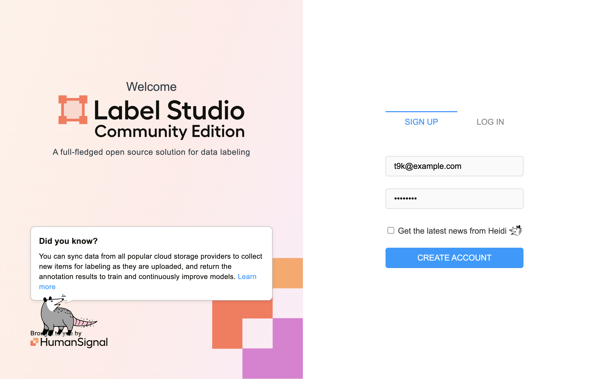
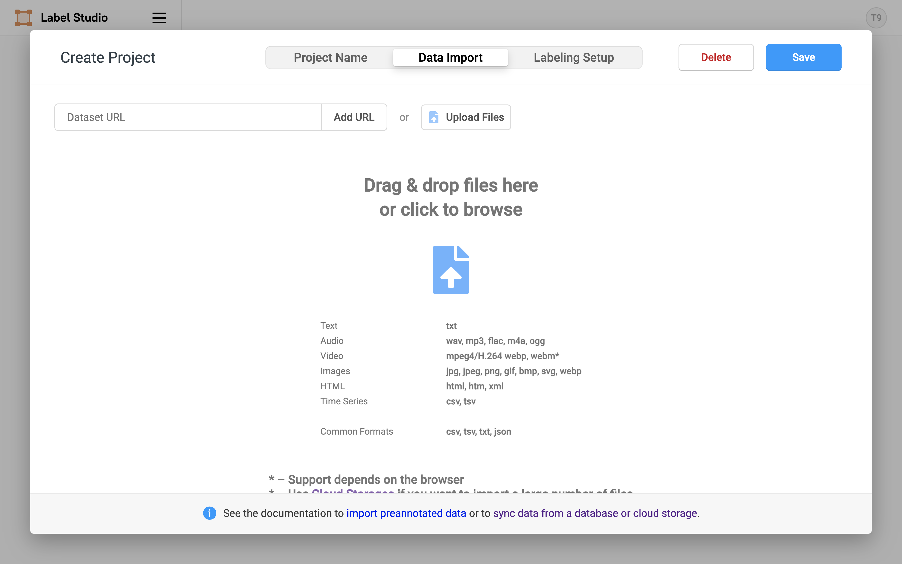
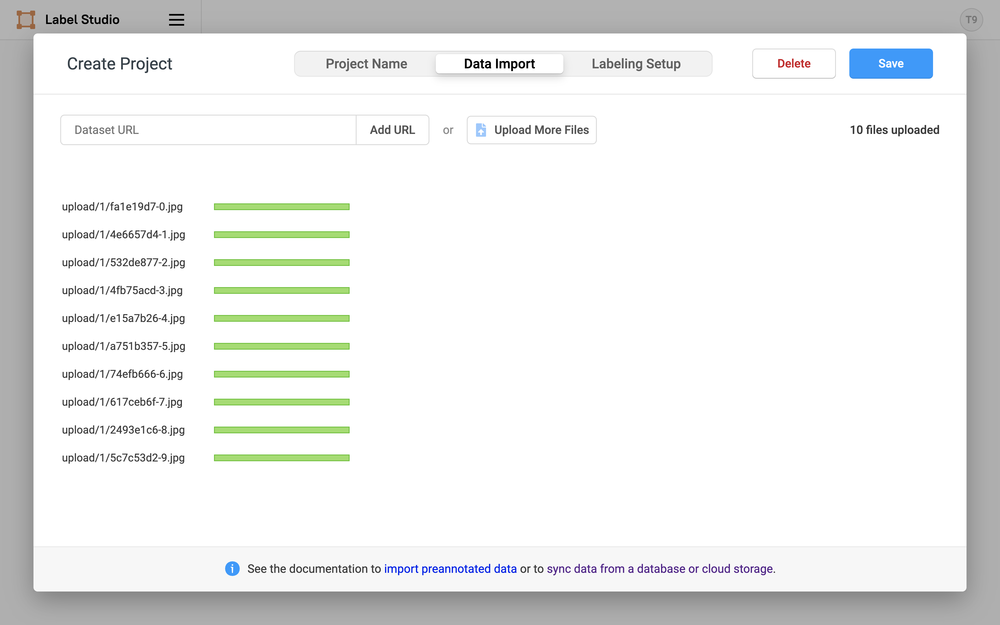
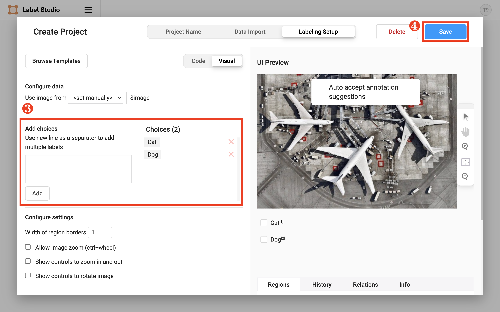
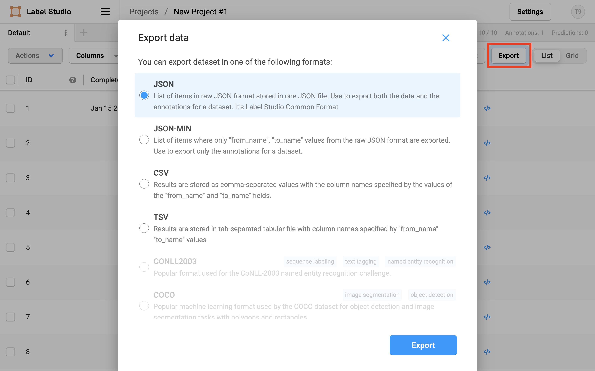
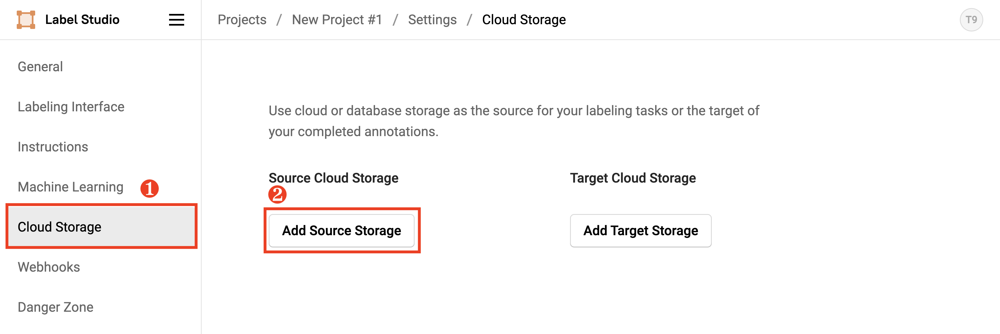
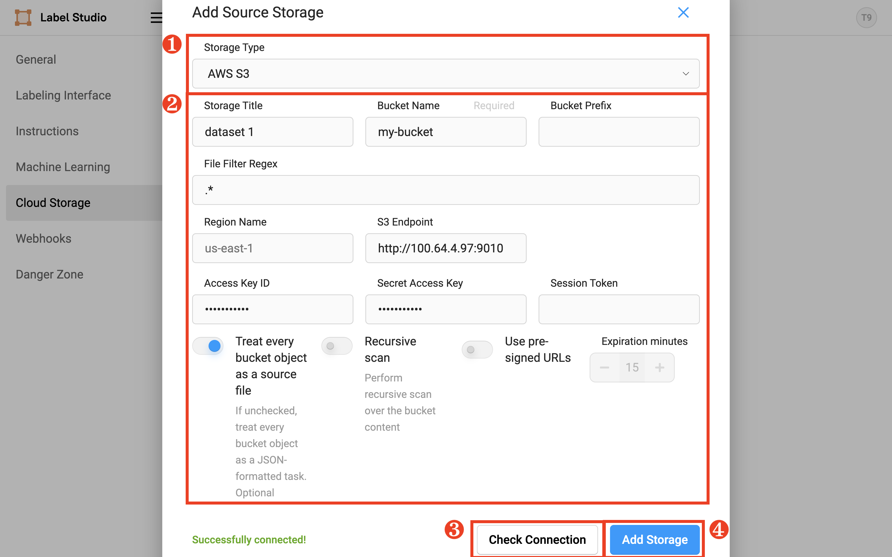
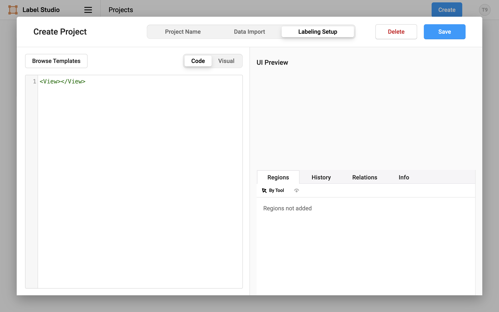
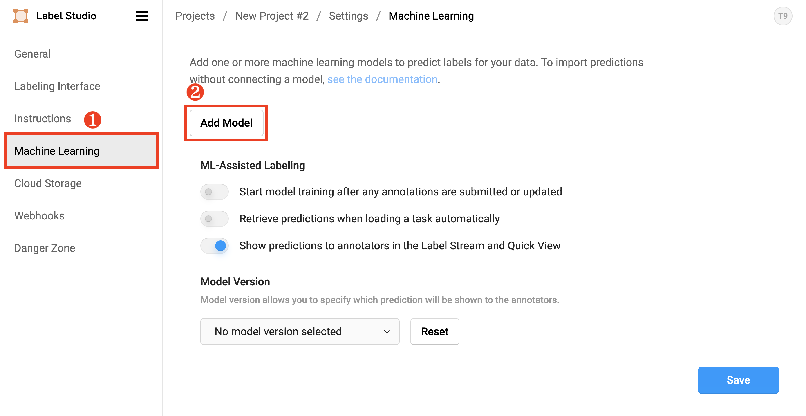
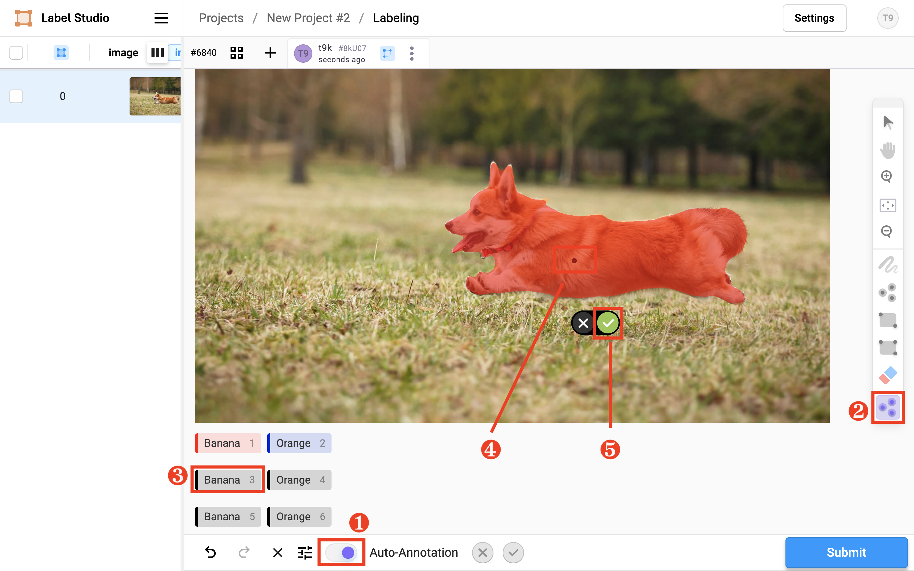

# Label Studio

<a target="_blank" rel="noopener noreferrer" href="https://github.com/HumanSignal/label-studio">Label Studio</a> 是一个开源的数据标注工具。它允许用户通过一个简单直观的用户界面来标注音频、文本、图像、视频和时间序列等多种数据类型，并支持导出到各种模型格式。

## 部署

### 安装与配置

进入 Notebook app 的终端，添加相应的 Helm Chart repository，列出 Chart `heartex/label-studio` 的所有版本：

```bash
helm repo add heartex https://charts.heartex.com/
helm search repo heartex/label-studio --versions
```

安装指定版本的 Chart `heartex/label-studio` 以部署 Label Studio 应用：

```bash
# 安装最新版本
helm repo update heartex
helm install label-studio-demo heartex/label-studio

# 安装指定版本，注意这不是 Label Studio 应用的版本
helm install label-studio-demo heartex/label-studio --version <VERSION_NUMBER>
```

以上安装全部使用默认配置，其中部分关键配置如下所示（使用命令 `helm get values -a label-studio-demo` 以查看完整配置）：

```yaml
app:
  ingress:           # Ingress 配置
    annotations: {}
    className: ""
    enabled: false
    host: ""
    tls: []
  replicas: 1        # 副本数
  resources:         # 计算资源
    limits:
      cpu: 4000m
      memory: 6144Mi
    requests:
      cpu: 1000m
      memory: 1024Mi
global:
  persistence:       # 持久化
    config:
      volume:
        accessModes:
        - ReadWriteOnce
        annotations: {}
        existingClaim: ""
        resourcePolicy: ""
        size: 10Gi       # 卷大小
        storageClass: ""
    enabled: true
    type: volume         # 卷
```

用户可以根据需要对这些配置进行修改：

* 如果有超过 10 个用户同时在线标注，可以适当增加计算资源的请求值和限制值。
* 如要提高容错，可以增加副本数。
* 可以提供 Ingress 配置以提供外部访问，请参阅 <a target="_blank" rel="noopener noreferrer" href="https://labelstud.io/guide/ingress_config">Set up an ingress controller for Label Studio Kubernetes deployments</a>。
* 可以修改卷大小，或使用其他类型的持久化方案（如 Amazon S3），请参阅 <a target="_blank" rel="noopener noreferrer" href="https://labelstud.io/guide/persistent_storage">Set up persistent storage</a>。

<aside class="note">
<div class="title">注意</div>

Ingress 配置也可以采用其他方案，需要结合集群的具体配置。

</aside>

然后将新配置（覆盖默认配置的部分）保存为一个 YAML 文件，通过 `-f` 选项提供给安装命令：

```bash
helm install label-studio-demo heartex/label-studio -f <NEW_CONFIG_FILE>
```

### Kubernetes 资源清单

Helm 在部署应用时创建的主要 Kubernetes 资源如下表所示：

| 类型        | 名称                                | 作用                                           | 备注                       |
| ----------- | ----------------------------------- | ---------------------------------------------- | -------------------------- |
| Service     | label-studio-demo-ls-app            | 作为应用服务                                   |                            |
| Service     | label-studio-demo-postgresql        | 作为数据库服务                                 |                            |
| Deployment  | label-studio-demo-ls-app            | 部署应用                                       |                            |
| StatefulSet | label-studio-demo-postgresql        | 部署数据库                                     |                            |
| PVC         | label-studio-demo-ls-pvc            | 作为应用的持久化存储，存储用户上传的数据文件等 | 选择卷作为持久化方案时存在 |
| PVC         | data-label-studio-demo-postgresql-* | 作为数据库的持久化存储                         |                            |
| Ingress     | label-studio-demo-ls-app            | 提供外部访问                                   | 启用 Ingress 时存在        |

### 运维

**查看应用的状态**

```bash
helm status label-studio-demo
```

**重启应用**

```bash
kubectl rollout restart deployment/label-studio-demo-ls-app
```

**更新应用**

```bash
# 更新到最新版本
helm upgrade label-studio-demo heartex/label-studio

# 更新到指定版本
helm upgrade label-studio-demo heartex/label-studio --version <VERSION_NUMBER>

# 回滚更新，首先查看历史版本
helm history label-studio-demo
helm rollback label-studio-demo [REVISION]
```

**移除应用**

```bash
helm delete label-studio-demo
```

## 使用

### 基本使用

如果在部署应用时配置了 Ingress，那么直接在浏览器中访问相应的地址即可，否则需要进行端口转发。在用户的计算机上，前往模型构建控制台获取应用 Pod 的名称（前缀为 label-studio-demo-ls-app-）：

<figure class="screenshot">
  
</figure>

然后通过 t9k-pf 进行端口转发来访问 Label Studio 应用：

```bash
t9k-pf -n <APP_PROJECT> pod <POD_NAME> 8080:8085
```

在浏览器中访问 <a target="_blank" rel="noopener noreferrer" href="http://127.0.0.1:8080/">http://127.0.0.1:8080/</a> 进入应用的 Web UI。注册一个用户，Email 和密码可以任意指定：

<figure class="screenshot">
  
</figure>

假定任务是图像分类，我们准备了 10 张图片（来自数据集 <a target="_blank" rel="noopener noreferrer" href="https://www.microsoft.com/en-us/download/details.aspx?id=54765">Cats and Dogs</a>），需要将每一张图片标注为猫或狗。点击 **Create Project**：

<figure class="screenshot">
  
</figure>

在 Project Name 页面可选地修改 Project 的名称：

<figure class="screenshot">
  
</figure>

在 Data Import 页面上传 10 张图片：

<figure class="screenshot">
  
</figure>

<figure class="screenshot">
  
</figure>

在 Labeling Setup 页面，选择模板 **Computer Vision > Image Classification**，并将选项编辑为 **Cat** 和 **Dog**，最后点击 **Save**：

<figure class="screenshot">
  
</figure>

<figure class="screenshot">
  
</figure>

自动跳转到 Project 的默认标签页，点击 **Label All Tasks** 以开始标注：

<figure class="screenshot">
  
</figure>

对于每一张图片，勾选其为 Cat 或 Dog，然后点击 **Submit**：

<figure class="screenshot">
  
</figure>

标注结束后，点击 **Export** 以下载指定格式的标注数据。

<figure class="screenshot">
  
</figure>

### 导入大量数据

在导入数据时，如果仅上传少量（几十上百个）的文件，那么使用 Web UI 即可。但假设我们要上传数据集 Cats and Dogs 的总共 25000 张图片，仍然使用 Web UI 会导致其崩溃，这时我们需要寻求另外的导入数据的方法。

Label Studio 支持<a target="_blank" rel="noopener noreferrer" href="https://labelstud.io/guide/storage">从外部存储同步数据</a>。这里以 Amazon S3 为例。在用户的计算机上准备好数据文件，并将其上传到 S3 bucket：

```bash
$ tree .                                       
.
├── 0.jpg
├── 1.jpg
├── 10.jpg
├── 100.jpg
├── 1000.jpg
├── 10000.jpg
├── 10001.jpg
...
├── 9998.jpg
└── 9999.jpg

0 directories, 25000 files

$ rclone copy -P . corps3:my-bucket/kagglecatsanddogs                                                                        
Transferred:      569.808 MiB / 809.542 MiB, 70%, 2.328 MiB/s, ETA 1m42s                                               
Transferred:        16994 / 25000, 68%                                                                                 
Elapsed time:      3m35.2s                                                                                             
Transferring:                                                                                                          
 *                                      2793.jpg:100% /23.680Ki, 0/s, -                                                
 *                                      2794.jpg:100% /20.700Ki, 0/s, -                                                
 *                                      2795.jpg:100% /22.631Ki, 0/s, -                                                
 *                                      2796.jpg:100% /13.476Ki, 0/s, -
```

在 Label Studio 的项目设置中点击 **Cloud Storage > Add Source Storage**，选择存储类型 AWS S3，并填写相关的配置，点击 **Check Connection** 验证连接是否成功，最后点击 **Add Storage**。

<figure class="screenshot">
  
</figure>

<figure class="screenshot">
  
</figure>

创建完成之后，点击 **Sync Storage**，即可从导入数据文件：

<figure class="screenshot">
  
</figure>

回到项目，可以看到数据被导入：

<figure class="screenshot">
  
</figure>

### 自定义标注 UI

应用内置了大量标注模板，覆盖了各种类型的机器学习任务。除此之外，用户还可以使用类似 XML 的标签来自定义标注 UI，详细语法规则请参阅 <a target="_blank" rel="noopener noreferrer" href="https://labelstud.io/tags">Customize the Label Studio User Interface</a>。


<figure class="screenshot">
  
</figure>

<figure class="screenshot">
  
</figure>

### 自动化标注

人工标注数据费时费力，我们可以引入机器学习模型来完成这一工作，这样只需要人工审核即可。

Label Studio 支持添加 ML backend，使用其自动标注或进行在线训练。这里演示使用 <a target="_blank" rel="noopener noreferrer" href="https://github.com/facebookresearch/segment-anything">SAM</a> 进行语义分割任务的自动标注。

在应用的 Web UI 点击 **Account & Settings**，以获取用户的 **Access Token**：

<figure class="screenshot">
  
</figure>

回到 Notebook app 的终端，获取应用 service 的 IP 地址：

```bash
kubectl get svc label-studio-demo-ls-app -o jsonpath="{.spec.clusterIP}"
```

然后使用如下 YAML 配置文件创建 SimpleMLService 以部署 ML backend 服务，其中环境变量 `LABEL_STUDIO_HOST` 和 `LABEL_STUDIO_ACCESS_TOKEN` 的值需要根据上面获取的结果进行修改。镜像 `t9kpublic/label-studio-sam:main` 构建自示例 <a target="_blank" rel="noopener noreferrer" href="https://github.com/HumanSignal/label-studio-ml-backend/tree/master/label_studio_ml/examples/segment_anything_model">Interactive Annotation in Label Studio with Segment Anything Model</a>。

<details><summary><code class="hljs">sam.yaml</code></summary>

```yaml
{{#include ../assets/integrations/label-studio/sam.yaml}}
```

</details>

```bash
kubectl create -f sam.yaml
```

<aside class="note info">
<div class="title">信息</div>

Label Studio ML backend 还提供了其他模型的示例，请访问 <a target="_blank" rel="noopener noreferrer" href="https://github.com/HumanSignal/label-studio-ml-backend/tree/master/label_studio_ml/examples">examples</a>。用户也可以尝试自己编写一个 ML backend，请参阅 <a target="_blank" rel="noopener noreferrer" href="https://labelstud.io/guide/ml_create">Write your own ML backend</a>。

</aside>

获取 ML backend service 的 IP 地址和端口号：

```bash
kubectl get svc label-studio-sam -o jsonpath="{.spec.clusterIP}"
kubectl get svc label-studio-sam -o jsonpath="{.spec.ports[0].port}"
```

再次进入应用的 Web UI，创建一个新的 project，上传一张图片，并且 template 使用如下自定义模板：

```xml
<View>
  <Image name="image" value="$image" zoom="true"/>
  <BrushLabels name="tag" toName="image">
  	<Label value="Banana" background="#FF0000"/>
  	<Label value="Orange" background="#0d14d3"/>
  </BrushLabels>
  <KeyPointLabels name="tag2" toName="image" smart="true">
    <Label value="Banana" smart="true" background="#000000" showInline="true"/>
    <Label value="Orange" smart="true" background="#000000" showInline="true"/>
  </KeyPointLabels>
  <RectangleLabels name="tag3" toName="image" smart="true">
    <Label value="Banana" background="#000000" showInline="true"/>
    <Label value="Orange" background="#000000" showInline="true"/>
  </RectangleLabels>
</View>
```

在 Label Studio 的项目设置中点击 **Machine Learning > Add Model**，填写 SAM 服务的 URL 和模型名称，勾选 **Use for interactive preannotations**，然后点击 **Validate and Save**：

<figure class="screenshot">
  
</figure>

<figure class="screenshot">
  
</figure>

标注时按照下图的顺序进行操作，可以看到图片中的柯基被正确地分割出来：

<figure class="screenshot">
  
</figure>

### 团队协作

应用提供了简单直接的团队协作方式。团队的多个成员分别注册用户、登录并进入同一个项目，通过设定不同的过滤条件来分别标注全部数据的不同子集。

例如设定 `ID / <= / 3000` 可以仅列举前 3000 个数据；设定 `Annotated by / is empty / yes` 可以仅列举未被标注的数据。

## 参考

* <a target="_blank" rel="noopener noreferrer" href="https://github.com/HumanSignal/label-studio">GitHub 上的 Label Studio</a>
* <a target="_blank" rel="noopener noreferrer" href="https://labelstud.io/guide/">Label Studio 文档</a>
    * <a target="_blank" rel="noopener noreferrer" href="https://labelstud.io/guide/ingress_config">设置 Ingress 控制器</a>
    * <a target="_blank" rel="noopener noreferrer" href="https://labelstud.io/guide/persistent_storage">设置持久化存储</a>
    * <a target="_blank" rel="noopener noreferrer" href="https://labelstud.io/guide/storage">从外部存储同步数据</a>
    * <a target="_blank" rel="noopener noreferrer" href="https://labelstud.io/guide/setup">标注配置</a>
    * <a target="_blank" rel="noopener noreferrer" href="https://labelstud.io/guide/ml">将 Label Studio 集成你的到机器学习工作流</a>
    * <a target="_blank" rel="noopener noreferrer" href="https://labelstud.io/guide/ml_create.html">构建你自己的 ML backend</a>
* <a target="_blank" rel="noopener noreferrer" href="https://github.com/HumanSignal/label-studio-ml-backend">GitHub 上的 Label Studio ML backend</a>
    * <a target="_blank" rel="noopener noreferrer" href="https://github.com/HumanSignal/label-studio-ml-backend/tree/master/label_studio_ml/examples">ML backend 示例</a>
