# 向量数据库：PostgreSQL + pgvector

在[向量数据库：Qdrant](./vector-database-qdrant.md)中我们介绍了向量数据库的概念以及开源产品 Qdrant。这里我们介绍另一个优秀的开源方案：PostgreSQL + pgvector。

<a target="_blank" rel="noopener noreferrer" href="https://www.postgresql.org/">PostgreSQL</a> 是一个稳定可靠、功能强大的开源对象关系型数据库系统，第一个公开版本于 1989 年发布。此后，它经历了多次迭代，并逐渐成为世界上最流行的开源数据库之一。它支持 SQL 标准，并提供复杂查询、事务完整性、多版本并发控制等多种现代数据库技术特性。PostgreSQL 以其高度的扩展性和对大型数据集的强大处理能力而闻名，适用于从小型应用程序到大型企业系统的各种环境。此外，它还拥有一个活跃的开发社区，为开发者提供丰富的资源和工具。

<a target="_blank" rel="noopener noreferrer" href="https://github.com/pgvector/pgvector">pgvector</a> 是一个用于向量相似性搜索的 PostgreSQL 扩展。安装此扩展后，PostgreSQL 可以支持向量数据的存储、检索和查询等操作。

## 部署

### 安装

进入 Notebook `app` 的终端，添加相应的 Helm Chart repository，列出 Chart `bitnami/postgresql` 的所有版本：

```bash
helm repo add bitnami https://charts.bitnami.com/bitnami

# 注意 CHART VERSION 和 APP VERSION（PostgreSQL 版本）之间的对应关系
# 例如 CHART VERSION 14.1.x 中的 PostgreSQL 版本都是 16.2.0
helm search repo bitnami/postgresql --versions
```

安装指定版本的 Chart 并指定 `t9kpublic/bitnami-pgvector` 镜像，以部署包含 pgvector 的 PostgreSQL 应用：

```bash
# 安装最新版本
helm repo update bitnami
helm install pgvector-demo bitnami/postgresql \
  --set image.repository=t9kpublic/bitnami-pgvector \
  --set image.tag=0.6.0-pg16

# 安装指定 CHART VERSION，注意这不是 APP VERSION（PostgreSQL 版本）
helm install pgvector-demo bitnami/postgresql \
  --version <CHART_VERSION> \
  --set image.repository=t9kpublic/bitnami-pgvector \
  --set image.tag=0.6.0-pg16
```

<aside class="note tip">
<div class="title">信息</div>

`t9kpublic/bitnami-pgvector` 镜像是在 `bitnami/postgresql`  镜像的基础上安装了 pgvector，
请参阅 <a target="_blank" rel="noopener noreferrer" href="https://github.com/pgvector/pgvector/issues/126#issuecomment-1589203644">issue #126</a>。

</aside>

### 配置

以上安装全部使用默认配置，完整的默认配置请参阅 <a target="_blank" rel="noopener noreferrer" href="https://artifacthub.io/packages/helm/bitnami/postgresql#parameters">Parameters</a> 以及相应的 `values.yaml`：

```bash
# 获取指定 CHART VERSION 的 values.yaml
helm show values bitnami/postgresql --version <CHART_VERSION> > values.yaml
```

如要修改默认配置，你可以将新配置（覆盖默认配置的字段）保存为一个 YAML 文件，通过 `-f` 选项提供给安装命令：

```bash
# 使用修改后的 values.yaml
helm install pgvector-demo t9kpublic/bitnami-pgvector \
  --version <CHART_VERSION> \
  --set image.repository=t9kpublic/bitnami-pgvector \
  --set image.tag=0.6.0-pg16 \
  -f values.yaml
```

下面将分主题介绍部分关键配置（CHART VERSION 14.1.3）。

#### 计算资源

默认配置没有指定计算资源，表示 Pod 可以无限制地使用节点的 CPU 和内存资源。你可以根据实际需求指定请求值和限制值，可以参阅<a target="_blank" rel="noopener noreferrer" href="https://cloud.google.com/sql/docs/postgres/manage-memory-usage-best-practices?hl=zh-cn">管理内存用量的最佳实践</a>。

```yaml
# 默认配置
primary:
  resources: {}
```

#### 存储

默认配置指定的卷大小为 `8Gi`，并且没有指定存储类型。你可以根据数据规模修改卷大小，并选用高性能的存储类型。

```yaml
# 默认配置
primary:
  persistence:
    existingClaim: ""     # 使用已有的 PVC
    subPath: ""           # 卷被挂载的子路径，用于多个服务共用一个卷
    storageClass: ""      # 存储类型
    accessModes:
      - ReadWriteOnce
    size: 8Gi             # 存储大小
```

#### 网络

你可以按需修改 Service 配置，提供 tls 配置以提供外部安全访问。

```yaml
# 默认配置
tls:                    # tls 配置
  enabled: false
  autoGenerated: false
  preferServerCiphers: true
  certificatesSecret: ""
  certFilename: ""
  certKeyFilename: ""
  certCAFilename: ""
  crlFilename: ""

primary:
  service:              # Service 配置
    type: ClusterIP
    ports:
      postgresql: 5432
    clusterIP: ""
    loadBalancerIP: ""
    externalTrafficPolicy: Cluster
```

#### 安全

你可以设置 `postgres` 管理员用户的密码，
请参阅 <a target="_blank" rel="noopener noreferrer" href="https://github.com/bitnami/containers/tree/main/bitnami/postgresql#setting-the-root-password-on-first-run">Setting the root password on first run</a>。

```yaml
auth:
  enablePostgresUser: true     # 启用 postgres 管理员用户
  postgresPassword: ""         # postgres 管理员用户的密码
```

#### 备份

你可以启用数据库的定时备份并提供相应配置。注意这里的备份方法是转储（dump）而不是快照（snapshot）。

```yaml
# 默认配置
backup:
  enabled: false
  cronjob:
    schedule: "@daily"
    timeZone: ""
    podSecurityContext:
      enabled: true
      fsGroupChangePolicy: Always
      sysctls: []
      supplementalGroups: []
      fsGroup: 1001
    containerSecurityContext:
      enabled: true
      seLinuxOptions: null
      runAsUser: 1001
      runAsNonRoot: true
      privileged: false
      readOnlyRootFilesystem: false
      allowPrivilegeEscalation: false
      capabilities:
        drop: ["ALL"]
      seccompProfile:
        type: "RuntimeDefault"
    command:
      - /bin/sh
      - -c
      - "pg_dumpall --clean --if-exists --load-via-partition-root --quote-all-identifiers --no-password --file=${PGDUMP_DIR}/pg_dumpall-$(date '+%Y-%m-%d-%H-%M').pgdump"
    storage:
      existingClaim: ""
      storageClass: ""
      accessModes:
       - ReadWriteOnce
      size: 8Gi
      subPath: ""
```

### 应用架构

应用的系统架构如下图所示（CHART VERSION 14.1.3，默认配置）：

<figure class="architecture">
  
</figure>

创建的主要 Kubernetes 资源如下表所示：

| 类型        | 名称                            | 作用                                         | 备注                |
| ----------- | ------------------------------- | -------------------------------------------- | ------------------- |
| Service     | pgvector-demo-postgresql        | 暴露 PostgreSQL 服务                         |                     |
| StatefulSet | pgvector-demo-postgresql        | 部署 PostgreSQL + pgvector（包括持久化存储） | 默认计算资源为 `{}` |
| PVC         | data-pgvector-demo-postgresql-* | 作为 PostgreSQL 的持久化存储                 | 默认卷大小为 `8Gi`  |
| Secret      | pgvector-demo-postgresql        | 存储 postgres 密钥                           |                     |

### 运维

查看应用的状态

```bash
helm status pgvector-demo
```

更新应用，下面的 `image.tag` 可能需要设置为其他值。

```bash
# 更新到最新版本
helm upgrade pgvector-demo t9kpublic/bitnami-pgvector \
  --set image.repository=t9kpublic/bitnami-pgvector \
  --set image.tag=0.6.0-pg16

# 更新到指定版本
helm upgrade pgvector-demo t9kpublic/bitnami-pgvector \
  --version <CHART_VERSION> \
  --set image.repository=t9kpublic/bitnami-pgvector \
  --set image.tag=0.6.0-pg16

# 回滚更新，首先查看历史版本
helm history pgvector-demo
helm rollback pgvector-demo [REVISION]
```

移除应用

```bash
helm delete pgvector-demo
kubectl delete pvc -l app.kubernetes.io/instance=pgvector-demo
```

## 使用

继续使用 Notebook `app` 的终端，获取应用的密钥，并连接到 PostgreSQL 实例：

```bash
export POSTGRES_PASSWORD=$(kubectl get secret --namespace demo pgvector-demo-postgresql -o jsonpath="{.data.postgres-password}" | base64 -d)
kubectl run pgvector-demo-postgresql-client \
  --rm --tty -i --restart='Never' --namespace demo \
  --image docker.io/t9kpublic/bitnami-pgvector:main \
  --env="PGPASSWORD=$POSTGRES_PASSWORD" \
  --command -- \
  psql --host pgvector-demo-postgresql -U postgres -d postgres -p 5432
```

使用 psql 命令启用 pgvector 扩展：

```sql
CREATE EXTENSION vector;
```

然后运行一个快速入门：

```sql
CREATE TABLE items (id bigserial PRIMARY KEY, embedding vector(3));
INSERT INTO items (embedding) VALUES ('[1,2,3]'), ('[4,5,6]');
SELECT * FROM items ORDER BY embedding <-> '[3,1,2]' LIMIT 5;
DROP TABLE items;
```

接下来运行一个 <a target="_blank" rel="noopener noreferrer" href="https://github.com/pgvector/pgvector-python/blob/master/examples/sentence_embeddings.py">Python 语言的官方示例</a>。先安装必要的 Python 库：

```bash
pip install pgvector "psycopg[binary]" sentence_transformers
```

然后执行如下 Python 脚本，命令行参数需要提供连接字符串：

<details><summary><code class="hljs">sentence_embeddings.py</code></summary>

```python
{{#include ../assets/integrations/vector-database-pgvector/sentence_embeddings.py}}
```

</details>

```bash
export POSTGRES_PASSWORD=$(kubectl get secret --namespace demo pgvector-demo-postgresql -o jsonpath="{.data.postgres-password}" | base64 -d)
python pgvector-test.py "host=pgvector-demo-postgresql port=5432 dbname=postgres user=postgres password=$POSTGRES_PASSWORD"
```

脚本创建了一个表，添加了一些向量数据，并进行了一次基本的向量查询。输出应类似于：

```
The bear is growling
The cat is purring
```

更多信息请参阅
<a target="_blank" rel="noopener noreferrer" href="https://github.com/pgvector/pgvector">pgvector 的 README 文档</a>。

## 参考

* <a target="_blank" rel="noopener noreferrer" href="https://github.com/pgvector/pgvector">GitHub 上的 pgvector</a>
* <a target="_blank" rel="noopener noreferrer" href="https://github.com/pgvector/pgvector-python">GitHub 上的 pgvector-python</a>
