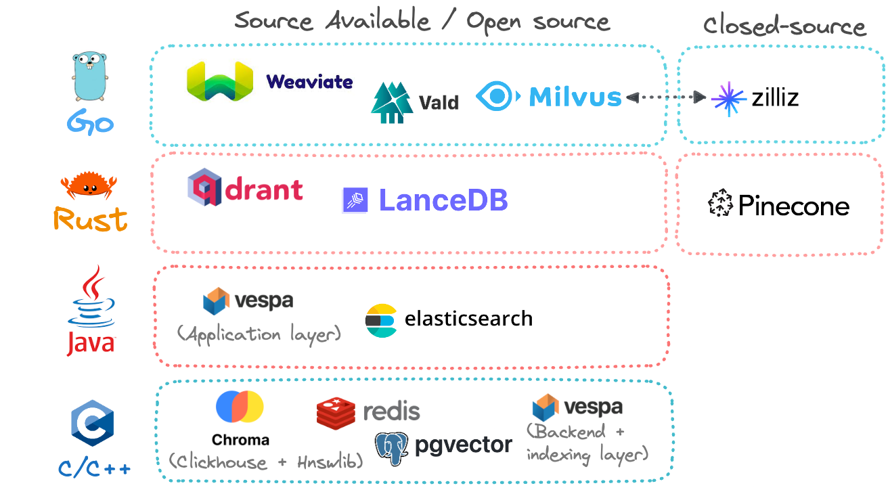
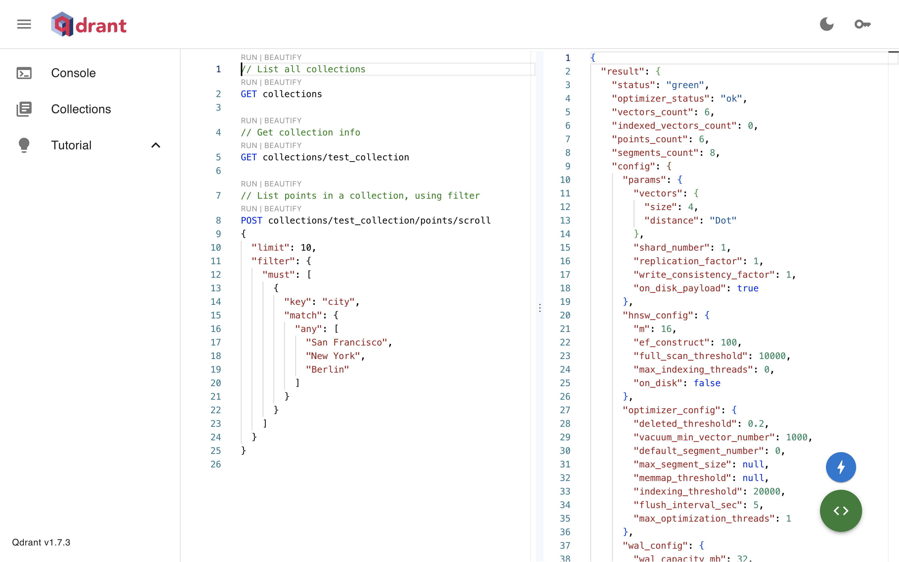

# 向量数据库

向量数据库是一种专门设计用于存储、索引和检索向量数据的数据库。它适用于处理大规模的高维向量，这些向量通常代表了图像、视频、文本或音频内容的特征，甚至整个世界本身。向量数据库通常用于支持机器学习应用，例如检索增强生成（RAG）、图像检索、推荐系统等。

向量数据库的核心功能是相似度搜索（similarity search），即通过计算向量之间的相似度来快速检索出内容上相似的项目。常用的相似度度量包括欧氏距离、余弦相似度和点积。为了实现高效的大规模相似度搜索，向量数据库通常采用专门的数据结构和索引技术，以及高效的搜索算法（如近似最近邻搜索算法）。以基于检索增强生成的问答应用为例，当用户提出一个问题时，应用会首先将问题转换为向量，然后在向量数据库中检索与该向量相似的向量，即与问题相关的上下文。这些检索到的上下文信息用于增强大型语言模型的回答生成过程，使得生成的答案更为精确和详尽。

目前市面上存在数量众多的向量数据库产品，即便是开源向量数据库也有不少选择，例如 <a target="_blank" rel="noopener noreferrer" href="https://github.com/milvus-io/milvus">Milvus</a>、<a target="_blank" rel="noopener noreferrer" href="https://github.com/qdrant/qdrant">Qdrant</a>、<a target="_blank" rel="noopener noreferrer" href="https://github.com/chroma-core/chroma">Chroma</a>、<a target="_blank" rel="noopener noreferrer" href="https://github.com/weaviate/weaviate">Weaviate</a> 等。关于这些向量数据库的比较，可以参阅博客 <a target="_blank" rel="noopener noreferrer" href="https://thedataquarry.com/posts/vector-db-1/">Vector databases (1): What makes each one different?</a>。



## 部署

这里以 <a target="_blank" rel="noopener noreferrer" href="https://github.com/qdrant/qdrant">Qdrant</a> 为例进行部署。Qdrant 官方提供了 <a target="_blank" rel="noopener noreferrer" href="https://artifacthub.io/packages/helm/qdrant/qdrant">Helm chart</a>，部署更加简单、便捷。


Qdrant 的一些特性如下：

* **高效**：有效利用计算资源。Qdrant 完全用 Rust 语言开发，实现了动态查询计划和有效载荷数据索引。也为企业提供了硬件感知的构建版本。
* **快速且准确**：实现了 HNSW 算法的独特自定义修改，用于近似最近邻搜索。以最先进的速度进行搜索，并在不影响结果的情况下应用搜索过滤器。
* **易于使用的 API**：提供 OpenAPI v3 规范来生成几乎任何编程语言的客户端库。或者，利用为 Python 或其他编程语言准备的现成客户端以获得额外功能。
* **丰富的数据类型**：向量负载支持大量的数据类型和查询条件，包括字符串匹配、数值范围、地理位置等。负载过滤条件允许您构建几乎任何自定义业务逻辑，这些逻辑应基于相似性匹配工作。
* **分布式**：云原生且横向可扩展。无论用户需要伺服多少数据，Qdrant 总是可以使用恰到好处的计算资源。

Qdrant 提供了 REST API 和 gRPC API 作为接口，所有与 Qdrant 的交互都通过这些 API 进行。此外，Qdrant 还提供了多种语言的客户端库和一个 Web UI 界面，[使用](#使用)部分将演示使用 Python 客户端以及 Web UI 与 Qdrant 交互。

### 安装

进入 Notebook app 的终端，添加相应的 Helm Chart repository，列出 Chart `qdrant/qdrant` 的所有版本：

```bash
helm repo add qdrant https://qdrant.github.io/qdrant-helm
helm search repo qdrant/qdrant --versions
```

安装指定版本的 Chart `qdrant/qdrant` 以部署 Qdrant 应用：

```bash
# 安装最新版本
helm repo update qdrant
helm install qdrant-demo qdrant/qdrant

# 安装指定版本，注意这不是 Qdrant 应用的版本
helm install qdrant-demo qdrant/qdrant --version <VERSION_NUMBER>
```

## 配置

以上安装全部使用默认配置，完整的默认配置请参阅 <a target="_blank" rel="noopener noreferrer" href="https://github.com/qdrant/qdrant-helm/blob/main/charts/qdrant/values.yaml">`values.yaml`</a>。如要修改默认配置，用户可以将新配置（覆盖默认配置的字段）保存为一个 YAML 文件，通过 `-f` 选项提供给安装命令：

```bash
helm install qdrant-demo qdrant/qdrant -f <NEW_CONFIG_FILE>
```

下面将分主题介绍部分关键配置。

### 计算资源

默认配置没有指定计算资源，表示 Pod 可以无限制地使用节点的 CPU 和内存资源。用户可以根据实际需求指定请求值和实际值。

```yaml
# 默认配置
resources: {}
```

### 存储

默认配置指定的卷大小为 10Gi，并且没有指定存储类型。用户可以根据数据规模修改卷大小，并选用高性能的存储类型。

```yaml
# 默认配置
persistence:
  accessModes:
  - ReadWriteOnce
  annotations: {}
  size: 10Gi                # 卷大小
  storageClassName: ""      # 存储类型
config:
  storage: {}
```

此外，用户还可以在 `config.storage` 字段下配置 Qdrant 实例的存储和索引的多个参数，请参阅 <a target="_blank" rel="noopener noreferrer" href="https://qdrant.tech/documentation/guides/configuration/#configuration-file-example">configuration file example</a>。

### 网络

默认配置没有启动 Ingress，用户可以提供 Ingress 配置以提供外部访问。

```yaml
# 默认配置
ingress:              # Ingress 配置
  enabled: false
  ingressClassName: ""
  annotations: {}
  hosts:
  - host: example-domain.com
    paths:
    - path: /
      pathType: Prefix
      servicePort: 6333
  tls: []

service:              # Service 配置              
  type: ClusterIP
  additionalLabels: {}
  annotations: {}
  loadBalancerIP: ""
  ports:
    - name: http
      port: 6333
      targetPort: 6333
      protocol: TCP
      checksEnabled: true
    - name: grpc
      port: 6334
      targetPort: 6334
      protocol: TCP
      checksEnabled: false
    - name: p2p
      port: 6335
      targetPort: 6335
      protocol: TCP
      checksEnabled: false

config:
  service: {}
  tls: {}
```

此外，用户还可以在 `config.service` 和 `config.tls` 字段下配置 Qdrant 实例的服务和 TLS 的多个参数，请参阅[安全](#安全)以及 <a target="_blank" rel="noopener noreferrer" href="https://qdrant.tech/documentation/guides/configuration/#configuration-file-example">configuration file example</a>。

### 分布式部署

Qdrant 支持分布式部署模式，在此模式下，多个 Qdrant 服务彼此通信，将数据分布到多个副本（replica）中，以扩展存储能力并增加稳定性。默认配置启用了分布式部署模式，并指定端口 6335 用于内部通信，但只创建了 1 个副本。用户可以增加副本数量以实现分布式部署。

```yaml
# 默认配置
replicaCount: 1

config:
  cluster:
    enabled: true
    p2p:
      port: 6335
    consensus:
      tick_period_ms: 100
```


关于分布式一致性协议、分片、复制（replication）和一致性保证的更多信息，请参阅 <a target="_blank" rel="noopener noreferrer" href="https://qdrant.tech/documentation/guides/distributed_deployment/">Distributed deployment</a>。

### 安全

默认配置没有为 Qdrant 实例提供任何保护，在投入生产使用之前，用户需要启用安全措施。首先，启用 TLS 以加密连接：

```yaml
config:
  service:
    enable_tls: true

  p2p:
    enable_tls: true  # 分布式部署下，对 peer 之间的通信启用 TLS

  tls:
    cert: ./tls/cert.pem
    key: ./tls/key.pem
```

<aside class="note tip">
<div class="title">提示</div>

当 TLS 启用后，用户必须使用 HTTPS 连接。

</aside>

在此基础上，可以使用静态的 API key 进行身份验证：

```yaml
config:
  service:
    api_key: your_secret_api_key_here
```

<aside class="note tip">
<div class="title">提示</div>

设置 API key 后，用户必须在请求头中附带 API key。

</aside>

更多信息请参阅 <a target="_blank" rel="noopener noreferrer" href="https://qdrant.tech/documentation/guides/security/">Security</a>。

### Kubernetes 资源清单

Helm 在部署应用时创建的主要 Kubernetes 资源如下表所示：

| 类型        | 名称                         | 作用                 | 备注 |
| ----------- | ---------------------------- | -------------------- | ---- |
| Service     | qdrant-demo                  | 作为应用服务         |      |
| StatefulSet | qdrant-demo                  | 部署应用             |      |
| PVC         | qdrant-storage-qdrant-demo-* | 作为应用的持久化存储 |      |

### 运维

**查看应用的状态**

```bash
helm status qdrant-demo
```

**更新应用**

```bash
# 更新到最新版本
helm upgrade qdrant-demo qdrant/qdrant

# 更新到指定版本
helm upgrade qdrant-demo qdrant/qdrant --version <VERSION_NUMBER>

# 回滚更新，首先查看历史版本
helm history qdrant-demo
helm rollback qdrant-demo [REVISION]
```

**移除应用**

```bash
helm delete qdrant-demo
kubectl delete pvc -l app.kubernetes.io/instance=qdrant-demo
```

## 使用

继续使用 Notebook app 的终端，获取应用 service 的公开的端口号：

```bash
kubectl get svc qdrant-demo -o jsonpath="{.spec.ports}"
```

输出应类似于：

```json
[{"name":"http","port":6333,"protocol":"TCP","targetPort":6333},{"name":"grpc","port":6334,"protocol":"TCP","targetPort":6334},{"name":"p2p","port":6335,"protocol":"TCP","targetPort":6335}]
```

首先使用 Python 客户端运行一个快速入门。安装 Python 客户端：

```bash
pip install qdrant-client
```

然后执行如下 Python 脚本，命令行参数中需要提供 gRPC 端口号：

<details><summary><code class="hljs">quick_start.py</code></summary>

```python
{{#include ../assets/integrations/vector-database/quick_start.py}}
```

</details>

```bash
python quick-start.py qdrant-demo:<GRPC_PORT>
```

脚本创建了一个 collection，添加了一些数据，并进行了两次基本的查询。输出应类似于：

```python
[ScoredPoint(id=4, version=0, score=1.3619999885559082, payload={'city': 'New York'}, vector=None, shard_key=None), ScoredPoint(id=1, version=0, score=1.2730000019073486, payload={'city': 'Berlin'}, vector=None, shard_key=None), ScoredPoint(id=3, version=0, score=1.2079999446868896, payload={'city': 'Moscow'}, vector=None, shard_key=None)]
[ScoredPoint(id=2, version=0, score=0.8709999918937683, payload={'city': 'London'}, vector=None, shard_key=None)]
```

接下来进入 Web UI 与 Qdrant 向量数据库交互。如果在部署应用时配置了 Ingress，那么直接在浏览器中访问相应的地址即可，否则需要进行端口转发。通过 t9k-pf 进行端口转发：

```bash
t9k-pf -n <APP_PROJECT> pod qdrant-demo-0 6333:6333
```

在浏览器中访问 <a target="_blank" rel="noopener noreferrer" href="http://127.0.0.1:6333/dashboard">http://127.0.0.1:6333/dashboard</a> 进入 Web UI。在 Console 页面中，用户可以直接调用 REST API 并得到响应结果：

<figure class="screenshot">
  
</figure>

在 Collections 页面中，用户可以进行以下操作：

* 浏览 collection 的所有数据点
* 查看 collection 的基本信息
* 制作和上传快照
* 对数据点进行可视化
* 删除 collection

<figure class="screenshot">
  
</figure>

<figure class="screenshot">
  
</figure>

<figure class="screenshot">
  
</figure>

Web UI 的其他功能这里不再一一介绍，用户可以自行探索。

更多使用教程请进一步参阅 <a target="_blank" rel="noopener noreferrer" href="https://qdrant.tech/documentation/">Qdrant 文档</a>。

## 参考

* <a target="_blank" rel="noopener noreferrer" href="https://github.com/qdrant/qdrant">GitHub 上的 Qdrant</a>
* <a target="_blank" rel="noopener noreferrer" href="https://qdrant.tech/documentation/">Qdrant 文档</a>
    * <a target="_blank" rel="noopener noreferrer" href="https://qdrant.tech/documentation/quick-start/">快速入门</a>
    * <a target="_blank" rel="noopener noreferrer" href="https://qdrant.tech/documentation/guides/distributed_deployment/">分布式部署</a>
    * <a target="_blank" rel="noopener noreferrer" href="https://qdrant.tech/documentation/guides/configuration/">配置</a>
    * <a target="_blank" rel="noopener noreferrer" href="https://qdrant.tech/documentation/guides/security/">安全</a>
* <a target="_blank" rel="noopener noreferrer" href="https://github.com/qdrant/qdrant-helm">GitHub 上的 Qdrant Helm</a>
