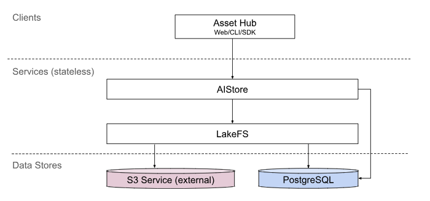

# 资产管理

所谓 AI 资产，指数据集和模型等人工智能相关的数据。

TensorStack AI 平台的资产管理模块（AssetHub，以下简称 AH）对模型和数据集提供完善的管理功能，包括版本管理、持续开发和协同开发等功能。

## 产品架构

如上图所示，AH 使用 TensorStack AI 平台自研存储系统 AIStore 存储数据，用户可以通过 AH 控制台、命令行工具和 SDK 工具与 AIStore 连接，实现 AH 的各项功能。

## 版本控制

AH 支持多版本模型管理，用户可以训练和提交多个临时版本模型，发布其中符合预期的模型。

多版本管理通过以下机制实现：

* Branch：分支，用户可以创建一个新分支来记录模型的临时版本；将新分支合并到主分支上，完成模型的发布。
* Commit：“交付”，相当于版本快照，便于确定版本和追溯历史。
* Tag：标签，用户可以为具有“特殊意义”的 Commit 标记标签，比如 best、v1 等。

数据集同样支持 Branch、Commit 和 Tag 的管理方式，不过数据集不会如模型那样频繁产出，所以一般建议数据集只在主分支上持续更新。

## S3 接口

在训练（或部署服务）时，除了将数据集和模型下载到本地使用，大多数框架也支持直接从 S3 数据服务上动态获取数据文件。

AH 提供 S3 接口，用户可以在 AH 控制台上创建 S3 凭证，然后使用页面上生成的 S3 配置文件在训练过程中直接通过 S3 接口获取数据。

<aside class="note">

注意

由于需要动态通过网络下载数据，S3 接口读取数据的速度要比提前下载到本地慢。因此，仅推荐在存储空间有限且对数据读取速度不敏感的条件下使用 S3 接口。

</aside>

## 协同开发

AH 支持文件夹粒度的权限共享。用户可以将一组模型或数据集分享给其他人，实现多人共同开发和训练结果共享的目的。

可分享的权限包括查看权限或编辑权限，编辑权限包含查看权限。分享的目标可以是另一个用户、用户组或者公开给所有人。

## 下一步

* 了解如何使用 AH [管理 AI 资产](../tasks/manage-ai-assets.md)
