# 模型构建

一次完整的模型构建实验由许多步骤组成，包括准备实验数据、开发机器学习算法、选择训练超参数和执行训练等等。

TensorStack AI 平台的模型构建模块可以帮助你在分布式集群中快速方便地完成上述工作。模型构建模块的功能包括：

<figure>
  
</figure>

* Notebook：在线机器学习开发工具，你可以使用此模块直接在平台上开发机器学习脚本。
* TensorBoard：机器学习可视化工具，实现训练过程可视化、模型可视化。
* Job：一类任务型资源，其中包括 TensorFlowTrainingJob、MPIJob 等多种资源，使用各种机器学习框架、通信协议来进行分布式计算。其中 TensorFlowTrainingJob 和 PyTorchTrainingJob 集成了 TensorBoard 的创建功能，可以监控训练进程和查看训练结果。
* AutoTune：超参数调优实验，在给定的搜索空间中查找最优的超参数组合以及机器学习网络结构。AutoTune 在进行超参数调优的过程中需要使用 TrainingJob（根据训练框架选用 TensorFlowTrainingJob、PyTorchTrainingJob 或 XGBoostTrainingJob）对超参数的效果进行验证。

## 架构

<figure>
  
</figure>

如上图所示：

* TensorStack CLI 是 TensorStack AI 平台所使用的命令行工具，可以用于操作几乎所有 TensorStack AI 平台的模块，包括模型构建。
* Kubernetes API Server 是 Kubernetes 的重要组成部分，负责对外提供接口，接受对集群的操作请求。在此框架中，Kubernetes API Server 需要向模型构建模块提供集群中的资源信息，同时接收资源的创建、删除等请求。
* 红框中的内容为模型构建模块的组成部分：
    * 控制台（Console）：模块的交互界面，你可以通过此界面使用模块的全部功能。
    * 服务器（Server）：模块功能的提供者，为你提供查看、创建、修改和删除资源的接口。
    * 控制器（Controller）：资源控制器，用于处理资源的创建和修改请求。

## 下一步

* 学习使用 [Notebook](./notebook.md)
* 学习使用 [TensorBoard](./tensorboard.md)
* 学习使用 [T9k Job](../jobs/index.md)
* 学习使用 [AutoTune](./autotune.md)
