# 数据管理

AI 开发和应用的过程中会使用和产生各种各样的数据，包括训练/测试数据集、模型权重、训练/评估配置、训练/评估指标和日志等等。TensorStack AI 平台提供了一套完善的数据管理方案：自研存储系统 AIStore 存储全部数据文件，其实现了版本控制、权限管理、协同开发等功能；资产管理和实验管理两个模块建立在 AIStore 之上，前者专用于存储模型和数据集，后者专用于追踪模型训练。

## 架构

资产管理和实验管理模块的架构如上图所示，它们使用 AIStore 存储数据，用户可以通过控制台、命令行工具和 SDK 工具与 AIStore 连接，实现这两个模块的各项功能。
