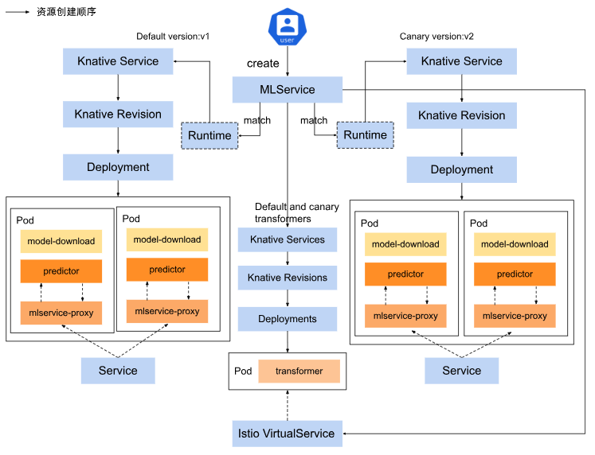
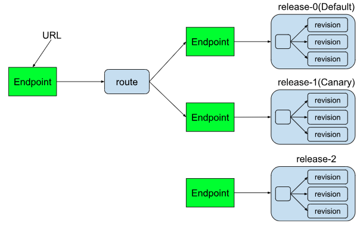
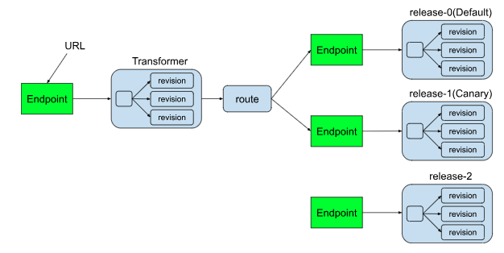

# MLService

MLService 用于在 TensorStack AI 平台上部署机器学习模型推理服务，主要用于生产环境。

## 控制层

控制层的任务是根据用户创建的 MLService ，在集群中生成相应的 `knative service`、 `virtual service` 等资源。

MLService 控制层架构示意图如下：

<figure class="architecture">
  
</figure>

其中：

* 控制器会为 MLService 中的每一个 Predictor 以及 Transformer 创建一个 `knative service`。MLService 基于 `knative service` 实现容量伸缩、多版本发布等功能。
* 控制器会为 MLService 创建 k8s 原生 `service` 以及 istio 的 `virtual service` 来管理流量。MLService 基于这些服务以支持集群内，集群外的流量访问。
* 机器学习模型存储在外部存储服务中，控制器会在部署服务前先下载/加载模型。

## 数据层

数据层描述了工作中的 MLService 各个组件之间数据的流动。

MLService 目前包含 2 种组件：

* Predictor：
    * 每个 MLService 至少要有一个 Predictor。
    * Predictor 是一个推理服务，用户向其发送预测请求，然后得到相应的推理结果。
    * Predictor 自身可以独立的进行伸缩，并在自身的多个副本之间进行流量的负载均衡。
    * MLService 可以同时包含多个 predictor，用户可以单独访问其中任意一个 predictor。
* Transformer
    * Transformer 是可选的。
    * Transformer 允许用户在预测请求的流程中添加预处理和后处理流程。

数据层图示如下：

无 Transformer 的情况：

<figure class="architecture">
  
</figure>

有 Transformer 的情况：

<figure class="architecture">
  
</figure>

## 基本示例

下面是一个基本的 MLService 示例：

```yaml
apiVersion: tensorstack.dev/v1beta1
kind: MLService
metadata:
  name: torch-mnist
spec:
  default: version1
  releases:
    - name: version1
      predictor:
        minReplicas: 1
        maxReplicas: 3
        model:
          parameters:
            "MODEL_PATH": "mnist=model.mar"
          runtime: torchserve
          modelUri: pvc://tutorial/tutorial-examples/deployment/pvc/mlservice-torch/
```

该示例部署的推理服务只包含一个版本 `version1`，其使用 MLServiceRuntime `torchserve`，使用的模型存储在 pvc `tutorial` 中，服务的工作负载数量会根据流量动态变化，最小为 1，最大为 3。

## MLServiceRuntimes

在[基本示例](#基本示例)中，我们使用了 MLServiceRuntime `torchserve`。在此章节中我们将向用户详细介绍 MLServiceRuntimes 的工作机制。

MLService 提供了 MLServiceRuntime 来支持多种机器学习框架，从而帮助用户快速部署推理服务。

MLServiceRuntime 定义了推理服务 Pod 的模版，模版中包含了推理服务的关键信息，例如镜像、启动命令、资源需求等。

### MLServiceRuntime 基本示例

下面是一个基本的 MLServiceRuntime 的例子：

该 MLServiceRuntime 在 spec.template 中定义了推理服务 Pod 的模版，服务会运行 torchserve 指令。

```yaml
apiVersion: tensorstack.dev/v1beta1
kind: MLServiceRuntime
metadata:
  name: torchserve
spec:
  enabled: true
  template:
    spec:
      containers:
      - name: user-container
        image: torchserve:latest
        args:
          - torchserve
          - --start
          - --model-store=/var/lib/t9k/model
          - --models {{if .MODEL_PATH}}{{.MODEL_PATH}}{{else}}all{{end}}
        resources:
          limits:
            cpu: "200m"
            memory: 200Mi
        ports:
        - containerPort: 8080
          protocol: TCP
```

MLServiceRuntime 中的 Pod 模版有以下规范必须遵守：

1. 必须要有一个名为 `user-container` 的容器，后续所介绍的[模型存储](#模型存储)、[日志收集](#日志收集)等功能都只对 `user-container` 生效。
2. `user-container` 的容器中最多只能定义一个 `containerPort`，且其余的容器定义中不能有 `containerPort`。

<aside class="note info">
<div class="title">信息</div>

`user-container` 容器中定义的唯一 `containerPort` 就是推理服务对应的端口，如果没有定义，默认访问 `8080` 端口。

</aside>

### 使用 MLServiceRuntime

用户可以在 MLService 的 Predictor 定义中指定要使用的 MLServiceRuntime 名称，例如：

```yaml
apiVersion: tensorstack.dev/v1beta1
kind: MLService
metadata:
  name: demo
spec:
  default: version1
  releases:
  - name: version1
    predictor:
      model:
        runtime: torchserve
        modelUri: "<your-model-registry/your-model-path>"
```

用户在 Predictor `version1` 的 `.model.runtime` 中指定了 `torchserve`。在创建 Pod 时，会使用当前项目下名称为 `torchserve` 的 MLServiceRuntime。

### MLServiceRuntime 的更新

如果用户更新了一个 MLServiceRuntime，所有使用了该 MLServiceRuntime 的 MLService 所创建的 Pod 也会随之进行更新。

<aside class="note warning">
<div class="title">提醒</div>

MLService 的更新并不是实时的。建议最好不要修改 MLServiceRuntime，这可能会影响正在运行的服务。

</aside>

### 个性化改动

除了直接使用 MLServiceRuntime 定义好的 Pod 模版，MLService 还支持两种对其进行个性化改动的方式。

#### Parameters

MLService 支持在 Predictor 的 `.model.parameters` 设置参数，该字段是一个 map 类型，key 为参数名，value 为参数值。

在之前的 [MLServiceRuntime 基本示例](#mlserviceruntime-基本示例)中，我们可以看到 `--models {{if .MODEL_PATH}}{{.MODEL_PATH}}{{else}}all{{end}}` 这样一行。这里使用了 <a target="_blank" rel="noopener noreferrer" href="https://pkg.go.dev/text/template">golang template</a> 的语法，意思是：

* 如果用户指定了 `MODEL_PATH`，这一行会被设置为 `--model <用户指定的 MODEL_PATH>`
* 如果用户没有指定 `MODEL_PATH`，这一行会被设置为 `--model all`

指定了 `MODEL_PATH` 的 MLService 如下：

```yaml
apiVersion: tensorstack.dev/v1beta1
kind: MLService
metadata:
  name: demo
spec:
  default: version1
  releases:
  - name: version1
    predictor:
      model:
        parameters:
          "MODEL_PATH": "mnist=model.mar"
        runtime: torchserve
        modelUri: "<your-model-registry/your-model-path>"
```

上述 MLService 最终产生的 Pod 的 args 中会有一行 `--model mnist=model.mar`，指定了使用模型的名称和文件。

#### StrategicMergePatch

Runtime 定义了 Pod 模版，但不一定能适用于所有场景。MLService 支持用户在 MLServiceRuntime 的基础上，进行覆盖或者添加。例如：

```yaml
apiVersion: tensorstack.dev/v1beta1
kind: MLService
metadata:
  name: demo
spec:
  default: version1
  releases:
  - name: version1
    predictor:
      model:
        modelFormat:
          name: pytorch
        modelUri: "<your-model-registry/your-model-path>"
      template:
        spec:
          containers:
            - name: user-container
              image: self-torchserve:latest
```

将上面 MLService 中 predictor `version1` 的 `template.spec` 和之前的 [Runtime 基本示例](#runtime-基本示例)相比，可以发现他们都定义了一个名为 `user-container` 的 container，但是 `image` 不同。于是最终生成的 Pod 中，MLService 中定义的 `image` 会覆盖 MLServiceRuntime 中的 `image`，但是 MLServiceRuntime 中 `args` 等其余设置都会被保留。

<aside class="note warning">
<div class="title">提醒</div>

使用 StrategicMergePatch 在 MLService 中定义容器时，不可以设置 `ports` 字段。否则会导致合并后的 Pod 中定义了多个 `port`。

</aside>

这里的覆盖合并原则采用的是 StrategicMergePatch。
用户可以通过阅览以下参考资料，进一步了解  StrategicMergePatch：
* <a target="_blank" rel="noopener noreferrer" href="https://kubernetes.io/docs/tasks/manage-kubernetes-objects/update-api-object-kubectl-patch/#use-a-strategic-merge-patch-to-update-a-deployment">Update API Objects in Place Using kubectl patch</a>
* <a target="_blank" rel="noopener noreferrer" href="https://pkg.go.dev/k8s.io/apimachinery/pkg/util/strategicpatch">strategicpatch - k8s.io/apimachinery/pkg/util/strategicpatch</a>

以下给出几个常用的例子：

1. 添加 container， containers 数组中不同名的都会被保留。

| MLServiceRuntime| MLService| Result|
|-|-|-|
|containers:<br>- name: user-container<br>&nbsp;&nbsp;...|containers:<br>- name: proxy<br>&nbsp;&nbsp;...|containers:<br>- name: user-container<br>&nbsp;&nbsp;...<br>- name: proxy<br>&nbsp;&nbsp;...|

2. 修改 image，相同名称 container 的 image 会被覆盖。

| MLServiceRuntime| MLService| Result|
|-|-|-|
|containers:<br>- name: user-container<br>&nbsp;&nbsp;image: torchserve:alpha|containers:<br>- name: user-container<br>&nbsp;&nbsp;image: torchserve:beta|containers:<br>- name: user-container<br>&nbsp;&nbsp;image: torchserve:beta|

3. 修改 args，相同名称 container 的 args 数组会整个被覆盖。

| MLServiceRuntime| MLService| Result|
|-|-|-|
|containers:<br>- name: user-container<br>&nbsp;&nbsp;args: ["--k1=v1", "--k2=v2"]|containers:<br>- name: user-container<br>&nbsp;&nbsp;args: ["--k2=v3"]|containers:<br>- name: user-container<br>&nbsp;&nbsp;args: ["--k2=v3"]|

#### 设置资源

上述的 [StrategicMergePatch](#strategicmergepatch) 给用户提供了完整的个性化改动方案。除此以外，针对改动频率更高的资源要求（resources），MLService 提供了更方便的个性化改动方案。用户可以直接通过 Predictor 中的 `resources` 覆盖 Runtime 的资源要求，例如：

```yaml
apiVersion: tensorstack.dev/v1beta1
kind: MLService
metadata:
  name: demo
spec:
  default: version1
  releases:
  - name: version1
    predictor:
      model:
        modelFormat:
          name: pytorch
        modelUri: "<your-model-registry/your-model-path>"
      resources:
        limits:
          cpu: 500m
          memory: 1Gi
```

## 模型存储

MLService 支持 S3 和 PVC 两种存储模型的方式，用户需要根据模型存储的类型填写 MLService 的配置。

### S3

S3 是一种对象存储服务和协议，具有良好的可扩展性、数据可用性和安全性等优点，其协议被多种商业和开源产品支持，并且被广泛部署。

在MLService中使用 S3 存储模式需要在 `spec.releases[*].predictor.model.modelUri` 中设置模型路径并在 `spec.releases[*].predictor.storage.s3Storage.secretName` 中指定存储 S3 配置的 Secret 的名称。其中存储路径必需包含前缀 `s3://`，Secret 存储的 S3 配置格式是 <a target="_blank" rel="noopener noreferrer" href="https://s3tools.org/s3cmd">s3cmd</a> 配置文件格式。

例如：

```yaml
...
  releases:
    - name: test1
      predictor:
        model:
          modelUri: "s3://models/example/"
        storage:
          s3Storage:
            secretName: s3-security
...
```

模型在 S3 中的存储路径为 `s3://models/example/`，S3 的配置信息存储在 Secret `s3-security` 中。

### PVC

MLService 支持使用 [PVC](../storage/pvc.md) 中的模型。

在MLService中使用 PVC 存储模式需要在 `spec.releases[*].predictor.model.modelUri` 中设置包含前缀 `pvc://` 的模型路径。例如：

```yaml
...
  releases:
    - name: test1
      predictor:
        model:
          modelUri: "pvc://tutorial/models/example"
...
```

其中模型存储在 PVC `tutorial` 的 `models/example/` 路径下。

## 访问推理服务

MLService 部署成功后，通过状态字段 `status.address.url` 可以查询到全局推理服务的 Base URL，再加上部署模型对应的路径即可得到访问推理服务的地址。

以[基本示例](#基本示例)中的服务为例，全局推理服务地址的状态字段如下：

```yaml
...
status:
  address:
    url: http://torch-mnist.<project>.<domain>
...
```

由于服务使用的是 TorchServe 框架，按照其<a target="_blank" rel="noopener noreferrer" href="https://pytorch.org/serve/inference_api.html"> API 规范</a>，用户可以通过下述命令查看服务状态，并进行模型服务预测：

```bash
$ curl http://torch-mnist.<project-name>.<domain-name>/v1/models/mnist
{
    "model_version_status": <model-status>
}
# 模型预测（所用数据在 https://github.com/t9k/tutorial-examples/blob/master/deployment/pvc/mlservice-torch/test_data/0.png）
$ curl -T test_data/0.png http://torch-mnist.<project-name>.<domain-name>/v1/models/mnist:predict
{
    "predictions": <predict-result>
}
```

## 发布策略

### 多版本支持

一个 MLService 可以同时部署多个版本的 Predictor，在 `spec.releases` 字段中设置配置详情。

在下面的示例中，MLService 同时部署了 `nov-02`、`nov-05` 和 `nov-11` 三个版本的服务，这三个版本都使用同一个 MLServiceRuntime，但是使用的模型不同：

```yaml
apiVersion: tensorstack.dev/v1beta1
kind: MLService
metadata:
  name: multi-releases
spec:
  default: nov-02
  releases:
    - name: nov-02
      predictor:
        model:
          runtime: torchserve
          modelUri: pvc://tutorial/model-11-02
    - name: nov-05
      predictor:
        model:
          runtime: torchserve
          modelUri: pvc://tutorial/model-11-05
    - name: nov-11
      predictor:
        model:
          runtime: torchserve
          modelUri: pvc://tutorial/model-11-11
```

### 金丝雀发布

MLService 支持金丝雀发布，用户可以通过 `spec.canary` 字段设置金丝雀发布对应的模型版本，`spec.canaryTrafficPercent` 字段设置金丝雀发布的路由权重。`spec.default` 是必需字段，用于设置默认发布对应的模型版本。

例如上一节中我们部署了 3 个版本的模型，我们想主要使用 `nov-05` 这个版本，并且将刚刚训练好的 `nov-11` 作为金丝雀版本：

* 默认发布：`nov-05`，路由权重为 80%。
* 金丝雀发布：`nov-11`，路由权重为 20%。

```yaml
...
spec:
  default: nov-05
  canary: nov-11
  canaryTrafficPercent: 20
...
```

## 日志收集

MLService 支持对预测请求在日志中进行收集，日志收集对于每一个组件来说是独立的，可以通过组件定义中的 `logger` 来设置。设置后，每一条预测请求经过组件时，会以 <a target="_blank" rel="noopener noreferrer" href="https://cloudevents.io">CloudEvent</a> 的形式打印在日志当中，同时该 CloudEvent 也会被发送给指定的下游。

`logger` 的字段如下：

* urls：下游地址数组。设置接受 CloudEvent 的下游服务地址。
* mode：日志信息的类型，可选值 request、response、all。
    * all(默认)：记录预测请求和响应
    * request：只记录预测请求
    * response：只记录预测响应


下面是一个日志信息示例

```text
Context Attributes,
  specversion: 1.0
  type:tensorstack.dev.mlservice.request
  source: torch-mnist-logger-predict-origin
  id: 0009174a-24a8-4603-b098-09c8799950e9
  time: 2021-04-10T00:23:26.0789529Z
Extensions,
  component: predict
  inferenceurl: /v1/models/mnist:predict
  mlservicename: torch-mnist-logger
  namespace: example
  traceparent: 00-9b81bc9a3531a1e4357e236054d86b47-546e4c891883d512-00
Data,
  �PNG

Validation: valid
Context Attributes,
  specversion: 1.0
  type: tensorstack.dev.mlservice.response
  source: torch-mnist-logger-predict-origin
  id: 0009174a-24a8-4603-b098-09c8799950e9
  time: 2021-04-10T00:23:26.080736102Z
  datacontenttype: application/json
Extensions,
  component: predict
  inferenceurl: 
  mlservicename: torch-mnist-logger
  namespace: example
  traceparent: 00-6d69e2d3917689ee301610780af06de8-be01c3cfdf8e446e-00
Data,
{
  "0": 1.0,
  "2": 1.3369853835154544e-10,
  "6": 7.10219507987428e-14,
  "5": 5.859705488843112e-14,
  "9": 3.2580891499658536e-15
}
```

<aside class="note info">
<div class="title">信息</div>

MLService 在本地的日志信息会存储在 <a target="_blank" rel="noopener noreferrer" href="https://www.elastic.co/guide/en/elasticsearch/reference/7.10/index.html">Elasticsearch</a> 中。在 Elasticsearch 中，每个 Index 是一个命名空间，Index 之间互相独立。MLService 日志信息的 Index 模式是 `mlservice-<date>`，例如 `mlservice-2022.04.27`。

</aside>

## 前处理及后处理

MLService 支持部署含有前处理及后处理服务（Transformer） 的推理服务：

* 预处理：用户发向推理服务的原始数据，先经过 Transformer 预处理，然后再被发送到推理服务。
* 后处理：推理服务返回的预测结果，先经过 Transformer 后处理，然后再返回给用户。

用户可以使用 [Tensorstack SDK](../../../tools/python-sdk-t9k/index.md) 编写 Transformer 代码，制作镜像，并基于该镜像创建含有 Transformer 的推理服务。详细示例请参考 [制作并部署含有 Transformer 的模型推理服务](../../tasks/deploy-mlservice-transformer.md)。

## 容量伸缩

MLService 支持容量自动伸缩，工作负载的变化是根据请求负荷指标来变化的，具体原理可以查看 <a target="_blank" rel="noopener noreferrer" href="https://knative.dev/docs/serving/autoscaling/">Knative Autoscaling</a>。

用户可以通过设置 `spec.releases[*].predictor.minReplicas` 字段和 `spec.releases[*].predictor.maxReplicas` 字段来指定 Predictor 工作负载数量的下限和上限。

同样的，如果用户启用了 Transformer，可以通过 `spec.transformer.minReplicas` 字段和 `spec.transformer.maxReplicas` 字段来指定 Transformer 工作负载数量的下限和上限。

以下是一些特殊情况：
* `minReplicas` 不填时，工作负载数量的默认最小值为 1。
* `minReplicas` 等于 0 时，当没有流量请求时，MLService 会缩容到 0，删掉所有的工作负载。
* `maxReplicas` 不填或设为 0 时，工作负载数量没有上限。

除了负载数量的限制，用户还可以在具体的 Runtime 或者组件（Predictor 或者 Transformer）的 Pod 定义中设置 Knative Autoscaling 相关的 Annotation，例如：

```yaml
...
spec:
  releases:
    - name: version1
      minReplicas: 1
      maxReplicas: 3
      predictor:
        template:
          metadata:
            annotations: 
              autoscaling.knative.dev/metric: "rps"
              autoscaling.knative.dev/target: "100"
...
```

在上面的示例中，我们设置了工作负载数量的范围为 `[1,3]`，自动伸缩指标(metric)为 `rps`，自动伸缩目标(target)为 `100`。这意味着当每个工作负载每秒处理的请求数量（requests-per-second）达到 100 时，负载会开始扩容，且扩容最大数量为 3，最小数量为 1。

## 调度器

MLService 支持使用两种调度器：Kubernetes 默认调度器（默认）和 [T9k Scheduler](../../cluster/scheduling/index.md)。MLService 通过 `spec.scheduler` 字段设置调度器：

* 不设置 `spec.scheduler` 字段，则默认使用 Kubernetes 默认调度器。
* 设置 `spec.scheduler.t9kScheduler` 字段，则使用 T9k Scheduler 调度器。

在下面的示例中，使用了 T9k Scheduler 调度器，且工作负载处于队列 `default` 中。

```yaml
...
spec:
  scheduler:
    t9kScheduler:
      queue: default
...
```

## 服务状态

通过 MLService 的状态字段可以获取如下信息：

* 推理服务的全局状态及服务地址：`status.ready` 表明推理服务是否准备就绪，`status.address.url` 表明全局推理服务地址。
* 每个部署的模型的状态及服务地址：`status.releases[*].ready` 表明该版本推理服务是否准备就绪，`status.releases[*].url` 表明该版本的推理服务地址。
* Transformer 的状态及服务地址：`status.ready` 表明 Transformer 服务是否准备就绪，`status.transformer.url` 表明 Transformer 服务地址。
* 推理服务没有就绪的原因：`status.conditions` 以及 `status.releases[*].message` 等字段中会记录相关报错信息。

以[多版本支持](#多版本支持)的示例的状态为例，其 MLService 状态字段如下。从状态字段可以看出，该推理服务处于就绪状态，外部访问地址为 `http://multi-releases.<project>.<domain>`，某个 release 的访问地址为 `http://multi-releases-predict-<release>.<project>.<domain>`

```yaml
status:
  address:
    url: http://multi-releases.<project>.<domain>
  canaryRelease: nov-02
  conditions:
  - lastTransitionTime: "2023-11-27T10:44:27Z"
    status: "False"
    type: Paused
  - lastTransitionTime: "2023-11-27T10:50:04Z"
    status: "True"
    type: Ready
  defaultRelease: nov-05
  releases:
  - name: nov-02
    ready: true
    readyReplicas: 1
    totalReplicas: 1
    trafficPercent: 80
    url: http://multi-releases-predict-nov-02.<project>.<domain>
  - name: nov-05
    ready: true
    readyReplicas: 1
    totalReplicas: 1
    trafficPercent: 20
    url: http://multi-releases-predict-nov-05.<project>.<domain>
  - name: nov-11
    ready: true
    readyReplicas: 1
    totalReplicas: 1
    trafficPercent: 0
    url: http://multi-releases-predict-nov-11.<project>.<domain>
```

如果推理服务没有就绪，你可以通过查看 `status.conditions` 中 type 为 `Ready` 的 reason 以及 message 来查看具体信息，同时 Event 中也会有相关的错误信息。

## 应用示例

TODO