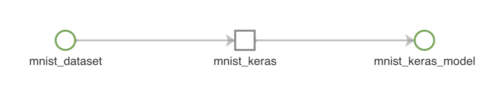
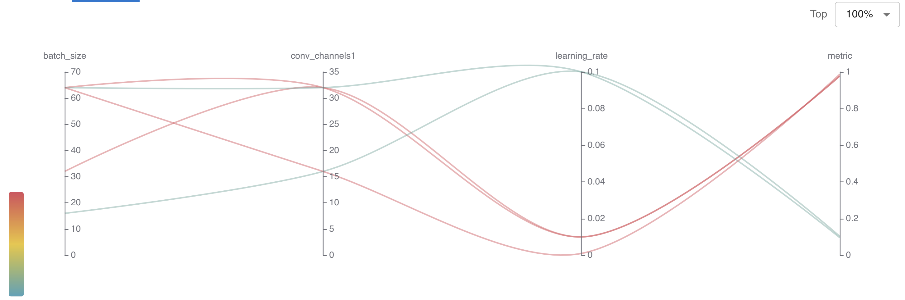
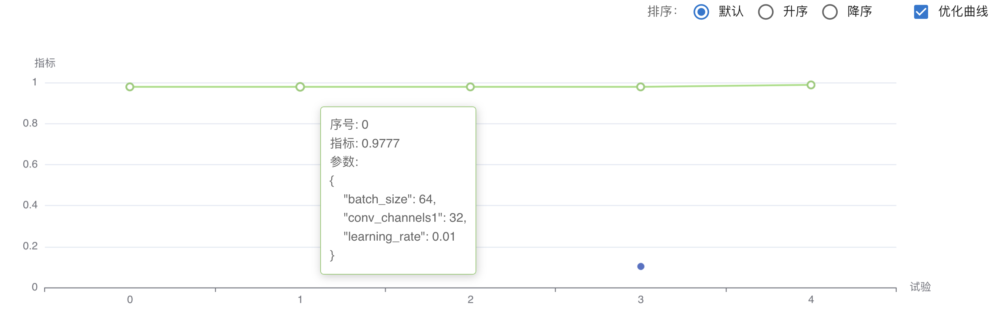
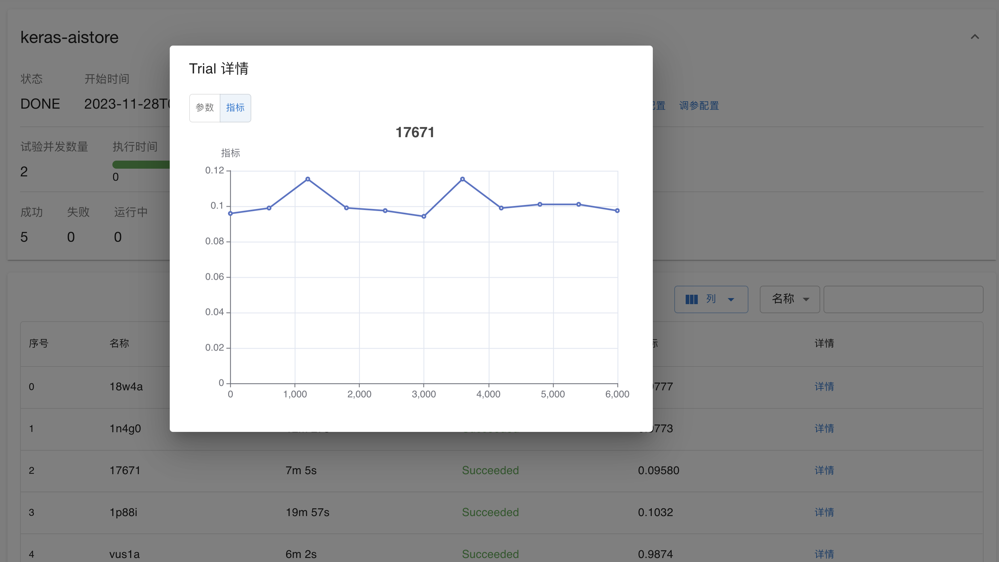

# 实验管理

实验管理模块（Experiment Management，以下简称 EM）提供实验数据追踪功能，能够收集实验元数据、实验中间产物，并可视化和比较实验结果，推动模型进步。这里的实验指的是以特定配置运行的一次模型训练，旨在探究某产生的指标表现如何。

## 存储结构

EM 使用树状结构组织一个用户的实验数据，在 Web UI 中体现为目录结构。

```bash
# EM 目录结构示意图
user:demo
  ├── em-example/
  │   ├── mnist_dataset
  │   └── mnist_keras
  └── autotune/
      └── keras-tune
```

### 节点类型

EM 树状结构中，节点根据存储方式分为四类，用 StorageType 表示：

* StorageType == 0：不存储数据文件，仅用于组织 EM 树状结构。EM 中文件夹即该类型节点。
* StorageType == 1：存储一个文件数据。
* StorageType == 2：存储一组数据文件。
* StorageType == 3：该类型节点可以创建和管理多个版本，每一个版本中可以存储一组数据文件。

在这四种存储类型的基础上，EM 根据用途实现以下 7 个节点类型：

* Folder：Storage Type == 0，文件夹结构，用来组织实验数据。
* Shotrcut：Storage Type == 0，快捷方式，指向另一个节点。
* Run：Storage Type == 2，记录实验元数据，包括实验基本信息、实验参数和实验指标。
* Artifact：Storage Type == 2，记录实验的中间产物，也包括未发布的数据集和模型。
* AutoTune：Storage Type == 2，记录超参数调优实验数据，参考[超参数调优实验](./building/autotune.md)。
* Model：Storage Type == 3，记录机器学习模型。
* Dataset：Storage Type == 3，记录机器学习所使用的数据集。

Artifact 没有特定的文件组织结构，用户可根据需要组织上传。

Model 和 Dataset 由平台的资产管理模块，具体请参考 [EM 和 AssetHub 之间的关系](#em-和-assethub-之间的关系) 。

Run 和 Autotune 是实验元数据的存储节点，具有特定的文件组织结构，EM Web 根据这些特定的文件组织结构进行实验数据的可视化。

#### Run 节点

Run 记录实验元数据，包括实验基本信息、实验参数和实验指标。

Run 节点中包含一个 index.yaml 文件，其中记录其他实验数据在该节点中的相对路径：

```
hyperparameters: hyperparameters.yaml
metrics:
  train: metrics/train.yaml
  val: metrics/val.yaml
  test: metrics/test.yaml
platform: platform.yaml
git: git.yaml
log: stdout.log
```

* `hypterparameters`：机器学习超参数。
* `metrics`：训练指标，由于指标可能产生自不同阶段，同一阶段也可能有多种指标，所以使用上例中的结构记录多个指标文件。
* `platform`：平台信息，包括系统版本、python 包版本等。
* `git`：代码存储位置，我们一半会将机器学习脚本存储在 GitHub 中。
* `log`：日志文件。

上述文件的生成可以由 em 工具自动完成，用户只需要了解如何使用 em 工具。参考 [em API 文档](../tools/python-sdk-t9k/api/t9k-em.md)。

#### AutoTune 节点

AutoTune 记录超参数调优实验数据，包括实验的基本配置以及每一次训练的参数和指标。

AutoTune 节点的文件结构如下：

```
.
├── profile.json
├── 17671/
│   ├── metadata.json
│   └── metrics.yaml
...
```

* `profile.json`：记录超参数调优实验的训练配置、超参数搜索空间和调优配置等信息
* `17671`：超参数调优过程中，每一次训练都会创建一个文件夹用来记录训练数据，文件夹名称即训练的 ID（随机生成）。
  * `metadata.json`：记录训练参数和训练状态。
  * `metrics.yaml`：记录训练指标，超参数调优创建的训练都只会产生一个指标，调优控制器会根据该指标调整超参数。

## 可视化

EM 支持使用以下方式对 Run 数据进行可视化：

* 数据流图：Run 和 Artifact 之间是存在使用和产出关系的，比如一次实验（Run）使用一个 Artifact 作为训练数据，最后产出另一个 Artifact。这种使用和产出关系构成了一个数据流动路线图，即数据流图。用户可以通过数据流图快速跳转到对应数据节点。



* 指标折线图


EM 支持使用以下方式对 AutoTune 数据进行可视化：

* “超参数-指标”图



* 指标优化曲线



* 各次训练的指标信息



## 权限管理

EM 支持节点粒度的权限控制：

* 用户可以将一个节点分享给另一个用户、用户组或者公开给所有人。
* 可分享的权限包括查看权限或编辑权限，编辑权限包含查看权限。
* 文件夹权限修改会传递给所有子节点（当用户被分享了一个文件夹的编辑权限，则该用户自动拥有文件夹中所有节点的编辑权限；取消分享同理）。
* 当一个节点被移动到另一个文件夹中，节点完全继承该文件夹的权限，覆盖节点之前的权限设置。

## EM 和 Asset Hub 之间的关系

Asset Hub 是 TensorStack AI 平台的[资产管理模块](./asset-management.md)，用于管理数据集和模型。

数据集和模型作为实验的输入和输出，也应当作为实验管理的一部分，所以在 EM 中也可以看到 Asset Hub 中的数据集和模型数据，如下图所示：

```bash
# EM 目录结构示意图
user:demo
  └── t9k-assethub/
      ├── model/
      │   ├── folder1
      │   │   ├── model1
      │   │   ...
      │   ├── folder2
      │   ...
      └── dataset/
```

数据集和模型分别记录在 EM 的 `./t9k-assethub/dataset` 和 `./t9k-assethub/model` 文件夹中，model 文件夹（dataset 文件夹同样）维护文件夹和模型两级结构，每一个模型都是一个具有版本管理功能的节点。

<aside class="note">
<div class="title">注意</div>

在使用 EM 的时候，非必要请勿修改 t9k-assethub 文件夹中的数据，以避免影响 Asset Hub 的使用。

</aside>

## 下一步

* 学习如何使用 EM [追踪模型训练](../tasks/track-model-training.md)
