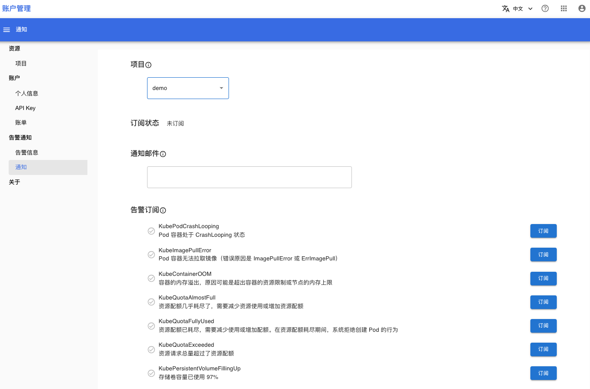

# 告警通知

当集群出现异常情况时，Tensorstack AI 平台会产生告警信息。通过告警信息，用户可以及时发现、处理问题。

有两种查看告警信息的方法：
* 在 Tensorstack Web UI 查看告警信息
* 通过邮件接收告警信息：提前在 Tensorstack Web UI 订阅某些告警信息，当产生这些告警信息时，系统会将告警信息发送到你的订阅邮件

下面是查看告警信息的页面：

<figure class="screenshot">
  
</figure>

下面是订阅告警信息的页面：

<figure class="screenshot">
  
</figure>

## 告警信息列表

系统可以产生下列告警信息

### Pod 相关

* KubePodCrashLooping：Pod container 处于 CrashLooping 状态。
* KubeImagePullError：Pod 容器无法拉取镜像（错误原因是 ImagePullError 或 ErrImagePull）
* KubeContainerOOM：容器的内存溢出，原因可能是超出容器的资源限制或节点的内存上限

### 资源配额相关

* KubeQuotaAlmostFull：资源配额几乎耗尽了，需要减少资源使用或增加资源配额
* KubeQuotaFullyUsed：资源配额已耗尽，需要减少使用或增加配额。在资源配额耗尽期间，系统拒绝创建 Pod 的行为
* KubeQuotaExceeded：资源请求总量超过了资源配额

### 存储相关

KubePersistentVolumeFillingUp：PersistentVolume 存储空间已使用 97%。

### T9k 工作负载相关

* T9kMLServiceNotReady：未处于暂停状态的 MLService 超过 15 分钟还未就绪
* T9kSimpleMLServiceNotReady：SimpleMLService 超过 15 分钟还未就绪
* T9kJobFailed：Job 运行失败。
* T9kNotebookNotReady：未处于暂停状态的 Notebook 超过 15 分钟还未就绪
* T9kTensorBoardNotReady：未处于暂停状态的 TensorBoard 超过 15 分钟还未就绪

## 项目权限

用户只能查看、订阅他有权访问的项目中的告警信息。

## 下一步

* 学习如何[查看告警信息](../../tasks/useralerts-check.md)
* 学习如何[订阅告警信息](../../tasks/useralerts-subscription.md)
