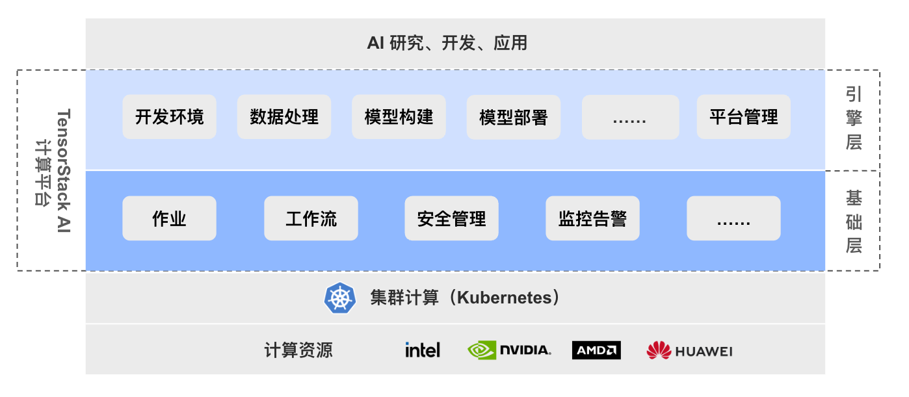
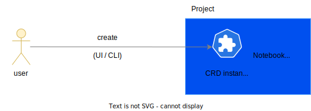

# 概述

## 产品介绍

“TensorStack AI 计算平台” 是面向 AI 集群的系统软件，针对 AI 集群的硬件架构和 AI 领域的计算任务的特性和需求，提供稳定、可扩展的 AI 技术平台能力，服务 AI 技术研发和规模化落地。

AI 集群的拥有者可以使用这套软件，构建自己的 “AI 私有云” 或 “AI 混合云” 基础设施服务。

<aside class="note info">
<div class="title">“TensorStack AI 计算平台” 的功能</div>

作为基础设施软件，平台提供两方面的能力：

1. **计算服务**：针对 AI 集群使用者，向上支持各种 AI 计算场景，例如：云端开发环境、模型训练、部署推理服务、应用开发等；
1. **集群管理**：针对 AI 集群的管理、运维人员，提供方便的机制，实施各种资源、安全、数据等管理策略。

</aside>

通过先进的架构和丰富的 API + 系统服务，“TensorStack AI 计算平台” 合理地隐藏了分布式并行、异构计算、加速计算等技术的复杂细节，提高了抽象层次，并为 AI 领域的各种计算提供了针对性的支持，极大地提升了 AI 技术研究、开发、应用的工作效率。

<figure class="architecture">
  
  <figcaption>图 1：TensorStack AI 计算平台采用云原生架构，由 AI 引擎层（AI Engine, AIE）和 AI 基础层（AI Base, AIB）组成，为上层 AI 应用和底层 AI 算力建立有机连接，提供先进、可扩展的 AI 系统层面的能力。</figcaption>
</figure>

## 基本流程

用户使用 “TensorStack AI 计算平台” 的基本交互流程：

1. 管理员 - 创建 - [项目（Project）](./modules/security/project.md)并设定项目管理员。用户以项目管理员或者普通成员的方式使用项目，用户可以同时使用多个项目。
1. 管理员 - 创建 - [用户帐户](./modules/security/account.md)。
1. 用户 - 使用其帐户 - 登录系统。
1. 用户 - 在项目中 - 完成工作（创建各种计算任务）。

<figure class="architecture">
  
  <figcaption>图 2：用户登陆系统后在 “项目” 中创建计算任务以完成各种工作。</figcaption>
</figure>


## 使用功能

用户通过创建各种类型 <a target="_blank" rel="noopener noreferrer" href="https://kubernetes.io/docs/concepts/extend-kubernetes/api-extension/custom-resources/">CRD</a> 的实例（instance）使用产品的功能。例如：

- 创建一个 `Notebook` CRD 的实例，以使用 Jupyter Notebook；
- 为了使用 DeepSpeed 进行大规模并行的 LLM 预训练，创建一个 `DeepSpeedJob` CRD 的实例；
- 为了部署一个模型推理服务，并支持服务规模的自动伸缩，创建一个 `MLService` CRD 的实例；

<figure class="architecture">
  
  <figcaption>图 3：用户可以通过命令行接口（CLI） 或者可视化的 Web 页面（UI） 创建这些 CRD 的实例。</figcaption>
</figure>

<aside class="note info">
<div class="title">TensorStack 通过 CRD 提供系统功能</div>

平台目前提供了 ～30 个 CRD，以支持各种 AI 计算场景。用户可通过下列命令查看集群中部署的 TensorStack CRD：

```bash
kubectl api-resources |grep tensorstack
```
</aside>

### CLI

CRD 实例（instance）的创建总是可以通过命令行实现，例如使用 `kubectl` 可以方便的创建一个 Notebook：

```bash
# create a notebook
kubectle create -f notebook-tutorial.yaml 
```

<details><summary><code class="hljs">notebook-tutorial.yaml</code></summary>

```yaml
{{ #include ./assets/overview/notebook-tutorial.yaml }}
```

</details>

### UI

对于很多 CRD，TensorStack 的 Web 控制台（console）提供了通过表单（form）创建其实例的方式。

例如，可使用如下表单创建 Notebook 实例：

<figure class="screenshot">
  
  <figcaption>图 4：使用 UI 创建 Notebook。 </figcaption>
</figure>


## 下一步

- 跟从[快速开始](./get-started/index.md)的内容，快速完成基本的体验。
- 阅读 [AI 开发和应用](./modules/building/index.md)章节，以学习 AI 开发相关的概念。
- 阅读[背景](./background.md)，了解产品的技术架构和设计思路等。
