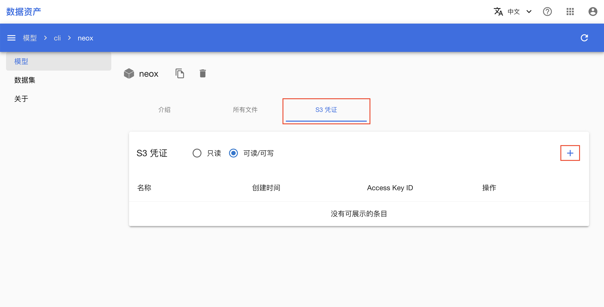
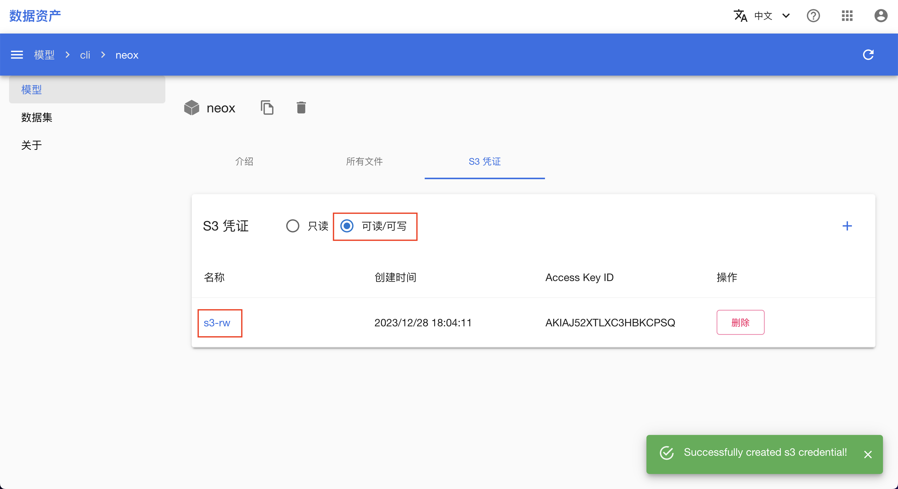
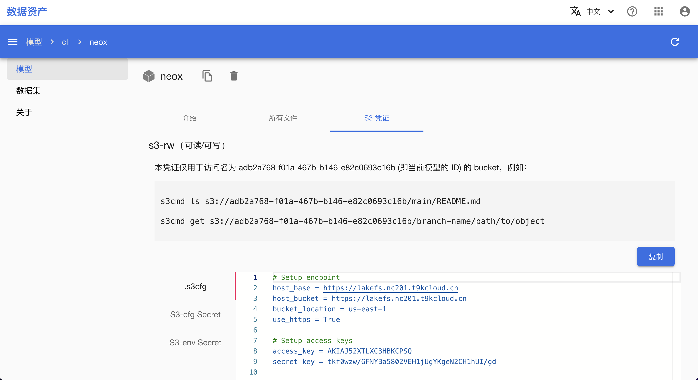
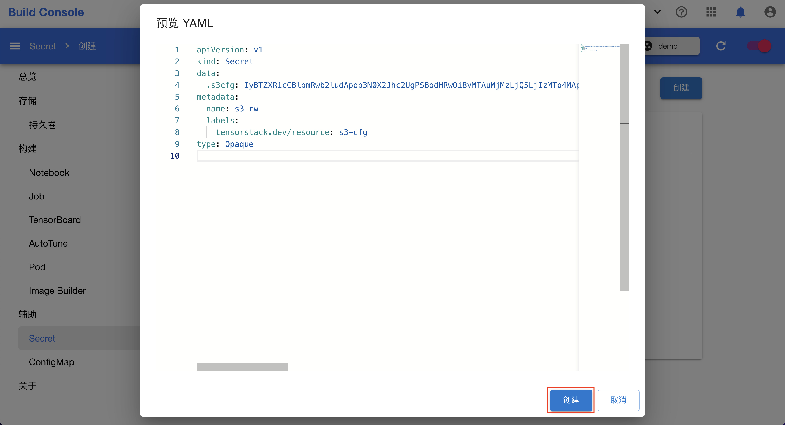
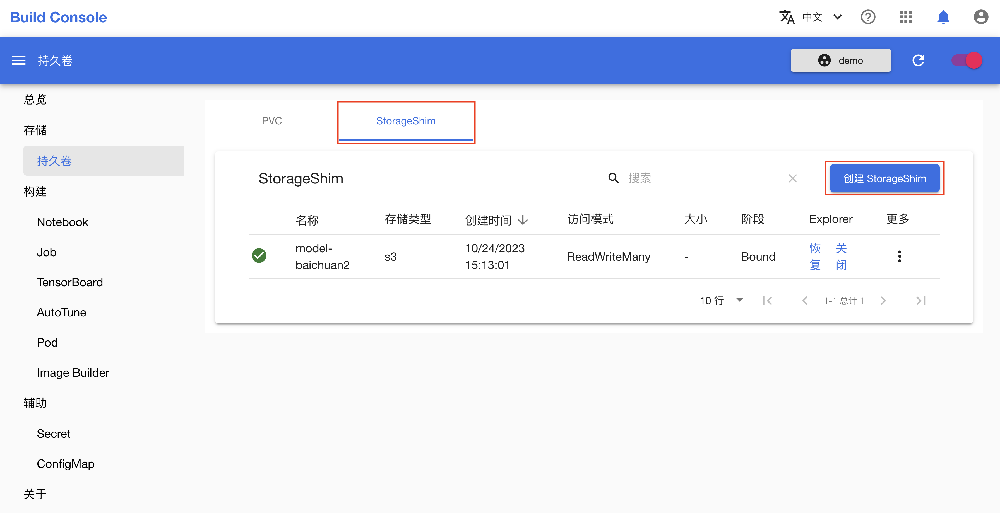
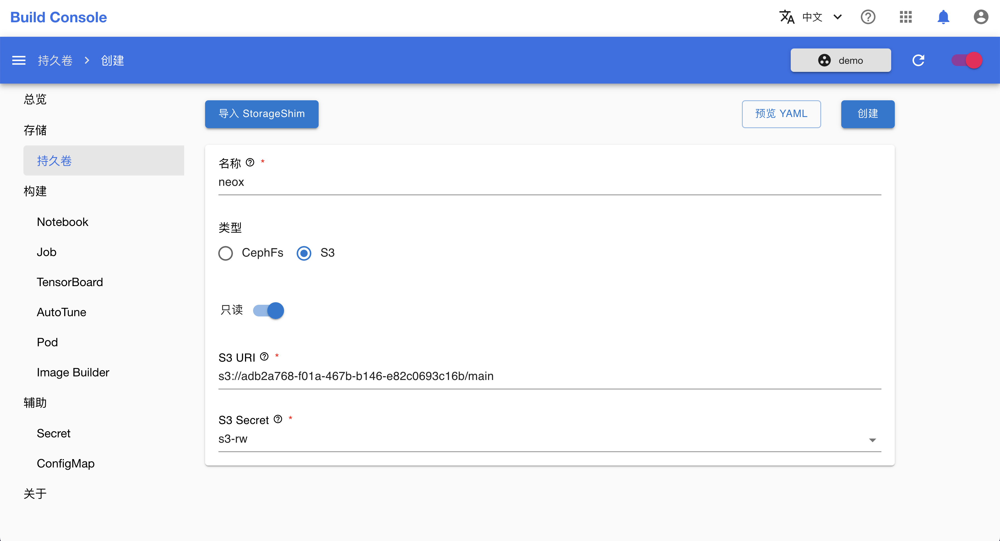

# 通过 S3 访问模型和数据集

本教程演示如何 S3 访问模型。

数据集同理。

## 准备工作

* 完成教程[操作文件夹、模型和数据集](./manipulate-folder-asset.md)。

## 创建 S3 凭证

在 AssetHub 控制台进入模型详情页面，点击 **S3 凭证**可以查看目前已有的所有 S3 凭证。然后点击表格右上角的 **+** 创建一个 S3 凭证：

<figure class="screenshot">
  
</figure>

填写名称 `s3-rw`，选择类型为**可读/可写**，最后点击**创建**：

<figure class="screenshot">
  
</figure>

## 查看 S3 凭证

创建完成后，点击表格左上角的**可读/可写**，查看所有类型为可读/可写的 S3 凭证：

<figure class="screenshot">
  
</figure>

点击刚刚创建的 S3 凭证 `s3-rw`，查看其详情：

<figure class="screenshot">
  
</figure>

S3 凭证有三种格式：

1. `.s3cfg`：命令行工具 s3cmd 的配置文件。
2. `S3-cfg Secret`：s3cfg 形式的 Secret YAML，创建后可在 Notebook、Job、Workflow 等工作负载时挂载此 Secret。
3. `S3-env Secret`：s3 环境变量形式的 Secret YAML，创建后可在 Notebook、Job、Workflow 等工作负载时挂载此 Secret。

## 通过 s3cmd 访问模型

点击右侧的**复制**，复制 `.s3cfg` 格式的 S3 凭证，保存在 `$HOME/.s3cfg` 文件中，即可通过 s3cmd 命令行工具访问此模型中的文件。

<aside class="note info">
<div class="title">如何安装 s3cmd 命令行工具？</div>

根据操作系统的不同，分别通过以下命令安装 s3cmd 命令行工具：

```bash
# macOS
brew install s3cmd

# Linux
apt install s3cmd

# Windows
pip install s3cmd
```

</aside>

例如，在上述示例中，所创建的 S3 凭证 `s3-rw` 仅可用于访问名为 `neox` 的模型。根据页面上的提示，此模型对应的 bucket 名称为 `adb2a768-f01a-467b-b146-e82c0693c16b`，用户可以通过以下命令查看此模型的 `main` 分支的 `README.md` 文件：

```bash
s3cmd ls s3://baa98ded-2f93-4e9b-835a-6515a63a6eb4/main/README.md
```

通过以下命令下载此模型的某个分支下某个路径的文件：

```bash
s3cmd get s3://baa98ded-2f93-4e9b-835a-6515a63a6eb4/branch-name/path/to/object
```

## 通过 StorageShim 访问模型

除了通过命令行工具访问，用户还可以创建一个 [StorageShim](./use-storageshim-s3.md)，将 S3 bucket 的某个子路径形式化为一个持久卷，以便在 Notebook、Job、Workflow 等工作负载中挂载，直接以文件系统的形式查看、编辑 S3 bucket 中的文件。

在创建 StorageShim 之前，用户首先需要创建一个 Secret 保存 S3 bucket 的相关信息。在 S3 凭证的详情页面，点击左侧的 **S3-cfg Secret** 标签，然后点击右上角的**复制**：

<figure class="screenshot">
  
</figure>

在模型构建控制台的左侧导航菜单中点击**辅助 > Secret** 进入 Secret 管理页面，然后点击右上角的**创建 Secret**进入 Secret 创建页面：

<figure class="screenshot">
  
</figure>

在 Secret 创建页面，点击**预览 YAML**，将所复制的 `S3-cfg Secret` 粘贴到 YAML 编辑框中，最后点击**创建**。

<figure class="screenshot">
  
</figure>

在模型构建控制台的左侧导航菜单中点击**存储 > 持久卷**进入持久卷管理页面，然后点击上方的 **S3** 进入 S3 类型的持久卷管理页面，最后点击右上角的**创建**进入 StorageShim 创建页面：

<figure class="screenshot">
  
</figure>

在 StorageShim 创建页面，

1. 名称填写 `neox`；
2. 类型选择 `S3`；
3. S3 URI 填写 `s3://adb2a768-f01a-467b-b146-e82c0693c16b/main`，以便把上述示例模型的 main 分支挂载为持久卷；
4. S3 Secret 选择刚刚创建的 `s3-rw`。

最后点击**创建**。

<figure class="screenshot">
  
</figure>

StorageShim 创建完成后，等待其阶段变为 **Bound**，用户即可通过以下方式使用这个名为 `neox` 的持久卷：

1. 点击**启动**，创建一个 Explorer 来浏览持久卷中的文件。
2. 在创建 Notebook 时，添加持久卷 `neox`，以便在 Notebook 中查看和编辑此模型中的文件。
3. 在创建 Job 时，添加持久卷 `neox`，以便在 Job 中使用此模型中的文件。

<figure class="screenshot">
  
</figure>
