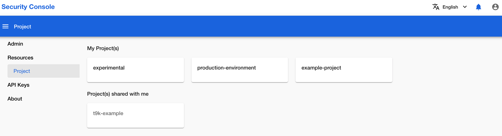
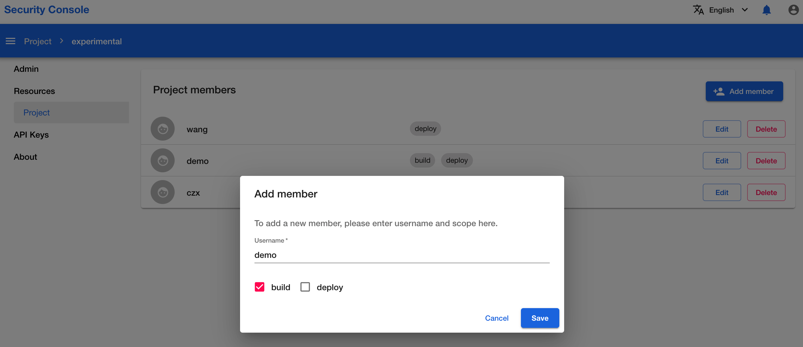

# 添加 Project 成员

本教程演示如何为一个 Project 添加成员。

## 准备工作

* 了解 [Project](../../module/security/index.md#project) 的基本概念。
* 成为一个 Project 的所有者（owner）。如果您不是任何一个 Project 的所有者（owner），请联系平台管理员为您创建一个 Project。

## 查看自己的 Project

在浏览器中进入安全控制台之后，点击左侧导航菜单的 **Projects** 进入 Project 列表页面。其中，**My Project(s)** 部分列出了所有您是所有者（owner）的 Project，**Project(s) shared with me** 部分列出了所有您是成员的 Project。

<figure class="screenshot">
  
</figure>

## 为一个 Project 添加用户

在 Project 列表页面的 **My Project(s)** 部分，点击其中一个 Project 的名称进入该 Project 的详情页面，这里展示了该 Project 的所有成员（您是该 Project 的所有者）。

<figure class="screenshot">
  
</figure>

点击右上角的 **Add member** 为该 Project 添加成员。在弹出的对话框中，您需要填写所要分享的成员名以及该成员可使用的范围（scope），填写完成之后点击 **Save** 保存更改，右下角会有悬浮框提示是否添加成功。

<figure class="screenshot">
  
</figure>
