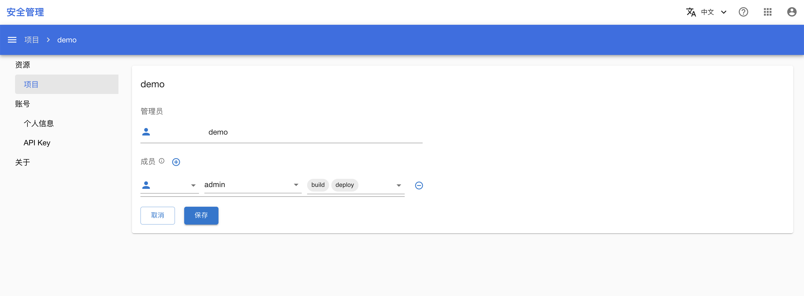

# 添加项目成员

本教程演示如何为一个项目添加成员。

## 准备工作

* 了解[项目](../modules/security/project.md)的基本概念。
* 成为一个项目的管理员。如果您不是任何一个项目的管理员，请联系平台管理员为您创建一个项目。

## 查看自己的项目

在浏览器中进入安全管理控制台之后，在左侧的导航菜单中点击**资源 > 项目**进入项目列表页面。其中，**我的项目**部分列出了所有您作为管理员的项目，**分享给我的项目**部分列出了所有您作为成员的项目。

<figure class="screenshot">
  
</figure>

## 为项目添加用户

在**我的项目**部分，点击其中一个项目的名称进入该项目的详情页面，这里展示了项目的所有成员（您是项目的管理员）。

<figure class="screenshot">
  
</figure>

点击成员右侧的**修改按钮**，再点击 **⊕** 为该项目添加成员。在弹出的对话框中，您需要填写所要添加的成员名以及该成员可使用的范围（scope），填写完成之后点击**保存**提交更改，右下角会有悬浮框提示是否添加成功。

<figure class="screenshot">
  
</figure>
