# 使用 AutoTune 进行超参数优化

本教程演示如何使用 [AutoTune](../modules/building/autotune.md) 对模型进行超参数优化（以 Keras 模型的单机训练为例）。

## 准备训练脚本

在开始超参数优化实验之前，你需要提前准备训练脚本。你可以使用模型构建控制台中的 Notebook 编辑训练脚本。

### 创建 PVC

参照[创建 PVC](./manage-pvc.md#创建-pvc) 教程创建名为 `autotune-mnist-keras`、大小为 1Gi 的 PVC。

### 创建 Notebook

从模型构建控制台进入 Notebook 列表，点击右上角的**创建 Notebook**。

<figure class="screenshot">
  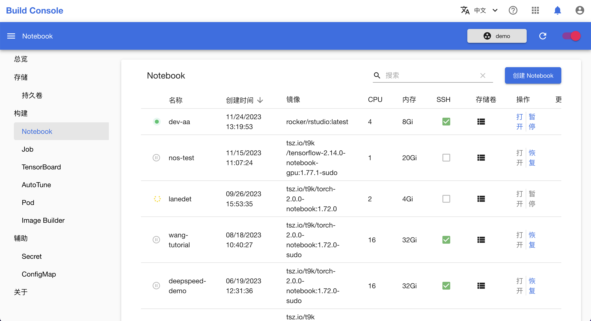
</figure>

创建 Notebook 时，在**存储卷**选择前面创建的 PVC 的名称 `autotune-mnist-keras`。

<figure class="screenshot">
  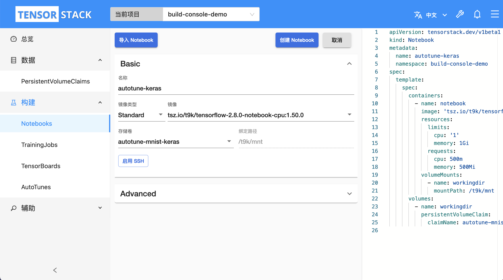
</figure>

创建完成之后，点击**打开**进入 Notebook。

<figure class="screenshot">
  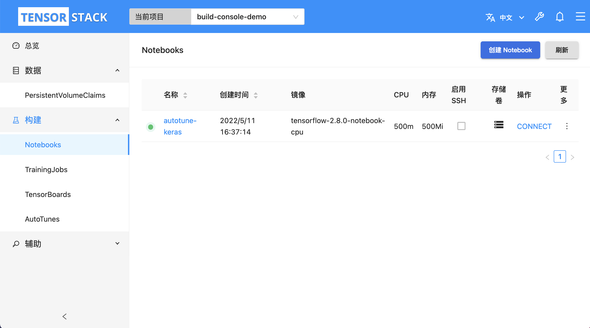
</figure>

### 在 Notebook 中编辑训练脚本

以下是一个 Keras 训练脚本，在此基础上做简单的修改以应用在 AutoTune 实验中。

```python
import argparse
import json
import logging
import os
import time

import tensorflow as tf
from tensorflow.keras import callbacks, datasets, layers, models, optimizers

parser = argparse.ArgumentParser(
    description='Distributed training of Keras model for MNIST with '
    'MultiWorkerMirroredStrategy.')
parser.add_argument('--log_dir',
                    type=str,
                    default=None,
                    help='Path of the TensorBoard log directory.')
parser.add_argument('--no_cuda',
                    action='store_true',
                    default=False,
                    help='Disable CUDA training.')
parser.add_argument('--save_path',
                    type=str,
                    default=None,
                    help='Save path of the trained model.')
args = parser.parse_args()
logger = logging.getLogger('print')
logger.setLevel(logging.INFO)
logger.addHandler(logging.StreamHandler())
logger.propagate = False

if args.no_cuda:
    tf.config.set_visible_devices([], 'GPU')
gpus = tf.config.get_visible_devices('GPU')
if gpus:
    # Print GPU info
    logger.info('NVIDIA_VISIBLE_DEVICES: {}'.format(
        os.getenv('NVIDIA_VISIBLE_DEVICES')))
    logger.info('T9K_GPU_PERCENT: {}'.format(os.getenv('T9K_GPU_PERCENT')))
    logger.info('Visible GPUs: {}'.format(
        tf.config.get_visible_devices('GPU')))
    # Set memory growth
    for gpu in gpus:
        tf.config.experimental.set_memory_growth(gpu, True)
    # # Set GPU memory limit
    # tf.config.set_logical_device_configuration(
    #     gpus[0], [tf.config.LogicalDeviceConfiguration(memory_limit=1024)])

strategy = tf.distribute.MultiWorkerMirroredStrategy()

# Get information for current worker.
tf_config = json.loads(os.environ['TF_CONFIG'])
world_size = len(tf_config['cluster']['worker'])
task_index = tf_config['task']['index']

params = {
    # Search space:
    # 'batch_size': ...
    # 'learning_rate': ...
    # 'conv_channels1': ...
    'epochs': 10,
    'conv_channels2': 64,
    'conv_channels3': 64,
    'conv_kernel_size': 3,
    'maxpool_size': 2,
    'linear_features1': 64,
    'seed': 1,
}

with strategy.scope():
    model = models.Sequential([
        layers.Conv2D(params['conv_channels1'],
                      params['conv_kernel_size'],
                      activation='relu',
                      input_shape=(28, 28, 1)),
        layers.MaxPooling2D((params['maxpool_size'], params['maxpool_size'])),
        layers.Conv2D(params['conv_channels2'],
                      params['conv_kernel_size'],
                      activation='relu'),
        layers.MaxPooling2D((params['maxpool_size'], params['maxpool_size'])),
        layers.Conv2D(params['conv_channels3'],
                      params['conv_kernel_size'],
                      activation='relu'),
        layers.Flatten(),
        layers.Dense(params['linear_features1'], activation='relu'),
        layers.Dense(10, activation='softmax'),
    ])
    model.compile(
        optimizer=optimizers.Adam(learning_rate=params['learning_rate']),
        loss='sparse_categorical_crossentropy',
        metrics=['accuracy'])

(train_images, train_labels), (test_images,
                               test_labels) = datasets.mnist.load_data(
                                   path=os.path.join(os.getcwd(), 'mnist.npz'))
train_images = train_images.reshape((60000, 28, 28, 1)).astype("float32") / 255
test_images = test_images.reshape((10000, 28, 28, 1)).astype("float32") / 255
train_images, val_images = train_images[:48000], train_images[48000:]
train_labels, val_labels = train_labels[:48000], train_labels[48000:]
train_dataset = tf.data.Dataset.from_tensor_slices(
    (train_images, train_labels)).shuffle(
        48000, seed=params['seed']).repeat().batch(params['batch_size'])
val_dataset = tf.data.Dataset.from_tensor_slices(
    (val_images, val_labels)).batch(400)
test_dataset = tf.data.Dataset.from_tensor_slices(
    (test_images, test_labels)).batch(1000)

model.fit(train_images,
          train_labels,
          batch_size=params['batch_size'],
          epochs=params['epochs'],
          validation_split=0.2,
          verbose=2)

# TODO: Automatically save best n models.
# if args.save_path and task_index == 0:
#     t9k.autotune.utils.save_best_n_models(model, args.save_path)

model.evaluate(test_images, test_labels, callbacks=test_callbacks, verbose=2)

if task_index > 0:
    # wait a while for index 0
    time.sleep(1)
```

在上述脚本中导入 `t9k.tuner` 模块，在训练模型之前调用 `get_next_parameter()` 函数获取训练超参数，替换原来的参数。

```python
from t9k import tuner

def main():
    ...
    tuner_params = tuner.get_next_parameter()
    params.update(tuner_params)
    ...
```

在训练过程中，添加 `AutoTuneCallback` 上传实验指标。

```python
train_callbacks = []
test_callbacks = []

if task_index == 0:
    from t9k.tuner.keras import AutoTuneFitCallback, AutoTuneEvalCallback
    train_callbacks.append(AutoTuneFitCallback(metric='accuracy'))
    test_callbacks.append(AutoTuneEvalCallback(metric='accuracy'))
    if args.log_dir:
        tensorboard_callback = callbacks.TensorBoard(log_dir=args.log_dir)
        train_callbacks.append(tensorboard_callback)

```

如下为修改后的训练脚本：

```python
import argparse
import json
import logging
import os
import time

import tensorflow as tf
from tensorflow.keras import callbacks, datasets, layers, models, optimizers

from t9k import tuner

parser = argparse.ArgumentParser(
    description='Distributed training of Keras model for MNIST with '
    'MultiWorkerMirroredStrategy.')
parser.add_argument('--log_dir',
                    type=str,
                    default=None,
                    help='Path of the TensorBoard log directory.')
parser.add_argument('--no_cuda',
                    action='store_true',
                    default=False,
                    help='Disable CUDA training.')
parser.add_argument('--save_path',
                    type=str,
                    default=None,
                    help='Save path of the trained model.')
args = parser.parse_args()
logger = logging.getLogger('print')
logger.setLevel(logging.INFO)
logger.addHandler(logging.StreamHandler())
logger.propagate = False

if args.no_cuda:
    tf.config.set_visible_devices([], 'GPU')
gpus = tf.config.get_visible_devices('GPU')
if gpus:
    # Print GPU info
    logger.info('NVIDIA_VISIBLE_DEVICES: {}'.format(
        os.getenv('NVIDIA_VISIBLE_DEVICES')))
    logger.info('T9K_GPU_PERCENT: {}'.format(os.getenv('T9K_GPU_PERCENT')))
    logger.info('Visible GPUs: {}'.format(
        tf.config.get_visible_devices('GPU')))
    # Set memory growth
    for gpu in gpus:
        tf.config.experimental.set_memory_growth(gpu, True)
    # # Set GPU memory limit
    # tf.config.set_logical_device_configuration(
    #     gpus[0], [tf.config.LogicalDeviceConfiguration(memory_limit=1024)])

strategy = tf.distribute.MultiWorkerMirroredStrategy()

# Get information for current worker.
tf_config = json.loads(os.environ['TF_CONFIG'])
world_size = len(tf_config['cluster']['worker'])
task_index = tf_config['task']['index']

tuner_params = tuner.get_next_parameter()
params = {
    # Search space:
    # 'batch_size': ...
    # 'learning_rate': ...
    # 'conv_channels1': ...
    'epochs': 10,
    'conv_channels2': 64,
    'conv_channels3': 64,
    'conv_kernel_size': 3,
    'maxpool_size': 2,
    'linear_features1': 64,
    'seed': 1,
}
params.update(tuner_params)

with strategy.scope():
    model = models.Sequential([
        layers.Conv2D(params['conv_channels1'],
                      params['conv_kernel_size'],
                      activation='relu',
                      input_shape=(28, 28, 1)),
        layers.MaxPooling2D((params['maxpool_size'], params['maxpool_size'])),
        layers.Conv2D(params['conv_channels2'],
                      params['conv_kernel_size'],
                      activation='relu'),
        layers.MaxPooling2D((params['maxpool_size'], params['maxpool_size'])),
        layers.Conv2D(params['conv_channels3'],
                      params['conv_kernel_size'],
                      activation='relu'),
        layers.Flatten(),
        layers.Dense(params['linear_features1'], activation='relu'),
        layers.Dense(10, activation='softmax'),
    ])
    model.compile(
        optimizer=optimizers.Adam(learning_rate=params['learning_rate']),
        loss='sparse_categorical_crossentropy',
        metrics=['accuracy'])

(train_images, train_labels), (test_images,
                               test_labels) = datasets.mnist.load_data(
                                   path=os.path.join(os.getcwd(), 'mnist.npz'))
train_images = train_images.reshape((60000, 28, 28, 1)).astype("float32") / 255
test_images = test_images.reshape((10000, 28, 28, 1)).astype("float32") / 255
train_images, val_images = train_images[:48000], train_images[48000:]
train_labels, val_labels = train_labels[:48000], train_labels[48000:]
train_dataset = tf.data.Dataset.from_tensor_slices(
    (train_images, train_labels)).shuffle(
        48000, seed=params['seed']).repeat().batch(params['batch_size'])
val_dataset = tf.data.Dataset.from_tensor_slices(
    (val_images, val_labels)).batch(400)
test_dataset = tf.data.Dataset.from_tensor_slices(
    (test_images, test_labels)).batch(1000)

train_callbacks = []
test_callbacks = []

if task_index == 0:
    from t9k.tuner.keras import AutoTuneFitCallback, AutoTuneEvalCallback
    train_callbacks.append(AutoTuneFitCallback(metric='accuracy'))
    test_callbacks.append(AutoTuneEvalCallback(metric='accuracy'))
    if args.log_dir:
        tensorboard_callback = callbacks.TensorBoard(log_dir=args.log_dir)
        train_callbacks.append(tensorboard_callback)

model.fit(train_images,
          train_labels,
          batch_size=params['batch_size'],
          epochs=params['epochs'],
          validation_split=0.2,
          callbacks=train_callbacks,
          verbose=2)

# TODO: Automatically save best n models.
# if args.save_path and task_index == 0:
#     t9k.autotune.utils.save_best_n_models(model, args.save_path)

model.evaluate(test_images, test_labels, callbacks=test_callbacks, verbose=2)

if task_index > 0:
    # wait a while for index 0
    time.sleep(1)
```

在 Notebook 中创建文件 `main.py`，写入上述脚本并保存文件。

<figure class="screenshot">
  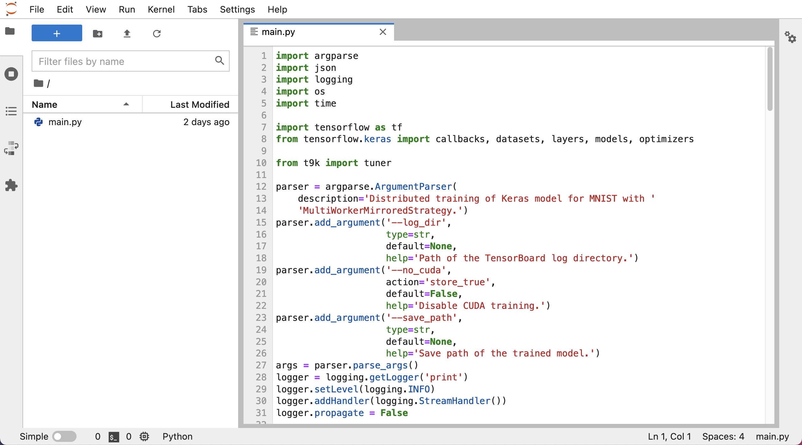
</figure>

创建 `download_dataset.py` 文件，写入并执行以下脚本来下载实验数据。

```python
import os
import tensorflow as tf

_, _ = tf.keras.datasets.mnist.load_data(os.path.join(os.getcwd(), 'mnist.npz'))
```

<figure class="screenshot">
  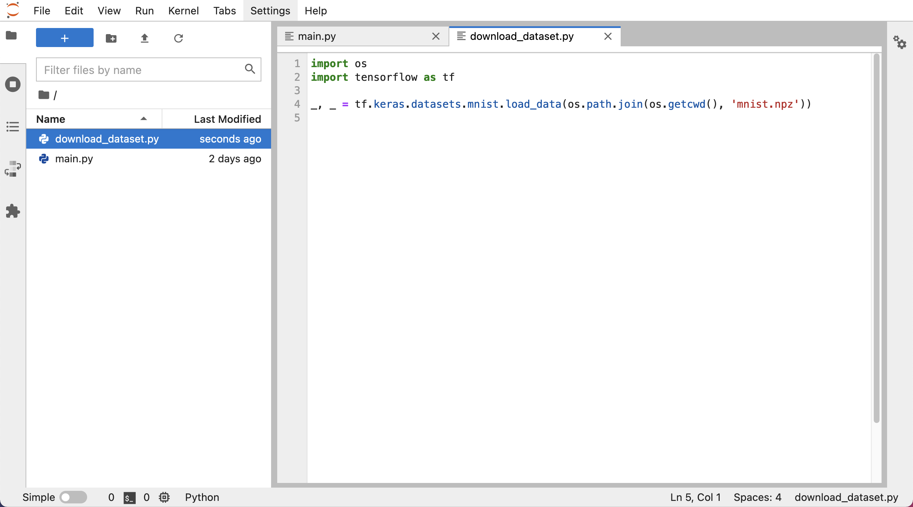
</figure>

<figure class="screenshot">
  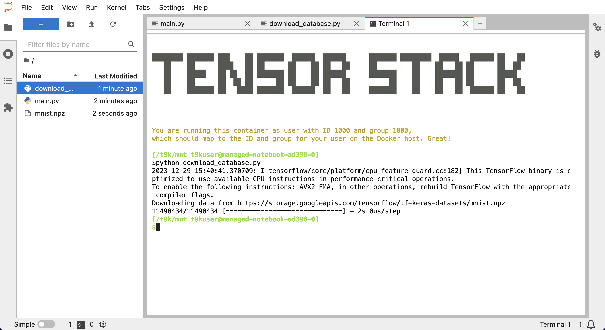
</figure>

## 准备数据库

你可以使用实验管理平台（以下称 EM）记录超参数调优实验中的超参数组合和训练结果。（如果你选择不使用 EM 持久记录 AutoTune 实验结果，请忽略这一步，并在开始实验时删掉 AutoTuneExperiment 的 `spec.aistore` 字段）

### 在实验管理控制台中新建文件夹

EM 的实验数据是以文件夹形式管理的，所以你首先需要在实验管理控制台点击右上角的 **+** 新建一个文件夹。

<figure class="screenshot">
  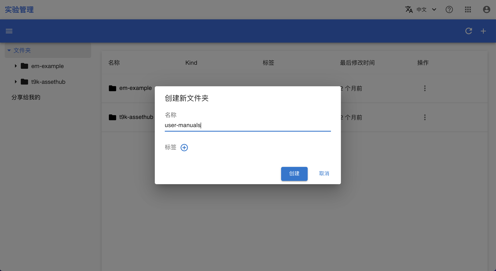
</figure>

进入文件夹，点击 **ID** 来复制该文件夹的 ID。

<figure class="screenshot">
  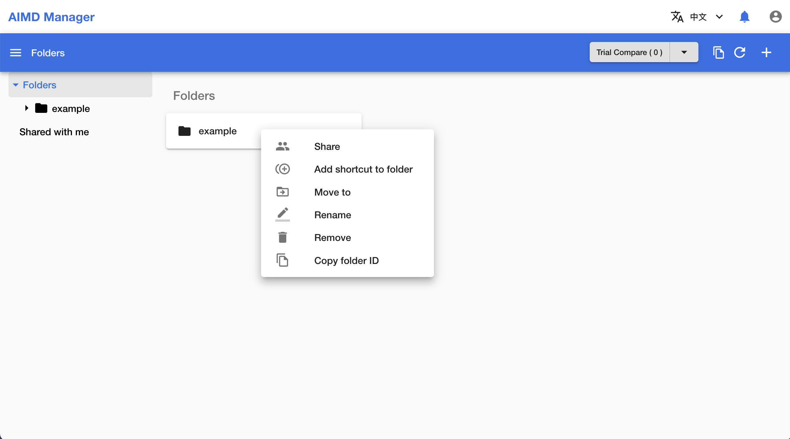
</figure>

<aside class="note info">
<div class="title">信息</div>

EM 的更详细信息请参阅[实验管理](../modules/experiment-management.md)。

</aside>

### 获得访问 EM 所需的 API Key

在超参数优化实验中，如果你希望使用 EM 来存储实验数据，需要生成一个具有访问 EM 文件夹权限的 API Key，你可以通过这个 API Key 上传实验数据。

<aside class="note info">
<div class="title">什么是 API Key</div>

请参阅 [API Key 介绍](../modules/account-and-security.md#api-key)。

</aside>

你需要按照[生成 API Key](./generate-api-key.md) 教程中的步骤，在安全控制台中生成一个 API Key，其中必须勾选 AIStore 选项。

<figure class="screenshot">
  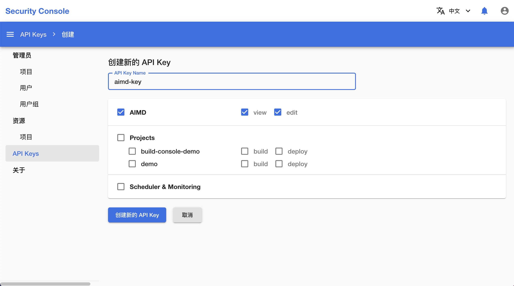
</figure>

生成 API Key 之后，点击**复制按钮**复制该 API Key。

<figure class="screenshot">
  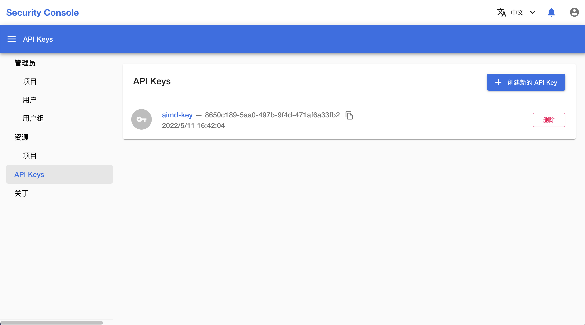
</figure>

然后，你需要按照[管理 Secret](./manage-secret.md) 教程中的步骤，在模型构建控制台中将所复制的 API Key 存入名为 `aistore` 的 Secret 中，以方便后续实验使用。

<figure class="screenshot">
  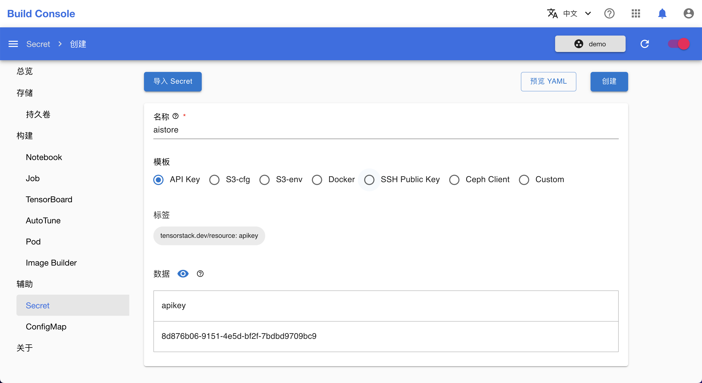
</figure>

## 开始实验

在模型构建控制台的 AutoTune 列表页面，点击右上角的**创建 AutoTuneExperiment** 进入 AutoTuneExperiment 创建页面。

<figure class="screenshot">
  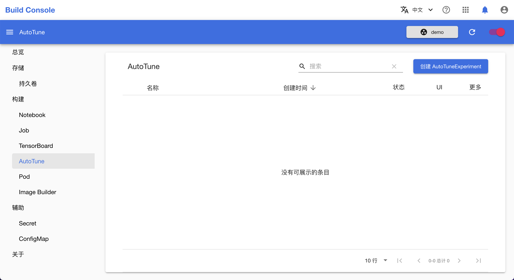
</figure>

在 AutoTuneExperiment 创建页面，点击**预览 YAML**，输入以下配置，点击**创建**：

```yaml
apiVersion: tensorstack.dev/v1beta1
kind: AutoTuneExperiment
metadata:
  name: autotune-mnist-keras
spec:
  maxExecSeconds: 3600
  maxTrialNum: 20
  trialConcurrency: 3
  storage: 100Mi
  aistore:
    secret: 'aistore'
    folder: 'b6c17378-965c-4467-9a43-eed65597f976'
  searchSpace: |-
    {
      "batch_size": {"_type": "choice", "_value": [16, 32, 64, 128]},
      "learning_rate": {"_type": "choice", "_value": [0.0001, 0.001, 0.01, 0.1]},
      "conv_channels1": {"_type": "choice", "_value": [16, 32, 64, 128]}
    }
  trainingConfig:
    type: tensorflow
    tasks:
      - type: worker
        replicas: 4
        template:
          spec:
            securityContext:
              runAsUser: 1000
            containers:
              - command:
                  - sh
                  - -c
                  - "python3 main.py --log_dir /mnt/log --no_cuda"
                workingDir: /mnt/
                imagePullPolicy: IfNotPresent
                image: t9kpublic/tensorflow-2.5.1:20220216
                name: tensorflow
                resources:
                  requests:
                    cpu: 2000m
                    memory: 2Gi
                  limits:
                    cpu: 4000m
                    memory: 4Gi
                volumeMounts:
                  - mountPath: /mnt
                    name: data
            volumes:
              - name: data
                persistentVolumeClaim:
                  claimName: autotune-mnist-keras
  tuner:
    builtinTunerName: TPE
    classArgs: |-
      {
        "optimize_mode": "maximize", 
        "constant_liar_type": "min"
      }
```

在此例中，实验绑定了准备过程中创建的名为 `autotune-mnist-keras` 的 PVC，其中存有在 Notebook 中编辑的训练脚本；使用了名为 `aistore` 的存有 API Key 的 Secret；填入了前面创建的 EM Folder 的 ID。

<figure class="screenshot">
  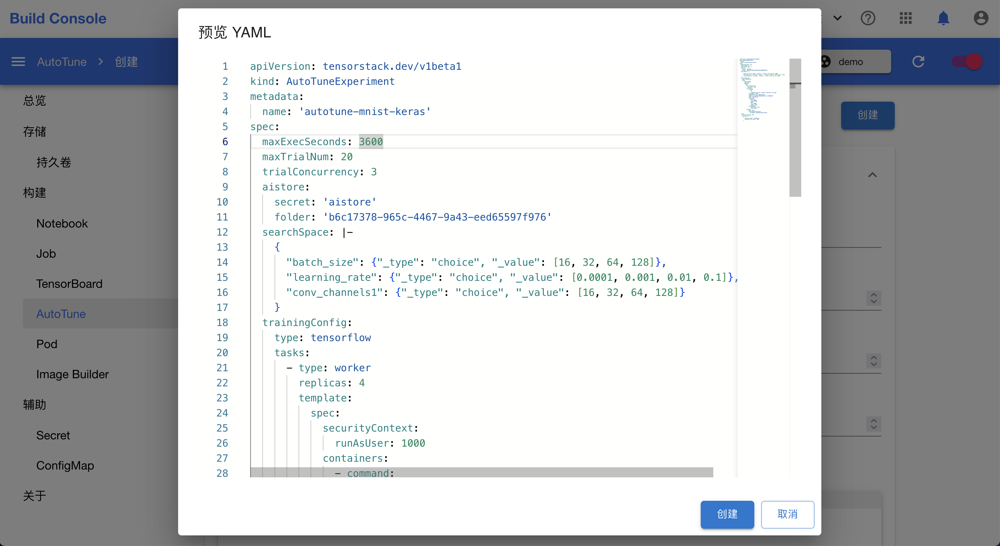
</figure>

## 查看实验

你可以在 AutoTune 列表页面看到已创建的 AutoTuneExperiment，点击**连接**进入实验详情页面。

<figure class="screenshot">
  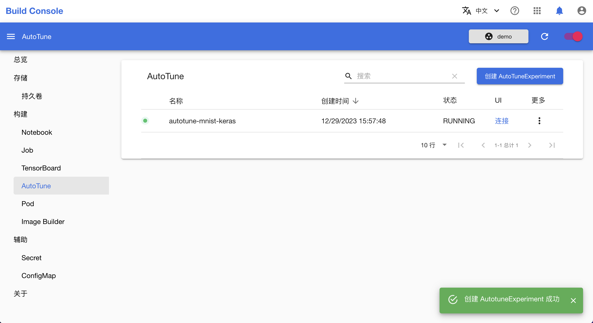
</figure>

下图为实验详情页面，你可以在该页面查看实验基本信息、各试验的参数与结果，以及查看试验之间的对比。

<figure class="screenshot">
  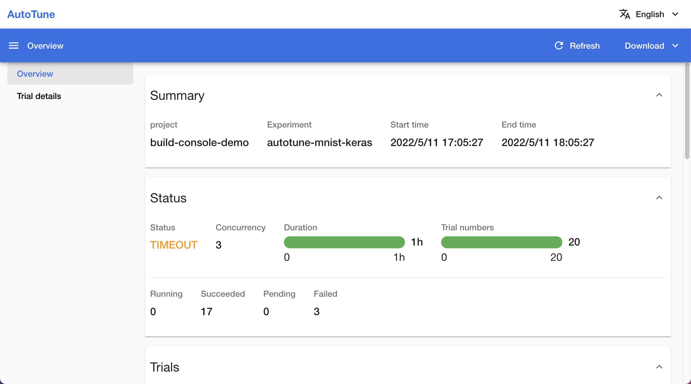
</figure>

<figure class="screenshot">
  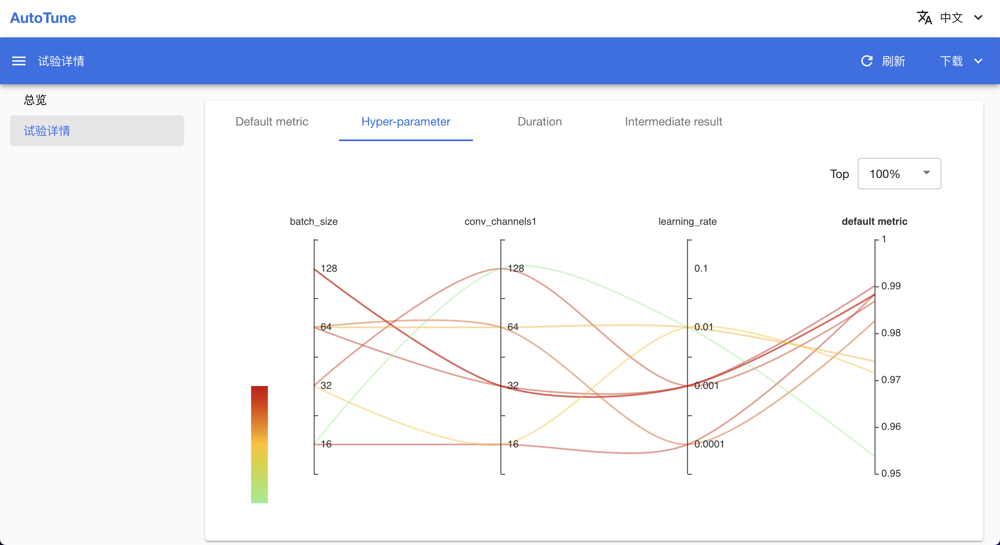
</figure>
