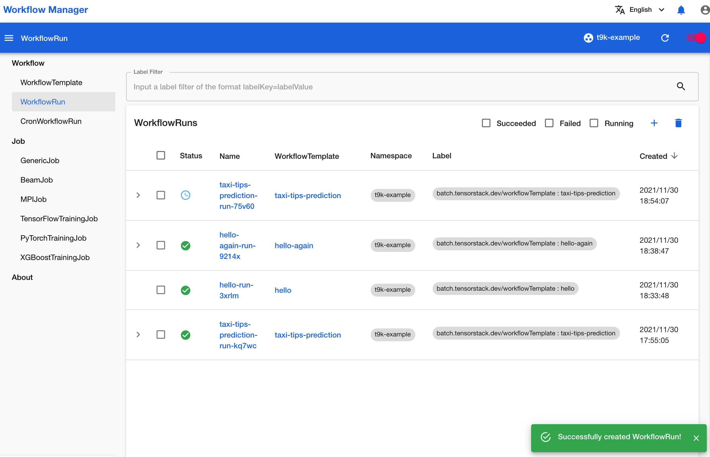
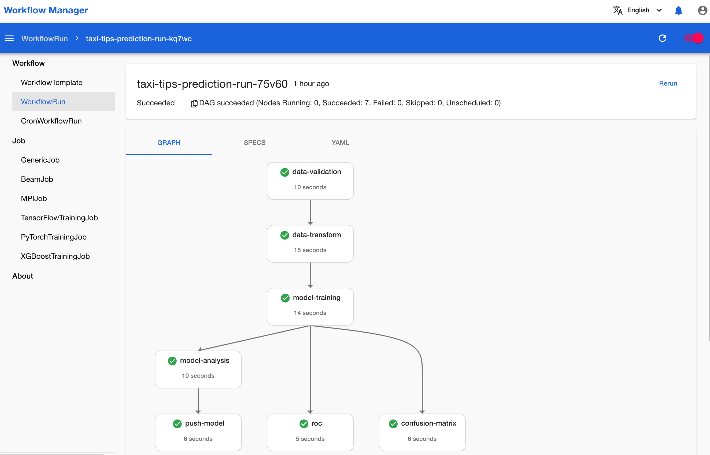

# 建立从数据采样到模型导出的自动化工作流

本教程演示如何建立一个端到端的机器学习工作流，包括数据预处理、模型训练、模型分析等步骤。本教程使用的机器学习应用样例是一个二分类问题，根据乘客搭乘出租车的位置、路程、用时等特征数据预测乘客是否会付小费。

## 准备工作

* 完成教程[创建存在依赖关系的工作流](./create-dependent-workflow.md)。
* 成为一个[项目](../modules/security/project.md)的管理员或[成员](./add-project-member.md)。

## 运行示例

请按照<a target="_blank" rel="noopener noreferrer" href="https://github.com/t9k/tutorial-examples/blob/master/docs/README-zh.md#%E4%BD%BF%E7%94%A8%E6%96%B9%E6%B3%95">使用方法</a>准备环境，然后前往<a target="_blank" rel="noopener noreferrer" href="https://github.com/t9k/tutorial-examples/tree/master/workflow/e2e-workflow">本教程对应的示例</a>，参照其 README 文档运行。

<aside class="note tip">

提示

上述操作使用 YAML 配置文件创建 WorkflowTemplate 及 WorkflowRun，你也可以在工作流控制台进行创建。

</aside>

## 查看运行结果

成功创建 WorkflowRun 之后，进入工作流控制台的 WorkflowRun 列表页面，可以看到名为 **taxi-tips-prediction-run-75v60** 的 WorkflowRun 正在运行：

<figure class="screenshot">
  
</figure>

点击**该名称** 进入详情页面，可以看到刚才创建的 WorkflowRun 的详细运行状态：

<figure class="screenshot">
  
</figure>

本页面会自动刷新以获取 WorkflowRun 的最新状态，你也可以点击右上角的**刷新图标**手动刷新。
