# 建立从数据采样到模型导出的自动化工作流

本教程演示如何建立一个端到端的机器学习工作流，包括数据预处理、模型训练、模型分析、模型上传等步骤。本教程使用的机器学习应用样例是一个二分类问题，根据乘客搭乘出租车的位置、路程、用时等特征数据预测乘客是否会付小费。

## 准备工作

* 完成教程[创建工作流的基本单元](./create-basic-unit-of-workflow.md)。
* 完成教程[创建存在依赖关系的工作流](./create-workflow-including-dependencies.md)。
* 了解 [TensorStack AI 平台的各个模块及其功能](../../product-introduction/overview.md)。
* 成为一个 [Project](../../module/security/index.md#project) 的所有者或成员。
* 下载样例代码和数据，并将所下载的压缩包解压到某个路径下。本教程将使用环境变量 `WORK_DIR` 代表该路径，即设定 `WORK_DIR=/path/to/taxi-tips-prediction`。

    [下载样例代码和数据](../assets/tasks/build-automatic-workflow/build-automatic-workflow-from-data-sampling-to-model-exporting/taxi-tips-prediction.zip){.md-button}

    `$WORK_DIR` 目录下的文件结构如下：

    * `./data` 目录下是用于训练、验证、测试的数据集。
    * `./src` 目录下是数据预处理、模型训练、模型分析、模型上传等每个步骤的 Python 代码，主要使用了 <a target="_blank" rel="noopener noreferrer" href="https://www.tensorflow.org/tfx">TFX 库</a>。
    * `./docker` 目录下是用于编译 Docker 镜像的 Dockerfile。
    * `./workflowtemplates` 目录下是用于创建 WorkflowTemplate 的 YAML 配置文件。在网页中创建 WorkflowTemplate 时，您可以将 YAML 配置文件的内容直接复制粘贴到网页中。


## 编译镜像

工作流在集群中运行时需要使用一些 Docker 镜像。我们已经在 Docker 仓库 `registry.tensorstack.cn` 中准备好了这些镜像，您可以通过以下命令进行验证：

```bash
docker pull registry.tensorstack.cn/t9k/tfx:prod-2.1.1
docker pull registry.tensorstack.cn/t9k/python:prod-3.6.10
docker pull registry.tensorstack.cn/t9k/build-sdk:latest
```

!!! question "如何在本地环境安装 Docker？"

    具体方法请参阅 <a target="_blank" rel="noopener noreferrer" href="https://docs.docker.com/get-docker/">Docker 官方文档</a>。

如果由于网络或其他原因无法获取上述镜像，您也可以使用 Dockerfile 来手动编译它们（`registry.tensorstack.cn/t9k/build-sdk:latest` 除外，我们将始终维护该镜像的最新版本）：

```bash
cd $WORK_DIR/docker

docker build -t registry.tensorstack.cn/t9k/tfx:prod-2.1.1 -f tfx.Dockerfile .
docker push registry.tensorstack.cn/t9k/tfx:prod-2.1.1

docker build -t registry.tensorstack.cn/t9k/python:prod-3.6.10 -f python3.Dockerfile .
docker push registry.tensorstack.cn/t9k/python:prod-3.6.10
```


## 上传代码和数据集

工作流在集群中运行时需要读取代码和数据集，因此我们需要新建一个 PVC 并将代码和数据集上传到 PVC 上。我们使用模型构建控制台中的 [Notebook 服务](../../module/building/notebook.md)来完成这个任务。

与[创建 Notebook](../develop-and-test-model/create-notebook.md) 教程中的步骤相同，进入模型构建控制台之后，选择一个 Project 并点击 **Enter** 进入该 Project 的主页面。

<figure class="screenshot">
  
</figure>

在 Project 主页面的左侧导航栏点击 **Build&nbsp;> Notebooks** 进入 Notebook 管理页面，点击右上角的 **Create Notebook** 进入 Notebook 创建页面。

<figure class="screenshot">
  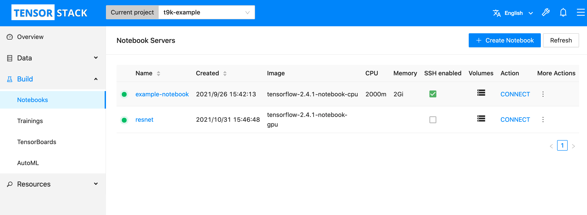
</figure>

在 Notebook 创建页面，填写 Notebook 的名称为 `taxi-tips-prediction`；**Workspace Volume** 选择 `New`，名称为 `taxi-tips-data`，**Size** 填 `1Gi` 即可。填写完成之后点击 **Create Notebook** 创建 Notebook，右下角会有悬浮框提示是否创建成功。

<figure class="screenshot">
  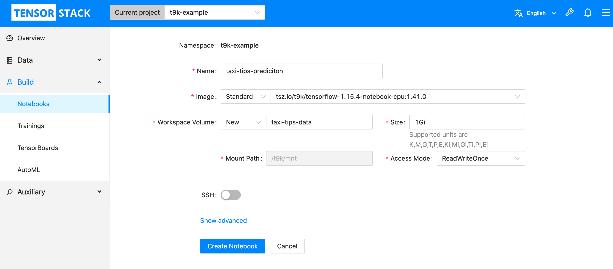
</figure>

回到 Notebook 管理页面，等待所创建的 Notebook 正常运行后（可点击右上角的 **Refresh** 刷新页面），点击 **CONNECT** 进入该 Notebook 的主页面。

<figure class="screenshot">
  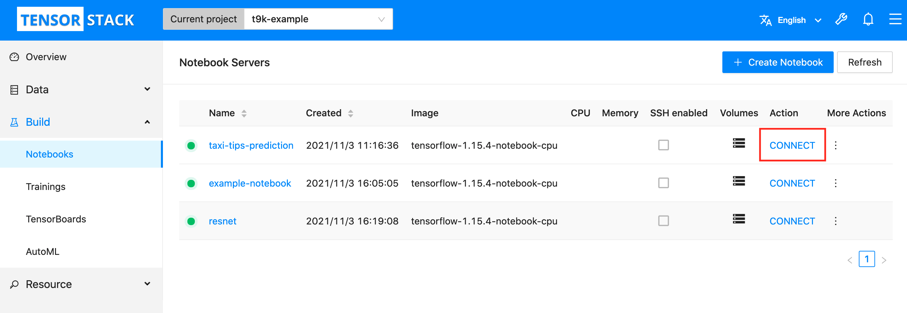
</figure>

点击左上角的 :material-upload:，将所下载的样例代码和数据压缩包上传到 PVC 中，然后点击右边的 **Terminal 方框**新建一个命令行终端。

<figure class="screenshot">
  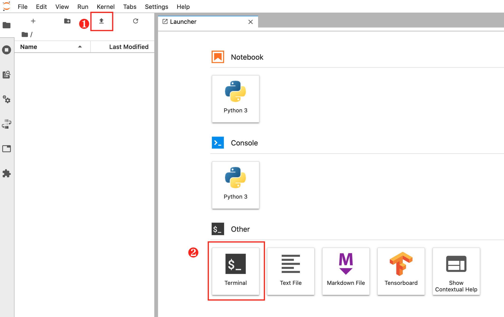
</figure>

在命令行终端中执行 `unzip ./taxi-tips-prediction.zip` 以解压上传的压缩包。

<figure class="screenshot">
  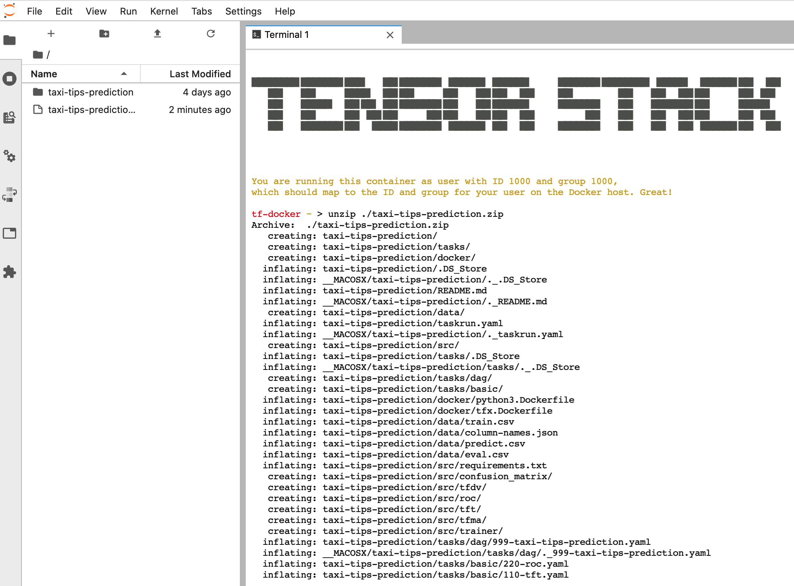
</figure>


## 创建用于模型上传的 Secret

工作流中包含将模型上传到模型管理服务的步骤，该步骤需要使用您在模型管理模块的用户名和密码，因此您需要先创建一个 Secret 存放您的用户名和密码。我们使用模型构建控制台来完成这个任务。

与上一步类似，在 Project 主页面的左侧导航栏点击 **Resources&nbsp;> Secrets** 进入 Secret 管理页面，然后点击右上角的 **Create Secret** 进入 Secret 创建页面。

<figure class="screenshot">
  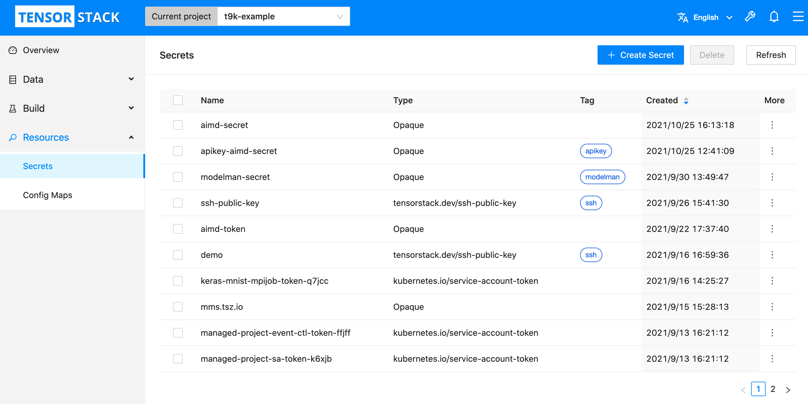
</figure>

在 Secret 创建页面，您需要填写 Secret 的名称、模型管理服务的域名、您的用户名、您在模型管理模块的密码，然后点击 **Create Secret** 创建该 Secret，右下角会有悬浮框提示是否创建成功。

<figure class="screenshot">
  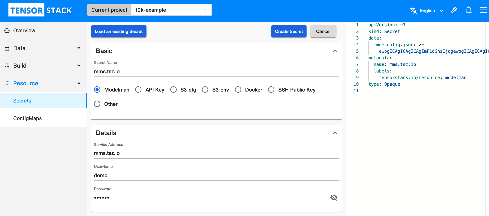
</figure>

!!! question "如何获取模型管理模块的密码？"

    此处的用户名与您登录其他 TensorStack 网页的用户名相同，但是密码需要在模型管理控制台获取。详见 [模型管理文档](../../module/model/index.md)。


## 创建 WorkflowTemplate

首先，您需要按照教程[创建工作流的基本单元](./create-basic-unit-of-workflow.md)中的步骤，创建 `$WORK_DIR/workflowtemplates/basic` 目录下的各个 WorkflowTemplate。为了简化操作，您可以将每个 WorkflowTemplate 对应的 YAML 配置文件的内容直接复制粘贴到创建 WorkflowTemplate 页面右侧的 YAML 编辑框中，然后点击 **Create WorkflowTemplate** 创建该 WorkflowTemplate。

<figure class="screenshot">
  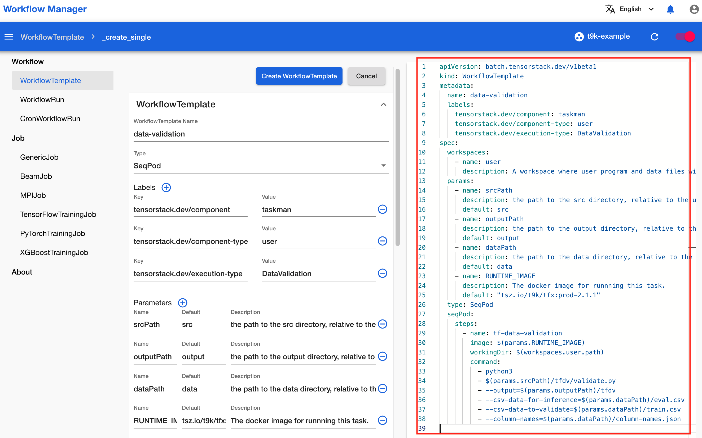
</figure>

然后，您需要按照教程[创建存在依赖关系的工作流](./create-workflow-including-dependencies.md)中的步骤，创建 `$WORK_DIR/workflowtemplates/dag` 目录下的 DAG WorkflowTemplate。同样，为了简化操作，您可以按照下面图示中的步骤，通过复制粘贴 DAG WorkflowTemplate 对应的 YAML 配置文件的内容来创建 DAG WorkflowTemplate。

<figure class="screenshot">
  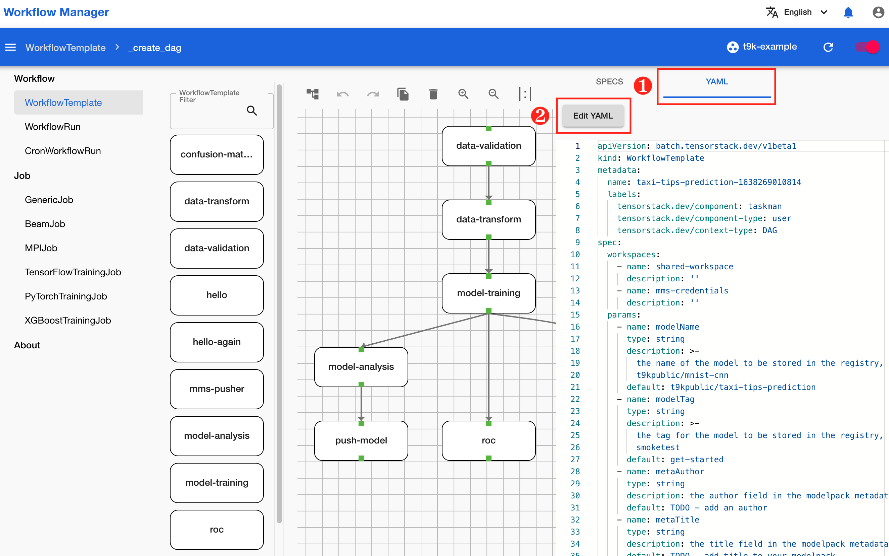
</figure>

<figure class="screenshot">
  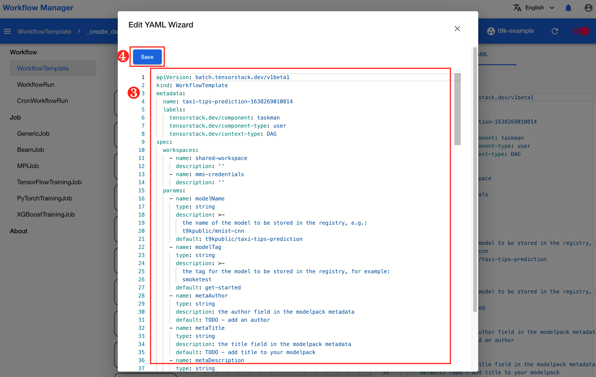
</figure>

<figure class="screenshot">
  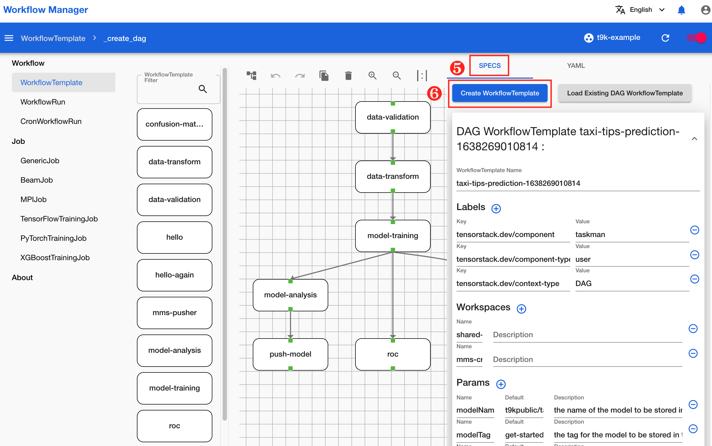
</figure>


## 创建 WorkflowRun

点击左侧导航栏的 **WorkflowRun** 进入 WorkflowRun 列表页面，点击列表右上角的 **+** 创建一个 WorkflowRun。

<figure class="screenshot">
  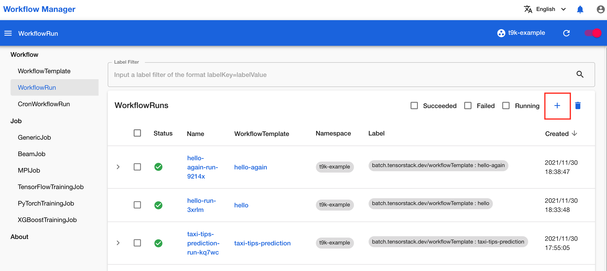
</figure>

在弹出的创建 WorkflowRun 对话框中，选择您刚才创建的 WorkflowTemplate `taxi-tips-prediction`，然后点击 **Next** 进入下一步。

<figure class="screenshot">
  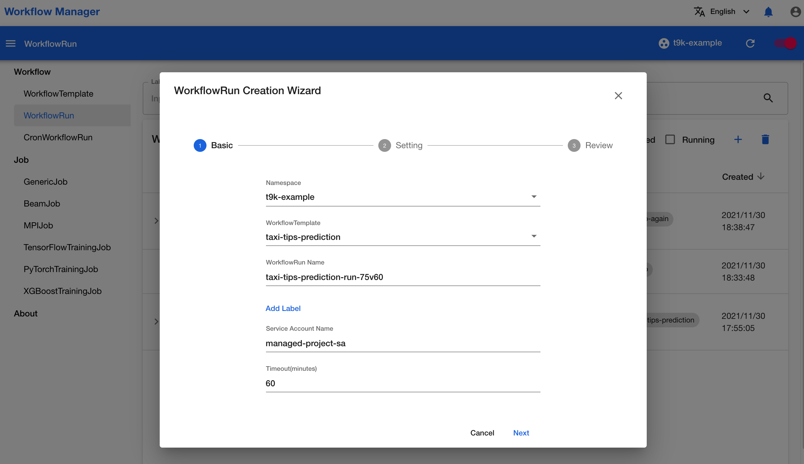
</figure>

在第二步中，填写 WorkflowTemplate `taxi-tips-prediction` 所需的各个参数和工作空间。其中：

* 参数（Parameters）均有默认值，您可以不必修改。
* 工作空间（Workspaces）中：
    * **shared-workspace** 填写[上传代码和数据集](#上传代码和数据集)步骤中创建的 PVC `taxi-tips-data`，并在 SubPath 栏填写 `taxi-tips-prediction`（即压缩包解压后的文件夹名称）。
    * **mms-credentials** 填写[创建用于模型上传的 Secret](#创建用于模型上传的-secret) 步骤中创建的 Secret。

填写完成之后，点击 **Next** 进入下一步。

<figure class="screenshot">
  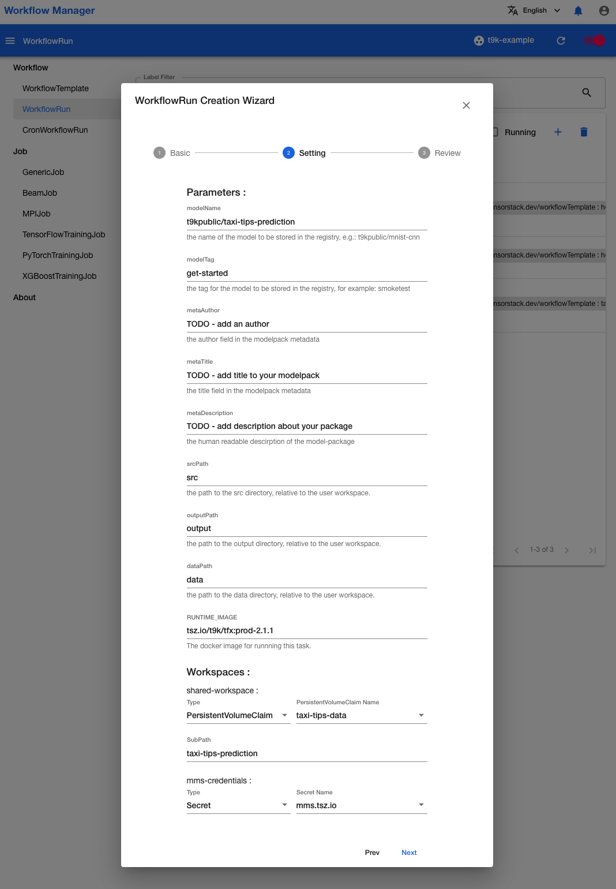
</figure>

在第三步中，检查您输入的信息是否有错误。如果没有，点击 **Create** 创建该 WorkflowRun，右下角会有悬浮框提示是否创建成功。

<figure class="screenshot">
  
</figure>

成功创建 WorkflowRun 之后会自动回到 WorkflowRun 列表页面，找到您刚才创建的 WorkflowRun “taxi-tips-prediction-run-75v60”，点击 WorkflowRun 的名称进入 WorkflowRun 的详情页面。

<figure class="screenshot">
  
</figure>

在 WorkflowRun 详情页面等待该 WorkflowRun 运行完毕。本页面会自动刷新以获取 WorkflowRun 的最新状态，您也可以点击右上角的 :material-reload: 手动刷新。

<figure class="screenshot">
  
</figure>
