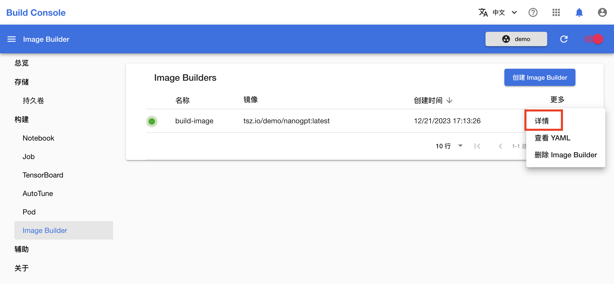
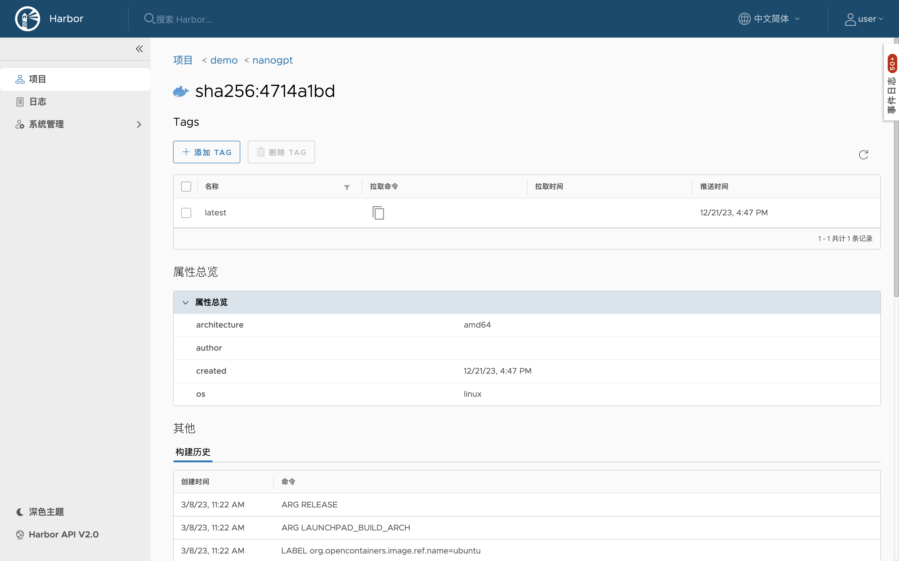

# 构建镜像

本教程演示如何在平台上构建自定义 Docker 镜像并推送到指定的 registry。

## 运行示例

请按照<a target="_blank" rel="noopener noreferrer" href="https://github.com/t9k/tutorial-examples/blob/master/docs/README-zh.md#%E4%BD%BF%E7%94%A8%E6%96%B9%E6%B3%95">使用方法</a>准备环境，然后前往<a target="_blank" rel="noopener noreferrer" href="https://github.com/t9k/tutorial-examples/tree/master/build-image/build-image-on-platform">本教程对应的示例</a>，参照其 README 文档运行。

<aside class="note tip">

提示

上述操作使用 YAML 配置文件创建 Secret 和 Image Builder，您也可以在模型构建控制台进行创建。

</aside>

其中，创建包含身份信息的 Secret 这一步骤也可以在模型构建控制台中通过创建 `Docker` 类型的 Secret 来完成，如下图所示。详情请参阅[创建 Secret](../../guide/manage-auxiliary-resources/manage-secret.md#创建-secret)。

## 检查构建进度和结果

在模型构建控制台的左侧导航菜单中点击**构建 > Image Builder**，然后点击刚创建的 Image Builder 右侧的**详情**，查看其详情和日志。拉取基础镜像、构建镜像和推送镜像都需要花费一定的时间，请耐心等待。

<figure class="screenshot">
  
</figure>

<figure class="screenshot">
  
</figure>

<figure class="screenshot">
  
</figure>

<aside class="note">

注意

拉取和推送较大的镜像可能会花费较长的时间，取决于具体的网络情况，在这一过程中可能出现网络断线导致工作流失败。

</aside>

一段时间后，构建完成的镜像被推送到相应的 registry 中。

<figure class="screenshot">
  
</figure>
