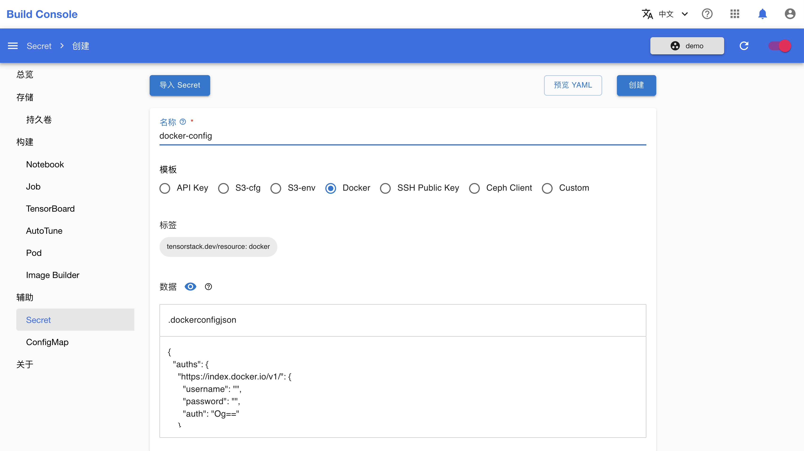

# 构建镜像

本教程演示如何在平台上构建容器镜像（container image）并推送到指定的容器镜像仓库（container registry）。

## 运行示例

请按照<a target="_blank" rel="noopener noreferrer" href="https://github.com/t9k/tutorial-examples/blob/master/docs/README-zh.md#%E4%BD%BF%E7%94%A8%E6%96%B9%E6%B3%95">使用方法</a>准备环境，然后前往<a target="_blank" rel="noopener noreferrer" href="https://github.com/t9k/tutorial-examples/tree/master/build-image/build-image-on-platform">本教程对应的示例</a>，参照其 README 文档运行。

<aside class="note tip">
<div class="title">提示</div>

上述操作使用 YAML 配置文件创建 Secret 和 Image Builder，你也可以在模型构建控制台进行创建。

</aside>

其中，创建包含身份信息的 Secret 这一步骤也可以在模型构建控制台中通过创建 `Docker` 类型的 Secret 来完成，如下图所示。详情请参阅[创建 Secret](../../guide/manage-auxiliary-resources/manage-secret.md#创建-secret)。

<figure class="screenshot">
  
</figure>

<aside class="note tip">
<div class="title">提示</div>

`auth` 字段中填写的内容应为 `[username]:[password]` 经过 Base64 编码后的字符串。

在已填写 `auth` 字段的情况下，可以删除 `username` 和 `password` 这两个字段，仍然能起到身份认证的作用。

</aside>

## 检查构建进度和结果

在模型构建控制台的左侧导航菜单中点击**构建 > Image Builder**，然后点击刚创建的 Image Builder 右侧的**详情**，查看其详情和日志。拉取基础镜像、构建镜像和推送镜像都需要花费一定的时间，请耐心等待。

<figure class="screenshot">
  
</figure>

<figure class="screenshot">
  
</figure>

<figure class="screenshot">
  
</figure>

<aside class="note">
<div class="title">注意</div>

拉取和推送较大的镜像可能会花费较长的时间，取决于具体的网络情况，在这一过程中可能出现网络断线导致工作流失败。

</aside>

一段时间后，构建完成的镜像被推送到相应的 registry 中。

<figure class="screenshot">
  
</figure>

## FAQs

### `Unpacking rootfs` 失败

使用 ImageBuilder 制作镜像时，有时会出现类似以下的错误：

```
INFO[0009] Unpacking rootfs as cmd RUN apt-get -qq update &&     apt-get -qq install --no-install-recommends -y curl requires it. 
error building image: error building stage: failed to get filesystem from image: stream error: stream ID 17; PROTOCOL_ERROR; received from peer
```

但是该错误信息并不准确，经分析，实际导致镜像 build 失败的可能原因是：镜像（Dockerfile 中 FROM 语句所引用的镜像）提取失败。

提取失败可能有以下原因：
- 镜像来源于无法访问或下载速度过慢的仓库

解决方法：
1. 切换到服务质量更好的的 Registry，例如本地网络部署的私有化 Registry，或其它 caching Regisry。
2. 使用代理服务器，通过该代理下载镜像。


<aside class="note">
<div class="title">如何在 ImageBuilder 中使用代理服务器</div>

可提供设置环境变量指定代理服务器。下面的 YAML 示例中，通过设置 `HTTPS_PROXY` 和 `HTTP_PROXY` 指定代理服务器地址为 `http://proxy.example.com:8080`。

```yaml
apiVersion: tensorstack.dev/v1beta1
kind: ImageBuilder
metadata:
  name: build-image
spec:
  builder:
    kaniko: {}
  dockerConfig: {}
  tag: example.io/nanogpt:latest
  env:
  - name: HTTPS_PROXY
    value: http://proxy.example.com:8080
  - name: HTTP_PROXY
    value: http://proxy.example.com:8080
  workspace: {}
```

</aside>
