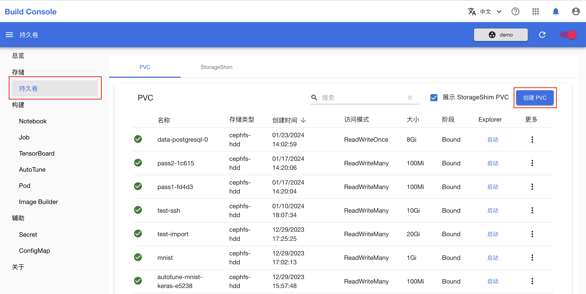
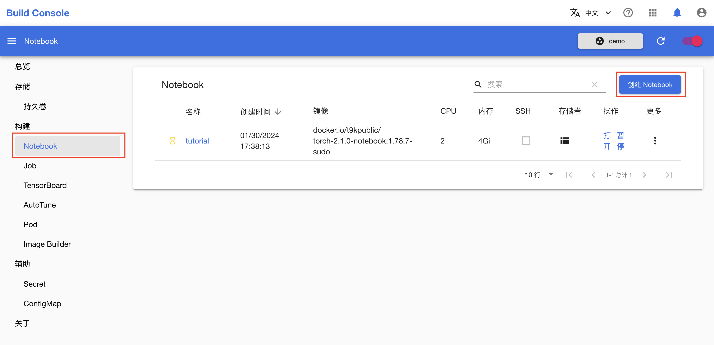
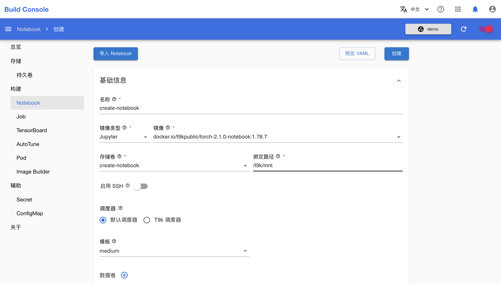
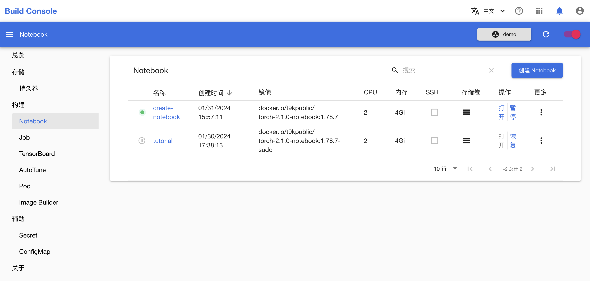
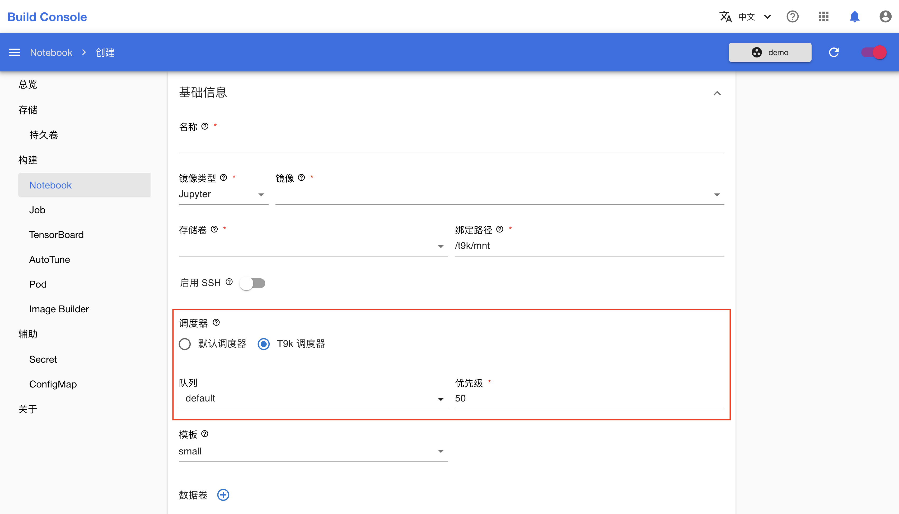
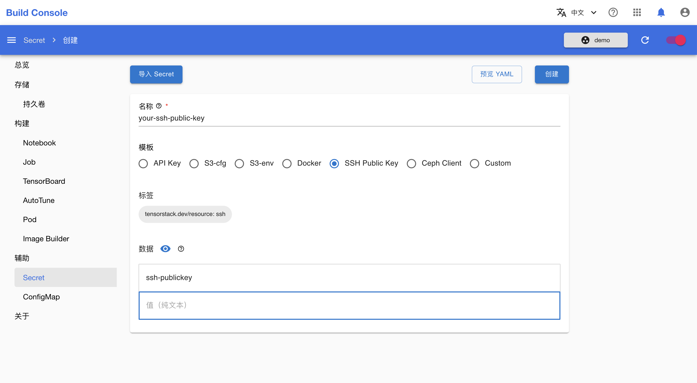
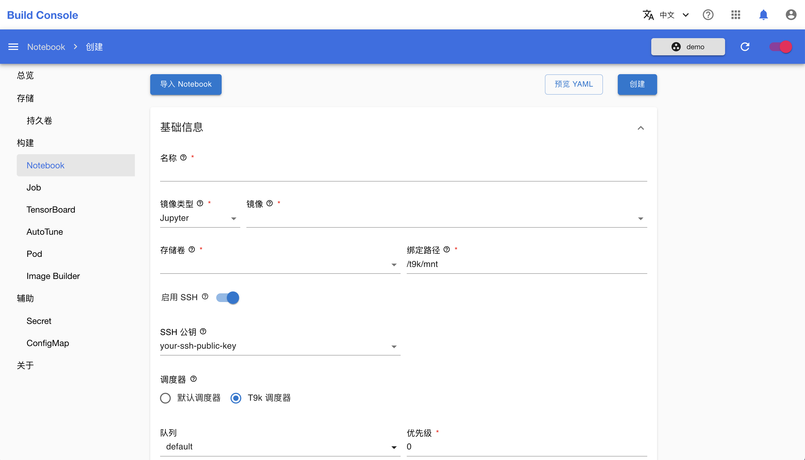

# 创建 Notebook

本教程演示如何创建 Notebook。

## 准备工作

* 了解 [Notebook](../modules/building/notebook.md) 的基本概念。
* 成为一个[项目](../modules/security/project.md)的管理员或[成员](./add-project-member.md)。

## 创建 PVC

创建 Notebook 时，需要至少绑定一个 PVC 来存储代码、数据等文件。如果你的项目中已有合适的持久卷，则可以直接进入下一节。

在模型构建控制台的左侧导航菜单中点击**存储 > 持久卷**进入 PVC 管理页面。然后点击右上角的**创建 PVC** 进入创建页面：

<figure class="screenshot">
  
</figure>

在 PVC 创建页面，**名称**填写 `create-notebook`，**存储**填写 `1Gi`，其他参数保持默认值，然后点击**创建**：

<figure class="screenshot">
  
</figure>

## 创建标准的 Notebook

在模型构建控制台的左侧导航菜单中点击**构建 > Notebook** 进入 Notebook 管理页面，然后点击右上角的**创建 Notebook** 进入创建页面：

<figure class="screenshot">
  
</figure>

在 Notebook 创建页面，如下填写各个参数：

* **名称**填写 `create-notebook`。
* **存储卷**选择上一节创建的 `create-notebook`（或其他合适的存储卷）。存储卷会被挂载到 Notebook 的 `/t9k/mnt` 目录下。
* **镜像**根据你想使用的机器学习框架（如 TensorFlow、PyTorch 等）及其版本选择一个标准 Notebook 镜像。
* **模版**根据你的资源需求选择一个合适大小的资源模版。

其他参数保持默认值，完成之后，点击**创建**：

<figure class="screenshot">
  
</figure>

<aside class="note info">

信息

标准 Notebook 镜像的默认用户是 `t9kuser`，其主目录（home directory）是 `/t9k/mnt`。

</aside>

回到 Notebook 管理页面查看新创建的 Notebook：

<figure class="screenshot">
  
</figure>

<aside class="note info">

Notebook 启动延迟

如果 Notebook 被分配到的节点中已经有了对应的 Notebook 镜像，那么 Notebook 通常能在几秒内启动就绪；否则，根据网络情况，可能需要几分钟甚至更长时间来拉取镜像，启动将被大大延迟。

</aside>

Notebook 就绪后，就可以[使用 Notebook](./use-notebook.md)。

## 其他配置

### 使用 T9k 调度器

[计算资源](../modules/computing-resources/index.md)模块还提供了选项，使用调度器 `t9k-scheduler`，以支持便捷的资源使用申请，使用 `t9k-scheduler` 调度任务时必须指定一个[队列](../modules/computing-resources/queue.md)。相比默认调度器，`t9k-scheduler` 需要额外填写如下参数：

* `队列 (queue)`：必填，选择一个队列（如果没有队列，请联系管理员创建一个队列）。
* `优先级 (priority)`：可选，默认值是 0。代表任务在队列内部的优先级。当发生资源抢占时，优先级数字较小的工作负载会比同一个队列中的其他负载优先被驱逐。

<figure class="screenshot">
  
</figure>

### 使用数据卷

可以为 Notebook 绑定额外的数据卷（存放数据的 PVC），如下图所示：

<figure class="screenshot">
  
</figure>

每绑定一个数据卷需要填写如下参数：

* `名称`：使用的 PVC 名称。
* `绑定路径`：将 PVC 绑定到 Notebook 的指定路径下。

在上图的示例中，我们将 PVC `examples` 绑定到了 Notebook 的 `/t9k/examples` 路径下。你可以在 Notebook 中通过对应路径访问 PVC 中的数据。

### 启用 SSH 选项

如果你想使用 SSH 连接到 Notebook 容器中来管理其中的文件，或者使用本地的 IDE 来编辑 Notebook 中的代码，**启用 SSH** 能够帮助你在 Notebook 中运行一个 SSH 服务。

Notebook 的 SSH 服务只允许通过密钥对进行验证，因此你需要上传公钥以使用 SSH 连接。TensorStack AI 平台使用 Secret 存储公钥信息。如果你已经创建了包含公钥的 Secret，则可以直接进入下一节。

在模型构建控制台的左侧导航菜单中点击**辅助 > Secret**，然后点击右上角的**创建 Secret** 进入的创建页面：

<figure class="screenshot">
  
</figure>

在 Secret 创建页面，选择类型为 **SSH Public Key**，填写名称和公钥内容。最后点击**创建 Secret** 进行创建：

<aside class="note info">

信息

如果你没有生成过密钥对，或者不知道从哪里获取公钥，那么你可以参阅 <a target="_blank" rel="noopener noreferrer" href="https://www.ssh.com/academy/ssh/keygen">SSH 文档</a>或者 <a target="_blank" rel="noopener noreferrer" href="https://learn.microsoft.com/zh-cn/windows-server/administration/openssh/openssh_keymanagement#user-key-generation">Windows 文档</a>。

</aside>

<figure class="screenshot">
  
</figure>

创建 Notebook 时，开启**启用 SSH** 按钮，然后选择前面创建的 Secret（此处为一个多选框，你可以同时设置多个 SSH 公钥）：

<figure class="screenshot">
  
</figure>

<aside class="note info">

信息

关于服务类型，详细的说明可以参阅 Kubernetes 官方文档<a target="_blank" rel="noopener noreferrer" href="https://kubernetes.io/zh-cn/docs/concepts/services-networking/service/#publishing-services-service-types">发布服务（服务类型）</a>。

</aside>

点击**创建**，等待运行之后，你可以[通过 SSH 连接远程使用 Notebook](./ssh-notebook.md)。
