# 创建执行各类任务的工作流单元

本教程演示如何创建执行各类任务的工作流单元。

## 准备工作

* 完成教程[创建工作流的基本单元](./create-workflow-unit.md)。
* 成为一个[项目](../modules/security/project.md)的管理员或[成员](./add-project-member.md)。

## 创建类型为 `Pod` 和 `SeqPod` 的 WorkflowTemplate

如 [WorkflowTemplate 介绍](../modules/workflows/workflowtemplate.md)中所述，`Pod` 和 `SeqPod` 类型的区别在于，`Pod` 中的所有容器是一起（近乎同时）开始运行的，而 `SeqPod` 中的每个步骤是按照定义的顺序依次执行的。如无特殊情况，我们一般使用 `SeqPod` 类型即可。以下均以 `SeqPod` 类型为基础进行讲解。

### 选择镜像

在教程[创建工作流的基本单元](./create-workflow-unit.md)中，我们已经完成了 `SeqPod` 类型的 WorkflowTemplate 的创建和运行。如教程中所述，在 `SeqPod` 的每个步骤（step）中，都要填写所使用的镜像。一般来说，镜像的来源可能有以下几种：

* TensorStack AI 平台预先提供的镜像：例如 [Notebook 镜像](../modules/building/notebook.md#预先编译好的镜像)，或者 <a target="_blank" rel="noopener noreferrer" href="https://registry.tensorstack.cn/">TensorStack 镜像站</a>中的任何镜像。
* 第三方镜像：例如来自 Docker 官方镜像站 <a target="_blank" rel="noopener noreferrer" href="https://hub.docker.com/">Docker Hub</a> 的镜像。
* 自制镜像：您可以利用 [TensorStack 命令行工具](../tools/cli-t9k/index.md)、<a target="_blank" rel="noopener noreferrer" href="https://docs.docker.com/engine/reference/commandline/cli/">Docker 命令行工具</a>自行编译镜像。

准备好镜像之后，在 **Image** 框中填入镜像的地址。

<figure class="screenshot">
  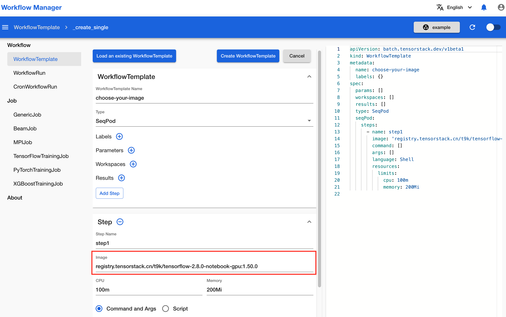
</figure>

### 执行 PVC 中的脚本

当您在 [Notebook](../modules/building/notebook.md) 中编写了一些 Python 脚本或 Shell 脚本后，您可以创建 WorkflowTemplate 以及对应的 WorkflowRun 来运行该脚本。只要 WorkflowRun 和 Notebook 绑定的是同一个 PVC，WorkflowRun 就能访问到您在 Notebook 中编写的脚本。

首先，在 Notebook 中编写想要运行的脚本，并 **Ctrl+S** 保存。

<figure class="screenshot">
  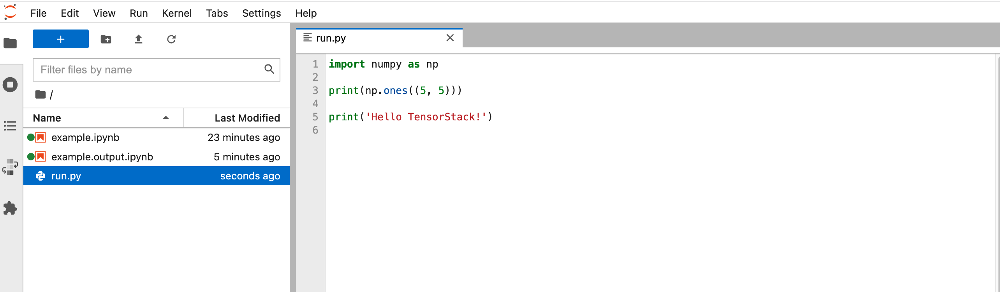
</figure>

查看 Notebook 所绑定的 PVC 名称，以便创建 WorkflowRun 时使用。

<figure class="screenshot">
  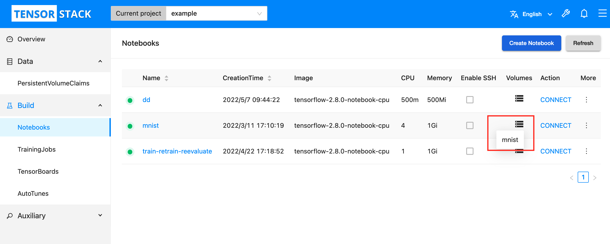
</figure>

按照下图所示填写表格，创建一个 `SeqPod` 类型的 WorkflowTemplate。

<figure class="screenshot">
  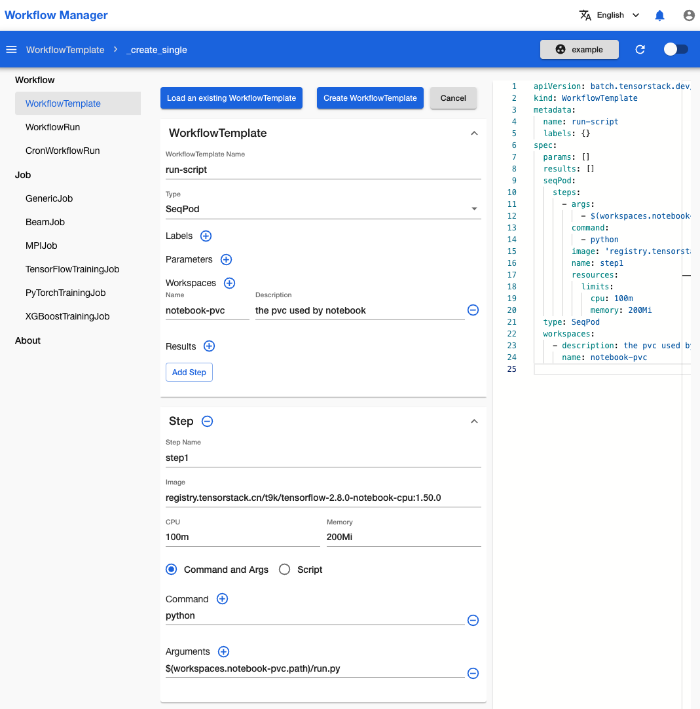
</figure>

或者，您也可以复制粘贴下面的 YAML 配置文件来创建 WorkflowTemplate：

```yaml
apiVersion: batch.tensorstack.dev/v1beta1
kind: WorkflowTemplate
metadata:
  name: run-script
  labels: {}
spec:
  params: []
  results: []
  seqPod:
    steps:
      - args:
          - $(workspaces.notebook-pvc.path)/run.py
        command:
          - python
        image: 'registry.tensorstack.cn/t9k/tensorflow-2.8.0-notebook-cpu:1.50.0'
        name: step1
        resources:
          limits:
            cpu: 100m
            memory: 200Mi
  type: SeqPod
  workspaces:
    - description: the pvc used by notebook
      name: notebook-pvc
```

然后，创建 WorkflowRun 来运行该 WorkflowTemplate。

<figure class="screenshot">
  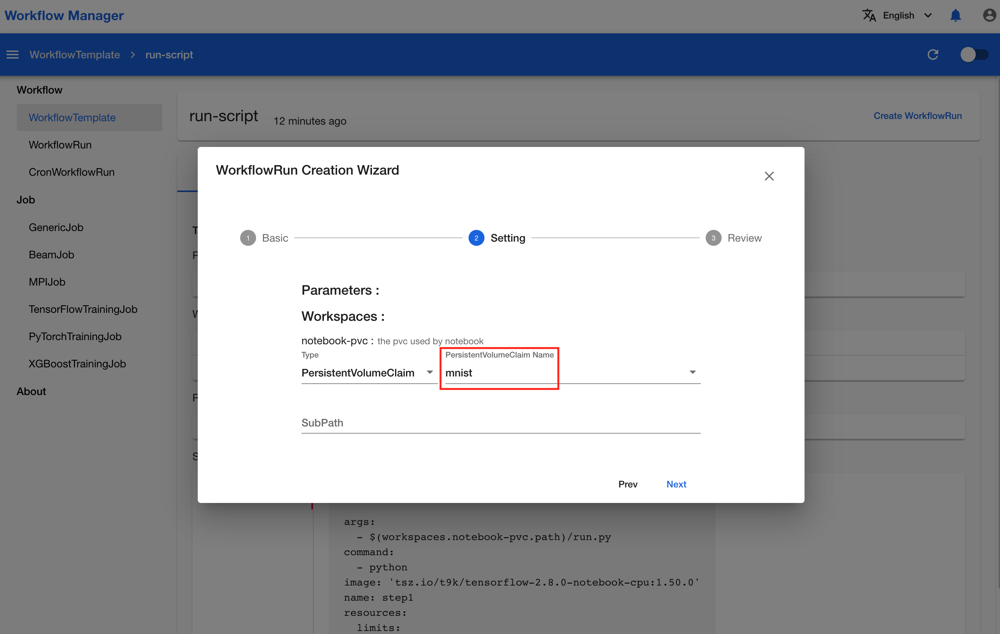
</figure>

<aside class="note">
<div class="title">注意</div>

WorkflowRun 和 Notebook 必须绑定同一个 PVC。

</aside>

WorkflowRun 运行完成后，可以看到打印结果与所编写的脚本运行预期结果一致。

<figure class="screenshot">
  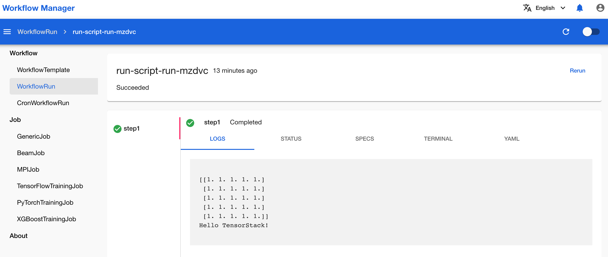
</figure>


### 执行自定义脚本

除了在 Notebook 中编写脚本，您还可以在创建 WorkflowTemplate 的过程中现场编写 Python 或 Shell 脚本。

如下图所示，创建 WorkflowTemplate 时选择类型为 `SeqPod`，然后点击 **Add Step**，在 Step 中选择 **Script** 即可嵌入自定义脚本。

<figure class="screenshot">
  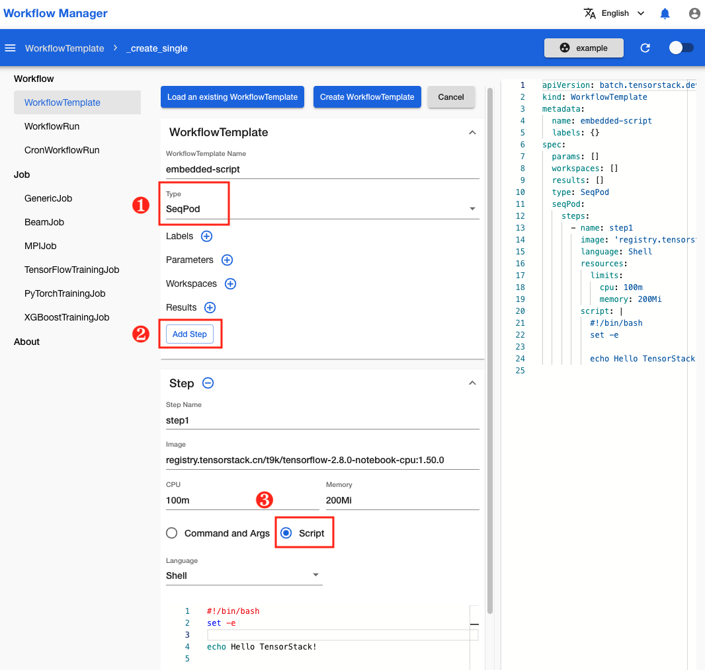
</figure>

目前支持 Python 和 Shell 两种语言，可通过下拉框进行选择。

<figure class="screenshot">
  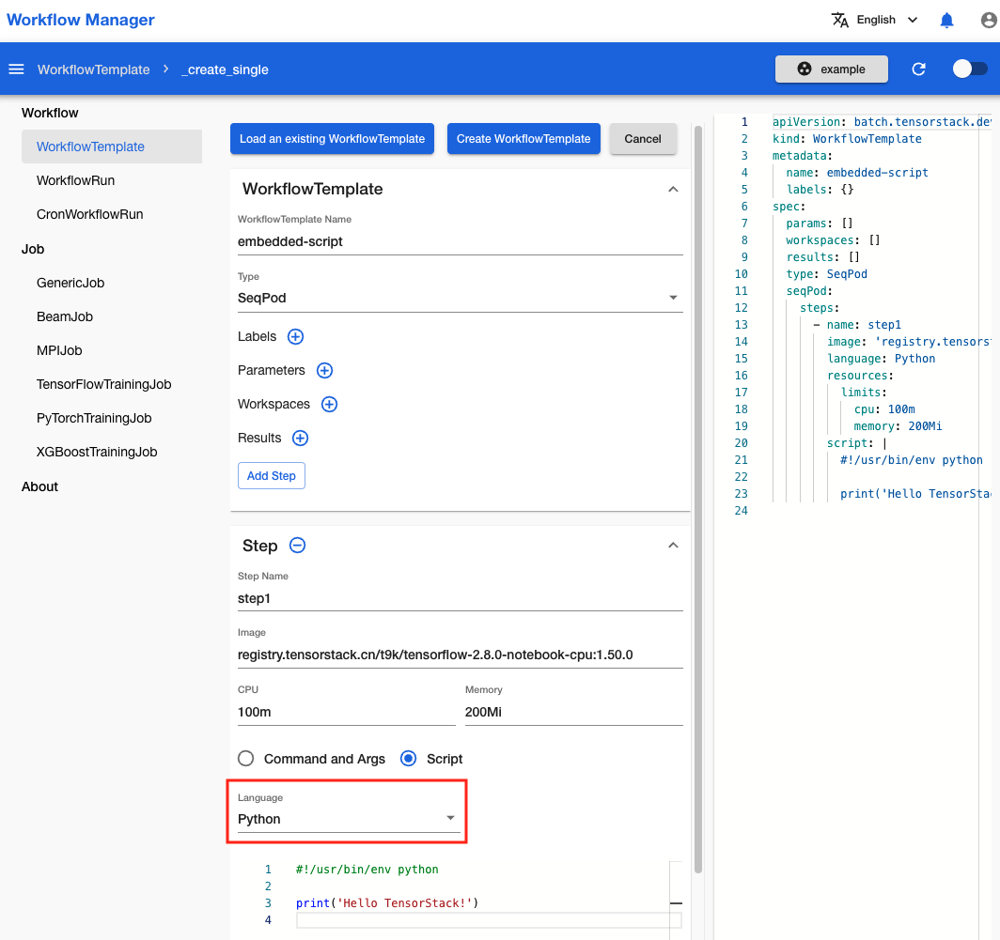
</figure>

创建 WorkflowTemplate 和对应的 WorkflowRun 来运行，可以看到打印结果与脚本运行与其结果一致。

<figure class="screenshot">
  
</figure>


## 创建类型为 `Resource` 的 WorkflowTemplate

如 [WorkflowTemplate 介绍](../modules/workflows/workflowtemplate.md#resource-workflowtemplate)中所述，`Resource` 类型的 WorkflowTemplate 用于创建一个 Kubernetes 资源。下面展示两个常用示例。


### 创建分布式训练

假设您已经有一个可以运行的 TrainingJob YAML 配置文件：

```yaml
apiVersion: batch.tensorstack.dev/v1beta1
kind: TensorFlowTrainingJob
metadata:
  name: mnist
spec:
  tensorboardSpec:               # TensorBoard服务器规约
    trainingLogFilesets:
      - t9k://pvc/mnist/log      # 日志文件路径
    image: tensorflow/tensorflow:2.8.0
                                # TensorBoard服务器使用的镜像
  replicaSpecs:
    - type: worker               # 工作器
      replicas: 4                # 工作器数量
      restartPolicy: ExitCode
      template:
        spec:
          securityContext:
            runAsUser: 1000
          containers:
            - image: tensorflow/tensorflow:2.8.0
                                  # 容器的镜像
              workingDir: /mnt
              name: tensorflow
              command:           # 执行`python`命令以执行训练脚本
                - sh
                - '-c'
                - >-
                  python /mnt/keras_mnist_trainingjob.py --log_dir /mnt/log --save_path /mnt/saved_model
                  --no_cuda
              env: []
              resources:
                limits:          # 限制量
                  cpu: '4'       # CPU
                  memory: 2Gi    # 内存
                requests:        # 请求量
                  cpu: '2'
                  memory: 1Gi
              volumeMounts:
                - name: data
                  mountPath: /mnt
          volumes:
            - name: data
              persistentVolumeClaim:
                claimName: mnist
```

如果您想将创建 TrainingJob 插入工作流中成为其中一个步骤，可以使用 `Resource` 类型的 WorkflowTemplate。如下图所示，在 WorkflowTemplate 创建页面，选择类型为 `Resource`，然后将上面的 YAML 配置文件复制粘贴到 **Resource Manifest** 文本框中，即可创建一个 WorkflowTemplate 来运行这个 TrainingJob。

<figure class="screenshot">
  
</figure>

但是，由于在同一个项目中不能创建两个同名的 TrainingJob，上述方式创建的 WorkflowTemplate 只能运行一次，不具备可复用性。因此我们可以对 TrainingJob 配置文件做一些修改，利用 WorkflowTemplate 的[指定参数](../modules/workflows/workflowtemplate.md#指定参数)功能，使其能被重复使用。

经过修改的 TrainingJob 配置文件如下：

```yaml
apiVersion: batch.tensorstack.dev/v1beta1
kind: TensorFlowTrainingJob
metadata:
  name: $(params.trainingjob_name)
spec:
  tensorboardSpec:               # TensorBoard服务器规约
    trainingLogFilesets:
      - t9k://pvc/mnist/log      # 日志文件路径
    image: tensorflow/tensorflow:2.8.0
                                # TensorBoard服务器使用的镜像
  replicaSpecs:
    - type: worker               # 工作器
      replicas: 4                # 工作器数量
      restartPolicy: ExitCode
      template:
        spec:
          securityContext:
            runAsUser: 1000
          containers:
            - image: tensorflow/tensorflow:2.8.0
                                # 容器的镜像
              workingDir: /mnt
              name: tensorflow
              command:          # 执行`python`命令以执行训练脚本
                - sh
                - '-c'
                - >-
                  python /mnt/keras_mnist_trainingjob.py --log_dir /mnt/log --save_path /mnt/saved_model
                  --no_cuda
              env: []
              resources:
                limits:
                  cpu: '4'
                  memory: 4Gi
                requests:
                  cpu: '2'
                  memory: 2Gi
              volumeMounts:
                - name: data
                  mountPath: /mnt
          volumes:
            - name: data
              persistentVolumeClaim:
                claimName: $(params.pvc_name)
```

改动有两处：

* `metadata.name` 从固定的 `mnist` 改为 `$(params.trainingjob_name)`。
* `spec.replicaSpecs.template.volumes.persistentVolumeClaim.claimName` 从固定的 `mnist` 改为 `$(params.pvc_name)`。

这两个改动使得 TrainingJob 的名称和所使用的 PVC 的名称在运行时才被传入，这样创建的 WorkflowTemplate 就能够多次重复使用了。

在 WorkflowTemplate 创建页面，将上述改动过的 Trainingjob 配置文件复制粘贴到 **Resource Manifest** 文本框中，并为 WorkflowTemplate 添加两个参数，分别名为 `trainingjob_name` 和 `pvc_name`，然后点击 **Create WorkflowTemplate** 进行创建。

<figure class="screenshot">
  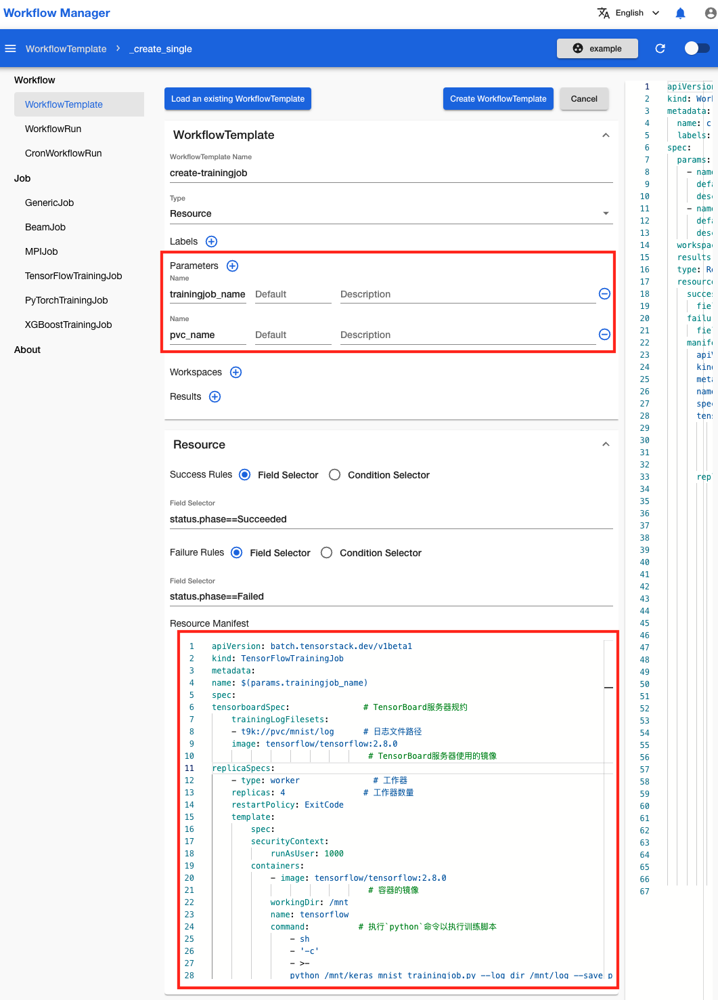
</figure>

在创建 WorkflowRun 时，为 `trainingjob_name` 和 `pvc_name` 这两个参数提供实际值。

<figure class="screenshot">
  
</figure>

等待 WorkflowRun 完成运行。

<figure class="screenshot">
  
</figure>


### 创建推理服务

与[创建分布式训练](#创建分布式训练)类似，我们可以在[简单推理服务](./deploy-simplemlservice.md)的 YAML 配置文件基础上，加入可变的参数：

```yaml
apiVersion: tensorstack.dev/v1beta1
kind: SimpleMLService
metadata:
  name: $(params.simplemlservice_name)
spec:
  replicas: 1
  storage:
    pvc:
      containerPath: /var/lib/t9k/models/mnist
      name: tutorial
      subPath: tutorial-examples/deployment/model/tensorflow/mnist
  tensorflow:
    image: t9kpublic/tensorflow-serving:2.6.0
```

在 WorkflowTemplate 创建页面，将上述 YAML 配置文件复制粘贴到 **Resource Manifest** 文本框中，并为 WorkflowTemplate 添加一些参数。

<figure class="screenshot">
  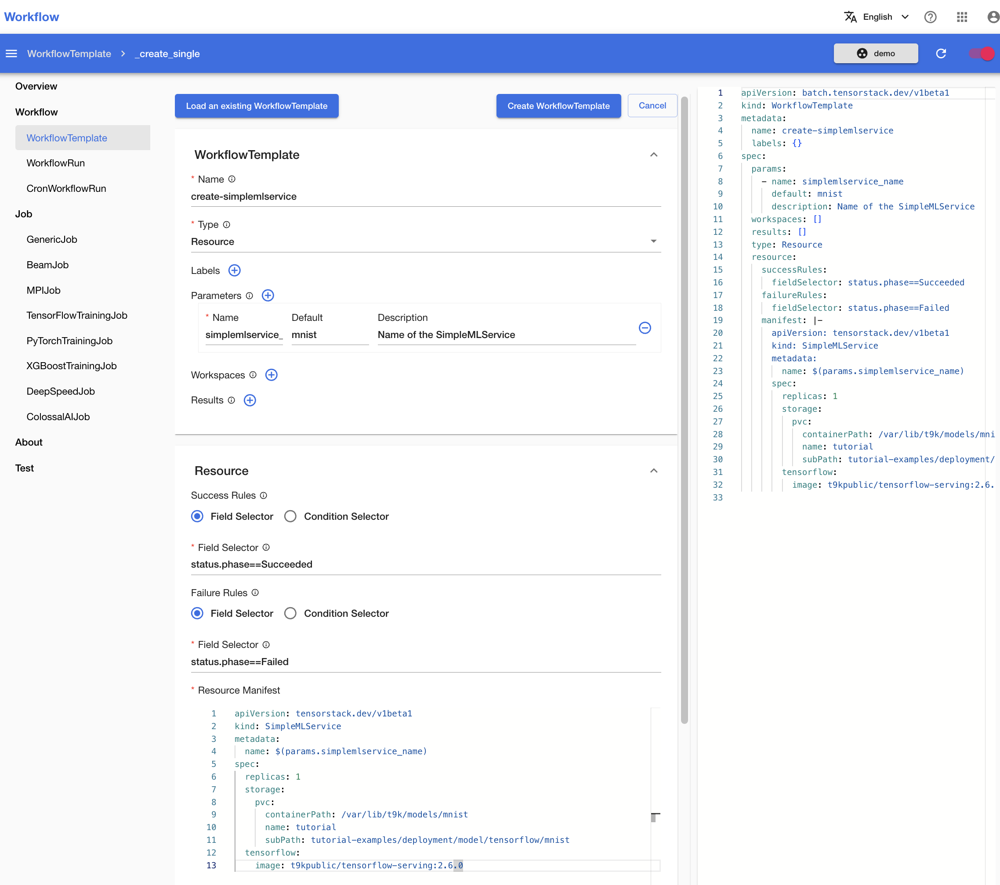
</figure>

创建 WorkflowTemplate，然后创建对应的 WorkflowRun 并提供参数的实际值。

与分布式训练不同，推理服务是一个长时间运行的服务，没有结束时间。因此所创建的 WorkflowRun 也不会结束运行，而是一直处于 Running 状态。

<figure class="screenshot">
  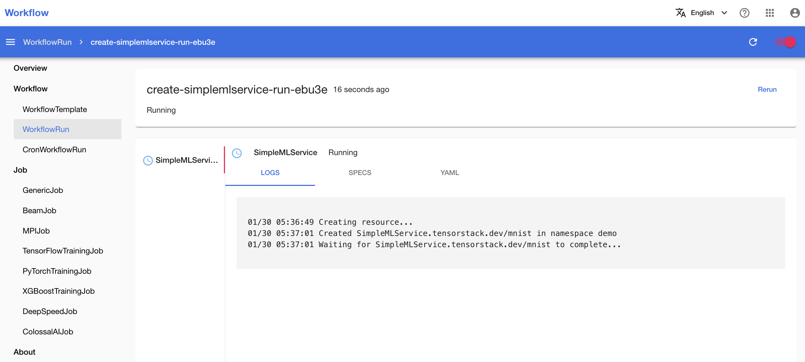
</figure>
