# 创建执行各类任务的工作流单元

本教程演示如何创建执行各类任务的工作流单元。

## 准备工作

* 完成教程[创建工作流的基本单元](./create-basic-unit-of-workflow.md)。
* 成为一个 [Project](../../module/security/index.md#project) 的所有者或者成员。

## 创建类型为 `Pod` 和 `SeqPod` 的 WorkflowTemplate

如 [WorkflowTemplate 介绍](../../module/workflow/workflow/workflowtemplate.md)中所述，`Pod` 和 `SeqPod` 类型的区别在于，`Pod` 中的所有容器是一起（近乎同时）开始运行的，而 `SeqPod` 中的每个步骤是按照定义的顺序依次执行的。如无特殊情况，我们一般使用 `SeqPod` 类型即可。以下均以 `SeqPod` 类型为基础进行讲解。

### 选择镜像

在教程[创建工作流的基本单元](./create-basic-unit-of-workflow.md)中，我们已经完成了 `SeqPod` 类型的 WorkflowTemplate 的创建和运行。如教程中所述，在 `SeqPod` 的每个步骤（step）中，都要填写所使用的镜像。一般来说，镜像的来源可能有以下几种：

* TensorStack AI 平台预先提供的镜像：例如 [Notebook 镜像](../../module/building/notebook.md#预先编译好的镜像)，或者 [TensorStack 镜像站](https://registry.tensorstack.cn/)中的任何镜像。
* 第三方镜像：例如来自 Docker 官方镜像站 [Docker Hub](https://hub.docker.com/) 的镜像。
* 自制镜像：您可以利用 [TensorStack 命令行工具](../../tool/tensorstack-cli/index.md)、[Docker 命令行工具](https://docs.docker.com/engine/reference/commandline/cli/)自行编译镜像。

准备好镜像之后，在 **Image** 框中填入镜像的地址。

<figure class="screenshot">
  
</figure>

### 执行 PVC 中的 `.ipynb` 文件

当您在 [Notebook](../../module/building/notebook.md) 中创建 `.ipynb` 文件并进行了一些实验后，您可能想将其变成工作流中的一个步骤。Notebook 通过 `notebook2workflow` 插件支持创建一个 WorkflowTemplate 来运行一个 `.ipynb` 文件。

首先，在 Notebook 中创建一个 `.ipynb` 文件，输入您想要运行的 Python 代码，并点击 :material-content-save: 保存。

<figure class="screenshot">
  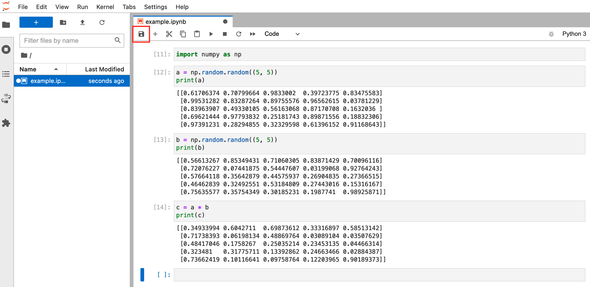
</figure>

点击左侧导航栏的**工作流图标**，然后点击 **USE CURRENT NOTEBOOK**，自动以当前的 `.ipynb` 文件为基础填写表格内容。

<figure class="screenshot">
  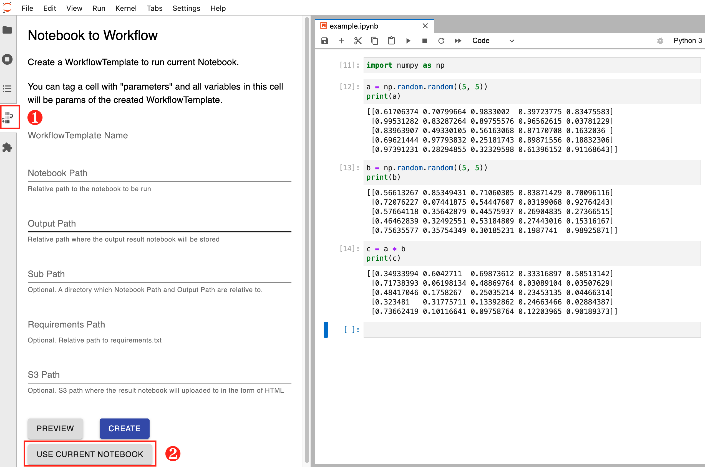
</figure>

点击 **PREVIEW** 可以预览所要创建的 WorkflowTemplate。

<figure class="screenshot">
  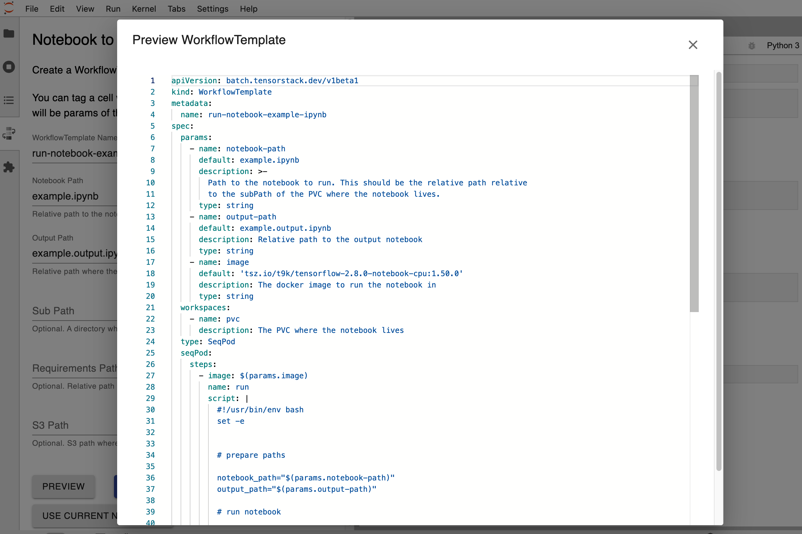
</figure>

点击 **CREATE** 创建该 WorkflowTemplate，左下角会有悬浮框提示是否创建成功。一个常见的错误原因是对 `.ipynb` 文件做的修改尚未保存。

<figure class="screenshot">
  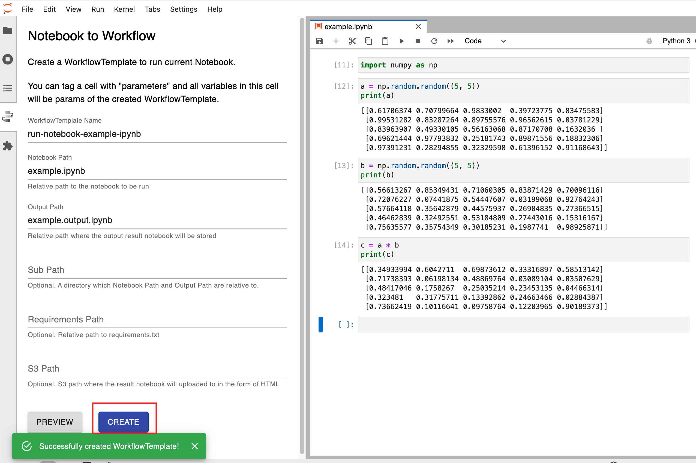
</figure>

接下来，您可以在工作流中找到该 WorkflowTemplate 并创建一个 WorkflowRun 来运行它。

<figure class="screenshot">
  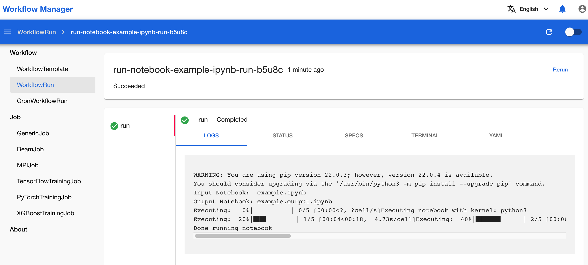
</figure>

!!! note "注意"
    WorkflowRun 和 Notebook 必须绑定同一个 PVC。

默认情况下，输出结果保存在之前的 `.ipynb` 文件同一目录下，后缀为 `.output.ipynb`。

<figure class="screenshot">
  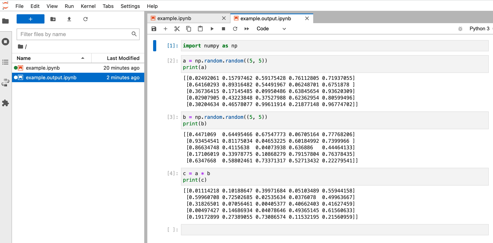
</figure>

### 执行 PVC 中的脚本

类似地，您也可以在 Notebook 中编写 Python 脚本（或者 Shell 脚本），然后创建 WorkflowTemplate 以及对应的 WorkflowRun 来运行该脚本。只要 WorkflowRun 和 Notebook 绑定的是同一个 PVC，WorkflowRun 就能访问到您在 Notebook 中编写的脚本。

首先，在 Notebook 中编写想要运行的脚本，并 **Ctrl+S** 保存。

<figure class="screenshot">
  
</figure>

查看 Notebook 所绑定的 PVC 名称，以便创建 WorkflowRun 时使用。

<figure class="screenshot">
  
</figure>

按照下图所示填写表格，创建一个 `SeqPod` 类型的 WorkflowTemplate。

<figure class="screenshot">
  
</figure>

或者，您也可以复制粘贴下面的 YAML 配置文件来创建 WorkflowTemplate：

??? quote "`run-script.yaml`"
    ```yaml
    apiVersion: batch.tensorstack.dev/v1beta1
    kind: WorkflowTemplate
    metadata:
      name: run-script
      labels: {}
    spec:
      params: []
      results: []
      seqPod:
        steps:
          - args:
              - $(workspaces.notebook-pvc.path)/run.py
            command:
              - python
            image: 'registry.tensorstack.cn/t9k/tensorflow-2.8.0-notebook-cpu:1.50.0'
            name: step1
            resources:
              limits:
                cpu: 100m
                memory: 200Mi
      type: SeqPod
      workspaces:
        - description: the pvc used by notebook
          name: notebook-pvc

    ```

然后，创建 WorkflowRun 来运行该 WorkflowTemplate。

<figure class="screenshot">
  
</figure>

!!! note "注意"
    WorkflowRun 和 Notebook 必须绑定同一个 PVC。

WorkflowRun 运行完成后，可以看到打印结果与所编写的脚本运行预期结果一致。

<figure class="screenshot">
  
</figure>


### 执行自定义脚本

除了在 Notebook 中编写脚本，您还可以在创建 WorkflowTemplate 的过程中现场编写 Python 或 Shell 脚本。

如下图所示，创建 WorkflowTemplate 时选择类型为 `SeqPod`，然后点击 **Add Step**，在 Step 中选择 **Script** 即可嵌入自定义脚本。

<figure class="screenshot">
  
</figure>

目前支持 Python 和 Shell 两种语言，可通过下拉框进行选择。

<figure class="screenshot">
  
</figure>

创建 WorkflowTemplate 和对应的 WorkflowRun 来运行，可以看到打印结果与脚本运行与其结果一致。

<figure class="screenshot">
  
</figure>


## 创建类型为 `Resource` 的 WorkflowTemplate

如 [WorkflowTemplate 介绍](../../module/workflow/workflow/workflowtemplate.md) 中所述，`Resource` 类型的 WorkflowTemplate 用于创建一个 Kubernetes 资源。下面展示两个常用示例。


### 创建分布式训练

假设您已经有一个可以运行的 TrainingJob YAML 配置文件，例如[快速入门教程](../../get-started/building.md#创建-trainingjob-进行分布式训练)中的 TrainingJob：

??? quote "`trainingjob.yaml`"
    ```yaml
    apiVersion: batch.tensorstack.dev/v1beta1
    kind: TensorFlowTrainingJob
    metadata:
      name: mnist
    spec:
      tensorboardSpec:               # TensorBoard服务器规约
        trainingLogFilesets:
          - t9k://pvc/mnist/log      # 日志文件路径
        image: tensorflow/tensorflow:2.8.0
                                    # TensorBoard服务器使用的镜像
      replicaSpecs:
        - type: worker               # 工作器
          replicas: 4                # 工作器数量
          restartPolicy: ExitCode
          template:
            spec:
              securityContext:
                runAsUser: 1000
              containers:
                - image: tensorflow/tensorflow:2.8.0
                                     # 容器的镜像
                  workingDir: /mnt
                  name: tensorflow
                  command:           # 执行`python`命令以执行训练脚本
                    - sh
                    - '-c'
                    - >-
                      python /mnt/keras_mnist_trainingjob.py --log_dir /mnt/log --save_path /mnt/saved_model
                      --no_cuda
                  env: []
                  resources:
                    limits:          # 限制量
                      cpu: '4'       # CPU
                      memory: 2Gi    # 内存
                    requests:        # 请求量
                      cpu: '2'
                      memory: 1Gi
                  volumeMounts:
                    - name: data
                      mountPath: /mnt
              volumes:
                - name: data
                  persistentVolumeClaim:
                    claimName: mnist
    ```

如果您想将创建 TrainingJob 插入工作流中成为其中一个步骤，可以使用 `Resource` 类型的 WorkflowTemplate。如下图所示，在 WorkflowTemplate 创建页面，选择类型为 `Resource`，然后将上面的 YAML 配置文件复制粘贴到 **Resource Manifest** 文本框中，即可创建一个 WorkflowTemplate 来运行这个 TrainingJob。

<figure class="screenshot">
  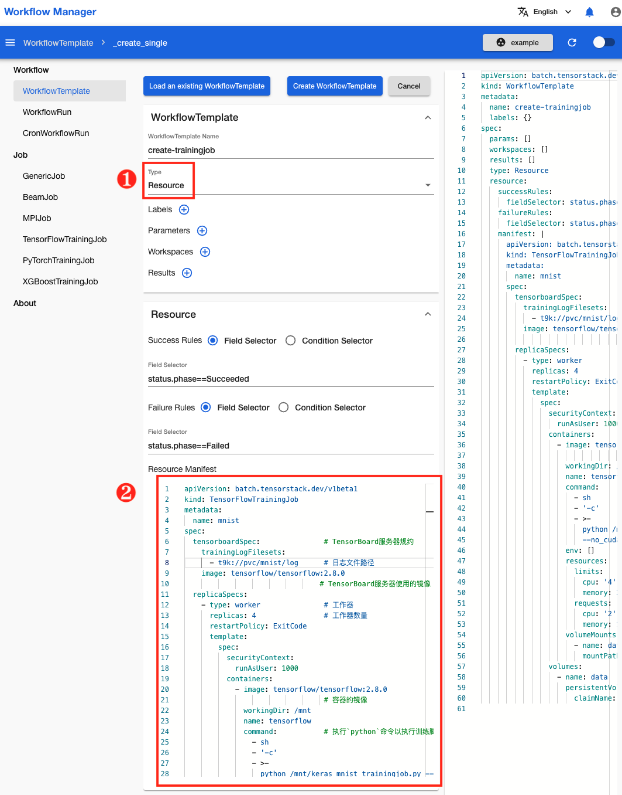
</figure>

但是，由于在同一个项目中不能创建两个同名的 TrainingJob，上述方式创建的 WorkflowTemplate 只能运行一次，不具备可复用性。因此我们可以对 TrainingJob 配置文件做一些修改，利用 WorkflowTemplate 的[指定参数](../../module/workflow/workflow/workflowtemplate.md#指定参数)功能，使其能被重复使用。

经过修改的 TrainingJob 配置文件如下：

??? quote "`trainingjob-modified.yaml`"
    ```yaml
    apiVersion: batch.tensorstack.dev/v1beta1
    kind: TensorFlowTrainingJob
    metadata:
      name: $(params.trainingjob_name)
    spec:
      tensorboardSpec:               # TensorBoard服务器规约
        trainingLogFilesets:
          - t9k://pvc/mnist/log      # 日志文件路径
        image: tensorflow/tensorflow:2.8.0
                                    # TensorBoard服务器使用的镜像
      replicaSpecs:
        - type: worker               # 工作器
          replicas: 4                # 工作器数量
          restartPolicy: ExitCode
          template:
            spec:
              securityContext:
                runAsUser: 1000
              containers:
                - image: tensorflow/tensorflow:2.8.0
                                    # 容器的镜像
                  workingDir: /mnt
                  name: tensorflow
                  command:          # 执行`python`命令以执行训练脚本
                    - sh
                    - '-c'
                    - >-
                      python /mnt/keras_mnist_trainingjob.py --log_dir /mnt/log --save_path /mnt/saved_model
                      --no_cuda
                  env: []
                  resources:
                    limits:
                      cpu: '4'
                      memory: 4Gi
                    requests:
                      cpu: '2'
                      memory: 2Gi
                  volumeMounts:
                    - name: data
                      mountPath: /mnt
              volumes:
                - name: data
                  persistentVolumeClaim:
                    claimName: $(params.pvc_name)
    ```

改动有两处：

* `metadata.name` 从固定的 `mnist` 改为 `$(params.trainingjob_name)`。
* `spec.replicaSpecs.template.volumes.persistentVolumeClaim.claimName` 从固定的 `mnist` 改为 `$(params.pvc_name)`。

这两个改动使得 TrainingJob 的名称和所使用的 PVC 的名称在运行时才被传入，这样创建的 WorkflowTemplate 就能够多次重复使用了。

在 WorkflowTemplate 创建页面，将上述改动过的 Trainingjob 配置文件复制粘贴到 **Resource Manifest** 文本框中，并为 WorkflowTemplate 添加两个参数，分别名为 `trainingjob_name` 和 `pvc_name`，然后点击 **Create WorkflowTemplate** 进行创建。

<figure class="screenshot">
  
</figure>

在创建 WorkflowRun 时，为 `trainingjob_name` 和 `pvc_name` 这两个参数提供实际值。

<figure class="screenshot">
  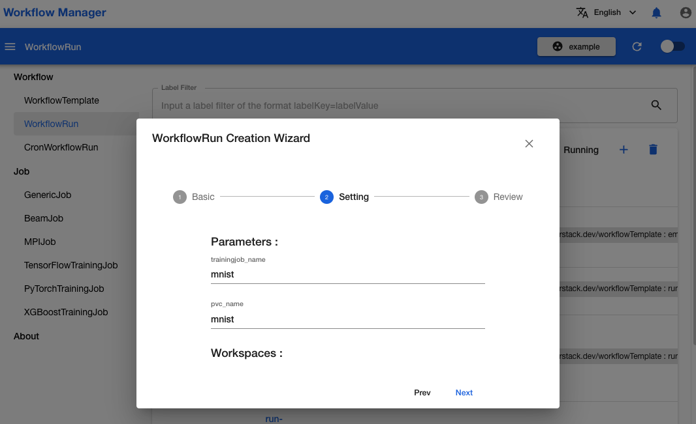
</figure>

等待 WorkflowRun 完成运行。

<figure class="screenshot">
  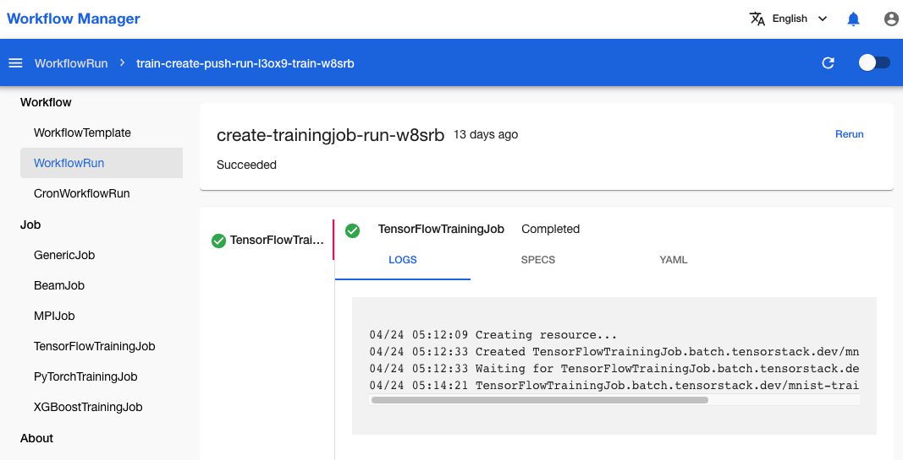
</figure>


### 创建推理服务

与[创建分布式训练](#创建分布式训练)类似，我们可以对推理服务的 YAML 配置文件做一些修改，加入一些可变的参数：

??? quote "`mlservice-modified.yaml`"
    ```yaml
    apiVersion: tensorstack.dev/v1beta1
    kind: MLService
    metadata:
      name: $(params.mlservice_name)
    spec:
      default: test
      releases:
        - name: test
          predictor:
            maxReplicas: 1
            minReplicas: 1
            tensorflow:
              image: 'tsz.io/t9kmirror/tensorflow-serving:2.6.0'
              modelUri: 'mms://$(params.mms_host)/$(params.model_name):$(params.model_tag)'
              resources:
                limits:
                  cpu: 200m
                  memory: 500M
    ```

在 WorkflowTemplate 创建页面，将上述 YAML 配置文件复制粘贴到 **Resource Manifest** 文本框中，并为 WorkflowTemplate 添加一些参数。

<figure class="screenshot">
  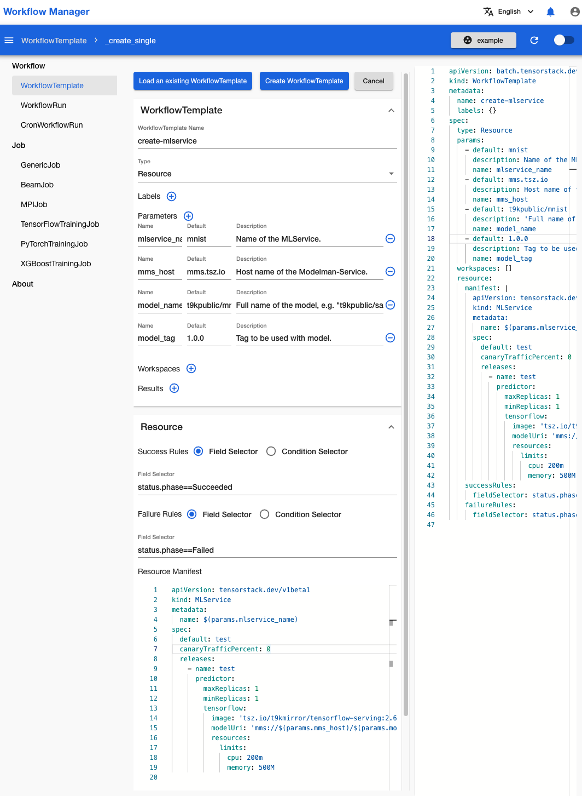
</figure>

创建 WorkflowTemplate，然后创建对应的 WorkflowRun 并提供参数的实际值。

与分布式训练不同，推理服务是一个长时间运行的服务，没有结束时间。因此所创建的 WorkflowRun 也不会结束运行，而是一直处于 Running 状态。

<figure class="screenshot">
  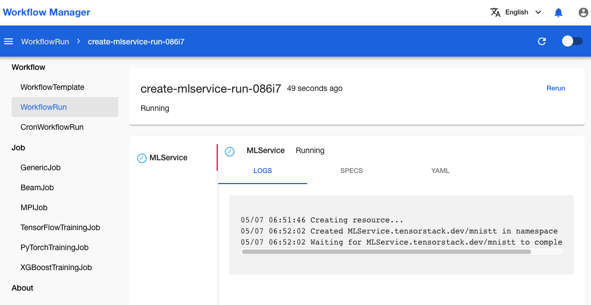
</figure>
