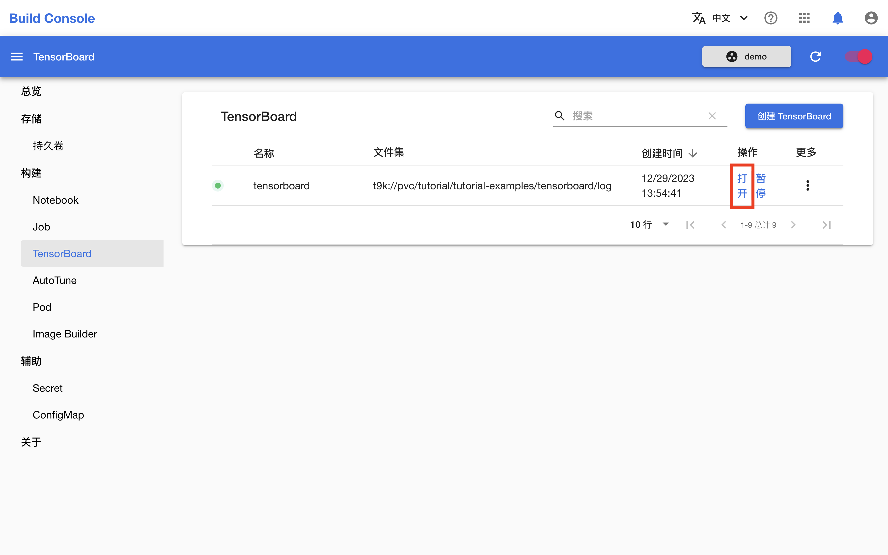
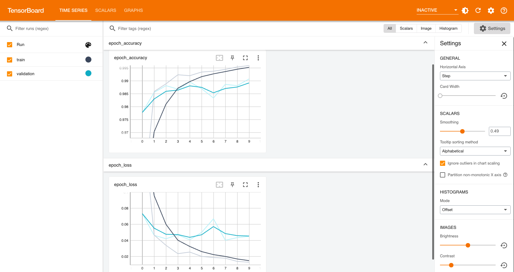

# 创建 TensorBoard

本教程演示如何创建 TensorBoard。

## 准备工作

* 了解 [TensorBoard](../modules/building/tensorboard.md) 的基本概念。
* 成为一个[项目](../modules/security/project.md)的管理员或[成员](./add-project-member.md)。

## 运行示例

请按照<a target="_blank" rel="noopener noreferrer" href="https://github.com/t9k/tutorial-examples/blob/master/docs/README-zh.md#%E4%BD%BF%E7%94%A8%E6%96%B9%E6%B3%95">使用方法</a>准备环境，然后前往<a target="_blank" rel="noopener noreferrer" href="https://github.com/t9k/tutorial-examples/tree/master/tensorboard">本教程对应的示例</a>，参照其 README 文档运行。

<aside class="note tip">

提示

上述操作使用 YAML 配置文件创建 TensorBoard，你也可以在模型构建控制台进行创建。

</aside>

## 查看训练指标

TensorBoard 处于 `Running` 状态后，进入模型构建控制台的 TensorBoard 页面，可以看到 TensorBoard `tensorboard` 正在运行：

<figure class="screenshot">
    
</figure>

点击 **TensorBoard** 右侧的 **打开** 进入 TensorBoard 页面，查看可视化展示的训练和验证指标：

<figure class="screenshot">
    
</figure>
