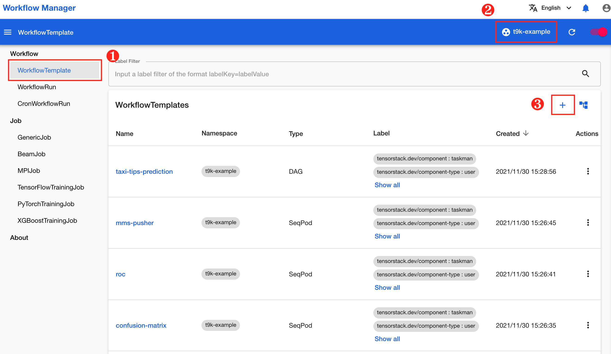
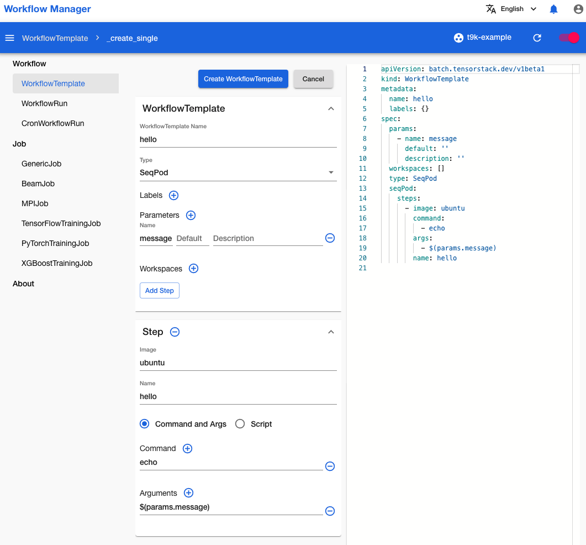
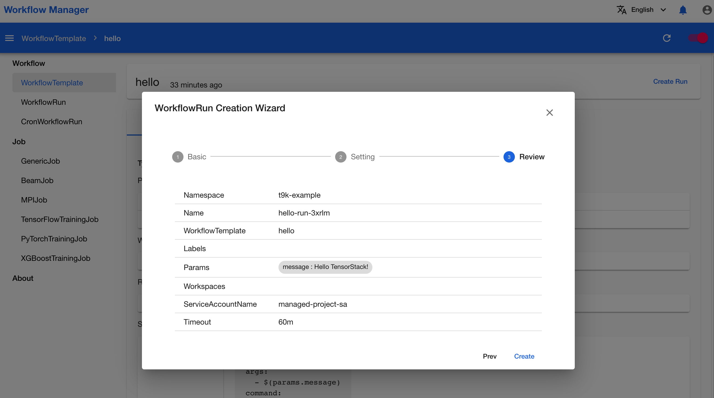
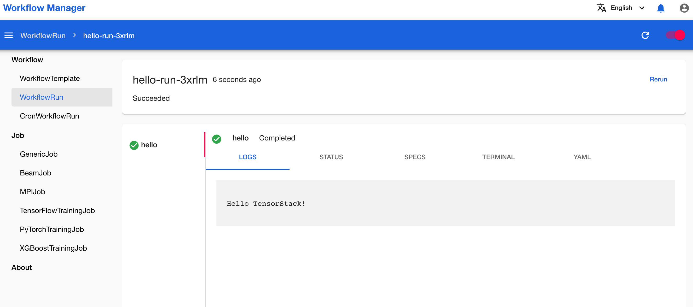

# 创建工作流的基本单元

本教程演示如何创建工作流的基本单元。

## 准备工作

* 了解 [WorkflowTemplate](../../module/workflow/workflow/workflowtemplate.md) 和 [WorkflowRun](../../module/workflow/workflow/workflowrun.md) 的基本概念。
* 成为一个 [Project](../../module/security/index.md#project) 的所有者或者成员。

## 创建 WorkflowTemplate

在浏览器中进入工作流控制台之后，点击左侧导航菜单的 **WorkflowTemplate** 进入 WorkflowTemplate 列表页面，然后点击右上角的 **Project** 框选择一个 Project，然后点击列表右上角的 **+** 在该 Project 中创建一个 WorkflowTemplate。

<figure class="screenshot">
  
</figure>

进入创建 WorkflowTemplate 页面之后，左侧的表格和右侧的 YAML 都可以进行编辑，并且两侧始终是同步变化的。您可以在此填写所要创建的 WorkflowTemplate。

<figure class="screenshot">
  
</figure>

首先，您需要在名为 **WorkflowTemplate Name** 的文本框中填写 WorkflowTemplate 的名称，然后在名为 **Type** 的下拉框中选择 WorkflowTemplate 的类型（可以是 `Pod`、`SeqPod`、`Resource` 等），最后根据 WorkflowTemplate 类型的不同，继续填写余下配置。

!!! info "信息"

    WorkflowTemplate 的每个字段的含义详见[参考](../../reference/tensorstack-resources/workflow-api/workflowtemplate.md)。

编辑好 WorkflowTemplate 之后，点击表格右上角的 **Create WorkflowTemplate** 创建该 WorkflowTemplate，右下角会有悬浮框提示是否创建成功。

## 创建 WorkflowRun

再次点击左侧导航菜单的 **WorkflowTemplate** 进入 WorkflowTemplate 列表页面，找到您刚才创建的 WorkflowTemplate `hello`，点击 WorkflowTemplate 的名称进入 WorkflowTemplate 的详情页面。

<figure class="screenshot">
  
</figure>

在 WorkflowTemplate 的详情页面，您可以点击 **SPECS** 或 **YAML** 标签查看 WorkflowTemplate 的详细情况，检查是否有错误。如果没有错误，点击右上角的 **Create WorkflowRun** 为该 WorkflowTemplate 创建一个 WorkflowRun。

<figure class="screenshot">
  
</figure>

在弹出的创建 WorkflowRun 对话框中，按步骤依次填写 WorkflowRun 所需要的参数，最后点击 **Create** 创建 WorkflowRun，右下角会有悬浮框提示是否创建成功。

<figure class="screenshot">
  
</figure>

## 查看 WorkflowRun 运行情况

点击左侧导航菜单的 **WorkflowRun** 进入 WorkflowRun 列表页面，找到您刚刚创建的 WorkflowRun `hello-run-3xrlm`，点击 WorkflowRun 的名称进入 WorkflowRun 的详情页面。

<figure class="screenshot">
  
</figure>

在 WorkflowRun 的详情页面，您可以点击 **LOGS**、**STATUS**、**SPECS** 和 **YAML** 等标签，分别查看 WorkflowRun 的日志、状态、规约和 YAML。如果 WorkflowRun 正在运行而且其类型是 Pod 或 SeqPod，您可以点击 **TERMINAL** 标签，连接到 WorkflowRun 创建的 Pod 的某个容器的终端（shell），利用命令行工具进行调试。
