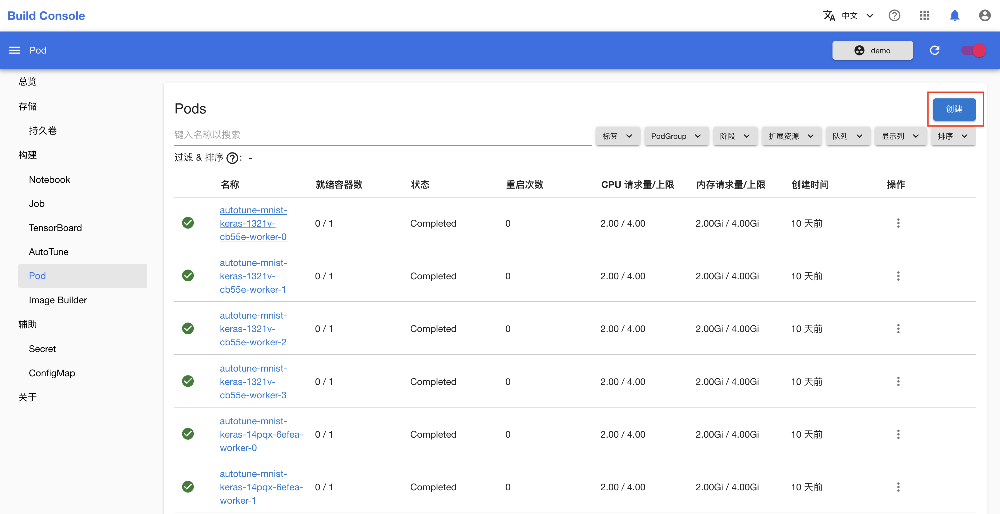
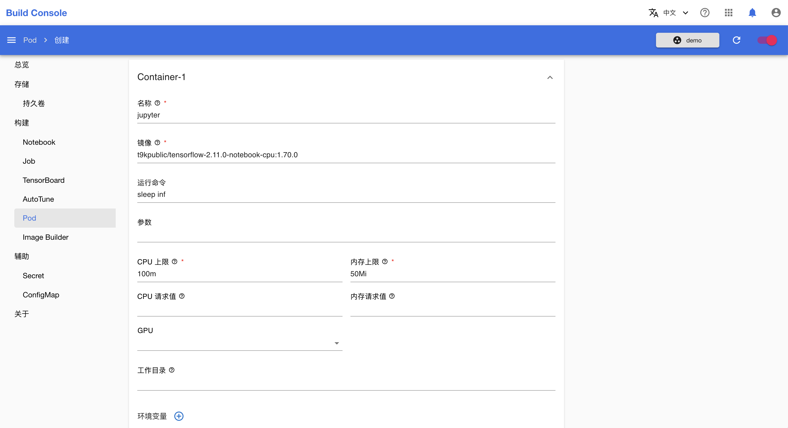
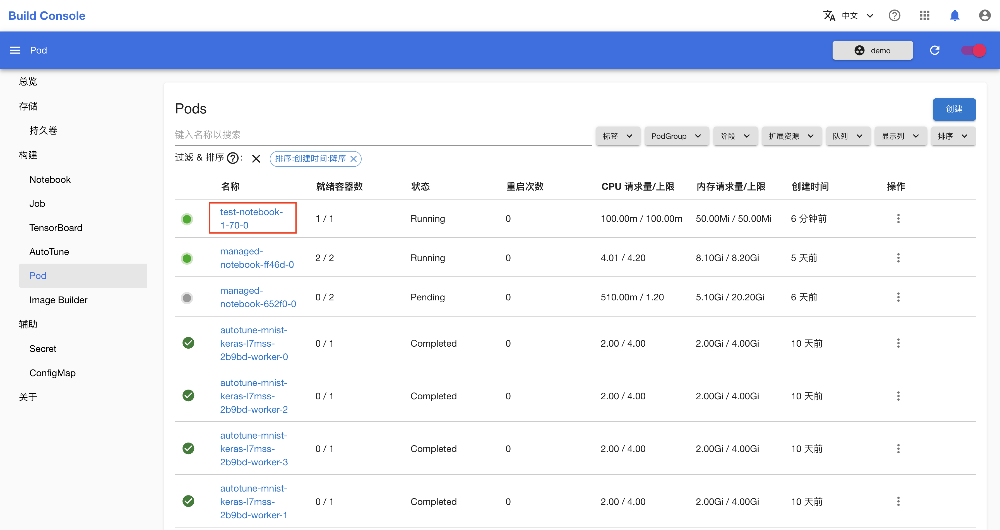
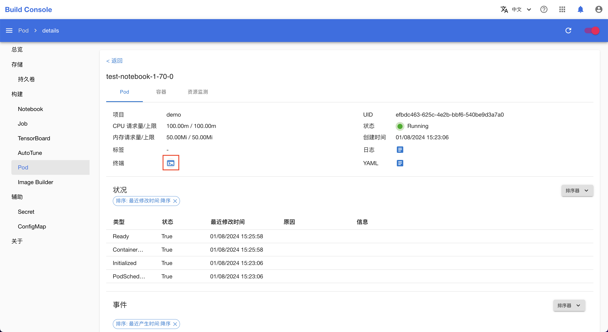

# 调试镜像

本教程演示如何方便地在模型构建控制台通过命令行进入一个镜像，以便对镜像进行探索和测试。

## 准备工作

* 成为一个[项目](../modules/security/project.md) 的管理员或[成员](./add-project-member.md)。

## 示例

假设我们想知道镜像 `t9kpublic/tensorflow-2.11.0-notebook-cpu:1.70.0` 中安装了哪些 pip 包。

进入模型构建控制台后，点击**构建 > Pod** 进入 Pod 管理页面。

<figure class="screenshot">
  
</figure>

点击右上角的**创建**以创建一个 Pod，执行 `sleep` 命令使镜像保持运行状态，以便我们连接镜像中的 `bash`（或 `sh`）终端。

<figure class="screenshot">
  
</figure>

<figure class="screenshot">
  
</figure>

分别填写项目名称、镜像名称、运行命令和资源使用量，然后点击**创建**。

<figure class="screenshot">
  
</figure>

所创建的 Pod 变为运行状态后，点击 Pod 名称进入 Pod 详情页面。

<figure class="screenshot">
  
</figure>

点击终端按钮，打开终端。

<figure class="screenshot">
  
</figure>

在打开的终端中，输入 `pip list` 显示该镜像中安装的所有 pip 包，或者输入其他任何命令。

最后，点击右上角的 **X** 关闭终端。
