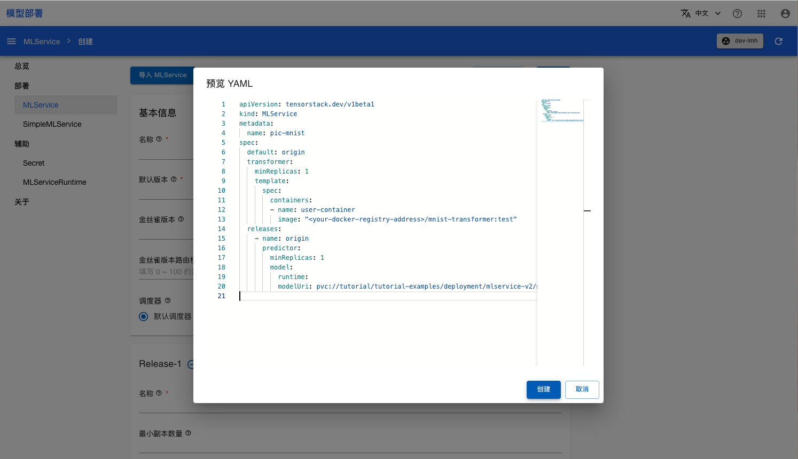

# 包含 Transformer 的推理服务

本教程演示如何使用 TensorStack SDK 创建 Transformer 镜像，然后部署包含该 Transformer 的 MLService。

## 准备工作

请按照<a target="_blank" rel="noopener noreferrer" href="https://github.com/t9k/tutorial-examples/blob/v20240206/docs/README-zh.md#%E4%BD%BF%E7%94%A8%E6%96%B9%E6%B3%95">使用方法</a>准备此次部署需要用到的 PVC 和 Notebook。

## 编写 Transformer 逻辑

接下来开始制作供 MLService 使用的 Transformer 镜像。首先进入 Notebook，启动一个终端，切换到对应目录：

```bash
cd ~/tutorial-examples/deployment/mlservice/transformer
```

查看文件 `server.py` ，内容如下：

```py title="server.py"
import json
from t9k import mlservice

import argparse
import io
import numpy as np
from PIL import Image
from typing import Dict

# inherit parser to get command-line-args help
# feel free to add your command line args
par = argparse.ArgumentParser(parents=[mlservice.option.parser])
args, _ = par.parse_known_args()

def image_transform(instance):
    image = Image.open(io.BytesIO(instance))
    a = np.asarray(image)
    a = a / 255.0
    return a.reshape(28, 28, 1).tolist()

class_names = ['T-shirt/top', 'Trouser', 'Pullover', 'Dress', 'Coat',
               'Sandal', 'Shirt', 'Sneaker', 'Bag', 'Ankle boot']

def get_prediction(prediction: list)->str:
    max_value = max(prediction)
    max_index = prediction.index(max_value)
    return class_names[max_index]

class Transformer(mlservice.MLTransformer):
    def preProcess(self, path: str, requestData: bytes, headers: Dict[str, str]) -> any:
        return json.dumps({'instances': [image_transform(requestData)]})

    def postProcess(self, path: str, statusCode: int, responseContent: bytes, headers: Dict[str, str]) -> bytes:
        data = responseContent.decode('utf-8')
        jsonData = json.loads(data)
        jsonStr = json.dumps({'predictions': [get_prediction(predict) for predict in jsonData['predictions']]})
        return jsonStr.encode('utf-8')
    
if __name__ == "__main__":
    transformer = Transformer()
    server = mlservice.MLServer()
    server.start(transformer=transformer)
```

代码中使用了 TensorStack SDK，通过重载 `preprocess` 和 `postprocess` 方法实现了一个 Transformer：

* `preprocess`：预处理函数，Transformer 收到用户发送的数据，使用 `preprocess` 对数据进行处理，然后再发送给推理服务。在这个示例中，先转换输入图片的数据格式，需要保持与训练的模型的输入数据一致，然后再转换为推理服务的输入格式。
* `postprocess`：后处理函数，Transformer 收到推理服务返回的结果，使用 `postprocess` 对其进行处理，然后再返回给用户。在这个示例中，模型用于处理分类问题，从推理服务返回的预测概率向量中解析出该图片的分类类别，并返回给用户。

用户可以参考该文件来实现自定义的 Transformer 逻辑。

## 制作镜像

基于上述代码，我们创建对应的 Dockerfile 如下：

```dockerfile
FROM python:3.8-slim

COPY t9k-sdk.tar.gz t9k-sdk.tar.gz
COPY server.py server.py

RUN pip install --upgrade pip
RUN pip install --no-cache-dir -i https://pypi.tuna.tsinghua.edu.cn/simple \
    numpy \
    pillow \
    requests
RUN pip install t9k-sdk.tar.gz  -i https://pypi.tuna.tsinghua.edu.cn/simple

ENTRYPOINT ["python", "server.py"]
```

上述 Dockerfile 引入了相关依赖，并将上一步的 `server.py` 文件作为启动命令。用户可以参考该文件来实现自定义的镜像。

然后我们通过运行一个 ImageBuilder 来制作镜像，为了使用 ImageBuilder，首先我们需要参照[创建 Secret](https://github.com/t9k/tutorial-examples/blob/v20240206/build-image/build-image-on-platform/README.md#%E5%88%9B%E5%BB%BA-secret)准备上传镜像所需要的 DockerConfig `Secret`。

完成后修改 `imagebuilder.yaml` 文件，将 `spec.dockerConfig.secret` 修改为上一步中创建的 DockerConfig `Secret` 的名称，并将 `spec.tag` 修改为目标镜像，并执行以下命令：

```
kubectl apply -f imagebuilder.yaml
```

查看 `ImageBuilder` 状态，等待 Phase 一栏变为 `Succeeded`：

```sh
kubectl get -f imagebuilder.yaml -w
```

## 部署 MLService

进入模型部署控制台，先点击左侧导航栏辅助一栏下的的 **MLServiceRuntime**，再点击 **创建 MLServiceRuntime** ，然后点击 **预览 YAML**， 并将下面内容复制到 YAML 编辑框中，最后点击 **创建** 创建 MLServiceRuntime。

```yaml
apiVersion: tensorstack.dev/v1beta1
kind: MLServiceRuntime
metadata:
  name: t9k-tensorflow-serving
spec:
  enabled: true
  template:
    spec:
      containers:
      - name: user-container
        image: t9kpublic/tensorflow-serving:2.13.1
        command:
          - /usr/bin/tensorflow_model_server
        args:
          - --model_name={{if .MODEL_NAME}}{{.MODEL_NAME}}{{else}}model{{end}}
          - --port={{if .GRPC_PORT}}{{.GRPC_PORT}}{{else}}9000{{end}}
          - --rest_api_port=8000
          - --model_base_path=/var/lib/t9k/model
        resources:
          limits:
            cpu: "200m"
            memory: 200Mi
        ports:
        - containerPort: 8000
          protocol: TCP
```

进入模型部署控制台的 MLService 页面，点击右上角**创建 MLService**，然后点击**预览 YAML**。如下图所示，将下述内容复制到右侧的 YAML 编辑框，最后点击 **创建** 创建 MLService：

<aside class="note">
<div class="title">注意</div>

请将 transformer 定义中的 `image` 替换为上一步中制作好的镜像地址。

</aside>

```yaml
apiVersion: tensorstack.dev/v1beta1
kind: MLService
metadata:
  name: pic-mnist
spec:
  default: origin
  transformer:
    minReplicas: 1
    template:
      spec:
        containers:
        - name: user-container
          image: "<your-docker-registry-address>/mnist-transformer:test"
  releases:
    - name: origin
      predictor:
        minReplicas: 1
        model:
          runtime: t9k-tensorflow-serving
          modelUri: pvc://tutorial/tutorial-examples/deployment/mlservice/transformer/model/
```

<figure class="screenshot">
  
</figure>


<<<<<<< HEAD
你可以直接使用命令行工具访问 MLService 的预测服务。运行命令获取 MLService 的 URL：
=======
## 发送预测请求

使用图片 `shoe.png` 作为测试数据发送预测请求。
>>>>>>> parent of 816714b (Update mlservice (#51))

``` shell
address=$(kubectl get mls pic-mnist -ojsonpath='{.status.address.url}') && echo $address
curl --data-binary @./shoe.png ${address}/v1/models/model:predict
```

## 参考

- [MLService 介绍](../modules/deployment/mlservice.md)
- API 参考：[MLService](../../references/api-reference/mlservice.md)
- API 参考：[MLServiceRuntime](../../references/api-reference/mlservice.md#mlserviceruntime)
