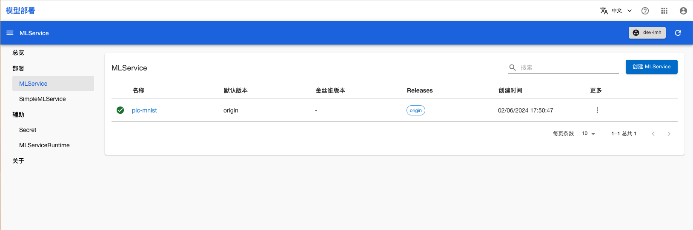

# 包含 Transformer 的推理服务

本教程演示如何使用 TensorStack SDK 创建 Transformer 镜像，然后部署包含该 Transformer 的 MLService。

## 运行示例

请按照<a target="_blank" rel="noopener noreferrer" href="https://github.com/t9k/tutorial-examples/blob/master/docs/README-zh.md#%E4%BD%BF%E7%94%A8%E6%96%B9%E6%B3%95">使用方法</a>准备环境，然后前往<a target="_blank" rel="noopener noreferrer" href="https://github.com/t9k/tutorial-examples/blob/master/deployment/mlservice/transformer">本教程的示例</a>，参照其 README 文档运行。本示例运行了一个带有 Transformer 的 MLService 推理服务。

## Transformer 实现

Transformer 是 MLService 中的一个组件，它可以对推理的请求进行预处理和后处理:
* 预处理：用户发向推理服务的原始数据，先经过 Transformer 预处理，然后再被发送到推理服务。
* 后处理：推理服务返回的预测结果，先经过 Transformer 后处理，然后再返回给用户。
    

<aside class="note info">
<div class="title">信息</div>

你可以使用 Tensorstack SDK 编写 Transformer 代码，并使用 ImageBuilder 制作自定义 Transformer 镜像。详情请参考 [制作 Transformer 镜像](https://github.com/t9k/tutorial-examples/tree/master/deployment/mlservice/transformer#%E5%88%B6%E4%BD%9C-transformer-%E9%95%9C%E5%83%8F)

</aside>

## 查看推理服务状态

部署完成后，进入模型部署控制台的 MLService 页面，可以看到名为 **pic-mnist** 的 MLService，稍等片刻，等其进入 Ready 状态：

<figure class="screenshot">
  
</figure>

## 使用推理服务

你可以直接使用命令行工具访问 MLService 的预测服务。运行命令获取 MLService 的 URL：

``` shell
address=$(kubectl get mls pic-mnist -ojsonpath='{.status.address.url}') && echo $address
```

使用图片 `shoe.png` 作为测试数据发送预测请求：

``` shell
curl --data-binary @./shoe.png ${address}/v1/models/model:predict
```

## 参考

- [MLService 介绍](../modules/deployment/mlservice.md)
- API 参考：[MLService](../../references/api-reference/mlservice.md)
- API 参考：[MLServiceRuntime](../../references/api-reference/mlservice.md#mlserviceruntime)
