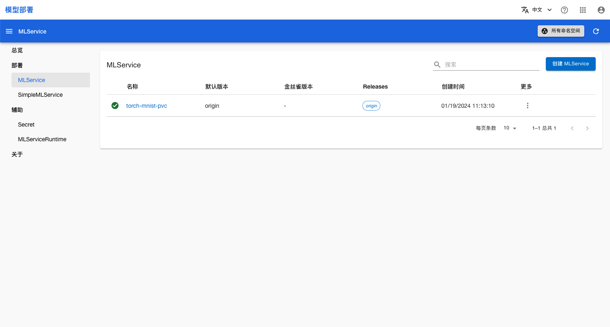
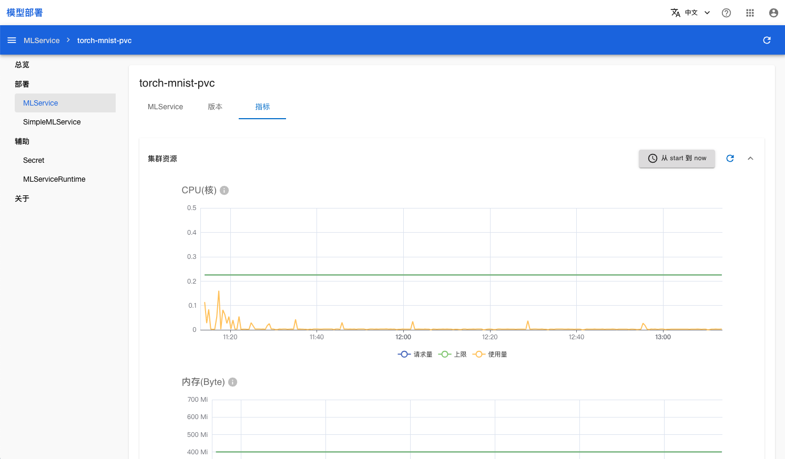

# 模型推理服务

本教程演示如何使用 MLService 部署一个功能完善、自动化程度高，可用于生产环境的模型推理服务。

## 运行示例

请按照<a target="_blank" rel="noopener noreferrer" href="https://github.com/t9k/tutorial-examples/blob/master/docs/README-zh.md#%E4%BD%BF%E7%94%A8%E6%96%B9%E6%B3%95">使用方法</a>准备环境，然后前往<a target="_blank" rel="noopener noreferrer" href="https://github.com/t9k/tutorial-examples/blob/master/deployment/mlservice/torch-pvc">本教程的示例</a>，参照其 README 文档运行。本示例使用 PVC 中存储的模型创建了一个 MLService 服务。

<aside class="note tip">
<div class="title">提示</div>

除了上述直接提供 YAML 配置文件的方法外，你也可以选择从网页控制台创建 MLService。

</aside>

## 查看推理服务状态

部署完成后，进入模型部署控制台的 MLService 页面，可以看到名为 **torch-mnist-pvc** 的 MLService，稍等片刻，等其进入 Ready 状态：

<figure class="screenshot">
    
</figure>

## 使用推理服务

你可以直接使用命令行工具访问 MLService 的预测服务。运行命令获取 MLService 的 URL：

``` shell
url=$(kubectl get mlservice torch-mnist-pvc -o jsonpath='{.status.address.url}') && echo $url
```

发送推理请求：

``` shell
curl -T test_data/0.png ${url}/v1/models/mnist:predict # or use `1.png`, `2.png`
```

## 监控推理服务

在模型部署控制台，点击对应的 MLService，然后切换到**资源监测**页面，可以查看该 MLService 的资源统计：

<figure class="screenshot">
  
</figure>

## 参考

- [MLService 介绍](../modules/deployment/mlservice.md)
- API 参考：[MLService](../../references/api-reference/mlservice.md)
- API 参考：[MLServiceRuntime](../../references/api-reference/mlservice.md#mlserviceruntime)
