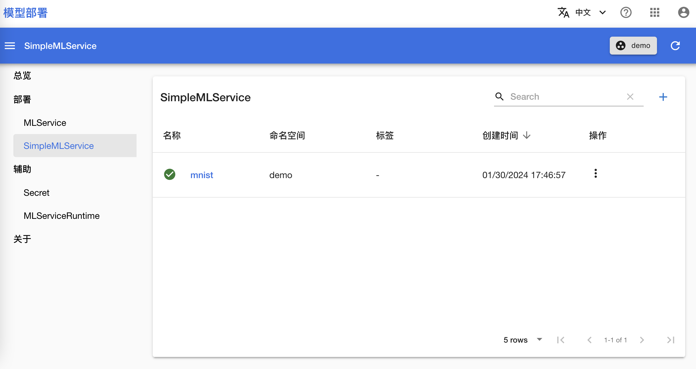
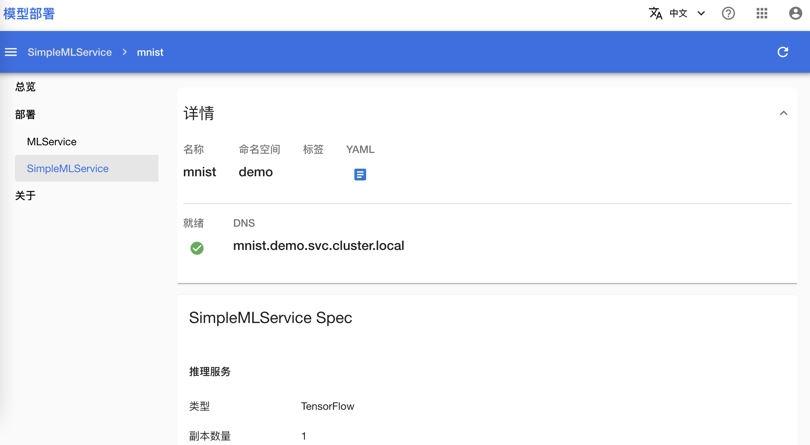

# 简单推理服务

本教程演示如何使用 SimpleMLService 快速部署一个模型推理服务。

## 运行示例

请按照<a target="_blank" rel="noopener noreferrer" href="https://github.com/t9k/tutorial-examples/blob/v20240206/docs/README-zh.md#%E4%BD%BF%E7%94%A8%E6%96%B9%E6%B3%95">使用方法</a>准备环境，然后前往<a target="_blank" rel="noopener noreferrer" href="https://github.com/t9k/tutorial-examples/blob/v20240206/deployment/simplemlservice">本教程的示例</a>，参照其 README 文档运行。本示例使用 PVC 中存储的模型创建了一个 SimpleMLService 服务。

<aside class="note tip">

提示

除了上述直接提供 YAML 配置文件的方法外，你也可以选择从网页控制台创建 SimpleMLService。

</aside>

## 查看推理服务状态

部署完成后，进入模型部署控制台的 SimpleMLService 页面，可以看到名为 **mnist** 的 SimpleMLService。

<figure class="screenshot">
    
</figure>

点击 SimpleMLService 的名称 **mnist** 可以看见 SimpleMLService 的基本信息，其中 URL 是在集群内访问这个推理服务的地址：

<figure class="screenshot">
    
</figure>

## 参考

- [SimpleMLService 介绍](../modules/deployment/simplemlservice.md)
- API 参考：[SimpleMLService](../../references/api-reference/simplemlservice.md)
