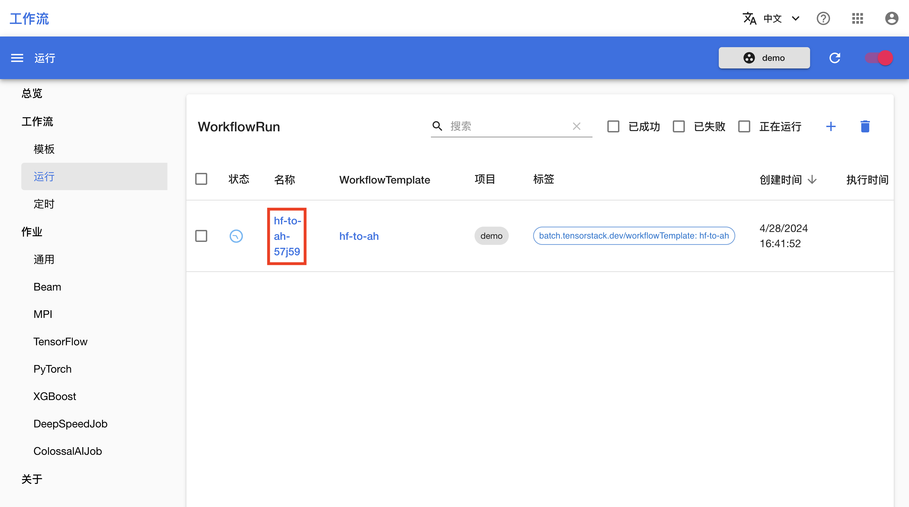
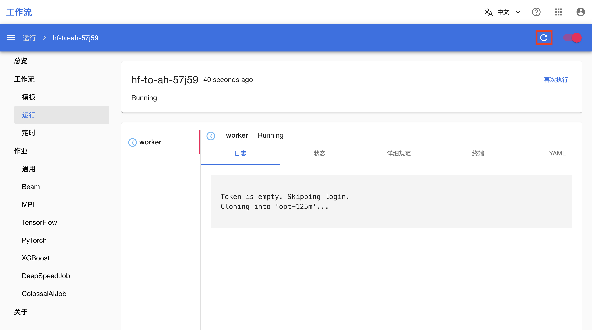
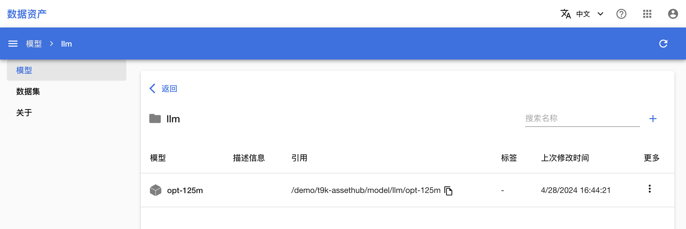
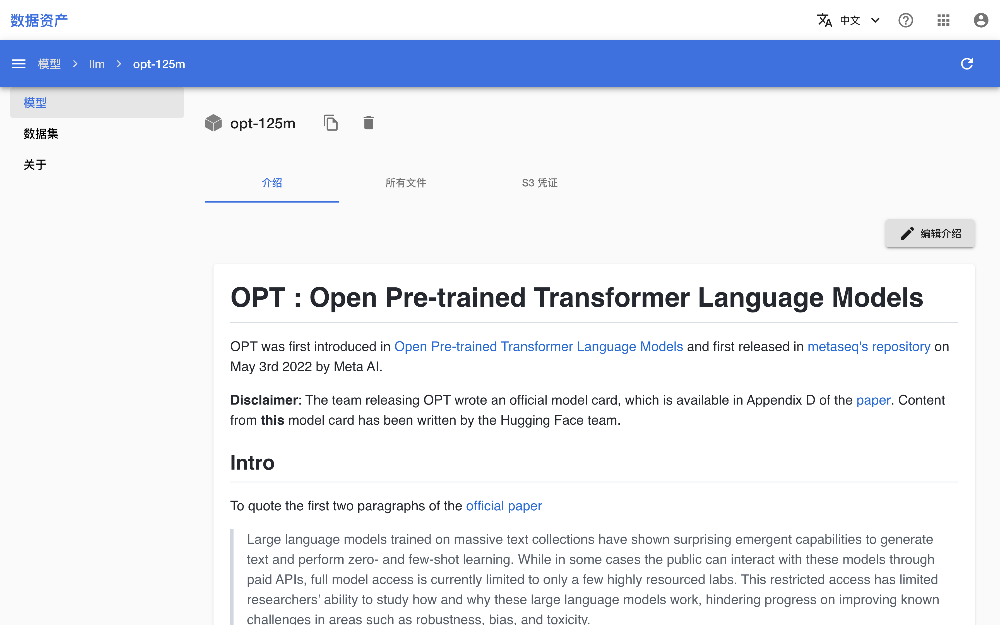
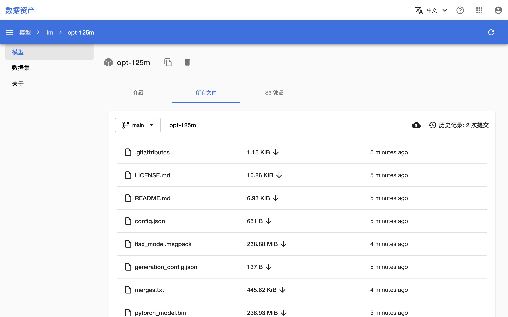

# 从 Hugging Face 下载模型和数据集到 Asset Hub

<a target="_blank" rel="noopener noreferrer" href="https://huggingface.co/">Hugging Face</a> 是一个 AI 开源社区，其提供的 Git 仓库托管了大量流行的开源模型和数据集。本教程演示如何使用工作流将 Hugging Face 的模型下载并存储到 Asset Hub，即在 Asset Hub 中创建一个副本。数据集同理。

## 运行示例

请按照<a target="_blank" rel="noopener noreferrer" href="https://github.com/t9k/tutorial-examples/blob/master/docs/README-zh.md#%E4%BD%BF%E7%94%A8%E6%96%B9%E6%B3%95">使用方法</a>准备环境，然后前往<a target="_blank" rel="noopener noreferrer" href="https://github.com/t9k/tutorial-examples/tree/master/workflow/hf-to-ah">本教程对应的示例</a>，参照其 README 文档运行。

<aside class="note tip">

提示

上述操作使用 YAML 配置文件创建 WorkflowTemplate 及 WorkflowRun，你也可以在工作流控制台进行创建。

</aside>

<aside class="note tip">

提示

对于国内用户，ModelScope 可以作为 Hugging Face 的一个替代下载源。本教程对应的示例同样支持从 ModelScope 下载，请参阅其 README 文档。

</aside>

## 查看运行结果

创建 WorkflowRun 之后，进入工作流控制台的 WorkflowRun 列表页面，可以看到名为 **hf-to-ah-xxxxx** 的 WorkflowRun 正在运行。

<figure class="screenshot">
  
</figure>

点击其**名称**进入详情页面，可以看到 WorkflowRun 的日志。点击右上角的**刷新图标**以手动刷新日志。

<figure class="screenshot">
  
</figure>

等待 WorkflowRun 运行完成。

## 查看模型

在 WorkflowRun 运行完成之后，进入 Asset Hub 控制台，进入模型文件夹 llm，可以看到下载的模型已经被放置在这里。

<figure class="screenshot">
  
</figure>

点击其**名称**进入详情页面，可以看到 facebook/opt-125m 模型的介绍，其解析自 `README.md` 文件。

<figure class="screenshot">
  
</figure>

点击上方的**所有文件**标签页，可以看到所有模型文件。检查确认与<a target="_blank" rel="noopener noreferrer" href="https://huggingface.co/facebook/opt-125m/tree/main">原模型文件</a>一致。

<figure class="screenshot">
  
</figure>
