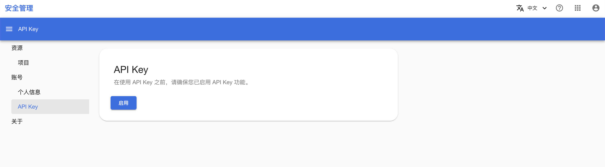
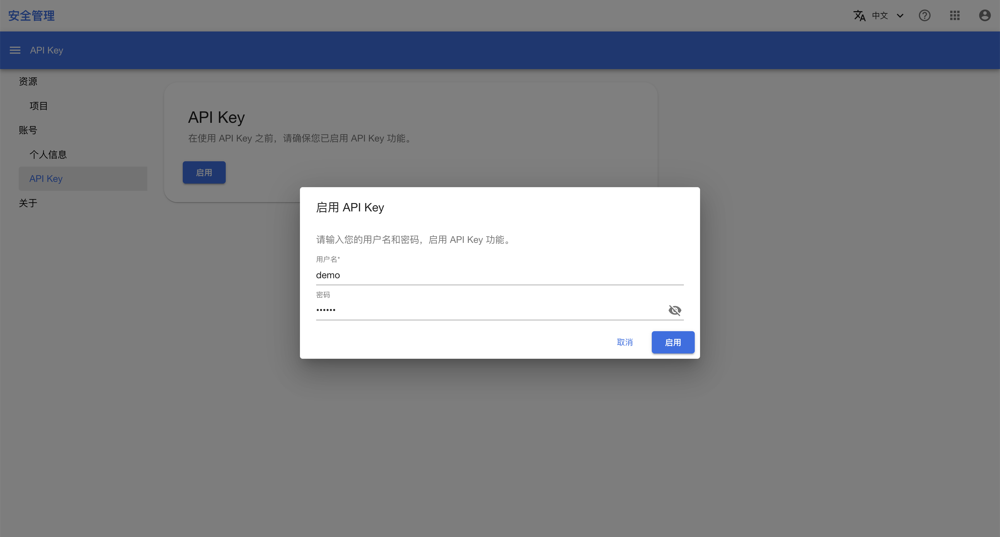
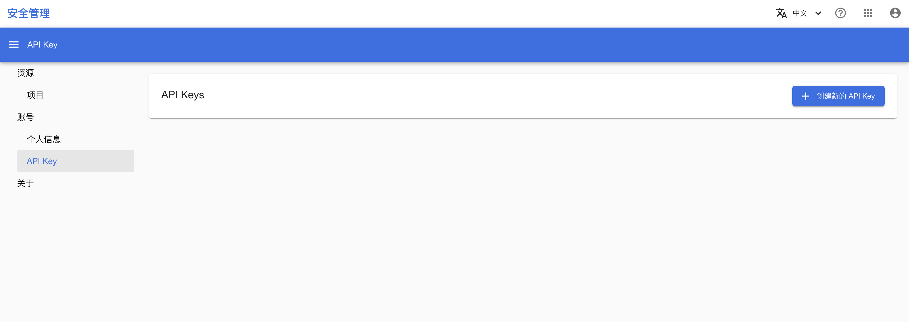
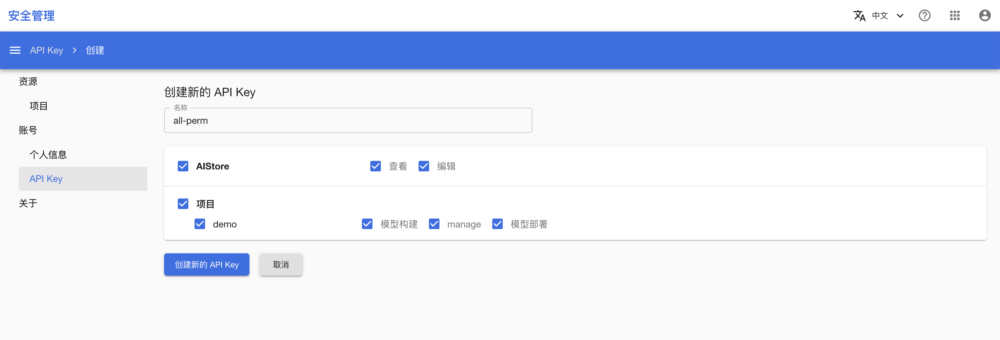

# 生成 API Key

本教程演示如何生成一个 API Key。

## 准备工作

* 了解 [API Key](../modules/security/account.md#api-key) 的基本概念。

## 开启 API Key 服务

进入安全管理控制台之后，在左侧的导航菜单中点击 **API Keys** 进入 API Key 管理页面。如果您是第一次使用 API Key 服务，需要进行一次额外的登录认证。点击 **Enable now** 开始登录认证。

<figure class="screenshot">
  
</figure>

在弹出的对话框中，输入您的用户名和密码，并点击 **Enable now** 开启 API Key 服务，右下角会有悬浮框提示是否成功。

<figure class="screenshot">
  
</figure>

## 生成一个 API Key

开启 API Key 服务之后，再次点击左侧导航菜单的 **API Keys** 进入 API Key 管理页面，此时会列出您拥有的所有 API Key。点击右上角的 **创建新的 API Key** 生成一个 API Key。

<figure class="screenshot">
  
</figure>

在 API Key 生成页面，填写 API Key 名称并勾选您想要包含在 API Key 中的权限，点击 **创建新的 API Key** 生成一个 API Key，右下角会有悬浮框提示是否成功。

<figure class="screenshot">
  
</figure>
