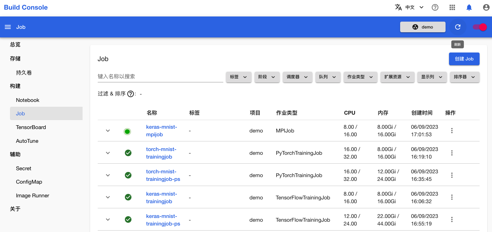
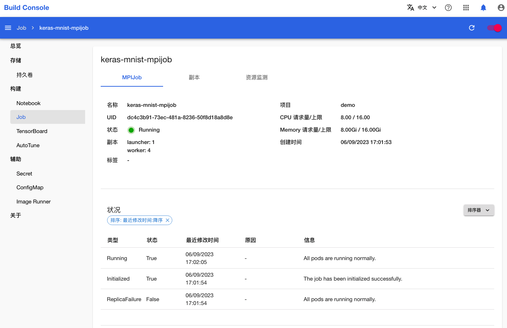
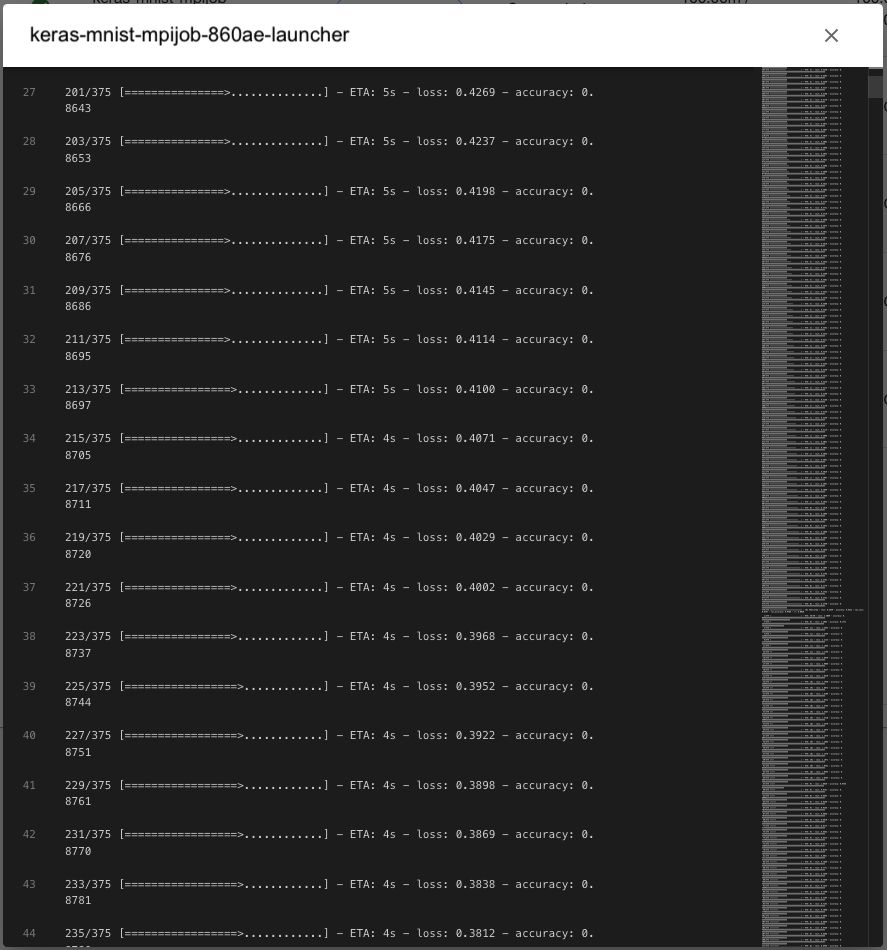
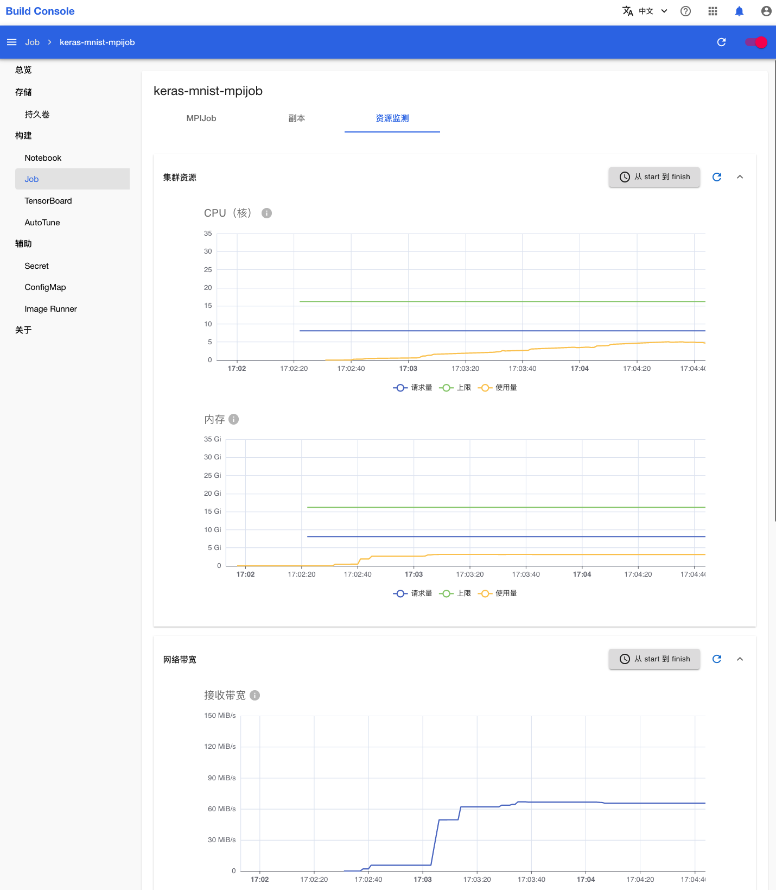

# 使用 Horovod 进行 Keras 模型的数据并行训练

本教程演示如何使用 MPIJob 对 Keras 模型进行多工作器同步训练（使用 <a target="_blank" rel="noopener noreferrer" href="https://horovod.readthedocs.io/en/stable/api.html#module-horovod.tensorflow.keras">`horovod.tensorflow.keras`</a> 模块）。

## 运行示例

请按照<a target="_blank" rel="noopener noreferrer" href="https://github.com/t9k/tutorial-examples/blob/master/docs/README-zh.md#%E4%BD%BF%E7%94%A8%E6%96%B9%E6%B3%95">使用方法</a>准备环境，然后前往<a target="_blank" rel="noopener noreferrer" href="https://github.com/t9k/tutorial-examples/tree/master/job/mpijob/horovod-keras">本教程对应的示例</a>，参照其 README 文档运行。

<aside class="note tip">

提示

上述操作使用 YAML 配置文件创建 MPIJob，你也可以在模型构建控制台进行创建。

</aside>

## 检查训练日志和指标

训练开始后，进入模型构建控制台的 Job 页面，可以看到名为 **keras-mnist-mpijob** 的 MPIJob 正在运行：

<figure class="screenshot">
    
</figure>

点击**该名称**进入详情页面，可以看到刚才创建的 MPIJob 的基本信息、状况信息和事件信息：

<figure class="screenshot">
    
</figure>

点击上方标签页的**副本**，查看 MPIJob 的 Pod 信息：

<figure class="screenshot">
    
</figure>

点击副本右侧的**更多按钮&nbsp;> 日志**以查看训练脚本执行过程中的日志输出：

<figure class="screenshot">
    
</figure>

点击上方标签页的**指标**，查看 MPIJob 运行过程中使用集群计算资源、网络资源和存储资源的情况：

<figure class="screenshot">
    
</figure>

一段时间之后，MPIJob 的状态变为 **Succeeded**，表示训练成功完成：

<figure class="screenshot">
    
</figure>

若 MPIJob 在运行过程中出错，其状态会变为 **Error**，并在事件信息和 Pod 信息部分显示错误信息，此时需要根据给出的错误信息进行问题排查。

<aside class="note tip">

提示

除了上述方法外，你也可以在 Notebook 中直接使用 `kubectl` 命令查看 MPIJob 以及其下各个 Pod 的状态、基本信息、事件、日志等以检查训练的进度和结果。

</aside>
