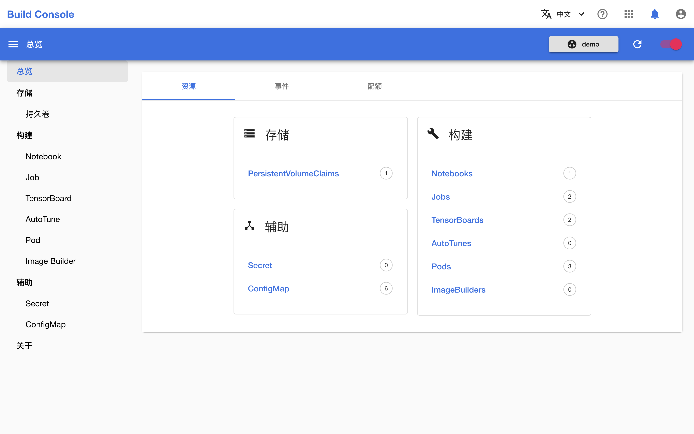
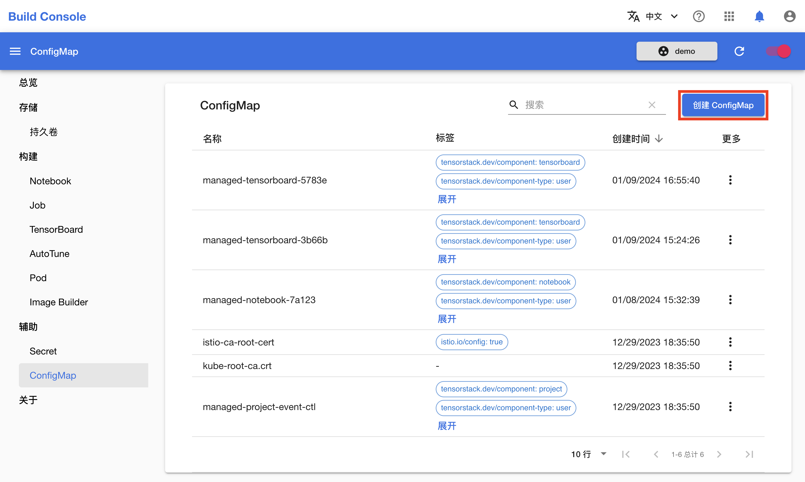
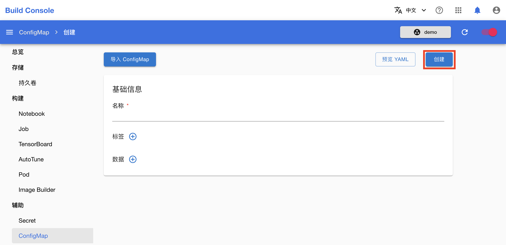
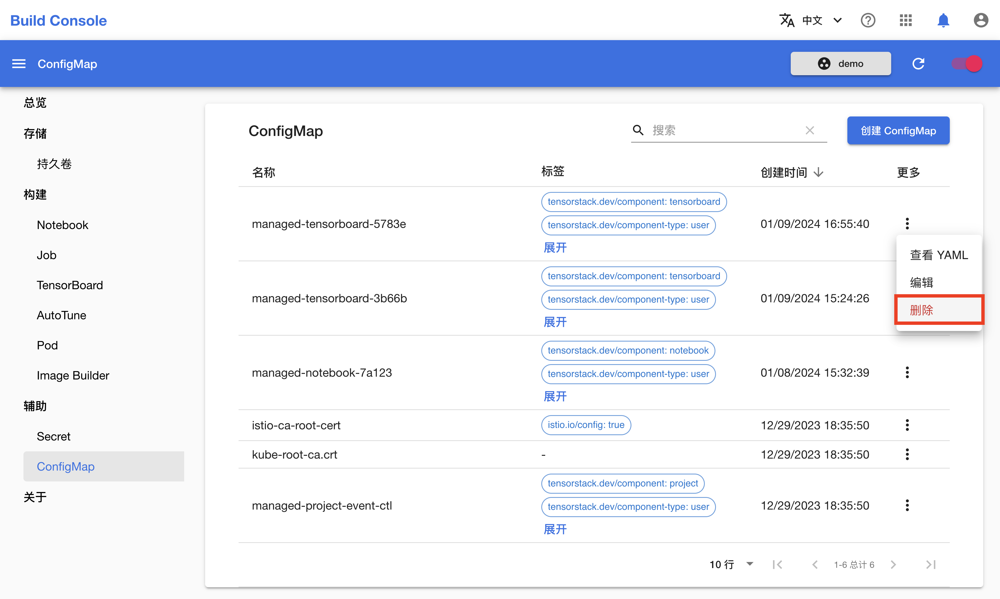

# 管理 ConfigMap

本教程演示如何在模型构建控制台中管理和使用 [ConfigMap](../modules/auxiliary/configmap.md)。

## 准备工作

* 了解 ConfigMap 的<a target="_blank" rel="noopener noreferrer" href="https://kubernetes.io/zh/docs/concepts/configuration/configmap/">概念</a>和 <a target="_blank" rel="noopener noreferrer" href="https://kubernetes.io/docs/reference/kubernetes-api/config-and-storage-resources/config-map-v1/">Kubernetes API</a>。
* 成为一个[项目](../modules/security/project.md)的管理员或[成员](./add-project-member.md)。

## 创建 ConfigMap

进入模型构建控制台，在左侧导航菜单（或右侧卡片）中点击**辅助&nbsp;> ConfigMap** 进入 ConfigMap 管理页面。

<figure class="screenshot">
  
</figure>

点击 ConfigMap 管理页面右上角的**创建 ConfigMap** 进入 ConfigMap 创建页面。

<figure class="screenshot">
  
</figure>

在 ConfigMap 创建页面填写名称、标签和要存储的数据，然后点击**创建**。

<figure class="screenshot">
  
</figure>

你可以点击左上角的**导入 ConfigMap** 以加载当前存在的 ConfigMap 的配置。

## 删除 ConfigMap

在 ConfigMap 管理页面，点击要删除的 ConfigMap 右侧的**更多按钮&nbsp;> 删除**。

<figure class="screenshot">
  
</figure>
