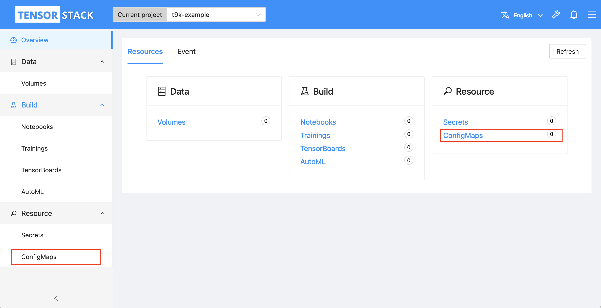
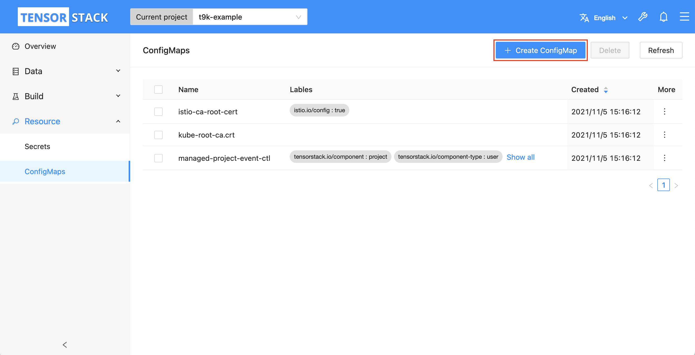
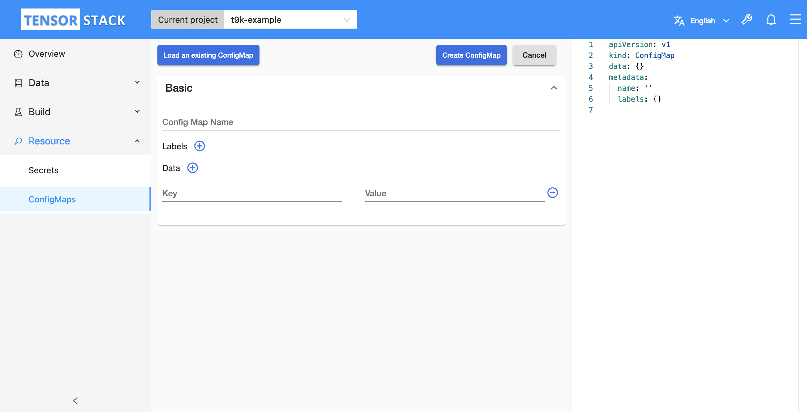
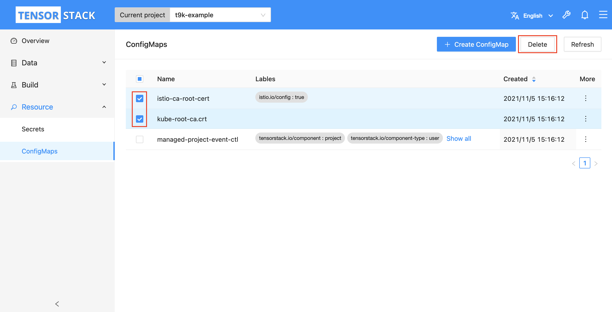

# 管理 ConfigMap

本教程演示如何在模型构建控制台中管理和使用 ConfigMap。

ConfigMap 是一种以键值对的形式存储非机密信息的 Kubernetes 资源。Pod 可以挂载 ConfigMap，并以环境变量、命令行参数或配置文件的形式使用 ConfigMap 中的信息。

## 准备工作

* 了解 ConfigMap 的<a target="_blank" rel="noopener noreferrer" href="https://kubernetes.io/zh/docs/concepts/configuration/configmap/">概念</a>和 <a target="_blank" rel="noopener noreferrer" href="https://kubernetes.io/docs/reference/kubernetes-api/config-and-storage-resources/config-map-v1/">Kubernetes API</a>。
* 成为一个 [Project](../../module/security/index.md#project) 的[所有者](../manage-project/create-and-delete-project.md)或者[成员](../manage-project/project-add-member.md)。

## 创建 ConfigMap

进入模型构建控制台之后，选择一个 Project 点击 **Enter** 进入 Project 主页面。

<figure class="screenshot">
  
</figure>

在 Project 主页面左侧导航菜单（或右侧卡片）中点击 **Auxiliary&nbsp;> ConfigMaps** 进入 ConfigMap 管理页面。

<figure class="screenshot">
  
</figure>

点击 ConfigMap 管理页面右上角的 **Create ConfigMap** 进入 ConfigMap 创建页面。

<figure class="screenshot">
  
</figure>

在 ConfigMap 创建页面分别填写 ConfigMap 名称、标签和所要存储的数据（或者直接在右侧的编辑框内直接编辑完整的 ConfigMap），然后点击 **Create ConfigMap** 创建 ConfigMap。

<figure class="screenshot">
  
</figure>

您也可以点击左上角的 **Loading an existing ConfigMap** 加载已经存在 ConfigMap。

## 删除 ConfigMap

进入 ConfigMap 管理页面后，在列表中勾选所要删除的 ConfigMap，点击右上角的 **Delete**。

<figure class="screenshot">
  
</figure>
