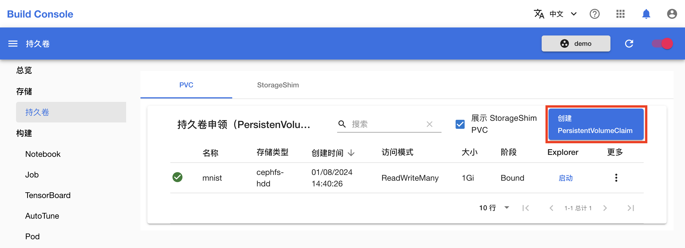
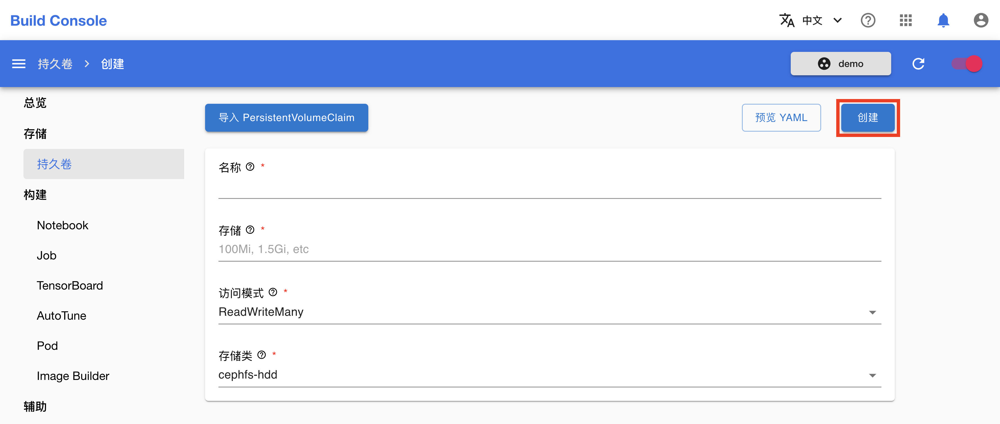
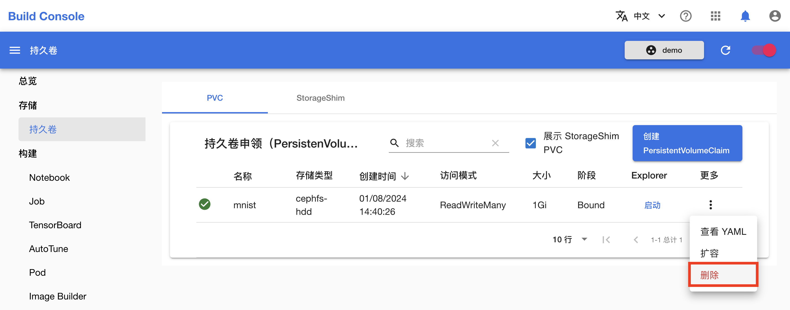

# 管理 PVC

本教程演示如何在模型构建控制台中管理和使用 [PVC](../modules/storage/pvc.md)。

## 准备工作

* 了解 PVC 的<a target="_blank" rel="noopener noreferrer" href="https://kubernetes.io/zh/docs/concepts/storage/persistent-volumes/">概念</a>和 <a target="_blank" rel="noopener noreferrer" href="https://kubernetes.io/docs/reference/kubernetes-api/config-and-storage-resources/persistent-volume-claim-v1/">Kubernetes API</a>。
* 成为一个[项目](../modules/security/project.md)的管理员或[成员](./add-project-member.md)。

## 创建 PVC

进入模型构建控制台，在左侧导航菜单（或右侧卡片）中点击**存储&nbsp;> 持久卷**进入 PVC 管理页面。

<figure class="screenshot">
  
</figure>

点击 PVC 管理页面右上角的**创建 PersistentVolumeClaim** 进入 PVC 创建页面。

<figure class="screenshot">
  
</figure>

在 PVC 创建页面填写名称和存储卷大小，选择存储卷访问模式和存储类，然后点击**创建**。

<figure class="screenshot">
  
</figure>

您可以点击左上角的**导入 PersistentVolumeClaim** 以加载当前存在的 PVC 的配置。

## 删除 PVC

在 PVC 管理页面，点击要删除的 PVC 右侧的**更多按钮&nbsp;> 删除**。

<figure class="screenshot">
  
</figure>
