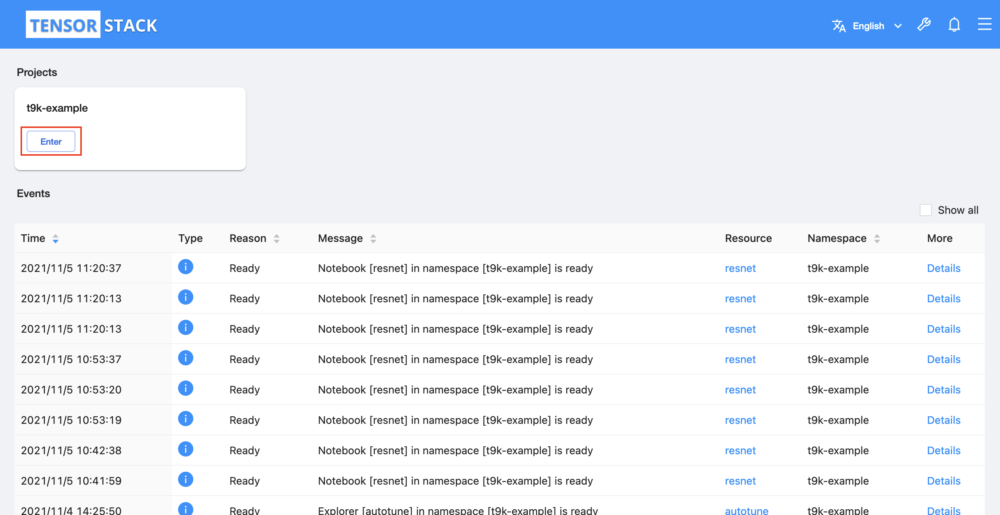
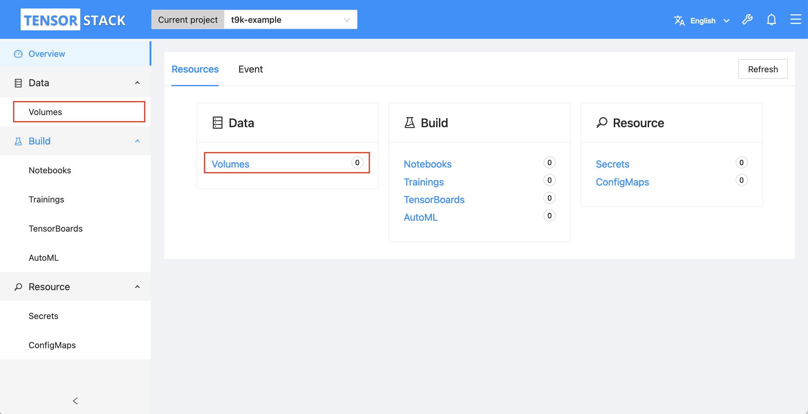
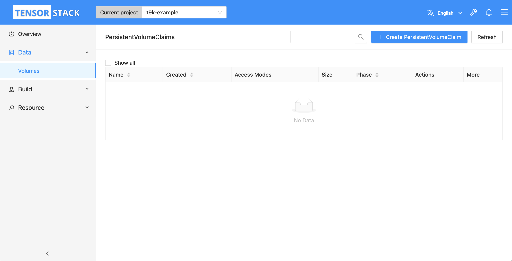
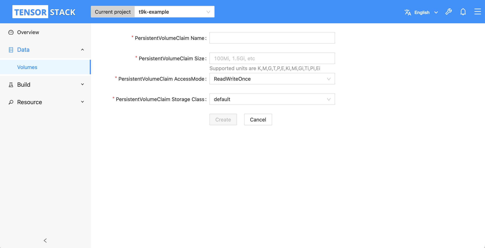
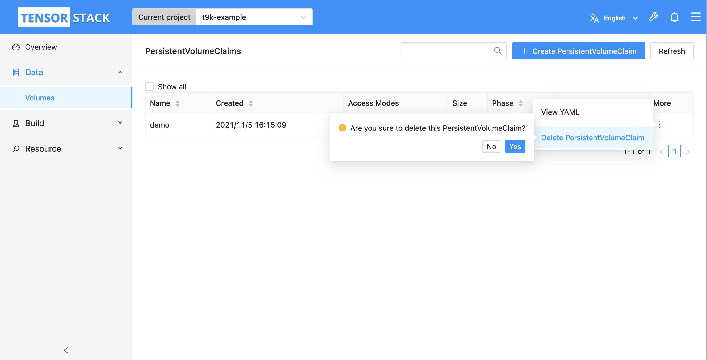
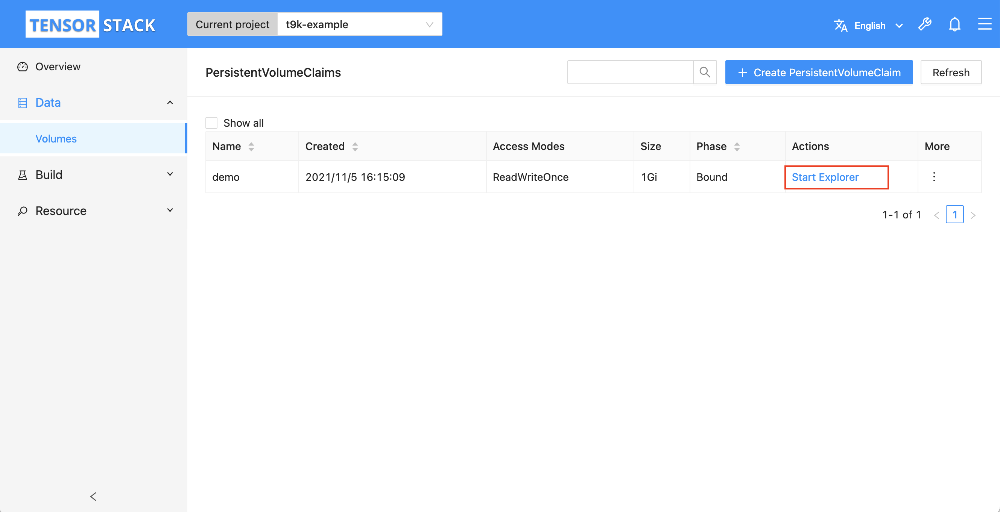
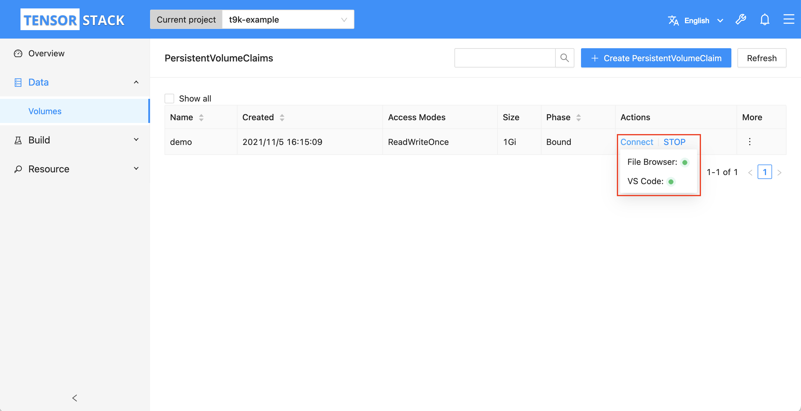

# 管理 PVC

本教程演示如何在模型构建控制台中管理和使用 PVC。

**PVC**（<a target="_blank" rel="noopener noreferrer" href="https://kubernetes.io/zh/docs/concepts/storage/persistent-volumes/">PersistentVolumeClaim</a>）是 Kubernetes 提供的一种声明式的存储卷请求，用于向 Kubernetes 集群申请持久化存储卷。PVC 使应用程序与存储资源进行解耦，提高了存储资源的管理和使用效率。PVC 可以被 Pod 挂载、作为 Pod 的卷被访问。

## 准备工作

* 了解 PVC 的<a target="_blank" rel="noopener noreferrer" href="https://kubernetes.io/zh/docs/concepts/storage/persistent-volumes/">概念</a>和 <a target="_blank" rel="noopener noreferrer" href="https://kubernetes.io/docs/reference/kubernetes-api/config-and-storage-resources/persistent-volume-claim-v1/">Kubernetes API</a>。
* 成为一个 [Project](../modules/account-and-security.md#project) 的所有者或[成员](./add-project-member.md)。

## 创建 PVC

进入模型构建控制台之后，选择一个 Project 点击 **Enter** 进入 Project 主页面。

<figure class="screenshot">
  
</figure>

在 Project 主页面左侧导航菜单（或右侧卡片）中点击 **Data&nbsp;> Volumes** 进入 PVC 管理页面。

<figure class="screenshot">
  
</figure>

点击 PVC 管理页面右上角的 **Create PersistentVolumeClaim** 进入 PVC 创建页面。

<figure class="screenshot">
  
</figure>

在 PVC 创建页面分别填写 PVC 名称、存储卷大小、存储卷访问模式和存储类型，然后点击 **Create** 创建 PVC。

<figure class="screenshot">
  
</figure>

## 删除 PVC

进入 PVC 管理页面后，选择所要删除的 PVC，在列表右侧点击 **:material-dots-vertical:&nbsp;> Delete PersistentVolumeClaim**，然后在弹出框中点击 **Yes**。

<figure class="screenshot">
  
</figure>

## PVC 数据管理

进入 PVC 管理页面后，选择所要操作的 PVC，点击列表中的 **Start Explorer**，启动 PVC 数据管理服务。

<figure class="screenshot">
  
</figure>

服务启动后，**Start Explorer** 会变成 **Connect｜Stop**，点击 **Stop** 关闭 PVC 数据管理服务，点击 **Connect** 进入 PVC 管理服务 UI。

<figure class="screenshot">
  
</figure>

延伸阅读

* <a target="_blank" rel="noopener noreferrer" href="https://filebrowser.org">FileBrowser 官方介绍</a>
* <a target="_blank" rel="noopener noreferrer" href="https://code.visualstudio.com/">VSCode 官方网站</a>

</aside>
