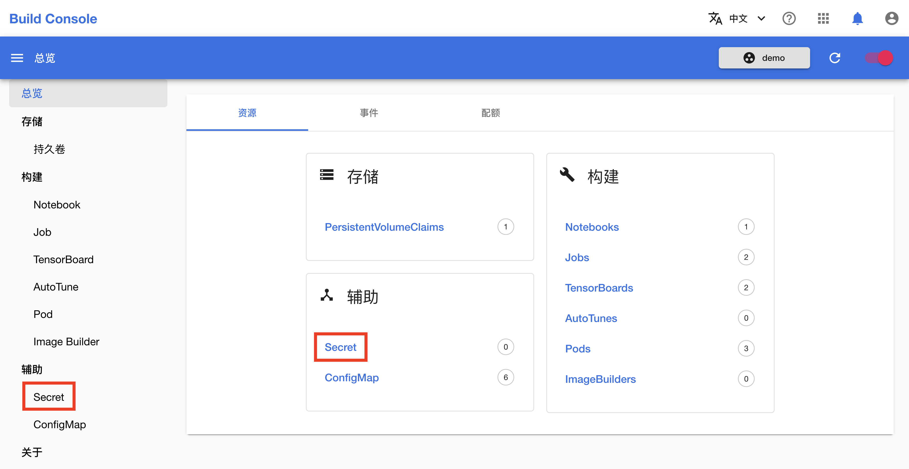
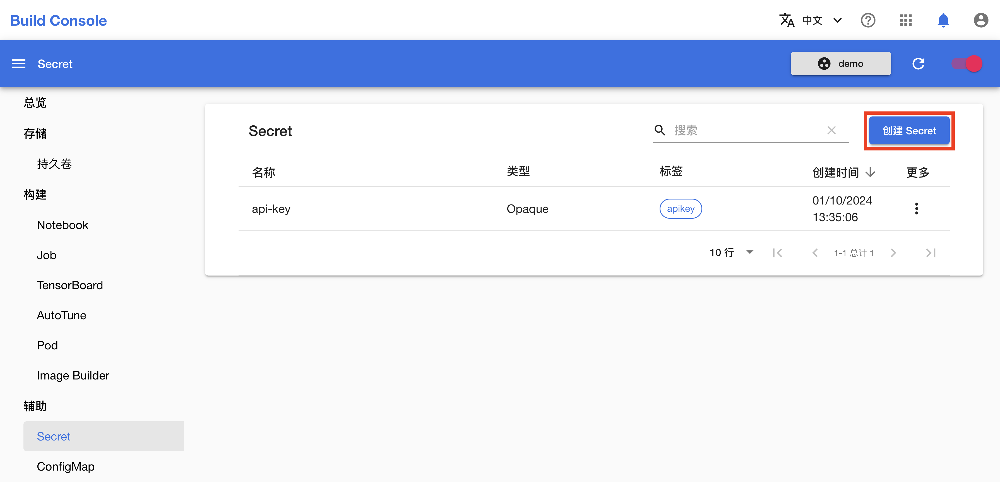
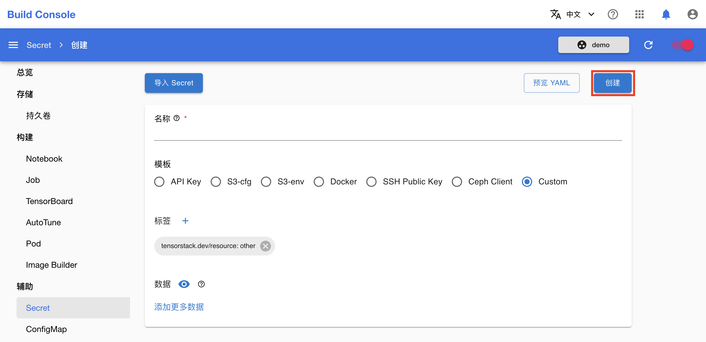
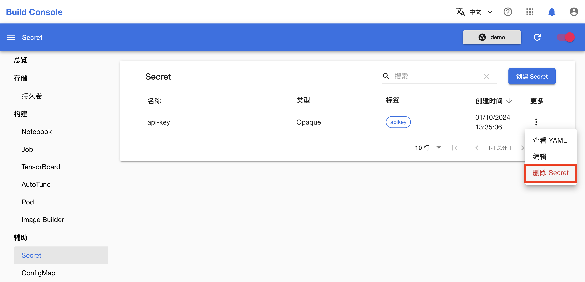

# 管理 Secret

本教程演示如何在模型构建控制台中管理和使用 [Secret](../modules/auxiliary/secret.md)。

## 准备工作

* 了解 Secret 的<a target="_blank" rel="noopener noreferrer" href="https://kubernetes.io/zh/docs/concepts/configuration/secret/">概念</a>和 <a target="_blank" rel="noopener noreferrer" href="https://kubernetes.io/docs/reference/kubernetes-api/config-and-storage-resources/secret-v1/">Kubernetes API</a>。
* 成为一个[项目](../modules/security/project.md)的管理员或[成员](./add-project-member.md)。

## 创建 Secret

进入模型构建控制台，在左侧导航菜单（或右侧卡片）中点击**辅助&nbsp;> Secret** 进入 Secret 管理页面。

<figure class="screenshot">
  
</figure>

点击 Secret 管理页面右上角的**创建 Secret** 进入 Secret 创建页面。

<figure class="screenshot">
  
</figure>

在 Secret 创建页面选择模板，填写名称和要存储的数据，然后点击**创建**。

<figure class="screenshot">
  
</figure>

<aside class="note info">

Secret 模板

这里所提供的多种 Secret 模板分别适用于存储不同类型的敏感数据，其中自定义模板支持扩展以适应各种需求。

Secret 存储的数据类型是通过其标签进行识别的。

</aside>

你可以点击左上角的**导入 Secret** 以加载当前存在的 Secret 的配置。

## 删除 Secret

在 Secret 管理页面，点击要删除的 Secret 右侧的**更多按钮&nbsp;> 删除**。

<figure class="screenshot">
  
</figure>
