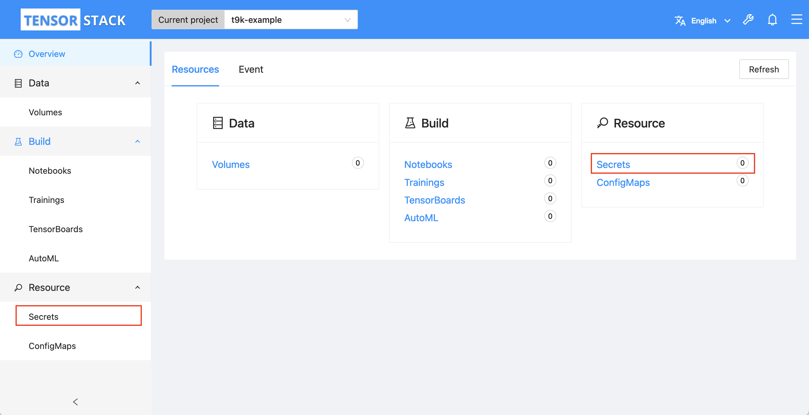
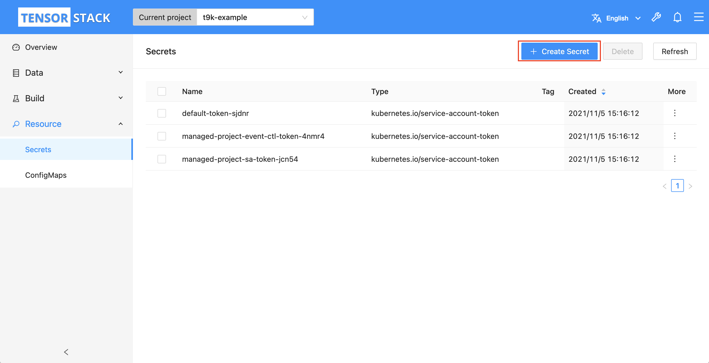
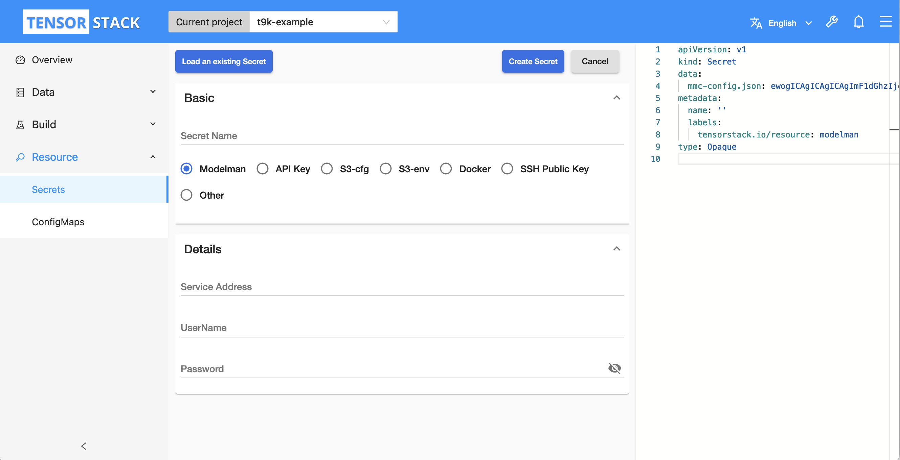
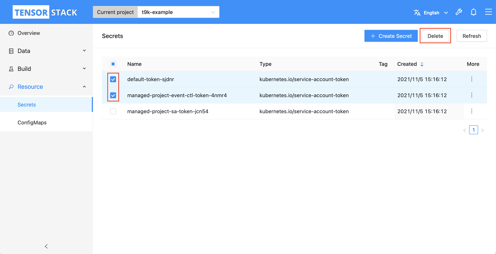

# 管理 Secret

本教程演示如何在模型构建控制台中管理和使用 Secret。

Secret 是一种存储密码、令牌、SSH Key 等敏感信息的 Kubernetes 资源。Pod 可以将 Secret 挂载为一个文件，并读取其中的信息。

## 准备工作

* 了解 Secret 的<a target="_blank" rel="noopener noreferrer" href="https://kubernetes.io/zh/docs/concepts/configuration/secret/">概念</a>和 <a target="_blank" rel="noopener noreferrer" href="https://kubernetes.io/docs/reference/kubernetes-api/config-and-storage-resources/secret-v1/">Kubernetes API</a>。
* 成为一个 [Project](../../module/security/index.md#project) 的[所有者](../manage-project/create-and-delete-project.md)或者[成员](../manage-project/project-add-member.md)。

## 创建 Secret

进入模型构建控制台之后，选择一个 Project 点击 **Enter** 进入 Project 主页面。

<figure class="screenshot">
  
</figure>

在 Project 主页面左侧导航栏（或右侧卡片）中点击 **Auxiliary&nbsp;> Secrets** 进入 Secret 管理页面。

<figure class="screenshot">
  
</figure>

点击 Secret 管理页面右上角的 **Create Secret** 进入 Secret 创建页面。

<figure class="screenshot">
  
</figure>

在 Secret 创建页面分别填写 Secret 名称、类型和所要存储的数据（或者直接在右侧的编辑框内直接编辑完整的 Secret），然后点击 **Create Secret** 创建 Secret。

<figure class="screenshot">
  
</figure>

您也可以点击左上角的 **Load an existing Secret** 加载已经存在的 Secret。

!!! info "Secret 的类型"
    * 我们根据 Secret 的用途将 Secret 分为图中所示的 7 种类型 （可扩展）。每种类型的 Secret 所存储的数据是不同的，具体体现在上图中的 **Details** 块中，您可以在创建页面勾选 Secret 的种类来查看详细的存储数据信息；
    * Secret 的类型通过其标签区分。

## 删除 Secret

进入 Secret 管理页面后，在列表中勾选所要删除的 Secret，点击右上角的 **Delete**。

<figure class="screenshot">
  
</figure>
